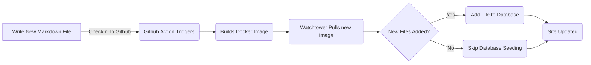

# Додавання блоку сутності для дописів блогу (Pt 6)

<!--category-- ASP.NET, Entity Framework -->
<datetime class="hidden">2024- 08- 20T05: 45</datetime>

# Вступ

Тепер, коли я веду блог, що працює з використанням фреймів сутностей, я можу легко додавати нові дописи і мови. Я просто додаю новий файл позначки до проекту і перевіряю його. Запобігає дії GitHub і сайт оновлюється.

На цьому посту я оприлюдню кілька маленьких додатків, які я зробив до цього процесу, і як це дозволяє майбутні покращення.

[TOC]

Див. частини [1](/blog/addingentityframeworkforblogpostspt1), [2](/blog/addingentityframeworkforblogpostspt2), [3](/blog/addingentityframeworkforblogpostspt3) , [4](/blog/addingentityframeworkforblogpostspt4) і [5](/blog/addingentityframeworkforblogpostspt5) за попередніми кроками.

# Оновлення тла

Одна з проблем, з якою я зіткнувся з переїздом у ОВР, полягала в тому, щоб зберегти свій процес оновлення сайту, не затримуючи оновлення сайту. Я хотів зробити процес додавання нового допису якомога простішим.

У попередніх частинах я показав, як я використовував `MarkdownBlogService` щоб отримати дописи і мови блогу. Цю службу ввели в наші контролери й погляди. Ця служба була простою службою, яка зчитувала файли з диска і повернула їх як `BlogViewModels`.

Процес оновлення такий:



Для того, щоб дозволити оновлення тла після запуску сайта у ASP.NET I використовувати  `IHostedService` щоб перевірити наявність нових файлів і додати їх до бази даних.

Це дуже просто і все, що вона робить є нижче:

```csharp
public class BackgroundEFBlogUpdater(IServiceScopeFactory scopeFactory, ILogger<BackgroundEFBlogUpdater> logger) : IHostedService
{
    private Task _backgroundTask;
    public async Task StartAsync(CancellationToken cancellationToken)
    {
       
        var scope = scopeFactory.CreateScope();
        var context = scope.ServiceProvider.GetRequiredService<IBlogPopulator>();
        logger.LogInformation("Starting EF Blog Updater");
      
        _backgroundTask = Task.Run(async () =>    await  context.Populate(), cancellationToken);
       logger.LogInformation("EF Blog Updater Finished");
    }

    public async Task StopAsync(CancellationToken cancellationToken)
    {
        
    }
}
```

Зверніть увагу, що один з критичних аспектів тут - це те, що ЄФ дуже прискіпливо пов'язана з копією. Я повинен був використати `IServiceScopeFactory` створити нову область видимості служби. Це тому, що сервіс одиночний, а ОВФ не подобається, коли його використовують в одиночних.
Використання `IServiceScopeFactory` є типовим шаблоном ядра ASP.NET, якщо вам потрібно використовувати обчислювальну службу під час служби у режимі 1oneton.

Я також повинен був використовувати `Task.Run` виконати завдання у новій гілці. Це тому, що `IHostedService` Пробігає по головній нитці, і я не хочу блокувати застосування.

Це `BackgroundEFBlogUpdater` Клас. Він ін'єкційний через `SetupBlog` Метод додавання, який я раніше показував:

```csharp
    public static void SetupBlog(this IServiceCollection services, IConfiguration configuration, IWebHostEnvironment env)
    {
        var config = services.ConfigurePOCO<BlogConfig>(configuration.GetSection(BlogConfig.Section));
       services.ConfigurePOCO<MarkdownConfig>(configuration.GetSection(MarkdownConfig.Section));
       services.AddScoped<CommentService>();
        switch (config.Mode)
        {
            case BlogMode.File:
                Log.Information("Using file based blog");
                services.AddScoped<IBlogService, MarkdownBlogService>();
                services.AddScoped<IBlogPopulator, MarkdownBlogPopulator>();
                break;
            case BlogMode.Database:
                Log.Information("Using Database based blog");
                services.AddDbContext<MostlylucidDbContext>(options =>
                {
                    if (env.IsDevelopment())
                    {
                        options.EnableSensitiveDataLogging(true);
                    }
                    options.UseNpgsql(configuration.GetConnectionString("DefaultConnection"));
                });
                services.AddScoped<IBlogService, EFBlogService>();
            
                services.AddScoped<IBlogPopulator, EFBlogPopulator>();
                services.AddHostedService<BackgroundEFBlogUpdater>();
                break;
        }
        services.AddScoped<IMarkdownBlogService, MarkdownBlogPopulator>();

        services.AddScoped<MarkdownRenderingService>();
    }
```

Зокрема, ця пряма `services.AddHostedService<BackgroundEFBlogUpdater>();`
У Core ASP. NET це запускає новий Service з вузлами, що працює у тлі. Цю службу буде запущено під час запуску і запуску програми до завершення роботи програми.

Це простий спосіб додавання фонової обробки до вашої програми ASP. NET.

# Включення

У цьому дописі я показав, як я додав фонову службу до моєї програми ASP. NET для оновлення бази даних з новими дописами блогу. Ця служба виконується після запуску і додавання всіх нових файлів до бази даних.