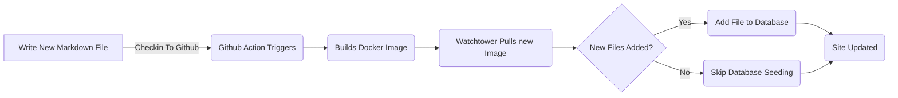

# 添加博客文章实体框架( Pt 6)

<!--category-- ASP.NET, Entity Framework -->
<datetime class="hidden">2024-08-20T05:45</datetime>

# 一. 导言 导言 导言 导言 导言 导言 一,导言 导言 导言 导言 导言 导言

现在我有了这个博客, 使用实体框架, 我可以很容易地添加新的文章和语言。 我只是在项目中添加一个新的标记文件, 并检查它。 GitHub行动触发器和网站更新。

在这个职位上,我将补充我对这个过程所作的一些小补充, 以及它如何使未来得以加强。

[技选委

见各部分 [1](/blog/addingentityframeworkforblogpostspt1), [2](/blog/addingentityframeworkforblogpostspt2), [3](/blog/addingentityframeworkforblogpostspt3) , [4](/blog/addingentityframeworkforblogpostspt4) 和 [5](/blog/addingentityframeworkforblogpostspt5) 用于前几个步骤。

# A. 更新背景

我在搬入EF时遇到的一个问题是,在不拖延网站更新的同时,保持更新网站的程序。 我希望尽可能简化增设新员额的程序。

在前几部分,我展示了如何使用 `MarkdownBlogService` 以获得博客文章和语言。 这一服务被注入我们的控制器和视图中。 此服务是一个简单的服务, 从磁盘上读取标记文件, 然后以 `BlogViewModels`.

更新进程如下:



为了在ASP.NET网站启动时能够更新背景情况,我使用  `IHostedService` 以检查新文件并将其添加到数据库中。

它非常简单,它所做的一切就是在下面:

```csharp
public class BackgroundEFBlogUpdater(IServiceScopeFactory scopeFactory, ILogger<BackgroundEFBlogUpdater> logger) : IHostedService
{
    private Task _backgroundTask;
    public async Task StartAsync(CancellationToken cancellationToken)
    {
       
        var scope = scopeFactory.CreateScope();
        var context = scope.ServiceProvider.GetRequiredService<IBlogPopulator>();
        logger.LogInformation("Starting EF Blog Updater");
      
        _backgroundTask = Task.Run(async () =>    await  context.Populate(), cancellationToken);
       logger.LogInformation("EF Blog Updater Finished");
    }

    public async Task StopAsync(CancellationToken cancellationToken)
    {
        
    }
}
```

请注意,这里的一个关键方面是 EF对范围界定非常挑剔。 我不得不使用 `IServiceScopeFactory` 创建新的服务范围。 这是因为服务是单吨的,EF不喜欢在单吨使用。
B. 使用《公约》和《公约》 `IServiceScopeFactory` 在 ASP.NET Core 中,当您需要使用单吨服务中的范围服务时,它是一种常见模式。

我还不得不使用 `Task.Run` 在新线索中运行任务。 这是因为 `IHostedService` 在主线上运行, 我不想从一开始就阻止应用程序 。

这是 `BackgroundEFBlogUpdater` 类。 注射时用 `SetupBlog` 我之前显示的扩展方法 :

```csharp
    public static void SetupBlog(this IServiceCollection services, IConfiguration configuration, IWebHostEnvironment env)
    {
        var config = services.ConfigurePOCO<BlogConfig>(configuration.GetSection(BlogConfig.Section));
       services.ConfigurePOCO<MarkdownConfig>(configuration.GetSection(MarkdownConfig.Section));
       services.AddScoped<CommentService>();
        switch (config.Mode)
        {
            case BlogMode.File:
                Log.Information("Using file based blog");
                services.AddScoped<IBlogService, MarkdownBlogService>();
                services.AddScoped<IBlogPopulator, MarkdownBlogPopulator>();
                break;
            case BlogMode.Database:
                Log.Information("Using Database based blog");
                services.AddDbContext<MostlylucidDbContext>(options =>
                {
                    if (env.IsDevelopment())
                    {
                        options.EnableSensitiveDataLogging(true);
                    }
                    options.UseNpgsql(configuration.GetConnectionString("DefaultConnection"));
                });
                services.AddScoped<IBlogService, EFBlogService>();
            
                services.AddScoped<IBlogPopulator, EFBlogPopulator>();
                services.AddHostedService<BackgroundEFBlogUpdater>();
                break;
        }
        services.AddScoped<IMarkdownBlogService, MarkdownBlogPopulator>();

        services.AddScoped<MarkdownRenderingService>();
    }
```

具体地说,这一行 `services.AddHostedService<BackgroundEFBlogUpdater>();`
在 ASP. NET Core 中, 它开始在背景中运行一个新的主机服务 。 此服务在应用程序启动和运行直到应用程序停止时启动 。

这是将背景处理添加到 ASP. NET 核心应用程序的简单方式 。

# 在结论结论中

我展示了如何在我的 ASP. NET Core 应用程序中添加背景服务, 当应用程序启动并添加任何新文件到数据库时, 此服务会运行 。