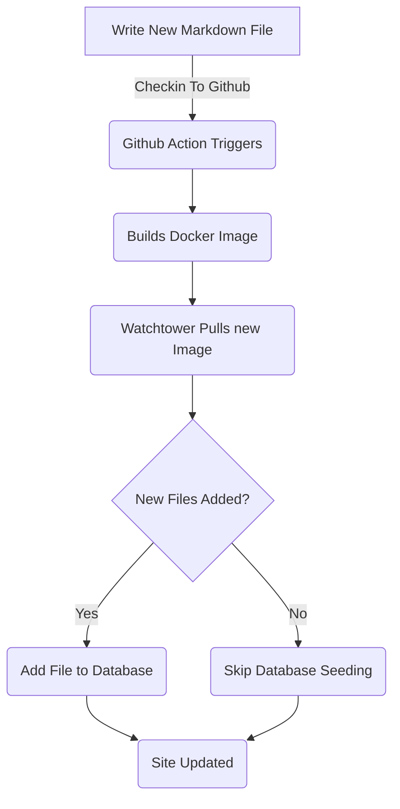

# إطار الهيئة المضاف لقائمة الوظائف (الجزء 5)

<!--category-- ASP.NET, Entity Framework -->
<datetime class="hidden">2024-08-18TT01: 20</datetime>

انظر الأجزاء [1](/blog/addingentityframeworkforblogpostspt1) وقد عقد مؤتمراً بشأن [2](/blog/addingentityframeworkforblogpostspt2) وقد عقد مؤتمراً بشأن [3](/blog/addingentityframeworkforblogpostspt3) وقد عقد مؤتمراً بشأن [4](/blog/addingentityframeworkforblogpostspt4) عن الخطوات السابقة.

# أولاً

وفي أجزاء سابقة قمنا بتغطية كيفية إنشاء قاعدة البيانات، وكيفية تنظيم ضوابطنا وآرائنا، وكيفية عمل خدماتنا، وكيفية تأسيس قاعدة البيانات ببعض البيانات الأولية. في هذا الجزء سوف نغطي تفاصيل عن كيفية عمل خدمات قاعدة EF وكيف يمكننا استخدامها في أجهزة التحكم لدينا.

كالمعتاد يمكنك أن ترى كل مصدر لهذا على بلدي جيت هوب [هنا هنا](https://github.com/scottgal/mostlylucidweb/tree/main/Mostlylucid/Blog)، في مجلد Plisuslucid/Blog.

[رابعاً -

# الـمـن الـدائـع

## دعم

سابقاً نحن استخدمنا `MarkdownBlogService` للحصول على مدوّناتنا ولغاتنا. تم إدخال هذه الخدمة في أجهزة التحكم و وجهات النظر لدينا. كانت هذه الخدمة خدمة بسيطة تقوم بقراءة ملفات التدرج من القرص وإعادتها كما يلي: `BlogViewModels`.

استخدم هذا قاموساً ساكناً ليحمل تدوينات المدونات ثم أعاد النتائج من ذلك القاموس.

```csharp
  public async Task<PostListViewModel> GetPagedPosts(int page = 1, int pageSize = 10, string language = EnglishLanguage)
    {
        var model = new PostListViewModel();
        var posts = GetPageCache().Where(x => x.Value.Language == language)
            .Select(x => GetListModel(x.Value)).ToList();
        model.Posts = posts.OrderByDescending(x => x.PublishedDate).Skip((page - 1) * pageSize).Take(pageSize).ToList();
        model.TotalItems = posts.Count();
        model.PageSize = pageSize;
        model.Page = page;
        return await Task.FromResult(model);
    }
```

هذا هو `GetPagedPosts` من `MarkdownBlogService`/ / / / هذه الطريقة تحصل على مقالات المدونات من المخبأ وتعيدها على أنها `PostListViewModel`.

استخدام ملفات لتخزين ملفات التأشير لا يزال نهجاً جيداً، يجعل من السهل إضافة الوظائف (أنا فقط احفظ الملفات إلى القرص وأتحقق منها) ومن السهل إدارتها. ولكننا نريد استخدام قاعدة البيانات لتخزين الوظائف واللغات.


## الخدمات الممولة من فئة الخدمة

في الـ [الجزء السابق ((/blog/adingityhenityforkorwork for blog Plog Plostsspt4) عرضت كيف قمنا ببذر قاعدة البيانات ببيانات المدونات. هذه التحديثات في كل مرة نقوم فيها بإعادة نشر وإعادة تشغيل الحاوية ([مُنَفْفِض ](blog/dockercompose)(ج) استخدمنا `EFBlogPopulator` لأداء هذا.

الآن، ان تدفقنا يبدو هكذا



الآن بما أن لدينا المدونات الموجودة في قاعدة بياناتنا نحن نستخدم `EFBlogService` من أجل التنفيذ `IBlogService` الواجهة:

```csharp
public interface IBlogService
{
   Task<List<string>> GetCategories();
    Task<List<BlogPostViewModel>> GetPosts(DateTime? startDate = null, string category = "");
    Task<PostListViewModel> GetPostsByCategory(string category, int page = 1, int pageSize = 10, string language = MarkdownBaseService.EnglishLanguage);
    Task<BlogPostViewModel?> GetPost(string slug, string language = "");
    Task<PostListViewModel> GetPagedPosts(int page = 1, int pageSize = 10, string language = MarkdownBaseService.EnglishLanguage);
    
    Task<List<PostListModel>> GetPostsForLanguage(DateTime? startDate = null, string category = "", string language = MarkdownBaseService.EnglishLanguage);
}
```

هذا هو `IBlogService` الواجهة البينية. هذه هي الواجهة التي يستخدمها متحكمونا للحصول على تدوينات المدونات. الـ `EFBlogService` يُنفِّذ هذه الوصلة واستخدامات `BlogContext` للحصول على البيانات من قاعدة البيانات.
كما هو مع خارج الخدمة المستندية [الفئة المذكورة أعلاه](#file-based-services) ويمكننا الحصول على وظائف حسب الفئة، واللغة، والتاريخ، والصفحات.

### `GetPostList`

```csharp
    private async Task<PostListViewModel> GetPostList(int count, List<BlogPostEntity> posts, int page, int pageSize)
    {
        var languages = await NoTrackingQuery().Select(x =>
                new { x.Slug, x.LanguageEntity.Name }
            ).ToListAsync();

        var postModels = new List<PostListModel>();

        foreach (var postResult in posts)
        {
            var langArr = languages.Where(x => x.Slug == postResult.Slug).Select(x => x.Name).ToArray();

            postModels.Add(postResult.ToListModel(langArr));
        }

        var postListViewModel = new PostListViewModel
        {
            Page = page,
            PageSize = pageSize,
            TotalItems = count,
            Posts = postModels
        };

        return postListViewModel;
    }
```

هنا نستخدم مشتركنا `PostsQuery` ونضيف ما يلي: `NoTrackingQuery` عبارة عن طريقة بسيطة ترجع `BlogPostEntity` مع `AsNoTrackingWithIdentityResolution` مضافاً. وهذا يعني أن الكيانات لا يتتبعها السياق ولا تُقرأ إلا. وهذا أمر مفيد عندما نقرأ البيانات فقط ولا نستكملها.

```csharp
     protected IQueryable<BlogPostEntity> PostsQuery()=>Context.BlogPosts.Include(x => x.Categories)
        .Include(x => x.LanguageEntity);
     
         private IQueryable<BlogPostEntity> NoTrackingQuery() => PostsQuery().AsNoTrackingWithIdentityResolution();
```

يمكنك أن ترى أننا أيضاً نحصل أيضاً على لغات الوظائف ومن ثم إنشاء `PostListViewModel` (ب) هو هيكل يقبل المعلومات (`Page`, `PageSize` وقد عقد مؤتمراً بشأن `TotalItems`ويعاد إلى وحدة التحكم.

### `GetPost`

وطريقتنا الرئيسية هي: `GetPost` التي تحصل على وظيفة واحدة من قبلها `Slug` وقد عقد مؤتمراً بشأن `Language`/ / / / هذه طريقة بسيطة تستخدم `PostsQuery` للحصول على الوظيفة ومن ثم ترجعها على أنها `BlogPostViewModel`.
يمكنك أن ترى أن لها أيضاً خيار `Language` مُحال `EnglishLanguage` ما هو ثابت فينا `MarkdownBaseService` -مصنفة. -مصنفة.

```csharp
  public async Task<BlogPostViewModel?> GetPost(string slug, string language = "")
    {
        if (string.IsNullOrEmpty(language)) language =MarkdownBaseService.EnglishLanguage;
        var post = await NoTrackingQuery().FirstOrDefaultAsync(x => x.Slug == slug && x.LanguageEntity.Name == language);
        if (post == null) return null;
        var langArr = await GetLanguagesForSlug(slug);
        return post.ToPostModel(langArr);
    }
```

هذا أيضاً يستخدم أسلوبنا المشترك `GetLanguagesForSlug` الذي يحصل على اللغات للوظيفة. هذه طريقة بسيطة تعيد اللغات للبريد.

```csharp
    private async Task<List<string>> GetLanguagesForSlug(string slug)=> await NoTrackingQuery()
        .Where(x => x.Slug == slug).Select(x=>x.LanguageEntity.Name).ToListAsync();
```

### `GetPostsByCategory`

وتحصل هذه الطريقة على الوظائف حسب الفئة (مثل إطار عمل ASP.net وهيئة هذه الوظيفة). فـي `PostsQuery` للحصول على الاعمدة ومن ثم يرشحها بالفئة ثم ترجع الوظائف على أنها `PostListViewModel`.

```csharp
    public async Task<PostListViewModel> GetPostsByCategory(string category, int page = 1, int pageSize = 10,
        string language = MarkdownBaseService.EnglishLanguage)
    {
        
        var count = await NoTrackingQuery()
            .Where(x => x.Categories.Any(c => c.Name == category) && x.LanguageEntity.Name == language).CountAsync();
        var posts = await PostsQuery()
            .Where(x => x.Categories.Any(c => c.Name == category) && x.LanguageEntity.Name == language)
            .Skip((page - 1) * pageSize)
            .Take(pageSize)
            .ToListAsync();

        var languages = await GetLanguagesForSlugs(posts.Select(x => x.Slug).ToList());
        var postListViewModel = new PostListViewModel
        {
            Page = page,
            PageSize = pageSize,
            TotalItems = count,
            Posts = posts.Select(x => x.ToListModel(
                languages.FirstOrDefault(entry => entry.Key == x.Slug).Value.ToArray())).ToList()
        };
        return postListViewModel;
    }
```

# في الإستنتاج

يمكنك أن ترى أن الخدمات التي تقوم على EF هي أكثر تعقيداً قليلاً من الخدمات التي تستند إلى الملفات لكنها أكثر مرونة ويمكن استخدامها في سيناريوهات أكثر تعقيداً. يمكننا استخدام خدمات EF في أجهزة التحكم و وجهات النظر للحصول على المدوّنات واللغات.
في المستقبل سوف نبني على هذه ونضيف خدمات مثل التحرير الخطي والتعليقات.
سننظر أيضاً في كيفية تزامن هذه عبر أنظمة متعددة.