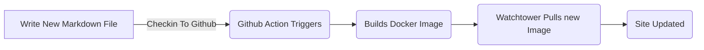
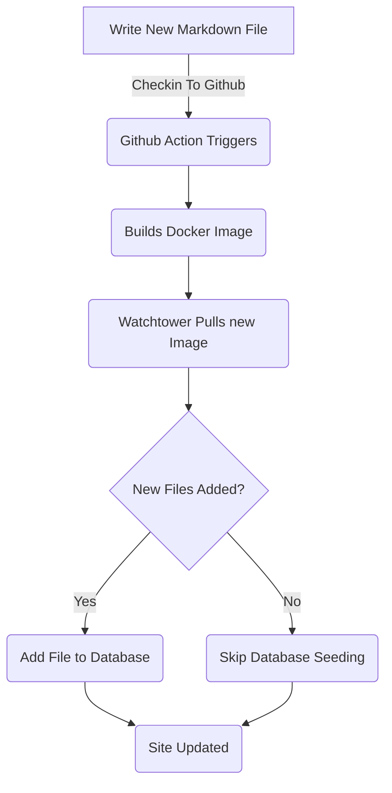

# Hinzufügen des Entity Framework für Blog-Posts (Teil 5)

<!--category-- ASP.NET, Entity Framework -->
<datetime class="hidden">2024-08-18T01:20</datetime>

Siehe Teile [1](/blog/addingentityframeworkforblogpostspt1) und [2](/blog/addingentityframeworkforblogpostspt2) und [3](/blog/addingentityframeworkforblogpostspt3) und [4](/blog/addingentityframeworkforblogpostspt4) für die vorherigen Schritte.

# Einleitung

In früheren Teilen befassten wir uns mit der Einrichtung der Datenbank, wie unsere Controller und Ansichten strukturiert sind, wie unsere Dienste funktionierten und wie die Datenbank mit einigen ersten Daten abgespeichert werden kann. In diesem Teil werden wir Details darüber, wie die EF Based Services funktionieren und wie wir sie in unseren Controllern nutzen können, behandeln.

Wie immer können Sie alle Quellen dafür auf meinem GitHub sehen [Hierher](https://github.com/scottgal/mostlylucidweb/tree/main/Mostlylucid/Blog), im Mostlylucid/Blog Ordner.

[TOC]

# Blog-Dienste

## Dateibasierte Dienste

Bisher haben wir eine `MarkdownBlogService` um unsere Blogposts und Sprachen zu erhalten. Dieser Service wurde in unsere Controller und Ansichten eingespritzt. Dieser Dienst war ein einfacher Dienst, der Markdown-Dateien von der Festplatte abliest und sie als `BlogViewModels`.

Dies benutzte ein statisches Wörterbuch, um die Blogposts zu halten, dann lieferte Ergebnisse aus diesem Wörterbuch.

```csharp
  public async Task<PostListViewModel> GetPagedPosts(int page = 1, int pageSize = 10, string language = EnglishLanguage)
    {
        var model = new PostListViewModel();
        var posts = GetPageCache().Where(x => x.Value.Language == language)
            .Select(x => GetListModel(x.Value)).ToList();
        model.Posts = posts.OrderByDescending(x => x.PublishedDate).Skip((page - 1) * pageSize).Take(pageSize).ToList();
        model.TotalItems = posts.Count();
        model.PageSize = pageSize;
        model.Page = page;
        return await Task.FromResult(model);
    }
```

Das ist die `GetPagedPosts` Verfahren aus der `MarkdownBlogService`......................................................................................................... Diese Methode bekommt die Blog-Posts aus dem Cache und gibt sie als `PostListViewModel`.

Mit Dateien zum Speichern von Markdown-Dateien ist immer noch ein guter Ansatz, es macht es einfach, Beiträge hinzuzufügen (ich speichern Sie Markdown-Dateien auf der Festplatte und überprüfen Sie sie in) und es ist einfach zu verwalten. Aber wir wollen die Datenbank nutzen, um die Beiträge und Sprachen zu speichern.



## EF-basierte Dienstleistungen

In der [vorheriger Teil](/blog/addingentityframeworkforblogpostspt4) Ich habe gezeigt, wie wir die Datenbank mit den Blog-Daten angesammelt haben. Dieses aktualisiert jedes Mal, wenn wir den Docker-Container umstellen und neu starten ([mit Wachturm ](blog/dockercompose)) Wir benutzten eine `EFBlogPopulator` Kurs, um das zu tun.

Jetzt sieht unser Fluss so aus



Jetzt, da wir die Blog-Posts in unserer Datenbank haben, verwenden wir die `EFBlogService` zur Bereitstellung der Umsetzung für out `IBlogService` Schnittstelle:

```csharp
public interface IBlogService
{
   Task<List<string>> GetCategories();
    Task<List<BlogPostViewModel>> GetPosts(DateTime? startDate = null, string category = "");
    Task<PostListViewModel> GetPostsByCategory(string category, int page = 1, int pageSize = 10, string language = MarkdownBaseService.EnglishLanguage);
    Task<BlogPostViewModel?> GetPost(string slug, string language = "");
    Task<PostListViewModel> GetPagedPosts(int page = 1, int pageSize = 10, string language = MarkdownBaseService.EnglishLanguage);
    
    Task<List<PostListModel>> GetPostsForLanguage(DateTime? startDate = null, string category = "", string language = MarkdownBaseService.EnglishLanguage);
}
```

Das ist die `IBlogService` Benutzeroberfläche. Dies ist die Schnittstelle, die unsere Controller verwenden, um die Blog-Beiträge zu erhalten. Das `EFBlogService` implementiert diese Schnittstelle und nutzt die `BlogContext` um die Daten aus der Datenbank zu erhalten.
Wie bei out FileBased service [oben](#file-based-services) wir können Beiträge nach Kategorie, Sprache, Datum und Seite erhalten.

### `GetPostList`

```csharp
    private async Task<PostListViewModel> GetPostList(int count, List<BlogPostEntity> posts, int page, int pageSize)
    {
        var languages = await NoTrackingQuery().Select(x =>
                new { x.Slug, x.LanguageEntity.Name }
            ).ToListAsync();

        var postModels = new List<PostListModel>();

        foreach (var postResult in posts)
        {
            var langArr = languages.Where(x => x.Slug == postResult.Slug).Select(x => x.Name).ToArray();

            postModels.Add(postResult.ToListModel(langArr));
        }

        var postListViewModel = new PostListViewModel
        {
            Page = page,
            PageSize = pageSize,
            TotalItems = count,
            Posts = postModels
        };

        return postListViewModel;
    }
```

Hier benutzen wir unsere gemeinsame `PostsQuery` aber wir fügen hinzu `NoTrackingQuery` die eine einfache Methode ist, die eine abfragebare der `BlogPostEntity` aber mit `AsNoTrackingWithIdentityResolution` hinzugefügt. Das bedeutet, dass die Entitäten nicht vom Kontext verfolgt werden und nur gelesen werden. Dies ist nützlich, wenn wir nur Daten lesen und nicht aktualisieren.

```csharp
     protected IQueryable<BlogPostEntity> PostsQuery()=>Context.BlogPosts.Include(x => x.Categories)
        .Include(x => x.LanguageEntity);
     
         private IQueryable<BlogPostEntity> NoTrackingQuery() => PostsQuery().AsNoTrackingWithIdentityResolution();
```

Sie können sehen, dass wir auch die Sprachen für die Beiträge bekommen und dann eine `PostListViewModel` die eine Struktur ist, die Informationen über das Paging akzeptiert (`Page`, `PageSize` und `TotalItems`) und wird an den Controller zurückgegeben.

### `GetPost`

Unsere wichtigste Methode ist die `GetPost` Methode, die einen einzigen Pfosten erhält durch seine `Slug` und `Language`......................................................................................................... Dies ist eine einfache Methode, die die `PostsQuery` um den Beitrag zu bekommen und gibt ihn dann als `BlogPostViewModel`.
Sie können sehen, dass es auch eine optionale `Language` Parameter, der voreingestellt wird `EnglishLanguage` die eine Konstante in unserem `MarkdownBaseService` Unterricht.

```csharp
  public async Task<BlogPostViewModel?> GetPost(string slug, string language = "")
    {
        if (string.IsNullOrEmpty(language)) language =MarkdownBaseService.EnglishLanguage;
        var post = await NoTrackingQuery().FirstOrDefaultAsync(x => x.Slug == slug && x.LanguageEntity.Name == language);
        if (post == null) return null;
        var langArr = await GetLanguagesForSlug(slug);
        return post.ToPostModel(langArr);
    }
```

Dies nutzt auch unsere gemeinsame Methode `GetLanguagesForSlug` die die Sprachen für einen Beitrag bekommt. Dies ist eine einfache Methode, die die Sprachen für einen Beitrag zurückgibt.

```csharp
    private async Task<List<string>> GetLanguagesForSlug(string slug)=> await NoTrackingQuery()
        .Where(x => x.Slug == slug).Select(x=>x.LanguageEntity.Name).ToListAsync();
```

### `GetPostsByCategory`

Diese Methode erhält die Beiträge nach Kategorie (wie ASP.NET & Entity Framework für diesen Beitrag). Es verwendet die `PostsQuery` um die Beiträge zu erhalten und dann nach Kategorie zu filtern. Es gibt dann die Beiträge als ein `PostListViewModel`.

```csharp
    public async Task<PostListViewModel> GetPostsByCategory(string category, int page = 1, int pageSize = 10,
        string language = MarkdownBaseService.EnglishLanguage)
    {
        
        var count = await NoTrackingQuery()
            .Where(x => x.Categories.Any(c => c.Name == category) && x.LanguageEntity.Name == language).CountAsync();
        var posts = await PostsQuery()
            .Where(x => x.Categories.Any(c => c.Name == category) && x.LanguageEntity.Name == language)
            .Skip((page - 1) * pageSize)
            .Take(pageSize)
            .ToListAsync();

        var languages = await GetLanguagesForSlugs(posts.Select(x => x.Slug).ToList());
        var postListViewModel = new PostListViewModel
        {
            Page = page,
            PageSize = pageSize,
            TotalItems = count,
            Posts = posts.Select(x => x.ToListModel(
                languages.FirstOrDefault(entry => entry.Key == x.Slug).Value.ToArray())).ToList()
        };
        return postListViewModel;
    }
```

# Schlussfolgerung

Sie können sehen, dass die EF Based Services etwas komplexer sind als die File Based Services, aber sie sind flexibler und können in komplexeren Szenarien eingesetzt werden. Wir können die EF Based Dienste in unseren Controllern und Ansichten nutzen, um die Blog-Beiträge und Sprachen zu erhalten.
In Zukunft werden wir auf diesen aufbauen und Services wie Inline-Editing und Kommentare hinzufügen.
Wir werden uns auch ansehen, wie wir diese über mehrere Systeme synchronisieren können.