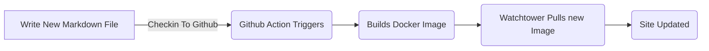
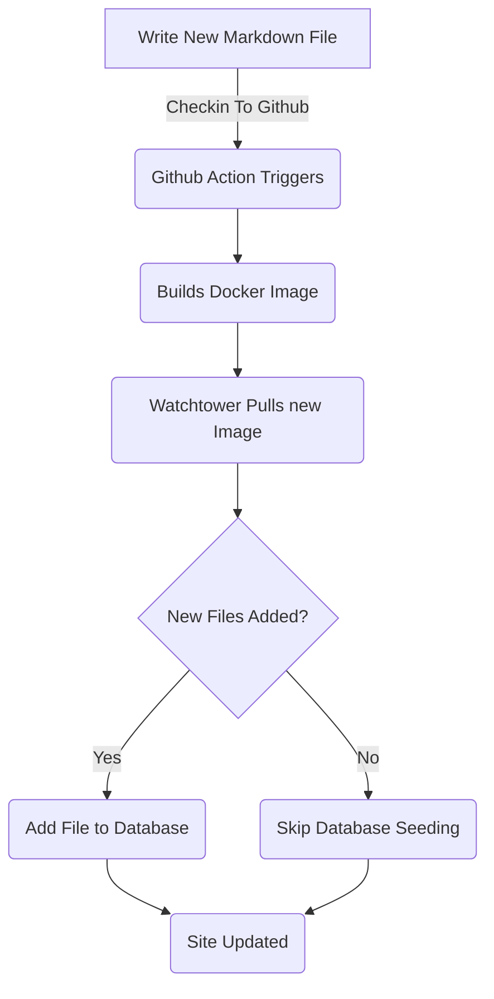

# Προσθήκη πλαισίου οντοτήτων για δημοσιεύσεις blog (μέρος 5)

<!--category-- ASP.NET, Entity Framework -->
<datetime class="hidden">2024-08-18T01:20</datetime>

Δείτε μέρη [1](/blog/addingentityframeworkforblogpostspt1) και [2](/blog/addingentityframeworkforblogpostspt2) και [3](/blog/addingentityframeworkforblogpostspt3) και [4](/blog/addingentityframeworkforblogpostspt4) για τα προηγούμενα βήματα.

# Εισαγωγή

Σε προηγούμενα μέρη καλύψαμε πώς να δημιουργήσουμε τη βάση δεδομένων, πώς δομούνται οι ελεγκτές και οι απόψεις μας, πώς λειτουργούσαν οι υπηρεσίες μας και πώς να σπείρουμε τη βάση δεδομένων με κάποια αρχικά δεδομένα. Σε αυτό το μέρος θα καλύψουμε λεπτομέρειες σχετικά με το πώς λειτουργούν οι υπηρεσίες EF Based και πώς μπορούμε να τις χρησιμοποιήσουμε στους ελεγκτές μας.

Ως συνήθως μπορείς να δεις όλη την πηγή για αυτό στο GitHub μου [Ορίστε.](https://github.com/scottgal/mostlylucidweb/tree/main/Mostlylucid/Blog), στον πιο διαυγή/blog φάκελο.

[TOC]

# Υπηρεσίες blog

## Υπηρεσίες με βάση το αρχείο

Στα προηγούμενα επεισόδια... `MarkdownBlogService` για να πάρουμε τις δημοσιεύσεις και τις γλώσσες του blog μας. Αυτή η υπηρεσία εισέβαλε στους ελεγκτές και τις απόψεις μας. Αυτή η υπηρεσία ήταν μια απλή υπηρεσία που διαβάζει τα αρχεία markdown από το δίσκο και τα επέστρεψε ως `BlogViewModels`.

Αυτό χρησιμοποίησε ένα στατικό λεξικό για να κρατήσει τις δημοσιεύσεις blog στη συνέχεια επέστρεψε τα αποτελέσματα από αυτό το λεξικό.

```csharp
  public async Task<PostListViewModel> GetPagedPosts(int page = 1, int pageSize = 10, string language = EnglishLanguage)
    {
        var model = new PostListViewModel();
        var posts = GetPageCache().Where(x => x.Value.Language == language)
            .Select(x => GetListModel(x.Value)).ToList();
        model.Posts = posts.OrderByDescending(x => x.PublishedDate).Skip((page - 1) * pageSize).Take(pageSize).ToList();
        model.TotalItems = posts.Count();
        model.PageSize = pageSize;
        model.Page = page;
        return await Task.FromResult(model);
    }
```

Αυτό είναι το `GetPagedPosts` μέθοδος από την `MarkdownBlogService`. Αυτή η μέθοδος παίρνει τις αναρτήσεις blog από την κρύπτη και τις επιστρέφει ως ένα `PostListViewModel`.

Χρησιμοποιώντας αρχεία για την αποθήκευση αρχείων Markdown εξακολουθεί να είναι μια καλή προσέγγιση, καθιστά απλό να προσθέσετε δημοσιεύσεις (Εγώ απλά αποθηκεύσετε τα αρχεία markdown στο δίσκο και να τα ελέγξετε) και είναι εύκολο να διαχειριστεί. Αλλά θέλουμε να χρησιμοποιήσουμε τη βάση δεδομένων για να αποθηκεύσουμε τις δημοσιεύσεις και τις γλώσσες.



## Υπηρεσίες με βάση την EF

Στην [Προηγούμενο μέρος](/blog/adding foundation frameworkforblogpostspt4) Έδειξα πώς σπέρναμε τη βάση δεδομένων με τα δεδομένα του blog. Αυτή η ενημέρωση κάθε φορά που ανασυντάσσουμε και επανεκκινούμε το δοχείο Docker ([με τη χρήση του πύργου φρουράς ](blog/dockercompose)) Χρησιμοποιήσαμε ένα `EFBlogPopulator` Τάξη για να το κάνουμε αυτό.

Τώρα η ροή μας μοιάζει κάπως έτσι.



Τώρα που έχουμε τις αναρτήσεις blog στη βάση δεδομένων μας χρησιμοποιούμε το `EFBlogService` να παρέχει την εφαρμογή για την εκτέλεση του προϋπολογισμού `IBlogService` διεπαφή:

```csharp
public interface IBlogService
{
   Task<List<string>> GetCategories();
    Task<List<BlogPostViewModel>> GetPosts(DateTime? startDate = null, string category = "");
    Task<PostListViewModel> GetPostsByCategory(string category, int page = 1, int pageSize = 10, string language = MarkdownBaseService.EnglishLanguage);
    Task<BlogPostViewModel?> GetPost(string slug, string language = "");
    Task<PostListViewModel> GetPagedPosts(int page = 1, int pageSize = 10, string language = MarkdownBaseService.EnglishLanguage);
    
    Task<List<PostListModel>> GetPostsForLanguage(DateTime? startDate = null, string category = "", string language = MarkdownBaseService.EnglishLanguage);
}
```

Αυτό είναι το `IBlogService` interface. Αυτή είναι η διεπαφή που χρησιμοποιούν οι ελεγκτές μας για να πάρουν τις δημοσιεύσεις blog. Η `EFBlogService` εφαρμόζει αυτή τη διεπαφή και χρησιμοποιεί το `BlogContext` για να πάρει τα δεδομένα από τη βάση δεδομένων.
Όπως και με την υπηρεσία FileBased [ανωτέρω](#file-based-services) Μπορούμε να πάρουμε θέσεις ανά κατηγορία, γλώσσα, ημερομηνία και σελίδα.

### `GetPostList`

```csharp
    private async Task<PostListViewModel> GetPostList(int count, List<BlogPostEntity> posts, int page, int pageSize)
    {
        var languages = await NoTrackingQuery().Select(x =>
                new { x.Slug, x.LanguageEntity.Name }
            ).ToListAsync();

        var postModels = new List<PostListModel>();

        foreach (var postResult in posts)
        {
            var langArr = languages.Where(x => x.Slug == postResult.Slug).Select(x => x.Name).ToArray();

            postModels.Add(postResult.ToListModel(langArr));
        }

        var postListViewModel = new PostListViewModel
        {
            Page = page,
            PageSize = pageSize,
            TotalItems = count,
            Posts = postModels
        };

        return postListViewModel;
    }
```

Εδώ χρησιμοποιούμε το κοινό μας `PostsQuery` Αλλά προσθέτουμε `NoTrackingQuery` που είναι μια απλή μέθοδος που επιστρέφει ένα ερωτηματικό της `BlogPostEntity` αλλά με `AsNoTrackingWithIdentityResolution` Προστέθηκε. Αυτό σημαίνει ότι οι οντότητες δεν παρακολουθούνται από το πλαίσιο και διαβάζονται μόνο. Αυτό είναι χρήσιμο όταν απλώς διαβάζουμε δεδομένα και δεν τα ενημερώνουμε.

```csharp
     protected IQueryable<BlogPostEntity> PostsQuery()=>Context.BlogPosts.Include(x => x.Categories)
        .Include(x => x.LanguageEntity);
     
         private IQueryable<BlogPostEntity> NoTrackingQuery() => PostsQuery().AsNoTrackingWithIdentityResolution();
```

Μπορείτε να δείτε ότι μπορούμε επίσης να πάρουμε τις γλώσσες για τις θέσεις και στη συνέχεια να δημιουργήσουμε ένα `PostListViewModel` η οποία είναι μια δομή η οποία δέχεται πληροφορίες σχετικά με την επιγραφή (`Page`, `PageSize` και `TotalItems`) και επιστρέφεται στο χειριστήριο.

### `GetPost`

Η κύρια μέθοδος μας είναι η `GetPost` μέθοδος η οποία λαμβάνει μία μόνο θέση από την `Slug` και `Language`. Αυτή είναι μια απλή μέθοδος που χρησιμοποιεί την `PostsQuery` να πάρει τη θέση και στη συνέχεια να την επιστρέψει ως ένα `BlogPostViewModel`.
Μπορείτε να δείτε ότι έχει επίσης ένα προαιρετικό `Language` παράμετρος η οποία προεπιλεγεί `EnglishLanguage` που είναι μια σταθερά στο δικό μας `MarkdownBaseService` Μαθήματα.

```csharp
  public async Task<BlogPostViewModel?> GetPost(string slug, string language = "")
    {
        if (string.IsNullOrEmpty(language)) language =MarkdownBaseService.EnglishLanguage;
        var post = await NoTrackingQuery().FirstOrDefaultAsync(x => x.Slug == slug && x.LanguageEntity.Name == language);
        if (post == null) return null;
        var langArr = await GetLanguagesForSlug(slug);
        return post.ToPostModel(langArr);
    }
```

Αυτό χρησιμοποιεί επίσης την κοινή μας μέθοδο `GetLanguagesForSlug` Που παίρνει τις γλώσσες για μια θέση. Αυτή είναι μια απλή μέθοδος που επιστρέφει τις γλώσσες για μια θέση.

```csharp
    private async Task<List<string>> GetLanguagesForSlug(string slug)=> await NoTrackingQuery()
        .Where(x => x.Slug == slug).Select(x=>x.LanguageEntity.Name).ToListAsync();
```

### `GetPostsByCategory`

Αυτή η μέθοδος λαμβάνει τις θέσεις ανά κατηγορία (όπως το πλαίσιο ASP.NET & οντότητας για αυτή τη θέση). Χρησιμοpiοιεί το `PostsQuery` να πάρει τις θέσεις και στη συνέχεια να τα φιλτράρει σύμφωνα με την κατηγορία. Στη συνέχεια επιστρέφει τις θέσεις ως `PostListViewModel`.

```csharp
    public async Task<PostListViewModel> GetPostsByCategory(string category, int page = 1, int pageSize = 10,
        string language = MarkdownBaseService.EnglishLanguage)
    {
        
        var count = await NoTrackingQuery()
            .Where(x => x.Categories.Any(c => c.Name == category) && x.LanguageEntity.Name == language).CountAsync();
        var posts = await PostsQuery()
            .Where(x => x.Categories.Any(c => c.Name == category) && x.LanguageEntity.Name == language)
            .Skip((page - 1) * pageSize)
            .Take(pageSize)
            .ToListAsync();

        var languages = await GetLanguagesForSlugs(posts.Select(x => x.Slug).ToList());
        var postListViewModel = new PostListViewModel
        {
            Page = page,
            PageSize = pageSize,
            TotalItems = count,
            Posts = posts.Select(x => x.ToListModel(
                languages.FirstOrDefault(entry => entry.Key == x.Slug).Value.ToArray())).ToList()
        };
        return postListViewModel;
    }
```

# Συμπέρασμα

Μπορείτε να δείτε ότι οι υπηρεσίες EF Based είναι λίγο πιο πολύπλοκες από τις υπηρεσίες File Based αλλά είναι πιο ευέλικτες και μπορούν να χρησιμοποιηθούν σε πιο περίπλοκα σενάρια. Μπορούμε να χρησιμοποιήσουμε τις υπηρεσίες EF Based στους ελεγκτές και τις απόψεις μας για να πάρουμε τις δημοσιεύσεις και τις γλώσσες του blog.
Στο μέλλον θα χτίσουμε πάνω σε αυτά και θα προσθέσουμε υπηρεσίες όπως inline επεξεργασία και σχόλια.
Θα δούμε επίσης πώς μπορούμε να συγχρονίσουμε αυτά σε πολλαπλά συστήματα.