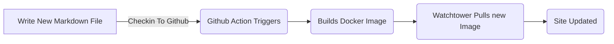
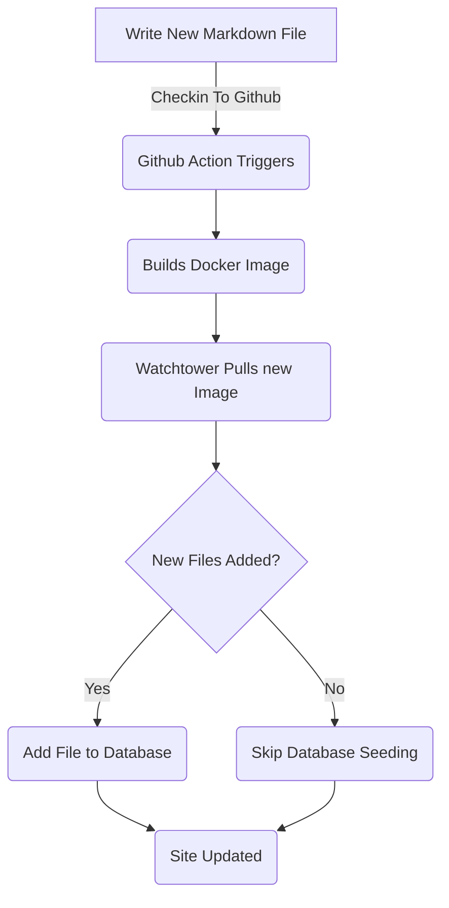

# Añadiendo marco de entidad para entradas de blog (Parte 5)

<!--category-- ASP.NET, Entity Framework -->
<datetime class="hidden">2024-08-18T01:20</datetime>

Ver partes [1](/blog/addingentityframeworkforblogpostspt1) y [2](/blog/addingentityframeworkforblogpostspt2) y [3](/blog/addingentityframeworkforblogpostspt3) y [4](/blog/addingentityframeworkforblogpostspt4) para los pasos anteriores.

# Introducción

En partes anteriores cubrimos cómo configurar la base de datos, cómo se estructuran nuestros controladores y vistas, cómo funcionaban nuestros servicios y cómo sembrar la base de datos con algunos datos iniciales. En esta parte cubriremos detalles sobre cómo funcionan los servicios basados en EF y cómo podemos usarlos en nuestros controladores.

Como siempre puedes ver toda la fuente de esto en mi GitHub [aquí](https://github.com/scottgal/mostlylucidweb/tree/main/Mostlylucid/Blog), en la carpeta Mostlylucid/Blog.

[TOC]

# Servicios de blogs

## Servicios basados en archivos

Anteriormente usábamos una `MarkdownBlogService` para obtener nuestros posts de blog e idiomas. Este servicio fue inyectado en nuestros controladores y puntos de vista. Este servicio era un servicio simple que leía los archivos de marca hacia abajo del disco y los devolvía como `BlogViewModels`.

Esto utilizó un diccionario estático para mantener los posts del blog y luego los resultados devueltos de ese diccionario.

```csharp
  public async Task<PostListViewModel> GetPagedPosts(int page = 1, int pageSize = 10, string language = EnglishLanguage)
    {
        var model = new PostListViewModel();
        var posts = GetPageCache().Where(x => x.Value.Language == language)
            .Select(x => GetListModel(x.Value)).ToList();
        model.Posts = posts.OrderByDescending(x => x.PublishedDate).Skip((page - 1) * pageSize).Take(pageSize).ToList();
        model.TotalItems = posts.Count();
        model.PageSize = pageSize;
        model.Page = page;
        return await Task.FromResult(model);
    }
```

Esta es la `GetPagedPosts` método de la `MarkdownBlogService`. Este método obtiene los mensajes de blog de la caché y los devuelve como un `PostListViewModel`.

El uso de archivos para almacenar archivos Markdown sigue siendo un buen enfoque, hace que sea fácil añadir publicaciones (solo guardo archivos Markdown en el disco y los comprobé) y es fácil de administrar. Pero queremos usar la base de datos para almacenar los mensajes e idiomas.



## Servicios basados en la FE

En el [parte anterior]((/blog/addingentityframeworkforblogpostspt4) Le mostré cómo sembramos la base de datos con los datos del blog. Esto actualiza cada vez que redistribuimos y reiniciamos el contenedor Docker ([Usando torre de vigilancia ](blog/dockercompose)) Usamos un `EFBlogPopulator` clase para hacer esto.

Ahora nuestro flujo se ve así



Ahora que tenemos las entradas del blog en nuestra base de datos usamos el `EFBlogService` para suministrar la aplicación para fuera `IBlogService` interfaz:

```csharp
public interface IBlogService
{
   Task<List<string>> GetCategories();
    Task<List<BlogPostViewModel>> GetPosts(DateTime? startDate = null, string category = "");
    Task<PostListViewModel> GetPostsByCategory(string category, int page = 1, int pageSize = 10, string language = MarkdownBaseService.EnglishLanguage);
    Task<BlogPostViewModel?> GetPost(string slug, string language = "");
    Task<PostListViewModel> GetPagedPosts(int page = 1, int pageSize = 10, string language = MarkdownBaseService.EnglishLanguage);
    
    Task<List<PostListModel>> GetPostsForLanguage(DateTime? startDate = null, string category = "", string language = MarkdownBaseService.EnglishLanguage);
}
```

Esta es la `IBlogService` interfaz. Esta es la interfaz que nuestros controladores utilizan para obtener las entradas del blog. Los `EFBlogService` implementa esta interfaz y utiliza el `BlogContext` para obtener los datos de la base de datos.
Como con el servicio basado en archivos [más arriba](#file-based-services) podemos obtener publicaciones por categoría, idioma, fecha y página.

### `GetPostList`

```csharp
    private async Task<PostListViewModel> GetPostList(int count, List<BlogPostEntity> posts, int page, int pageSize)
    {
        var languages = await NoTrackingQuery().Select(x =>
                new { x.Slug, x.LanguageEntity.Name }
            ).ToListAsync();

        var postModels = new List<PostListModel>();

        foreach (var postResult in posts)
        {
            var langArr = languages.Where(x => x.Slug == postResult.Slug).Select(x => x.Name).ToArray();

            postModels.Add(postResult.ToListModel(langArr));
        }

        var postListViewModel = new PostListViewModel
        {
            Page = page,
            PageSize = pageSize,
            TotalItems = count,
            Posts = postModels
        };

        return postListViewModel;
    }
```

Aquí usamos nuestro común `PostsQuery` pero añadimos `NoTrackingQuery` que es un método simple que devuelve una consultable de la `BlogPostEntity` pero con `AsNoTrackingWithIdentityResolution` añadido. Esto significa que las entidades no son rastreadas por el contexto y son leídas solamente. Esto es útil cuando sólo estamos leyendo datos y no actualizarlo.

```csharp
     protected IQueryable<BlogPostEntity> PostsQuery()=>Context.BlogPosts.Include(x => x.Categories)
        .Include(x => x.LanguageEntity);
     
         private IQueryable<BlogPostEntity> NoTrackingQuery() => PostsQuery().AsNoTrackingWithIdentityResolution();
```

Se puede ver que también obtenemos los idiomas para los mensajes y luego crear un `PostListViewModel` que es una estructura que acepta la información de búsqueda (`Page`, `PageSize` y `TotalItems`) y se devuelve al controlador.

### `GetPost`

Nuestro método principal es el `GetPost` método que obtiene un único puesto por su `Slug` y `Language`. Este es un método simple que utiliza el `PostsQuery` para obtener el post y luego lo devuelve como un `BlogPostViewModel`.
Usted puede ver que también tiene un opcional `Language` parámetro por defecto a `EnglishLanguage` que es una constante en nuestra `MarkdownBaseService` clase.

```csharp
  public async Task<BlogPostViewModel?> GetPost(string slug, string language = "")
    {
        if (string.IsNullOrEmpty(language)) language =MarkdownBaseService.EnglishLanguage;
        var post = await NoTrackingQuery().FirstOrDefaultAsync(x => x.Slug == slug && x.LanguageEntity.Name == language);
        if (post == null) return null;
        var langArr = await GetLanguagesForSlug(slug);
        return post.ToPostModel(langArr);
    }
```

Esto también utiliza nuestro método común `GetLanguagesForSlug` que obtiene los idiomas para un post. Este es un método simple que devuelve los idiomas para un post.

```csharp
    private async Task<List<string>> GetLanguagesForSlug(string slug)=> await NoTrackingQuery()
        .Where(x => x.Slug == slug).Select(x=>x.LanguageEntity.Name).ToListAsync();
```

### `GetPostsByCategory`

Este método obtiene los mensajes por categoría (como ASP.NET & Entity Framework para este post). Usa el `PostsQuery` para obtener los posts y luego filtrarlos por la categoría. A continuación, devuelve los mensajes como un `PostListViewModel`.

```csharp
    public async Task<PostListViewModel> GetPostsByCategory(string category, int page = 1, int pageSize = 10,
        string language = MarkdownBaseService.EnglishLanguage)
    {
        
        var count = await NoTrackingQuery()
            .Where(x => x.Categories.Any(c => c.Name == category) && x.LanguageEntity.Name == language).CountAsync();
        var posts = await PostsQuery()
            .Where(x => x.Categories.Any(c => c.Name == category) && x.LanguageEntity.Name == language)
            .Skip((page - 1) * pageSize)
            .Take(pageSize)
            .ToListAsync();

        var languages = await GetLanguagesForSlugs(posts.Select(x => x.Slug).ToList());
        var postListViewModel = new PostListViewModel
        {
            Page = page,
            PageSize = pageSize,
            TotalItems = count,
            Posts = posts.Select(x => x.ToListModel(
                languages.FirstOrDefault(entry => entry.Key == x.Slug).Value.ToArray())).ToList()
        };
        return postListViewModel;
    }
```

# Conclusión

Puede ver que los servicios basados en EF son un poco más complejos que los servicios basados en archivos, pero son más flexibles y se pueden utilizar en escenarios más complejos. Podemos utilizar los servicios basados en EF en nuestros controladores y vistas para obtener las publicaciones de blog e idiomas.
En el futuro nos basaremos en estos y añadiremos servicios como edición en línea y comentarios.
También veremos cómo podemos sincronizar estos a través de múltiples sistemas.