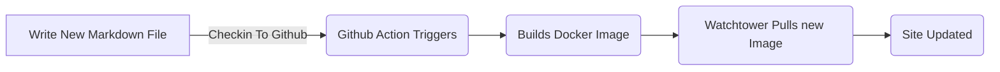
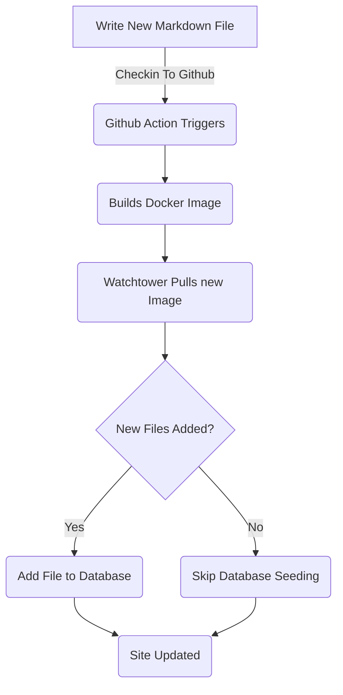

# Bloggaavien viestien lisätietokehys (osa 5)

<!--category-- ASP.NET, Entity Framework -->
<datetime class="hidden">2024-08-18T01:20</datetime>

Katso osat [1](/blog/addingentityframeworkforblogpostspt1) sekä [2](/blog/addingentityframeworkforblogpostspt2) sekä [3](/blog/addingentityframeworkforblogpostspt3) sekä [4](/blog/addingentityframeworkforblogpostspt4) edellisten vaiheiden osalta.

# Johdanto

Aiemmissa osissa selvitimme, miten tietokanta perustetaan, miten ohjaimemme ja näkemyksemme on jäsennetty, miten palvelumme toimivat ja miten tietokantaan saadaan alkutietoja. Tässä osassa kerromme yksityiskohtaisesti, miten EF-pohjaiset palvelut toimivat ja miten voimme käyttää niitä ohjaimissamme.

Kuten tavallista, näet kaiken tämän lähteen GitHubistani. [täällä](https://github.com/scottgal/mostlylucidweb/tree/main/Mostlylucid/Blog), Enimmäkseen lucid/Blog-kansiossa.

[TÄYTÄNTÖÖNPANO

# Blogipalvelut

## Tiedostopohjaiset palvelut

Aiemmin käytimme `MarkdownBlogService` jotta saamme blogikirjoituksemme ja kielemme. Tämä palvelu ruiskutettiin ohjaimiimme ja näkökulmiimme. Tämä palvelu oli yksinkertainen palvelu, joka luki levyltä markown-tiedostoja ja palautti ne `BlogViewModels`.

Tämä käytti Static Dictionary pitää blogikirjoituksia sitten palasi tuloksia, että Dictionary.

```csharp
  public async Task<PostListViewModel> GetPagedPosts(int page = 1, int pageSize = 10, string language = EnglishLanguage)
    {
        var model = new PostListViewModel();
        var posts = GetPageCache().Where(x => x.Value.Language == language)
            .Select(x => GetListModel(x.Value)).ToList();
        model.Posts = posts.OrderByDescending(x => x.PublishedDate).Skip((page - 1) * pageSize).Take(pageSize).ToList();
        model.TotalItems = posts.Count();
        model.PageSize = pageSize;
        model.Page = page;
        return await Task.FromResult(model);
    }
```

Tämä on `GetPagedPosts` metodin käytöstä `MarkdownBlogService`...................................................................................................................................... Tämä menetelmä saa blogikirjoitukset välimuistista ja palauttaa ne `PostListViewModel`.

Tiedostojen käyttäminen Markdown-tiedostojen tallentamiseen on edelleen hyvä lähestymistapa, joten viestien lisääminen on helppoa (tallennan vain markown-tiedostoja levylle ja tarkistan ne) ja se on helppo hallita. Haluamme kuitenkin käyttää tietokantaa viestien ja kielten tallentamiseen.



## EF-pohjaiset palvelut

• • • • • • • • • • • • • • • • • • • • • • • • • • • • • • • • • • • • • • • • • • • • • • • • • • • • • • • • • • • • • • • • • • • • • • • • • • • • • • • • • • • • • • • • • • • • • • • • • • • • • • • • • • • • • • • • • • • • • • • • • • • • • • • • • • • • • • • • • • • • • • • • • • • • • • • • • • • • • • • • • • • • • • • • • • • • • • • • • • • • • • • • • • • • • • • • • • • • • [Edellinen osa]((/blog/addrendientityframework forblogpostspt4) Näytin, miten levitimme tietokantaa blogitietojen avulla. Päivitämme tämän joka kerta uudelleen ja käynnistämme kontin uudelleen ([Vartiotornin käyttö ](blog/dockercompose)) Käytimme a `EFBlogPopulator` Tyyliä tehdä tämä.

Nyt virtamme näyttää tältä.



Nyt kun meillä on blogikirjoitukset tietokannassamme, käytämme `EFBlogService` Toimeenpanon toimittaminen `IBlogService` rajapinta:

```csharp
public interface IBlogService
{
   Task<List<string>> GetCategories();
    Task<List<BlogPostViewModel>> GetPosts(DateTime? startDate = null, string category = "");
    Task<PostListViewModel> GetPostsByCategory(string category, int page = 1, int pageSize = 10, string language = MarkdownBaseService.EnglishLanguage);
    Task<BlogPostViewModel?> GetPost(string slug, string language = "");
    Task<PostListViewModel> GetPagedPosts(int page = 1, int pageSize = 10, string language = MarkdownBaseService.EnglishLanguage);
    
    Task<List<PostListModel>> GetPostsForLanguage(DateTime? startDate = null, string category = "", string language = MarkdownBaseService.EnglishLanguage);
}
```

Tämä on `IBlogService` rajapinta. Tämä on rajapinta, jolla ohjaimemme saavat blogikirjoitukset. Erytropoietiini `EFBlogService` toteuttaa tämän käyttöliittymän ja käyttää `BlogContext` datan saamiseksi tietokannasta.
Kuten ei FileBased-palvelussa [yllä](#file-based-services) virkoja voi saada kategorioittain, kielellisesti, päivämäärin ja hakusanoin.

### `GetPostList`

```csharp
    private async Task<PostListViewModel> GetPostList(int count, List<BlogPostEntity> posts, int page, int pageSize)
    {
        var languages = await NoTrackingQuery().Select(x =>
                new { x.Slug, x.LanguageEntity.Name }
            ).ToListAsync();

        var postModels = new List<PostListModel>();

        foreach (var postResult in posts)
        {
            var langArr = languages.Where(x => x.Slug == postResult.Slug).Select(x => x.Name).ToArray();

            postModels.Add(postResult.ToListModel(langArr));
        }

        var postListViewModel = new PostListViewModel
        {
            Page = page,
            PageSize = pageSize,
            TotalItems = count,
            Posts = postModels
        };

        return postListViewModel;
    }
```

Täällä käytämme yhteistä `PostsQuery` mutta lisäämme `NoTrackingQuery` joka on yksinkertainen menetelmä, joka palauttaa kyselyn `BlogPostEntity` mutta `AsNoTrackingWithIdentityResolution` lisätty. Tämä tarkoittaa, että kokonaisuuksia ei seurata asiayhteydestä ja ne luetaan vain. Tämä on hyödyllistä, kun vain luemme dataa emmekä päivitä sitä.

```csharp
     protected IQueryable<BlogPostEntity> PostsQuery()=>Context.BlogPosts.Include(x => x.Categories)
        .Include(x => x.LanguageEntity);
     
         private IQueryable<BlogPostEntity> NoTrackingQuery() => PostsQuery().AsNoTrackingWithIdentityResolution();
```

Voit nähdä, että saamme myös kieliä virkoihin ja sitten luoda `PostListViewModel` joka on rakenne, joka hyväksyy hakutiedot (`Page`, `PageSize` sekä `TotalItems`) ja palautetaan rekisterinpitäjälle.

### `GetPost`

Päämenetelmämme on `GetPost` menetelmä, joka saa yhden viran sen `Slug` sekä `Language`...................................................................................................................................... Tämä on yksinkertainen menetelmä, jossa käytetään `PostsQuery` Saada postia ja sitten palauttaa sen `BlogPostViewModel`.
Voit nähdä, että se on myös valinnainen `Language` parametri, johon oletukset perustuvat `EnglishLanguage` joka on jatkuva meidän `MarkdownBaseService` Luokka.

```csharp
  public async Task<BlogPostViewModel?> GetPost(string slug, string language = "")
    {
        if (string.IsNullOrEmpty(language)) language =MarkdownBaseService.EnglishLanguage;
        var post = await NoTrackingQuery().FirstOrDefaultAsync(x => x.Slug == slug && x.LanguageEntity.Name == language);
        if (post == null) return null;
        var langArr = await GetLanguagesForSlug(slug);
        return post.ToPostModel(langArr);
    }
```

Tämä käyttää myös yhteistä menetelmäämme `GetLanguagesForSlug` joka saa kielet postiin. Tämä on yksinkertainen menetelmä, joka palauttaa kielet postitse.

```csharp
    private async Task<List<string>> GetLanguagesForSlug(string slug)=> await NoTrackingQuery()
        .Where(x => x.Slug == slug).Select(x=>x.LanguageEntity.Name).ToListAsync();
```

### `GetPostsByCategory`

Tällä menetelmällä virat saadaan luokittain (kuten ASP.NET & Entity Framework tässä viestissä). Se käyttää `PostsQuery` Saada virat ja suodattaa ne sitten kategorian mukaan. Sen jälkeen se palauttaa virat `PostListViewModel`.

```csharp
    public async Task<PostListViewModel> GetPostsByCategory(string category, int page = 1, int pageSize = 10,
        string language = MarkdownBaseService.EnglishLanguage)
    {
        
        var count = await NoTrackingQuery()
            .Where(x => x.Categories.Any(c => c.Name == category) && x.LanguageEntity.Name == language).CountAsync();
        var posts = await PostsQuery()
            .Where(x => x.Categories.Any(c => c.Name == category) && x.LanguageEntity.Name == language)
            .Skip((page - 1) * pageSize)
            .Take(pageSize)
            .ToListAsync();

        var languages = await GetLanguagesForSlugs(posts.Select(x => x.Slug).ToList());
        var postListViewModel = new PostListViewModel
        {
            Page = page,
            PageSize = pageSize,
            TotalItems = count,
            Posts = posts.Select(x => x.ToListModel(
                languages.FirstOrDefault(entry => entry.Key == x.Slug).Value.ToArray())).ToList()
        };
        return postListViewModel;
    }
```

# Johtopäätöksenä

Huomaat, että EF-pohjaiset palvelut ovat hieman monimutkaisempia kuin tiedostopohjaiset palvelut, mutta ne ovat joustavampia ja niitä voidaan käyttää monimutkaisemmissa skenaarioissa. Voimme käyttää ohjaimissamme ja näkökulmissamme EF-pohjaisia palveluita saadaksemme blogikirjoitukset ja -kielet.
Tulevaisuudessa rakennamme näitä ja lisäämme palveluita, kuten inline-muokkausta ja kommentteja.
Tarkastelemme myös, miten voimme synkronoida näitä eri järjestelmissä.