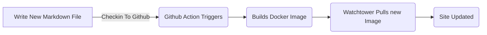
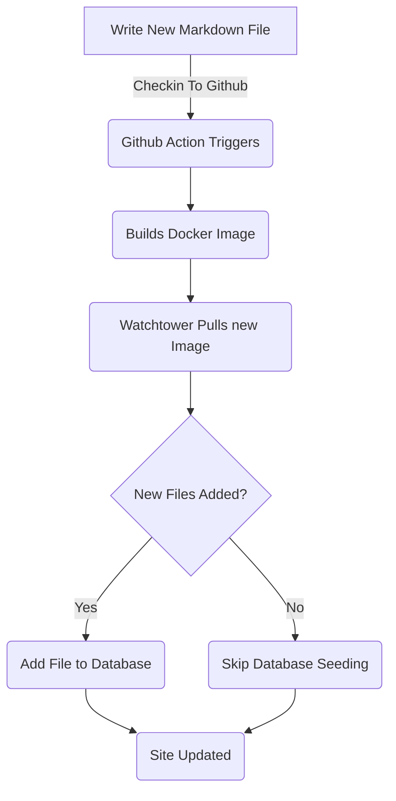

# Ajouter un cadre d'entité pour les billets de blog (partie 5)

<!--category-- ASP.NET, Entity Framework -->
<datetime class="hidden">2024-08-18T01:20</datetime>

Voir parties [1](/blog/addingentityframeworkforblogpostspt1) et [2](/blog/addingentityframeworkforblogpostspt2) et [3](/blog/addingentityframeworkforblogpostspt3) et [4](/blog/addingentityframeworkforblogpostspt4) pour les étapes précédentes.

# Présentation

Dans les parties précédentes, nous avons décrit comment configurer la base de données, comment nos contrôleurs et nos points de vue sont structurés, comment nos services fonctionnent et comment ensemencer la base de données avec quelques données initiales. Dans cette partie, nous présenterons des détails sur le fonctionnement des services EF Based et sur la façon dont nous pouvons les utiliser dans nos contrôleurs.

Comme d'habitude, vous pouvez voir toute la source pour cela sur mon GitHub [Ici.](https://github.com/scottgal/mostlylucidweb/tree/main/Mostlylucid/Blog), dans le dossier Mostlylucid/Blog.

[TOC]

# Services de blog

## Services basés sur des fichiers

Précédemment nous avons utilisé un `MarkdownBlogService` pour obtenir nos billets de blog et nos langues. Ce service a été injecté dans nos contrôleurs et nos vues. Ce service était un service simple qui lisait les fichiers de balisage à partir du disque et les renvoyait comme `BlogViewModels`.

Cela a utilisé un dictionnaire statique pour tenir les messages de blog puis retourné les résultats de ce dictionnaire.

```csharp
  public async Task<PostListViewModel> GetPagedPosts(int page = 1, int pageSize = 10, string language = EnglishLanguage)
    {
        var model = new PostListViewModel();
        var posts = GetPageCache().Where(x => x.Value.Language == language)
            .Select(x => GetListModel(x.Value)).ToList();
        model.Posts = posts.OrderByDescending(x => x.PublishedDate).Skip((page - 1) * pageSize).Take(pageSize).ToList();
        model.TotalItems = posts.Count();
        model.PageSize = pageSize;
        model.Page = page;
        return await Task.FromResult(model);
    }
```

C'est la `GetPagedPosts` méthode de la `MarkdownBlogService`C'est ce que j'ai dit. Cette méthode obtient les messages de blog du cache et les renvoie comme un `PostListViewModel`.

L'utilisation de fichiers pour stocker des fichiers Markdown est toujours une bonne approche, il est facile d'ajouter des messages (j'enregistre simplement les fichiers Markdown sur le disque et je les enregistre) et il est facile à gérer. Mais nous voulons utiliser la base de données pour stocker les messages et les langues.



## Services basés sur l'EF

Dans le [partie précédente]((/blog/addingentityframeworkforblogpostspt4) J'ai montré comment nous avons ensemencé la base de données avec les données du blog. Ceci met à jour chaque fois que nous redéployons et redémarrons le conteneur docker ([à l'aide d'une tour de guet ](blog/dockercompose)) Nous avons utilisé un `EFBlogPopulator` C'est la classe pour faire ça.

Maintenant, notre flux ressemble à ça.



Maintenant que nous avons les billets de blog dans notre base de données, nous utilisons `EFBlogService` de fournir la mise en œuvre pour `IBlogService` interface & #160;:

```csharp
public interface IBlogService
{
   Task<List<string>> GetCategories();
    Task<List<BlogPostViewModel>> GetPosts(DateTime? startDate = null, string category = "");
    Task<PostListViewModel> GetPostsByCategory(string category, int page = 1, int pageSize = 10, string language = MarkdownBaseService.EnglishLanguage);
    Task<BlogPostViewModel?> GetPost(string slug, string language = "");
    Task<PostListViewModel> GetPagedPosts(int page = 1, int pageSize = 10, string language = MarkdownBaseService.EnglishLanguage);
    
    Task<List<PostListModel>> GetPostsForLanguage(DateTime? startDate = null, string category = "", string language = MarkdownBaseService.EnglishLanguage);
}
```

C'est la `IBlogService` l'interface. C'est l'interface que nos contrôleurs utilisent pour obtenir les messages de blog. Les `EFBlogService` implémente cette interface et utilise `BlogContext` pour obtenir les données de la base de données.
Comme pour le service FileBased [ci-dessus](#file-based-services) nous pouvons obtenir des messages par catégorie, par langue, par date, et paged.

### `GetPostList`

```csharp
    private async Task<PostListViewModel> GetPostList(int count, List<BlogPostEntity> posts, int page, int pageSize)
    {
        var languages = await NoTrackingQuery().Select(x =>
                new { x.Slug, x.LanguageEntity.Name }
            ).ToListAsync();

        var postModels = new List<PostListModel>();

        foreach (var postResult in posts)
        {
            var langArr = languages.Where(x => x.Slug == postResult.Slug).Select(x => x.Name).ToArray();

            postModels.Add(postResult.ToListModel(langArr));
        }

        var postListViewModel = new PostListViewModel
        {
            Page = page,
            PageSize = pageSize,
            TotalItems = count,
            Posts = postModels
        };

        return postListViewModel;
    }
```

Ici, nous utilisons notre commun `PostsQuery` mais nous ajoutons `NoTrackingQuery` qui est une méthode simple qui renvoie une requête de la `BlogPostEntity` mais avec `AsNoTrackingWithIdentityResolution` ajouté. Cela signifie que les entités ne sont pas suivies par le contexte et sont lues uniquement. C'est utile lorsque nous lisons des données et que nous ne les mettons pas à jour.

```csharp
     protected IQueryable<BlogPostEntity> PostsQuery()=>Context.BlogPosts.Include(x => x.Categories)
        .Include(x => x.LanguageEntity);
     
         private IQueryable<BlogPostEntity> NoTrackingQuery() => PostsQuery().AsNoTrackingWithIdentityResolution();
```

Vous pouvez voir que nous obtenons également les langues pour les messages et ensuite créer un `PostListViewModel` qui est une structure qui accepte l'information de téléappel (`Page`, `PageSize` et `TotalItems`) et est retourné au contrôleur.

### `GetPost`

Notre méthode principale est la `GetPost` méthode qui obtient un seul post par son `Slug` et `Language`C'est ce que j'ai dit. Il s'agit d'une méthode simple qui utilise la `PostsQuery` pour obtenir le poste et ensuite le retourner comme un `BlogPostViewModel`.
Vous pouvez voir qu'il a aussi une option `Language` paramètre par défaut à `EnglishLanguage` qui est une constante dans notre `MarkdownBaseService` En cours.

```csharp
  public async Task<BlogPostViewModel?> GetPost(string slug, string language = "")
    {
        if (string.IsNullOrEmpty(language)) language =MarkdownBaseService.EnglishLanguage;
        var post = await NoTrackingQuery().FirstOrDefaultAsync(x => x.Slug == slug && x.LanguageEntity.Name == language);
        if (post == null) return null;
        var langArr = await GetLanguagesForSlug(slug);
        return post.ToPostModel(langArr);
    }
```

Ceci utilise aussi notre méthode commune `GetLanguagesForSlug` qui obtient les langues pour un poste. Il s'agit d'une méthode simple qui renvoie les langues pour un message.

```csharp
    private async Task<List<string>> GetLanguagesForSlug(string slug)=> await NoTrackingQuery()
        .Where(x => x.Slug == slug).Select(x=>x.LanguageEntity.Name).ToListAsync();
```

### `GetPostsByCategory`

Cette méthode obtient les messages par catégorie (comme ASP.NET & Entity Framework pour ce post). Il utilise les `PostsQuery` pour obtenir les messages et ensuite les filtrer par la catégorie. Il retourne ensuite les messages comme un `PostListViewModel`.

```csharp
    public async Task<PostListViewModel> GetPostsByCategory(string category, int page = 1, int pageSize = 10,
        string language = MarkdownBaseService.EnglishLanguage)
    {
        
        var count = await NoTrackingQuery()
            .Where(x => x.Categories.Any(c => c.Name == category) && x.LanguageEntity.Name == language).CountAsync();
        var posts = await PostsQuery()
            .Where(x => x.Categories.Any(c => c.Name == category) && x.LanguageEntity.Name == language)
            .Skip((page - 1) * pageSize)
            .Take(pageSize)
            .ToListAsync();

        var languages = await GetLanguagesForSlugs(posts.Select(x => x.Slug).ToList());
        var postListViewModel = new PostListViewModel
        {
            Page = page,
            PageSize = pageSize,
            TotalItems = count,
            Posts = posts.Select(x => x.ToListModel(
                languages.FirstOrDefault(entry => entry.Key == x.Slug).Value.ToArray())).ToList()
        };
        return postListViewModel;
    }
```

# En conclusion

Vous pouvez voir que les services EF Based sont un peu plus complexes que les services File Based, mais ils sont plus flexibles et peuvent être utilisés dans des scénarios plus complexes. Nous pouvons utiliser les services EF Based dans nos contrôleurs et les vues pour obtenir les messages de blog et les langues.
À l'avenir, nous nous en inspirerons et ajouterons des services comme l'édition en ligne et les commentaires.
Nous examinerons également comment nous pourrions synchroniser ces systèmes à travers plusieurs systèmes.