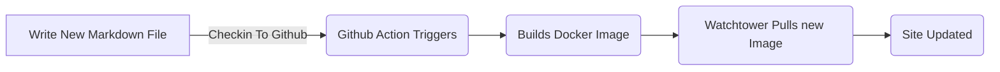
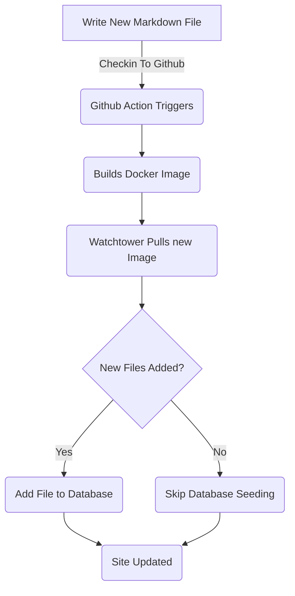

# ब्लॉग पोस्ट के लिए एंटिटी फ्रेमवर्क जोड़ा जा रहा है ( पार्ट ५)

<!--category-- ASP.NET, Entity Framework -->
<datetime class="hidden">2024- 0. 1418टी01: 20</datetime>

हिस्से में देखें [1](/blog/addingentityframeworkforblogpostspt1) और [2](/blog/addingentityframeworkforblogpostspt2) और [3](/blog/addingentityframeworkforblogpostspt3) और [4](/blog/addingentityframeworkforblogpostspt4) पिछले चरण के लिए.

# परिचय

पहले भाग में हम कैसे डाटाबेस सेट करने के लिए कवर, कैसे हमारे नियंत्रण और दृष्टिकोण निर्माण कर रहे हैं, हमारी सेवाओं ने कैसे काम किया, और कैसे कुछ प्रारंभिक डेटा के साथ डाटाबेस को बढ़ाया. इस भाग में हम विवरणों को कवर करेंगे कैसे EF आधारित सेवाओं के काम और कैसे हम उन्हें हमारे नियंत्रण में उपयोग कर सकते हैं।

हमेशा के रूप में आप मेरे GiB पर इस सब स्रोत के लिए देख सकते हैं [यहाँ](https://github.com/scottgal/mostlylucidweb/tree/main/Mostlylucid/Blog), सबसे पुराने/ ब्लॉग फ़ोल्डर में.

[विषय

# ब्लॉग सेवाName

## फ़ाइल आधारित सेवाएँ

पहले हम एक इस्तेमाल किया `MarkdownBlogService` हमारे ब्लॉग पोस्ट और भाषाओं को पाने के लिए। यह सेवा हमारे नियंत्रण और विचारों में शामिल थी । यह सेवा एक सरल सेवा थी जो डिस्क से फ़ाइलों को चिन्हित करती है और उन्हें वापस लौटा `BlogViewModels`.

यह एक स्थिर शब्दकोश के जरिए ब्लॉग पोस्ट को पकड़ने के लिए प्रयोग किया गया फिर उस शब्दकोश से परिणाम वापस आया.

```csharp
  public async Task<PostListViewModel> GetPagedPosts(int page = 1, int pageSize = 10, string language = EnglishLanguage)
    {
        var model = new PostListViewModel();
        var posts = GetPageCache().Where(x => x.Value.Language == language)
            .Select(x => GetListModel(x.Value)).ToList();
        model.Posts = posts.OrderByDescending(x => x.PublishedDate).Skip((page - 1) * pageSize).Take(pageSize).ToList();
        model.TotalItems = posts.Count();
        model.PageSize = pageSize;
        model.Page = page;
        return await Task.FromResult(model);
    }
```

यह है `GetPagedPosts` विधि से `MarkdownBlogService`___ इस विधि से कैश से ब्लॉग पोस्ट प्राप्त होता है तथा उन्हें एक के रूप में लौटाता है `PostListViewModel`.

फ़ाइलों को चिह्नित करने के लिए उपयोग में फ़ाइल अभी भी एक अच्छा तरीका है, यह पोस्टों को जोड़ने के लिए सरल बनाता है (मैं सिर्फ डिस्क में चिह्न फ़ाइलों को सहेजें और उन्हें चेक करना आसान बनाता हूँ) और यह प्रबंधन के लिए आसान है. लेकिन हम पोस्ट और भाषाओं को जमा करने के लिए डाटाबेस का उपयोग करना चाहते हैं.



## एएफ़ आधारित सेवाएँ

में [पिछला भाग ((/ swide/ sepatedirial) मैंने पता लगाया कि कैसे हमने ब्लॉग डाटा के साथ डाटाबेस को बढ़ाया. यह हर बार जब हम लाल-लोफ़ाई और नावर कंटेनर फिर से प्रारंभ करता है (एवरेज)[खाली स्थान का प्रयोग करें (_w) ](blog/dockercompose)हम एक इस्तेमाल किया `EFBlogPopulator` यह करने के लिए वर्ग.

अब हमारा प्रवाह इस तरह दिखता है



अब जबकि हमारे पास ब्लॉग पोस्ट हैं हम अपने डाटाबेस में इस्तेमाल करते हैं `EFBlogService` बाहर के लिए कार्यान्वयन देना `IBlogService` इंटरफेसः

```csharp
public interface IBlogService
{
   Task<List<string>> GetCategories();
    Task<List<BlogPostViewModel>> GetPosts(DateTime? startDate = null, string category = "");
    Task<PostListViewModel> GetPostsByCategory(string category, int page = 1, int pageSize = 10, string language = MarkdownBaseService.EnglishLanguage);
    Task<BlogPostViewModel?> GetPost(string slug, string language = "");
    Task<PostListViewModel> GetPagedPosts(int page = 1, int pageSize = 10, string language = MarkdownBaseService.EnglishLanguage);
    
    Task<List<PostListModel>> GetPostsForLanguage(DateTime? startDate = null, string category = "", string language = MarkdownBaseService.EnglishLanguage);
}
```

यह है `IBlogService` इंटरफेस. यह वह इंटरफेस है जो हमारा नियंत्रक ब्लॉग पोस्ट पाने के लिए प्रयोग करता है। वह `EFBlogService` इस इंटरफेस को लागू करता है तथा प्रयोग करता है `BlogContext` डाटाबेस से डाटा प्राप्त करने के लिए.
फ़ाइलबेस सेवा के साथ जैसा [ऊपर](#file-based-services) हम अलग - अलग भाषाओं, भाषा, और पृष्ठ द्वारा पोस्ट प्राप्त कर सकते हैं ।

### `GetPostList`

```csharp
    private async Task<PostListViewModel> GetPostList(int count, List<BlogPostEntity> posts, int page, int pageSize)
    {
        var languages = await NoTrackingQuery().Select(x =>
                new { x.Slug, x.LanguageEntity.Name }
            ).ToListAsync();

        var postModels = new List<PostListModel>();

        foreach (var postResult in posts)
        {
            var langArr = languages.Where(x => x.Slug == postResult.Slug).Select(x => x.Name).ToArray();

            postModels.Add(postResult.ToListModel(langArr));
        }

        var postListViewModel = new PostListViewModel
        {
            Page = page,
            PageSize = pageSize,
            TotalItems = count,
            Posts = postModels
        };

        return postListViewModel;
    }
```

यहाँ हम हमारे सामान्य उपयोग `PostsQuery` लेकिन हम जोड़ `NoTrackingQuery` जो एक सरल विधि है जो कि क्वैरी करने योग्य है `BlogPostEntity` लेकिन के साथ `AsNoTrackingWithIdentityResolution` जोड़ा गया. इसका मतलब है कि निगम को संदर्भ से ट्रैक नहीं किया जाता और सिर्फ पढ़ा जाता है । यह उपयोगी है जब हम सिर्फ डेटा पढ़ रहे हैं और इसे अद्यतन नहीं कर रहे हैं.

```csharp
     protected IQueryable<BlogPostEntity> PostsQuery()=>Context.BlogPosts.Include(x => x.Categories)
        .Include(x => x.LanguageEntity);
     
         private IQueryable<BlogPostEntity> NoTrackingQuery() => PostsQuery().AsNoTrackingWithIdentityResolution();
```

आप देख सकते हैं कि हम पोस्टों के लिए भाषा भी प्राप्त कर सकते हैं और फिर एक निर्मित `PostListViewModel` जो एक संरचना है जो अस्थायी जानकारी स्वीकारती है (अनुप्रयोग जानकारी)`Page`, `PageSize` और `TotalItems`और (मौत की तकलीफ़ से) पिन्डली से पिन्डली लिपट जाएगी

### `GetPost`

हमारा मुख्य तरीक़ा है `GetPost` विधि जो एक एकल पोस्ट हो जाता है `Slug` और `Language`___ यह एक सादा तरीका है जो प्रयोग करता है `PostsQuery` पोस्ट प्राप्त करने के लिए फिर इसे एक के रूप में लौटाता है `BlogPostViewModel`.
आप देख सकते हैं कि यह भी एक वैकल्पिक है `Language` पैरामीटर जिस तयशुदा को `EnglishLanguage` और हमारे ज़िम्मे है उसे एकत्र करना, `MarkdownBaseService` वर्ग.

```csharp
  public async Task<BlogPostViewModel?> GetPost(string slug, string language = "")
    {
        if (string.IsNullOrEmpty(language)) language =MarkdownBaseService.EnglishLanguage;
        var post = await NoTrackingQuery().FirstOrDefaultAsync(x => x.Slug == slug && x.LanguageEntity.Name == language);
        if (post == null) return null;
        var langArr = await GetLanguagesForSlug(slug);
        return post.ToPostModel(langArr);
    }
```

यह हमारे सामान्य तरीक़े का भी प्रयोग करता है `GetLanguagesForSlug` जो एक पोस्ट के लिए भाषाओं को प्राप्त करता है. यह एक सादा तरीका है जो पोस्ट के लिए भाषाओं को बताता है.

```csharp
    private async Task<List<string>> GetLanguagesForSlug(string slug)=> await NoTrackingQuery()
        .Where(x => x.Slug == slug).Select(x=>x.LanguageEntity.Name).ToListAsync();
```

### `GetPostsByCategory`

यह विधि वर्ग द्वारा पोस्ट हो जाता है (जैसे कि एनईएससी. नहीं) इस पोस्ट के लिए एंटिटी फ्रेमवर्क. यह प्रयोग करता है `PostsQuery` पोस्ट प्राप्त करने के लिए और फिर वर्ग से उन्हें फ़िल्टर करने के लिए। इसके बाद यह पोस्ट को एक के रूप में लौटाता है `PostListViewModel`.

```csharp
    public async Task<PostListViewModel> GetPostsByCategory(string category, int page = 1, int pageSize = 10,
        string language = MarkdownBaseService.EnglishLanguage)
    {
        
        var count = await NoTrackingQuery()
            .Where(x => x.Categories.Any(c => c.Name == category) && x.LanguageEntity.Name == language).CountAsync();
        var posts = await PostsQuery()
            .Where(x => x.Categories.Any(c => c.Name == category) && x.LanguageEntity.Name == language)
            .Skip((page - 1) * pageSize)
            .Take(pageSize)
            .ToListAsync();

        var languages = await GetLanguagesForSlugs(posts.Select(x => x.Slug).ToList());
        var postListViewModel = new PostListViewModel
        {
            Page = page,
            PageSize = pageSize,
            TotalItems = count,
            Posts = posts.Select(x => x.ToListModel(
                languages.FirstOrDefault(entry => entry.Key == x.Slug).Value.ToArray())).ToList()
        };
        return postListViewModel;
    }
```

# ऑन्टियम

आप देख सकते हैं कि ए. ए. ए. ए. ए. ए. हम अपने नियंत्रणों में EF आधारित सेवाओं का उपयोग कर सकते हैं और ब्लॉग पोस्टों और भाषाओं को प्राप्त करने के लिए दृश्य.
भविष्य में हम इन पर निर्माण करेंगे और सेवाओं को इनलाइन संपादन और टिप्पणी की तरह जोड़ें.
हम इस बात पर भी गौर करेंगे कि कैसे हम इन्हें बहुल व्यवस्थाओं को तुल्यकालित कर सकते हैं।