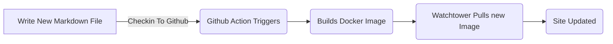
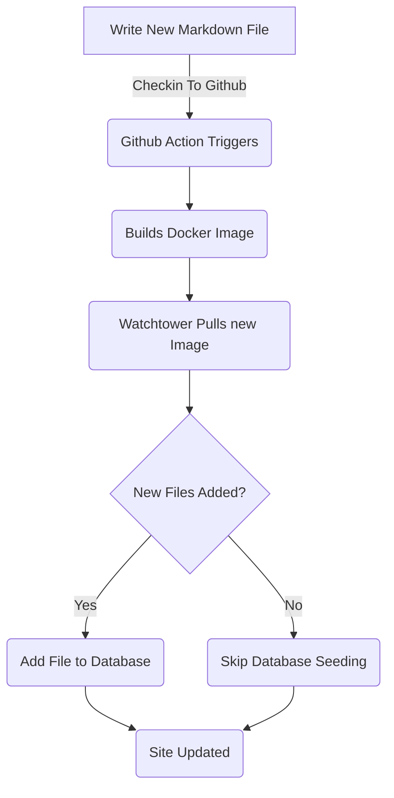

# Aggiunta del quadro dell'entità per i post del blog (parte 5)

<!--category-- ASP.NET, Entity Framework -->
<datetime class="hidden">2024-08-18T01:20</datetime>

Vedere parti [1](/blog/addingentityframeworkforblogpostspt1) e [2](/blog/addingentityframeworkforblogpostspt2) e [3](/blog/addingentityframeworkforblogpostspt3) e [4](/blog/addingentityframeworkforblogpostspt4) per le fasi precedenti.

# Introduzione

Nelle parti precedenti abbiamo esaminato come impostare il database, come i nostri controller e le nostre viste sono strutturati, come i nostri servizi hanno funzionato, e come creare il database con alcuni dati iniziali. In questa parte tratteremo i dettagli su come funzionano i servizi basati sull'impronta ambientale e su come possiamo utilizzarli nei nostri controllori.

Come al solito puoi vedere tutte le fonti per questo sul mio GitHub [qui](https://github.com/scottgal/mostlylucidweb/tree/main/Mostlylucid/Blog), nella cartella Mostlylucid/Blog.

[TOC]

# Servizi di blog

## Servizi basati su file

Nelle puntate precedenti... `MarkdownBlogService` per ottenere i nostri post sul blog e le lingue. Questo servizio è stato iniettato nei nostri controllori e punti di vista. Questo servizio era un servizio semplice che leggeva i file markdown dal disco e li restituiva come `BlogViewModels`.

Questo ha usato un dizionario statico per tenere i post del blog poi ha restituito i risultati da quel dizionario.

```csharp
  public async Task<PostListViewModel> GetPagedPosts(int page = 1, int pageSize = 10, string language = EnglishLanguage)
    {
        var model = new PostListViewModel();
        var posts = GetPageCache().Where(x => x.Value.Language == language)
            .Select(x => GetListModel(x.Value)).ToList();
        model.Posts = posts.OrderByDescending(x => x.PublishedDate).Skip((page - 1) * pageSize).Take(pageSize).ToList();
        model.TotalItems = posts.Count();
        model.PageSize = pageSize;
        model.Page = page;
        return await Task.FromResult(model);
    }
```

Questo è il `GetPagedPosts` metodo dal `MarkdownBlogService`. Questo metodo ottiene i post del blog dalla cache e li restituisce come `PostListViewModel`.

Utilizzando File per memorizzare i file Markdown è ancora un buon approccio, rende semplice aggiungere messaggi (io solo salvare i file markdown su disco e controllarli) ed è facile da gestire. Ma vogliamo usare il database per memorizzare i post e le lingue.



## Servizi basati sull'impronta ambientale

Nella [parte precedente](/blog/addingentityframeworkforblogpostspt4) Ho mostrato come abbiamo creato il database con i dati del blog. Questo aggiornamento ogni volta che redistribuiamo e riavviiamo il contenitore docker ([usando la torre di avvistamento ](blog/dockercompose)) Abbiamo usato un `EFBlogPopulator` lezione per fare questo.

Ora il nostro flusso assomiglia a questo



Ora che abbiamo i post del blog nel nostro database usiamo il `EFBlogService` fornire l'attuazione per out `IBlogService` interfaccia:

```csharp
public interface IBlogService
{
   Task<List<string>> GetCategories();
    Task<List<BlogPostViewModel>> GetPosts(DateTime? startDate = null, string category = "");
    Task<PostListViewModel> GetPostsByCategory(string category, int page = 1, int pageSize = 10, string language = MarkdownBaseService.EnglishLanguage);
    Task<BlogPostViewModel?> GetPost(string slug, string language = "");
    Task<PostListViewModel> GetPagedPosts(int page = 1, int pageSize = 10, string language = MarkdownBaseService.EnglishLanguage);
    
    Task<List<PostListModel>> GetPostsForLanguage(DateTime? startDate = null, string category = "", string language = MarkdownBaseService.EnglishLanguage);
}
```

Questo è il `IBlogService` Interfaccia. Questa è l'interfaccia che i nostri controller utilizzano per ottenere i post del blog. La `EFBlogService` implementa questa interfaccia e utilizza il `BlogContext` per ottenere i dati dal database.
Come per il servizio FileBased [sopra](#file-based-services) possiamo ottenere messaggi per categoria, per lingua, per data e per pagina.

### `GetPostList`

```csharp
    private async Task<PostListViewModel> GetPostList(int count, List<BlogPostEntity> posts, int page, int pageSize)
    {
        var languages = await NoTrackingQuery().Select(x =>
                new { x.Slug, x.LanguageEntity.Name }
            ).ToListAsync();

        var postModels = new List<PostListModel>();

        foreach (var postResult in posts)
        {
            var langArr = languages.Where(x => x.Slug == postResult.Slug).Select(x => x.Name).ToArray();

            postModels.Add(postResult.ToListModel(langArr));
        }

        var postListViewModel = new PostListViewModel
        {
            Page = page,
            PageSize = pageSize,
            TotalItems = count,
            Posts = postModels
        };

        return postListViewModel;
    }
```

Qui usiamo il nostro comune `PostsQuery` ma aggiungiamo `NoTrackingQuery` che è un metodo semplice che restituisce una queryable del `BlogPostEntity` ma con `AsNoTrackingWithIdentityResolution` aggiunto. Ciò significa che le entità non sono rintracciate dal contesto e sono lette solo. Questo è utile quando stiamo solo leggendo i dati e non aggiornandoli.

```csharp
     protected IQueryable<BlogPostEntity> PostsQuery()=>Context.BlogPosts.Include(x => x.Categories)
        .Include(x => x.LanguageEntity);
     
         private IQueryable<BlogPostEntity> NoTrackingQuery() => PostsQuery().AsNoTrackingWithIdentityResolution();
```

Potete vedere che abbiamo anche le lingue per i post e poi creare un `PostListViewModel` che è una struttura che accetta le informazioni di paging (`Page`, `PageSize` e `TotalItems`) e viene restituito al controller.

### `GetPost`

Il nostro metodo principale è il `GetPost` metodo che ottiene un singolo post dal suo `Slug` e `Language`. Questo è un metodo semplice che utilizza il `PostsQuery` per ottenere il post e poi lo restituisce come un `BlogPostViewModel`.
Potete vedere che ha anche un optional `Language` parametro di default a `EnglishLanguage` che è una costante nel nostro `MarkdownBaseService` classe.

```csharp
  public async Task<BlogPostViewModel?> GetPost(string slug, string language = "")
    {
        if (string.IsNullOrEmpty(language)) language =MarkdownBaseService.EnglishLanguage;
        var post = await NoTrackingQuery().FirstOrDefaultAsync(x => x.Slug == slug && x.LanguageEntity.Name == language);
        if (post == null) return null;
        var langArr = await GetLanguagesForSlug(slug);
        return post.ToPostModel(langArr);
    }
```

Questo utilizza anche il nostro metodo comune `GetLanguagesForSlug` che ottiene le lingue per un post. Questo è un metodo semplice che restituisce le lingue per un post.

```csharp
    private async Task<List<string>> GetLanguagesForSlug(string slug)=> await NoTrackingQuery()
        .Where(x => x.Slug == slug).Select(x=>x.LanguageEntity.Name).ToListAsync();
```

### `GetPostsByCategory`

Questo metodo ottiene i post per categoria (come ASP.NET & Entity Framework per questo post). Usa il `PostsQuery` per ottenere i post e poi filtrarli per categoria. Poi restituisce i post come un `PostListViewModel`.

```csharp
    public async Task<PostListViewModel> GetPostsByCategory(string category, int page = 1, int pageSize = 10,
        string language = MarkdownBaseService.EnglishLanguage)
    {
        
        var count = await NoTrackingQuery()
            .Where(x => x.Categories.Any(c => c.Name == category) && x.LanguageEntity.Name == language).CountAsync();
        var posts = await PostsQuery()
            .Where(x => x.Categories.Any(c => c.Name == category) && x.LanguageEntity.Name == language)
            .Skip((page - 1) * pageSize)
            .Take(pageSize)
            .ToListAsync();

        var languages = await GetLanguagesForSlugs(posts.Select(x => x.Slug).ToList());
        var postListViewModel = new PostListViewModel
        {
            Page = page,
            PageSize = pageSize,
            TotalItems = count,
            Posts = posts.Select(x => x.ToListModel(
                languages.FirstOrDefault(entry => entry.Key == x.Slug).Value.ToArray())).ToList()
        };
        return postListViewModel;
    }
```

# In conclusione

Potete vedere che i servizi EF Based sono un po' più complessi dei servizi File Based ma sono più flessibili e possono essere utilizzati in scenari più complessi. Possiamo utilizzare i servizi EF Based nei nostri controllori e viste per ottenere i post del blog e le lingue.
In futuro ci baseremo su questi e aggiungeremo servizi come l'editing e i commenti in linea.
Guarderemo anche come potremmo sincronizzarli su più sistemi.