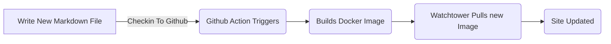
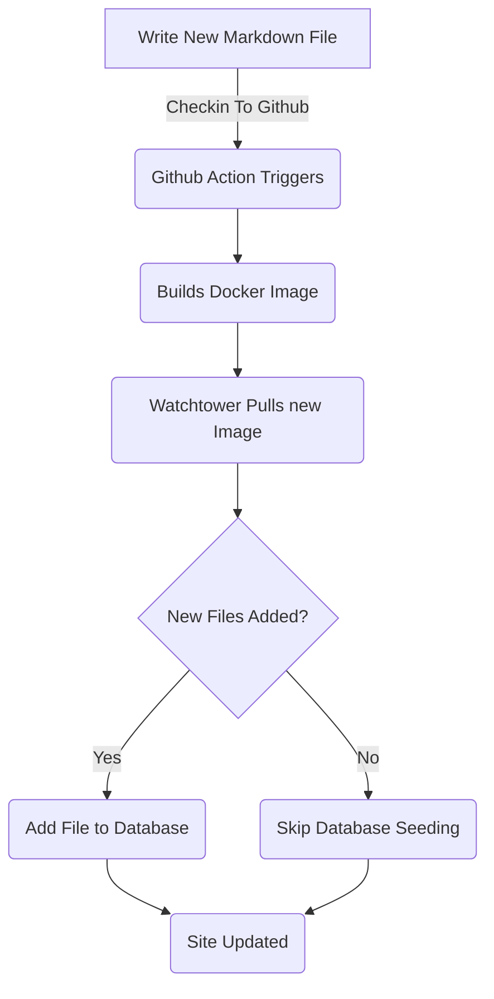

# Het toevoegen van een entiteitskader voor blogberichten (deel 5)

<!--category-- ASP.NET, Entity Framework -->
<datetime class="hidden">2024-08-18T01:20</datetime>

Zie delen [1](/blog/addingentityframeworkforblogpostspt1) en [2](/blog/addingentityframeworkforblogpostspt2) en [3](/blog/addingentityframeworkforblogpostspt3) en [4](/blog/addingentityframeworkforblogpostspt4) voor de vorige stappen.

# Inleiding

In eerdere delen bespraken we hoe we de database konden opzetten, hoe onze controllers en views gestructureerd zijn, hoe onze diensten werkten en hoe we de database met enkele initiële gegevens kunnen starten. In dit deel zullen we details behandelen over hoe de EF-gebaseerde diensten werken en hoe we ze kunnen gebruiken in onze controllers.

Zoals gewoonlijk kunt u alle bron te zien voor dit op mijn GitHub [Hier.](https://github.com/scottgal/mostlylucidweb/tree/main/Mostlylucid/Blog), in de map Meestallucid/Blog.

[TOC]

# Blogdiensten

## Diensten op basis van bestanden

Voorheen gebruikten we een `MarkdownBlogService` om onze blog posts en talen te krijgen. Deze service werd geïnjecteerd in onze controllers en views. Deze dienst was een eenvoudige dienst die markdown bestanden van de schijf af te lezen en ze terug te geven als `BlogViewModels`.

Dit gebruikte een statisch woordenboek om de blog berichten te houden en keerde vervolgens resultaten terug uit dat woordenboek.

```csharp
  public async Task<PostListViewModel> GetPagedPosts(int page = 1, int pageSize = 10, string language = EnglishLanguage)
    {
        var model = new PostListViewModel();
        var posts = GetPageCache().Where(x => x.Value.Language == language)
            .Select(x => GetListModel(x.Value)).ToList();
        model.Posts = posts.OrderByDescending(x => x.PublishedDate).Skip((page - 1) * pageSize).Take(pageSize).ToList();
        model.TotalItems = posts.Count();
        model.PageSize = pageSize;
        model.Page = page;
        return await Task.FromResult(model);
    }
```

Dit is de `GetPagedPosts` methode van de `MarkdownBlogService`. Deze methode krijgt de blog berichten van de cache en retourneert ze als een `PostListViewModel`.

Het gebruik van bestanden voor het opslaan van Markdown-bestanden is nog steeds een goede aanpak, het maakt het eenvoudig om posts toe te voegen (ik sla alleen markdown-bestanden op schijf op en check ze in) en het is gemakkelijk te beheren. Maar we willen de database gebruiken om de berichten en talen op te slaan.



## EF-gebaseerde diensten

In de [vorig deel]((/blog/addingentityframeworkforblogpostspt4) Ik liet zien hoe we de database hebben bezaaid met de bloggegevens. Deze updates elke keer dat we opnieuw in te zetten en herstart de docker container ([Wachttoren gebruiken ](blog/dockercompose)) We gebruikten een `EFBlogPopulator` Klas om dit te doen.

Nu ziet onze stroom er zo uit.



Nu we de blog berichten in onze database hebben gebruiken we de `EFBlogService` het leveren van de tenuitvoerlegging voor uit `IBlogService` interface:

```csharp
public interface IBlogService
{
   Task<List<string>> GetCategories();
    Task<List<BlogPostViewModel>> GetPosts(DateTime? startDate = null, string category = "");
    Task<PostListViewModel> GetPostsByCategory(string category, int page = 1, int pageSize = 10, string language = MarkdownBaseService.EnglishLanguage);
    Task<BlogPostViewModel?> GetPost(string slug, string language = "");
    Task<PostListViewModel> GetPagedPosts(int page = 1, int pageSize = 10, string language = MarkdownBaseService.EnglishLanguage);
    
    Task<List<PostListModel>> GetPostsForLanguage(DateTime? startDate = null, string category = "", string language = MarkdownBaseService.EnglishLanguage);
}
```

Dit is de `IBlogService` interface. Dit is de interface die onze controllers gebruiken om de blog berichten te krijgen. De `EFBlogService` implementeert deze interface en maakt gebruik van de `BlogContext` om de gegevens uit de database te krijgen.
Zoals met out FileBased service [boven](#file-based-services) We kunnen berichten per categorie, per taal, per datum en gepiept krijgen.

### `GetPostList`

```csharp
    private async Task<PostListViewModel> GetPostList(int count, List<BlogPostEntity> posts, int page, int pageSize)
    {
        var languages = await NoTrackingQuery().Select(x =>
                new { x.Slug, x.LanguageEntity.Name }
            ).ToListAsync();

        var postModels = new List<PostListModel>();

        foreach (var postResult in posts)
        {
            var langArr = languages.Where(x => x.Slug == postResult.Slug).Select(x => x.Name).ToArray();

            postModels.Add(postResult.ToListModel(langArr));
        }

        var postListViewModel = new PostListViewModel
        {
            Page = page,
            PageSize = pageSize,
            TotalItems = count,
            Posts = postModels
        };

        return postListViewModel;
    }
```

Hier gebruiken we onze gemeenschappelijke `PostsQuery` maar we voegen toe `NoTrackingQuery` dat is een eenvoudige methode die een queryable van de `BlogPostEntity` maar met `AsNoTrackingWithIdentityResolution` toegevoegd. Dit betekent dat de entiteiten niet worden gevolgd door de context en alleen worden gelezen. Dit is handig als we gewoon gegevens lezen en niet updaten.

```csharp
     protected IQueryable<BlogPostEntity> PostsQuery()=>Context.BlogPosts.Include(x => x.Categories)
        .Include(x => x.LanguageEntity);
     
         private IQueryable<BlogPostEntity> NoTrackingQuery() => PostsQuery().AsNoTrackingWithIdentityResolution();
```

U kunt zien dat we ook de talen voor de berichten te krijgen en vervolgens een `PostListViewModel` dat een structuur is die semafooninformatie accepteert (`Page`, `PageSize` en `TotalItems`) en wordt teruggegeven aan de controller.

### `GetPost`

Onze belangrijkste methode is de `GetPost` methode die een enkele post krijgt door zijn `Slug` en `Language`. Dit is een eenvoudige methode die gebruik maakt van de `PostsQuery` om de post te krijgen en dan terug te keren als een `BlogPostViewModel`.
U kunt zien dat het ook een optionele `Language` parameter die defaults is voor `EnglishLanguage` Dat is een constante in ons `MarkdownBaseService` Klas.

```csharp
  public async Task<BlogPostViewModel?> GetPost(string slug, string language = "")
    {
        if (string.IsNullOrEmpty(language)) language =MarkdownBaseService.EnglishLanguage;
        var post = await NoTrackingQuery().FirstOrDefaultAsync(x => x.Slug == slug && x.LanguageEntity.Name == language);
        if (post == null) return null;
        var langArr = await GetLanguagesForSlug(slug);
        return post.ToPostModel(langArr);
    }
```

Dit maakt ook gebruik van onze gemeenschappelijke methode `GetLanguagesForSlug` die de talen krijgt voor een post. Dit is een eenvoudige methode die de talen teruggeeft voor een bericht.

```csharp
    private async Task<List<string>> GetLanguagesForSlug(string slug)=> await NoTrackingQuery()
        .Where(x => x.Slug == slug).Select(x=>x.LanguageEntity.Name).ToListAsync();
```

### `GetPostsByCategory`

Deze methode krijgt de berichten per categorie (zoals ASP.NET & Entity Framework voor dit bericht). Het maakt gebruik van de `PostsQuery` om de berichten te krijgen en vervolgens te filteren naar de categorie. Het retourneert dan de berichten als een `PostListViewModel`.

```csharp
    public async Task<PostListViewModel> GetPostsByCategory(string category, int page = 1, int pageSize = 10,
        string language = MarkdownBaseService.EnglishLanguage)
    {
        
        var count = await NoTrackingQuery()
            .Where(x => x.Categories.Any(c => c.Name == category) && x.LanguageEntity.Name == language).CountAsync();
        var posts = await PostsQuery()
            .Where(x => x.Categories.Any(c => c.Name == category) && x.LanguageEntity.Name == language)
            .Skip((page - 1) * pageSize)
            .Take(pageSize)
            .ToListAsync();

        var languages = await GetLanguagesForSlugs(posts.Select(x => x.Slug).ToList());
        var postListViewModel = new PostListViewModel
        {
            Page = page,
            PageSize = pageSize,
            TotalItems = count,
            Posts = posts.Select(x => x.ToListModel(
                languages.FirstOrDefault(entry => entry.Key == x.Slug).Value.ToArray())).ToList()
        };
        return postListViewModel;
    }
```

# Conclusie

U kunt zien dat de EF Based services iets complexer zijn dan de File Based services, maar ze zijn flexibeler en kunnen gebruikt worden in complexere scenario's. We kunnen gebruik maken van de EF-gebaseerde diensten in onze controllers en views om de blog berichten en talen te krijgen.
In de toekomst bouwen we hierop voort en voegen we diensten toe zoals inline editing en commentaar.
We zullen ook kijken hoe we deze kunnen synchroniseren over meerdere systemen.