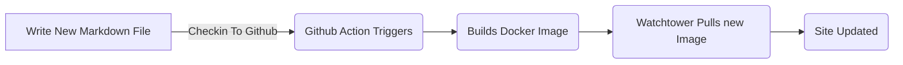
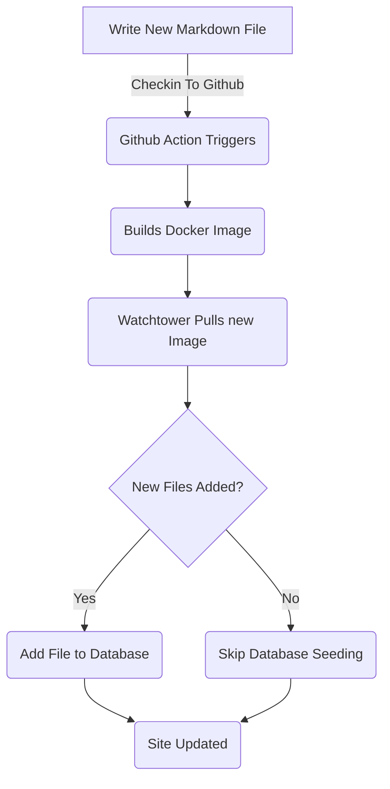

# Lägga till Entity Framework för blogginlägg (Del 5)

<!--category-- ASP.NET, Entity Framework -->
<datetime class="hidden">2024-08-18T01:20</datetime>

Se även de delar som är avsedda att användas vid tillverkning av varor enligt kapitel 87. [1](/blog/addingentityframeworkforblogpostspt1) och [2](/blog/addingentityframeworkforblogpostspt2) och [3](/blog/addingentityframeworkforblogpostspt3) och [4](/blog/addingentityframeworkforblogpostspt4) för de föregående stegen.

# Inledning

I tidigare delar tog vi upp hur man ställer in databasen, hur våra controllers och vyer är strukturerade, hur våra tjänster fungerade och hur man kan så databasen med några inledande data. I den här delen tar vi upp detaljer om hur EF-baserade tjänster fungerar och hur vi kan använda dem i våra styrenheter.

Som vanligt kan du se alla källor för detta på min GitHub [här](https://github.com/scottgal/mostlylucidweb/tree/main/Mostlylucid/Blog), i mappen Mostlylucid/Blog.

[TOC]

# Bloggtjänster

## Filbaserade tjänster

Tidigare använde vi en `MarkdownBlogService` för att få våra blogginlägg och språk. Denna tjänst injicerades i våra styrenheter och vyer. Denna tjänst var en enkel tjänst som läste markdown filer från disk och returnerade dem som `BlogViewModels`.

Detta använde en statisk ordbok för att hålla blogginläggen sedan returnerade resultat från den ordboken.

```csharp
  public async Task<PostListViewModel> GetPagedPosts(int page = 1, int pageSize = 10, string language = EnglishLanguage)
    {
        var model = new PostListViewModel();
        var posts = GetPageCache().Where(x => x.Value.Language == language)
            .Select(x => GetListModel(x.Value)).ToList();
        model.Posts = posts.OrderByDescending(x => x.PublishedDate).Skip((page - 1) * pageSize).Take(pageSize).ToList();
        model.TotalItems = posts.Count();
        model.PageSize = pageSize;
        model.Page = page;
        return await Task.FromResult(model);
    }
```

Det här är... `GetPagedPosts` metod från `MarkdownBlogService`....................................... Denna metod får blogginlägg från cache och returnerar dem som en `PostListViewModel`.

Att använda filer för att lagra Markdown-filer är fortfarande ett bra tillvägagångssätt, det gör det enkelt att lägga till inlägg (jag sparar bara markdown-filer till disk och checka in dem) och det är lätt att hantera. Men vi vill använda databasen för att lagra inlägg och språk.



## EF-baserade tjänster

I och med att [tidigare del](/blog/addingentityframeworkforblogpostspt4) visade jag hur vi sådde databasen med bloggdata. Detta uppdaterar varje gång vi omgrupperar och startar docker behållare ([användning av vakttorn ](blog/dockercompose)) Vi använde en `EFBlogPopulator` Klassen för att göra det här.

Nu ser vårt flöde ut så här



Nu när vi har blogginläggen i vår databas använder vi `EFBlogService` Att tillhandahålla genomförande för out `IBlogService` gränssnitt:

```csharp
public interface IBlogService
{
   Task<List<string>> GetCategories();
    Task<List<BlogPostViewModel>> GetPosts(DateTime? startDate = null, string category = "");
    Task<PostListViewModel> GetPostsByCategory(string category, int page = 1, int pageSize = 10, string language = MarkdownBaseService.EnglishLanguage);
    Task<BlogPostViewModel?> GetPost(string slug, string language = "");
    Task<PostListViewModel> GetPagedPosts(int page = 1, int pageSize = 10, string language = MarkdownBaseService.EnglishLanguage);
    
    Task<List<PostListModel>> GetPostsForLanguage(DateTime? startDate = null, string category = "", string language = MarkdownBaseService.EnglishLanguage);
}
```

Det här är... `IBlogService` gränssnitt. Detta är gränssnittet som våra styrenheter använder för att få blogginlägg. I detta sammanhang är det viktigt att se till att `EFBlogService` implementerar detta gränssnitt och använder `BlogContext` för att få data från databasen.
Som med ut FileBased service [ovan](#file-based-services) Vi kan få inlägg efter kategori, språk, datum och sidad.

### `GetPostList`

```csharp
    private async Task<PostListViewModel> GetPostList(int count, List<BlogPostEntity> posts, int page, int pageSize)
    {
        var languages = await NoTrackingQuery().Select(x =>
                new { x.Slug, x.LanguageEntity.Name }
            ).ToListAsync();

        var postModels = new List<PostListModel>();

        foreach (var postResult in posts)
        {
            var langArr = languages.Where(x => x.Slug == postResult.Slug).Select(x => x.Name).ToArray();

            postModels.Add(postResult.ToListModel(langArr));
        }

        var postListViewModel = new PostListViewModel
        {
            Page = page,
            PageSize = pageSize,
            TotalItems = count,
            Posts = postModels
        };

        return postListViewModel;
    }
```

Här använder vi vår gemensamma `PostsQuery` men vi lägger till `NoTrackingQuery` vilket är en enkel metod som returnerar en fråga av `BlogPostEntity` men med `AsNoTrackingWithIdentityResolution` tillagd. Detta innebär att enheterna inte spåras av sammanhanget och endast läses. Detta är användbart när vi bara läser data och inte uppdaterar det.

```csharp
     protected IQueryable<BlogPostEntity> PostsQuery()=>Context.BlogPosts.Include(x => x.Categories)
        .Include(x => x.LanguageEntity);
     
         private IQueryable<BlogPostEntity> NoTrackingQuery() => PostsQuery().AsNoTrackingWithIdentityResolution();
```

Du kan se att vi också får språken för inläggen och sedan skapa en `PostListViewModel` vilket är en struktur som godtar information om personsökning (`Page`, `PageSize` och `TotalItems`) och returneras till den personuppgiftsansvarige.

### `GetPost`

Vår huvudsakliga metod är `GetPost` metod som får en enda post genom sin `Slug` och `Language`....................................... Detta är en enkel metod som använder `PostsQuery` för att få posten och sedan returnera den som en `BlogPostViewModel`.
Du kan se att det också har en frivillig `Language` Parameter som är förvald till `EnglishLanguage` vilket är en konstant i vår `MarkdownBaseService` Klassen.

```csharp
  public async Task<BlogPostViewModel?> GetPost(string slug, string language = "")
    {
        if (string.IsNullOrEmpty(language)) language =MarkdownBaseService.EnglishLanguage;
        var post = await NoTrackingQuery().FirstOrDefaultAsync(x => x.Slug == slug && x.LanguageEntity.Name == language);
        if (post == null) return null;
        var langArr = await GetLanguagesForSlug(slug);
        return post.ToPostModel(langArr);
    }
```

Detta använder också vår gemensamma metod `GetLanguagesForSlug` som får språken för en post. Detta är en enkel metod som returnerar språken för ett inlägg.

```csharp
    private async Task<List<string>> GetLanguagesForSlug(string slug)=> await NoTrackingQuery()
        .Where(x => x.Slug == slug).Select(x=>x.LanguageEntity.Name).ToListAsync();
```

### `GetPostsByCategory`

Denna metod får inläggen per kategori (som ASP.NET & Entity Framework för detta inlägg). Den använder `PostsQuery` för att få inläggen och sedan filtrera dem efter kategorin. Det returnerar sedan inläggen som en `PostListViewModel`.

```csharp
    public async Task<PostListViewModel> GetPostsByCategory(string category, int page = 1, int pageSize = 10,
        string language = MarkdownBaseService.EnglishLanguage)
    {
        
        var count = await NoTrackingQuery()
            .Where(x => x.Categories.Any(c => c.Name == category) && x.LanguageEntity.Name == language).CountAsync();
        var posts = await PostsQuery()
            .Where(x => x.Categories.Any(c => c.Name == category) && x.LanguageEntity.Name == language)
            .Skip((page - 1) * pageSize)
            .Take(pageSize)
            .ToListAsync();

        var languages = await GetLanguagesForSlugs(posts.Select(x => x.Slug).ToList());
        var postListViewModel = new PostListViewModel
        {
            Page = page,
            PageSize = pageSize,
            TotalItems = count,
            Posts = posts.Select(x => x.ToListModel(
                languages.FirstOrDefault(entry => entry.Key == x.Slug).Value.ToArray())).ToList()
        };
        return postListViewModel;
    }
```

# Slutsatser

Du kan se att EF-baserade tjänster är lite mer komplexa än filbaserade tjänster, men de är mer flexibla och kan användas i mer komplexa scenarier. Vi kan använda EF-baserade tjänster i våra controllers och vyer för att få blogginlägg och språk.
I framtiden kommer vi att bygga på dessa och lägga till tjänster som inline redigering och kommentarer.
Vi ska också titta på hur vi kan synkronisera dessa över flera system.