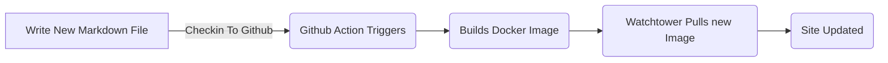
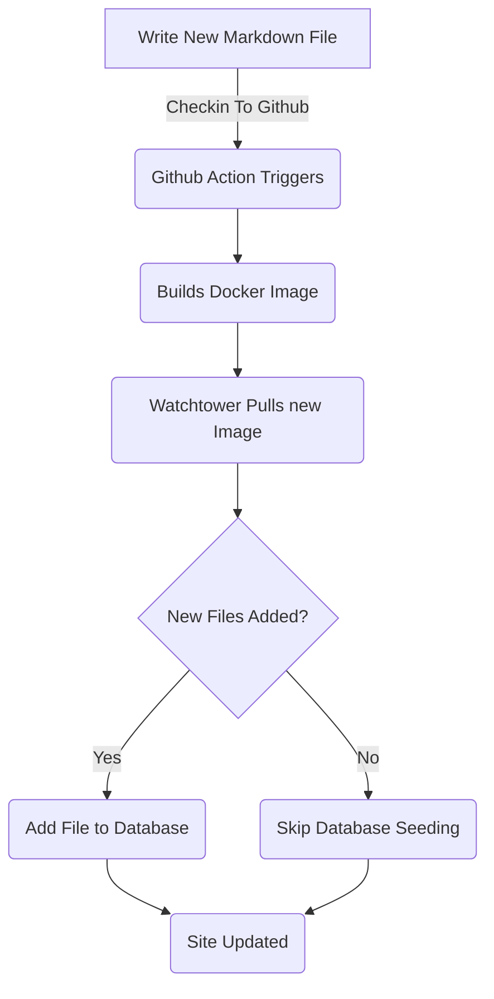

# Додавання блоку сутності для дописів блогу (частина 5)

<!--category-- ASP.NET, Entity Framework -->
<datetime class="hidden">2024- 08- 18T01: 20</datetime>

Див. частини [1](/blog/addingentityframeworkforblogpostspt1) і [2](/blog/addingentityframeworkforblogpostspt2) і [3](/blog/addingentityframeworkforblogpostspt3) і [4](/blog/addingentityframeworkforblogpostspt4) за попередніми кроками.

# Вступ

У попередніх частинах ми обговорювали, як налаштувати базу даних, як структуруються наші регулятори та погляди, як працювали наші служби, і як закласти базу даних деякими початковими даними. У цій частині ми будемо розглядати подробиці про те, як працюють сервіси ОЕС та як ми можемо використовувати їх в наших контролерах.

Як завжди, ви можете бачити все джерело для цього на моєму GitHub [тут](https://github.com/scottgal/mostlylucidweb/tree/main/Mostlylucid/Blog), у теці calcuid/Blog.

[TOC]

# Служби блогу

## Служби базування файлів

Раніше ми використовували `MarkdownBlogService` щоб отримати наші блоги та мови. Цю службу ввели в наші контролери й погляди. Ця служба була простою службою, яка зчитувала файли з диска і повернула їх як `BlogViewModels`.

Цей параметр використав статичний словник для зберігання дописів блогу, а потім повернув результати з цього словника.

```csharp
  public async Task<PostListViewModel> GetPagedPosts(int page = 1, int pageSize = 10, string language = EnglishLanguage)
    {
        var model = new PostListViewModel();
        var posts = GetPageCache().Where(x => x.Value.Language == language)
            .Select(x => GetListModel(x.Value)).ToList();
        model.Posts = posts.OrderByDescending(x => x.PublishedDate).Skip((page - 1) * pageSize).Take(pageSize).ToList();
        model.TotalItems = posts.Count();
        model.PageSize = pageSize;
        model.Page = page;
        return await Task.FromResult(model);
    }
```

Це `GetPagedPosts` метод з `MarkdownBlogService`. Цей метод отримання дописів блогу з кешу і повернення їх як `PostListViewModel`.

Використання пунктів Файли для зберігання файлів з міткою Розмітка все ще є непоганим підходом, за допомогою цього пункту можна просто додавати дописи (Я просто зберігаю файли з міткою на диск і перевіряю їх), ними просто керувати. Але ми хочемо використовувати базу даних для зберігання дописів та мов.



## Служби, що базуються на EF

У [Попередня частина]♪/blog/dingentity framework forblogpostspt4) Я показав, як ми засіяли базу даних даними блогу. Це оновлює кожного разу, коли ми перезапускаємо контейнер docker ([за допомогою Вартової башти. ](blog/dockercompose)) Ми використовували a `EFBlogPopulator` Клас, щоб зробити це.

Тепер наш потік виглядає ось так



Тепер, коли у нашій базі даних є дописи блогу, ми використовуємо `EFBlogService` для реалізації `IBlogService` інтерфейс:

```csharp
public interface IBlogService
{
   Task<List<string>> GetCategories();
    Task<List<BlogPostViewModel>> GetPosts(DateTime? startDate = null, string category = "");
    Task<PostListViewModel> GetPostsByCategory(string category, int page = 1, int pageSize = 10, string language = MarkdownBaseService.EnglishLanguage);
    Task<BlogPostViewModel?> GetPost(string slug, string language = "");
    Task<PostListViewModel> GetPagedPosts(int page = 1, int pageSize = 10, string language = MarkdownBaseService.EnglishLanguage);
    
    Task<List<PostListModel>> GetPostsForLanguage(DateTime? startDate = null, string category = "", string language = MarkdownBaseService.EnglishLanguage);
}
```

Це `IBlogService` інтерфейс. Це інтерфейс, який використовують наші контролери для отримання дописів у блогі. The `EFBlogService` реалізує цей інтерфейс і використовує `BlogContext` щоб отримати дані з бази даних.
Так само, як і за допомогою служби FileBased [зверху](#file-based-services) Ми можемо отримувати дописи за категоріями, мовою, датою та сторінками.

### `GetPostList`

```csharp
    private async Task<PostListViewModel> GetPostList(int count, List<BlogPostEntity> posts, int page, int pageSize)
    {
        var languages = await NoTrackingQuery().Select(x =>
                new { x.Slug, x.LanguageEntity.Name }
            ).ToListAsync();

        var postModels = new List<PostListModel>();

        foreach (var postResult in posts)
        {
            var langArr = languages.Where(x => x.Slug == postResult.Slug).Select(x => x.Name).ToArray();

            postModels.Add(postResult.ToListModel(langArr));
        }

        var postListViewModel = new PostListViewModel
        {
            Page = page,
            PageSize = pageSize,
            TotalItems = count,
            Posts = postModels
        };

        return postListViewModel;
    }
```

Тут ми використовуємо наше спільне `PostsQuery` але ми додаємо `NoTrackingQuery` який є простим методом, що повертає запит з `BlogPostEntity` але з `AsNoTrackingWithIdentityResolution` Додано. Це означає, що елементи не слідкують за контекстом і їх не слідкують лише за ними. Цей пункт буде корисним, якщо ми просто читаємо дані, а не оновлюємо їх.

```csharp
     protected IQueryable<BlogPostEntity> PostsQuery()=>Context.BlogPosts.Include(x => x.Categories)
        .Include(x => x.LanguageEntity);
     
         private IQueryable<BlogPostEntity> NoTrackingQuery() => PostsQuery().AsNoTrackingWithIdentityResolution();
```

Ви можете побачити, що ми також отримуємо мови для постів, а потім створюємо `PostListViewModel` який приймає інформацію про резервування (`Page`, `PageSize` і `TotalItems`) і повертається до контролера.

### `GetPost`

Нашим основним методом є `GetPost` метод, який отримує окремий допис за своїм `Slug` і `Language`. Це простий метод, який використовує `PostsQuery` щоб отримати допис, а потім повернути його як a `BlogPostViewModel`.
Ви можете бачити, що він також має необов'язкове значення `Language` параметр, який є типовим `EnglishLanguage` що є сталою в нашому `MarkdownBaseService` Клас.

```csharp
  public async Task<BlogPostViewModel?> GetPost(string slug, string language = "")
    {
        if (string.IsNullOrEmpty(language)) language =MarkdownBaseService.EnglishLanguage;
        var post = await NoTrackingQuery().FirstOrDefaultAsync(x => x.Slug == slug && x.LanguageEntity.Name == language);
        if (post == null) return null;
        var langArr = await GetLanguagesForSlug(slug);
        return post.ToPostModel(langArr);
    }
```

Це також використовує наш спільний метод `GetLanguagesForSlug` що дає мови для відправки. Це простий метод, який повертає мови для допису.

```csharp
    private async Task<List<string>> GetLanguagesForSlug(string slug)=> await NoTrackingQuery()
        .Where(x => x.Slug == slug).Select(x=>x.LanguageEntity.Name).ToListAsync();
```

### `GetPostsByCategory`

За допомогою цього методу можна отримувати дописи за категорією (напр., ASP. NET і Frame для цього допису). Він використовує `PostsQuery` щоб отримати дописи, а потім відфільтрувати їх за категорією. Після цього програма повертає дописи як a `PostListViewModel`.

```csharp
    public async Task<PostListViewModel> GetPostsByCategory(string category, int page = 1, int pageSize = 10,
        string language = MarkdownBaseService.EnglishLanguage)
    {
        
        var count = await NoTrackingQuery()
            .Where(x => x.Categories.Any(c => c.Name == category) && x.LanguageEntity.Name == language).CountAsync();
        var posts = await PostsQuery()
            .Where(x => x.Categories.Any(c => c.Name == category) && x.LanguageEntity.Name == language)
            .Skip((page - 1) * pageSize)
            .Take(pageSize)
            .ToListAsync();

        var languages = await GetLanguagesForSlugs(posts.Select(x => x.Slug).ToList());
        var postListViewModel = new PostListViewModel
        {
            Page = page,
            PageSize = pageSize,
            TotalItems = count,
            Posts = posts.Select(x => x.ToListModel(
                languages.FirstOrDefault(entry => entry.Key == x.Slug).Value.ToArray())).ToList()
        };
        return postListViewModel;
    }
```

# Включення

Як бачите, сервіси ECF є більш складними, ніж сервіси File Based, але вони гнучкіші і можуть використовуватися у більш складних сценаріях. Ми можемо використовувати служби EC Base у наших контролерів та переглядах, щоб отримувати блогові дописи і мови.
У майбутньому ми будемо будувати над цим і додавати служби, такі як вбудоване редагування та коментарі.
Ми також розглянемо, як ми можемо синхронізувати їх через багато систем.