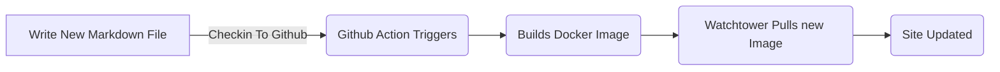
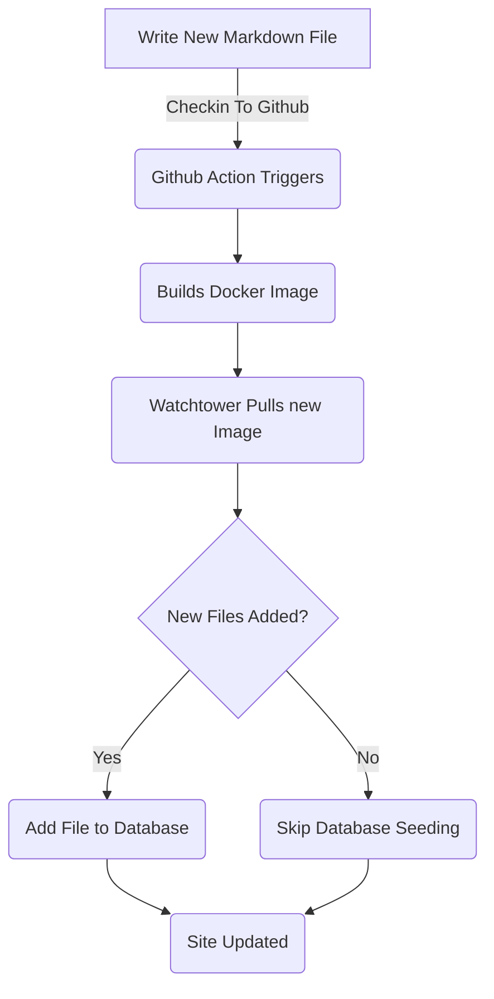

# 添加博客文章实体框架(第五部分)

<!--category-- ASP.NET, Entity Framework -->
<datetime class="hidden">2024-08-18T01:20</datetime>

见各部分 [1](/blog/addingentityframeworkforblogpostspt1) 和 [2](/blog/addingentityframeworkforblogpostspt2) 和 [3](/blog/addingentityframeworkforblogpostspt3) 和 [4](/blog/addingentityframeworkforblogpostspt4) 用于前几个步骤。

# 一. 导言 导言 导言 导言 导言 导言 一,导言 导言 导言 导言 导言 导言

在前几部分中,我们谈到如何建立数据库,我们的控制器和观点是如何结构的,我们的服务是如何运作的,以及如何利用一些初步数据为数据库播种。 这部分我们将详细介绍基于EF的服务如何运作,以及如何在控制器中使用。

和往常一样,你可以在我的GitHub上看到所有源头 [在这里](https://github.com/scottgal/mostlylucidweb/tree/main/Mostlylucid/Blog)中,在 Mostlylucid/Blog 文件夹中。

[技选委

# 博客服务

## 基于文件的服务

以前我们用过 `MarkdownBlogService` 以获得我们的博客文章和语言。 这一服务被注入我们的控制器和视图中。 此服务是一个简单的服务, 从磁盘上读取标记文件, 然后以 `BlogViewModels`.

使用静态字典来维持博客文章,

```csharp
  public async Task<PostListViewModel> GetPagedPosts(int page = 1, int pageSize = 10, string language = EnglishLanguage)
    {
        var model = new PostListViewModel();
        var posts = GetPageCache().Where(x => x.Value.Language == language)
            .Select(x => GetListModel(x.Value)).ToList();
        model.Posts = posts.OrderByDescending(x => x.PublishedDate).Skip((page - 1) * pageSize).Take(pageSize).ToList();
        model.TotalItems = posts.Count();
        model.PageSize = pageSize;
        model.Page = page;
        return await Task.FromResult(model);
    }
```

这是 `GetPagedPosts` 方法从 `MarkdownBlogService`.. 此方法将博客文章从缓存中调出, `PostListViewModel`.

使用文件存储 Markdown 文件仍然是一个很好的方法, 它让添加文章变得简单( 我只是将标记文件保存到磁盘上, 并检查进去) 并且很容易管理 。 但我们想用数据库存储这些文章和语言。



## EF 基础服务

在 [((/blog/adentity frameworkforblogpostspt4) 我展示了我们如何用博客数据播种数据库。 每次我们重新部署并重新启动 docker 容器时,[使用监视器 ](blog/dockercompose)我们用了一个 `EFBlogPopulator` 类可以做到这一点。

现在我们的流水看起来像这个样子



现在我们在数据库里有了博客文章 我们用的是 `EFBlogService` 提供执行的输出 `IBlogService` 接口 :

```csharp
public interface IBlogService
{
   Task<List<string>> GetCategories();
    Task<List<BlogPostViewModel>> GetPosts(DateTime? startDate = null, string category = "");
    Task<PostListViewModel> GetPostsByCategory(string category, int page = 1, int pageSize = 10, string language = MarkdownBaseService.EnglishLanguage);
    Task<BlogPostViewModel?> GetPost(string slug, string language = "");
    Task<PostListViewModel> GetPagedPosts(int page = 1, int pageSize = 10, string language = MarkdownBaseService.EnglishLanguage);
    
    Task<List<PostListModel>> GetPostsForLanguage(DateTime? startDate = null, string category = "", string language = MarkdownBaseService.EnglishLanguage);
}
```

这是 `IBlogService` 接口。 这是我们的控制器用来获取博客文章的界面。 缩略 `EFBlogService` 执行此界面并使用 `BlogContext` 从数据库获取数据。
与外出基于文件的服务 [以上](#file-based-services) 我们可以按类别、语言、日期和页码获得职位。

### `GetPostList`

```csharp
    private async Task<PostListViewModel> GetPostList(int count, List<BlogPostEntity> posts, int page, int pageSize)
    {
        var languages = await NoTrackingQuery().Select(x =>
                new { x.Slug, x.LanguageEntity.Name }
            ).ToListAsync();

        var postModels = new List<PostListModel>();

        foreach (var postResult in posts)
        {
            var langArr = languages.Where(x => x.Slug == postResult.Slug).Select(x => x.Name).ToArray();

            postModels.Add(postResult.ToListModel(langArr));
        }

        var postListViewModel = new PostListViewModel
        {
            Page = page,
            PageSize = pageSize,
            TotalItems = count,
            Posts = postModels
        };

        return postListViewModel;
    }
```

在这里,我们使用我们共同的 `PostsQuery` 但是我们添加 `NoTrackingQuery` 这是一个简单的方法, 返回可查询的 `BlogPostEntity` 中为 `AsNoTrackingWithIdentityResolution` 添加。 这意味着这些实体不按上下文进行跟踪,只阅读。 当我们只是读取数据而不是更新数据时,这是有用的。

```csharp
     protected IQueryable<BlogPostEntity> PostsQuery()=>Context.BlogPosts.Include(x => x.Categories)
        .Include(x => x.LanguageEntity);
     
         private IQueryable<BlogPostEntity> NoTrackingQuery() => PostsQuery().AsNoTrackingWithIdentityResolution();
```

您可以看到,我们也为这些职位获得语言,然后创建 `PostListViewModel` 它是一个接受传呼信息的结构(`Page`, `PageSize` 和 `TotalItems`),然后返回控制器。

### `GetPost`

我们的主要方法就是 `GetPost` 使用该方法获得一个单一员额的方法 `Slug` 和 `Language`.. 这是一种简单的方法,使用 `PostsQuery` 以获得该日志, 然后以 A 格式返回该日志 `BlogPostViewModel`.
你可以看到它还有一个可选的 `Language` 默认为 `EnglishLanguage` 这在我们心中是常态的, `MarkdownBaseService` 类。

```csharp
  public async Task<BlogPostViewModel?> GetPost(string slug, string language = "")
    {
        if (string.IsNullOrEmpty(language)) language =MarkdownBaseService.EnglishLanguage;
        var post = await NoTrackingQuery().FirstOrDefaultAsync(x => x.Slug == slug && x.LanguageEntity.Name == language);
        if (post == null) return null;
        var langArr = await GetLanguagesForSlug(slug);
        return post.ToPostModel(langArr);
    }
```

这也使用我们共同的方法 `GetLanguagesForSlug` 获取一个职位的语言 。 这是一种简单的方法, 返回文章所用的语言 。

```csharp
    private async Task<List<string>> GetLanguagesForSlug(string slug)=> await NoTrackingQuery()
        .Where(x => x.Slug == slug).Select(x=>x.LanguageEntity.Name).ToListAsync();
```

### `GetPostsByCategory`

这种方法使员额按职类分类(如该员额的ASP.NET和实体框架)。 它使用 `PostsQuery` 以获得职位,然后按类别过滤。 之后,该员额又作为a `PostListViewModel`.

```csharp
    public async Task<PostListViewModel> GetPostsByCategory(string category, int page = 1, int pageSize = 10,
        string language = MarkdownBaseService.EnglishLanguage)
    {
        
        var count = await NoTrackingQuery()
            .Where(x => x.Categories.Any(c => c.Name == category) && x.LanguageEntity.Name == language).CountAsync();
        var posts = await PostsQuery()
            .Where(x => x.Categories.Any(c => c.Name == category) && x.LanguageEntity.Name == language)
            .Skip((page - 1) * pageSize)
            .Take(pageSize)
            .ToListAsync();

        var languages = await GetLanguagesForSlugs(posts.Select(x => x.Slug).ToList());
        var postListViewModel = new PostListViewModel
        {
            Page = page,
            PageSize = pageSize,
            TotalItems = count,
            Posts = posts.Select(x => x.ToListModel(
                languages.FirstOrDefault(entry => entry.Key == x.Slug).Value.ToArray())).ToList()
        };
        return postListViewModel;
    }
```

# 在结论结论中

您可以看到,基于 EF 的服务比基于文件的服务复杂一些,但更灵活,可以用于更复杂的情景。 我们可以使用我们的控制器和观点中基于EF的服务获得博客文章和语言。
今后我们将以此为基础,增加服务,如内部编辑和评论。
我们还会研究如何在多个系统上同步这些系统。