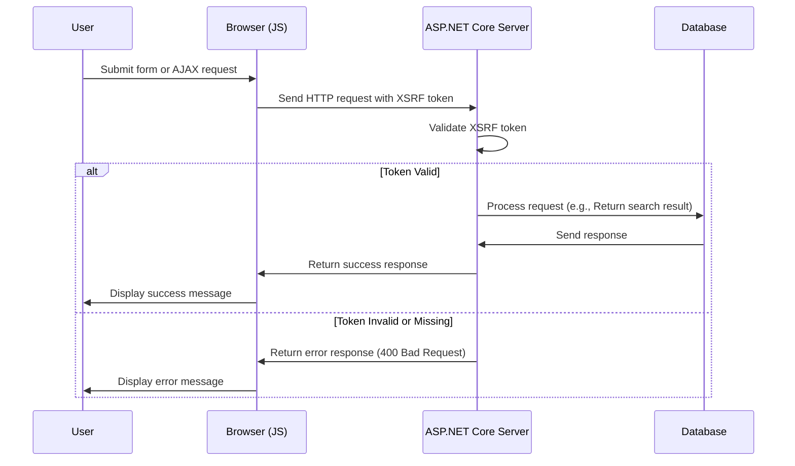

# جاري إضافة xSSRSF لـ جافScrcrbt

<!--category-- ASP.NET, Javascript -->
<datetime class="hidden">2024-08-22TT05: 30</datetime>

## أولاً

عند إضافة مربع البحث في [قبل سنة]، تركنا جانبا سمة أمنية حاسمة: حماية XSRF. وستغطي هذه المادة كيفية إضافة حماية XSRF إلى صندوق البحث.

[رابعاً -

## ما هو XSSRF؟

(إكس إس آر إف) يرمز لـ (كروس سايت طلب التزوير) إنه نوع من الهجمات حيث موقع إلكتروني خبيث يخدع مستخدما لأداء أعمال على موقع آخر على الإنترنت. على سبيل المثال ، يمكن ان يخدع موقع الكتروني خبيث مستخدما ما بتقديم طلب بحث على موقعنا على الانترنت. ولكن على الأرجح قد يكون هناك سيناريو ضد نقطة نهاية بحثنا مما يضع الموقع في حالة توقف طاحونة.



## 

إضافة إلى إضافة جافاستور XSRF نحتاج إلى إضافة تشكيل إعداد إلى `Program.cs` الذي يُخبر التطبيق لقبول اسم ترويسة لرمز XSRF. يتم ذلك بإضافة الرمز التالي في `Program.cs`:

```csharp
services.AddAntiforgery(options =>
{
    options.HeaderName = "X-CSRF-TOKEN";
});
```

هذا يُخبرُ التطبيقَ للبَحْث عن `X-CSRF-TOKEN` ترويسة عند التحقق من رمز XSSRF.

### إضافة حرف XSRF Token إلى رقم تعريف البحث

نحن بحاجة أيضاً إلى إضافة وصفة على API `[ValidateAntiForgeryToken]` هذه القوات تستخدم هذا الرمز

## إضافة مربع البحث XSSRF إلى صندوق البحث

في صندوق البحث، نحن بحاجة إلى إضافة رمز XSSRF إلى الترويسات. أولاً نضيف العلامة إلى توليد الرمز:

```razor
<div x-data="window.mostlylucid.typeahead()" class="relative" id="searchelement"  x-on:click.outside="results = []">
    @Html.AntiForgeryToken()
```

ثم نضيف الرمز إلى الرأس في سكربت جافاسكربت:

```javascript
    let token = document.querySelector('#searchelement input[name="__RequestVerificationToken"]').value;
console.log(token);
            fetch(`/api/search/${encodeURIComponent(this.query)}`, { // Fixed the backtick and closing bracket
                method: 'GET', // or 'POST' depending on your needs
                headers: {
                    'Content-Type': 'application/json',
                    'X-CSRF-TOKEN': token // Attach the AntiForgery token in the headers
                }
            })
                .then(response => response.json())
                .then(data => {
                    this.results = data;
                    this.highlightedIndex = -1; // Reset index on new search
                });

```

كما ترون هذا يحصل على قيمة الرمز من حقل الإدخال ويضيفها إلى الترويسات.

## في الإستنتاج

ومن السهل نسبيا لإضافة حماية XSSRF إلى جافاسكربت الخاص بك. إنّها خاصيّة أمنيّة حيويّة والتي يجب إضافتها إلى كلّ أشكالك ونقاطك النهائية.