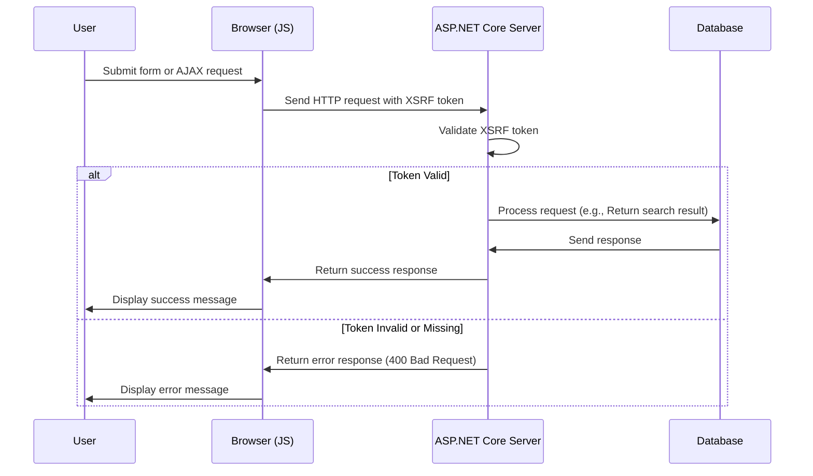

# XSRF für JavaScript hinzufügen

<!--category-- ASP.NET, Javascript -->
<datetime class="hidden">2024-08-22T05:30</datetime>

## Einleitung

Beim Hinzufügen des Suchfeldes in der [vorheriger Artikel], haben wir eine kritische Sicherheitsfunktion ausgelassen: XSRF-Schutz. Dieser Artikel behandelt, wie man XSRF-Schutz zum Suchfeld hinzufügt.

[TOC]

## Was ist XSRF?

XSRF steht für Cross-Site Request Forgery. Es ist eine Art von Angriff, bei dem eine bösartige Website einen Benutzer in die Durchführung von Aktionen auf einer anderen Website tricks. Zum Beispiel könnte eine bösartige Website einen Benutzer betrügen, eine Suchanfrage auf unserer Website einzureichen. Aber wahrscheinlicher könnte es einen Skriptlauf gegen unseren Suchendpunkt geben, der die Seite zu einem Schleifstopp bringt.



## Einrichtung

Um Javascript XSRF hinzuzufügen, müssen wir eine Konfigurationseinstellung zu unserer `Program.cs` was der App sagt, einen Header-Namen für das XSRF-Token zu akzeptieren. Dies geschieht durch das Hinzufügen des folgenden Codes in `Program.cs`:

```csharp
services.AddAntiforgery(options =>
{
    options.HeaderName = "X-CSRF-TOKEN";
});
```

Dies sagt der App zu suchen, für die `X-CSRF-TOKEN` Header bei der Validierung des XSRF-Tokens.

### Hinzufügen des XSRF Tokens zur Such-API

Wir müssen auch ein Attribut auf der API hinzufügen `[ValidateAntiForgeryToken]` Dies zwingt den Gebrauch dieses Tokens.

## Hinzufügen des XSRF-Tokens zum Suchfeld

Im Suchfeld müssen wir das XSRF-Token zu den Headern hinzufügen. Zuerst fügen wir das Tag hinzu, um das Token zu generieren:

```razor
<div x-data="window.mostlylucid.typeahead()" class="relative" id="searchelement"  x-on:click.outside="results = []">
    @Html.AntiForgeryToken()
```

Dann fügen wir das Token zu den Headern im JavaScript hinzu:

```javascript
    let token = document.querySelector('#searchelement input[name="__RequestVerificationToken"]').value;
console.log(token);
            fetch(`/api/search/${encodeURIComponent(this.query)}`, { // Fixed the backtick and closing bracket
                method: 'GET', // or 'POST' depending on your needs
                headers: {
                    'Content-Type': 'application/json',
                    'X-CSRF-TOKEN': token // Attach the AntiForgery token in the headers
                }
            })
                .then(response => response.json())
                .then(data => {
                    this.results = data;
                    this.highlightedIndex = -1; // Reset index on new search
                });

```

Wie Sie sehen können, erhält dies den Wert des Tokens aus dem Eingabefeld und fügt es den Headern hinzu.

## Schlussfolgerung

Es ist relativ einfach, XSRF-Schutz zu Ihrem JavaScript hinzuzufügen. Es ist eine kritische Sicherheitsfunktion, die zu allen Formularen und API-Endpunkten hinzugefügt werden sollte.