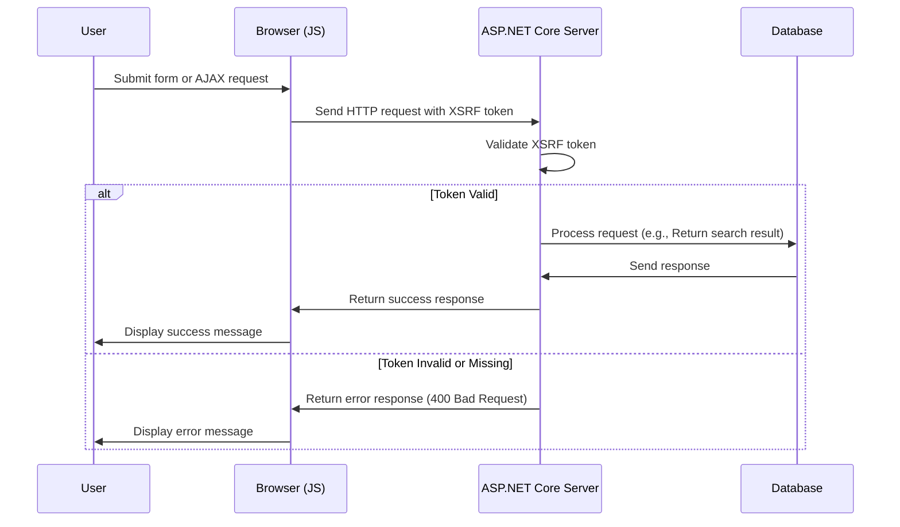

# Προσθήκη XSRF για JavaScript

<!--category-- ASP.NET, Javascript -->
<datetime class="hidden">2024-08-22T05:30</datetime>

## Εισαγωγή

Κατά την προσθήκη του πλαισίου αναζήτησης στο [προηγούμενο άρθρο], αφήσαμε έξω ένα κρίσιμο χαρακτηριστικό ασφάλειας: XSRF προστασία. Αυτό το άρθρο θα καλύψει πώς να προσθέσετε XSRF προστασία στο πλαίσιο αναζήτησης.

[TOC]

## Τι είναι το XSRF;

XSRF σημαίνει Cross-Site Request Forgery. Είναι ένα είδος επίθεσης όπου μια κακόβουλη ιστοσελίδα ξεγελά έναν χρήστη για να εκτελέσει ενέργειες σε μια άλλη ιστοσελίδα. Για παράδειγμα, μια κακόβουλη ιστοσελίδα θα μπορούσε να ξεγελάσει έναν χρήστη για να υποβάλει μια ερώτηση αναζήτησης στην ιστοσελίδα μας. Αλλά πιο πιθανό θα μπορούσε να υπάρχει ένα σενάριο σε σχέση με το τελικό σημείο αναζήτησης μας που φέρνει το site σε διακοπή λείανσης.



## Ρύθμιση

Για να προσθέσουμε Javascript XSRF πρέπει να προσθέσουμε μια ρύθμιση στο μας `Program.cs` που λέει στην εφαρμογή να δεχθεί ένα όνομα κεφαλίδας για το XSRF. Αυτό γίνεται με την προσθήκη του παρακάτω κώδικα: `Program.cs`:

```csharp
services.AddAntiforgery(options =>
{
    options.HeaderName = "X-CSRF-TOKEN";
});
```

Αυτό λέει στην εφαρμογή να ψάξει για το `X-CSRF-TOKEN` κεφαλίδα κατά την επικύρωση του XSRF.

### Προσθήκη του XSRF Token στο API αναζήτησης

Πρέπει επίσης να προσθέσουμε ένα χαρακτηριστικό στο API `[ValidateAntiForgeryToken]` Αυτό αναγκάζει τη χρήση αυτού του σημείου.

## Προσθήκη του XSRF Token στο πλαίσιο αναζήτησης

Στο πλαίσιο αναζήτησης, πρέπει να προσθέσουμε το σήμα XSRF στις κεφαλίδες. Πρώτα προσθέτουμε την ετικέτα για να δημιουργήσουμε το σύμβολο:

```razor
<div x-data="window.mostlylucid.typeahead()" class="relative" id="searchelement"  x-on:click.outside="results = []">
    @Html.AntiForgeryToken()
```

Στη συνέχεια προσθέτουμε το σύμβολο στις κεφαλίδες στο JavaScript:

```javascript
    let token = document.querySelector('#searchelement input[name="__RequestVerificationToken"]').value;
console.log(token);
            fetch(`/api/search/${encodeURIComponent(this.query)}`, { // Fixed the backtick and closing bracket
                method: 'GET', // or 'POST' depending on your needs
                headers: {
                    'Content-Type': 'application/json',
                    'X-CSRF-TOKEN': token // Attach the AntiForgery token in the headers
                }
            })
                .then(response => response.json())
                .then(data => {
                    this.results = data;
                    this.highlightedIndex = -1; // Reset index on new search
                });

```

Όπως μπορείτε να δείτε αυτό παίρνει την αξία του σημείου από το πεδίο εισόδου και το προσθέτει στις κεφαλίδες.

## Συμπέρασμα

Είναι σχετικά απλό να προσθέσετε XSRF προστασία σας JavaScript. Είναι ένα κρίσιμο χαρακτηριστικό ασφαλείας που πρέπει να προστεθεί σε όλες τις μορφές σας και τα τελικά σημεία API.