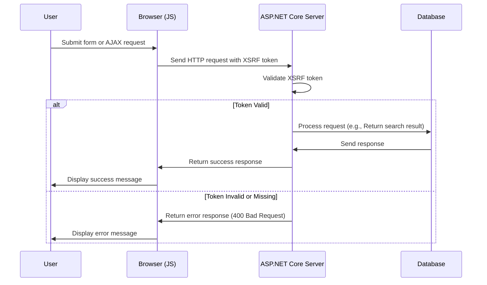

# Añadiendo XSRF para JavaScript

<!--category-- ASP.NET, Javascript -->
<datetime class="hidden">2024-08-22T05:30</datetime>

## Introducción

Al añadir el cuadro de búsqueda en el [Artículo anterior], dejamos fuera una característica de seguridad crítica: protección XSRF. Este artículo cubrirá cómo añadir protección XSRF al cuadro de búsqueda.

[TOC]

## ¿Qué es XSRF?

XSRF significa Falsificación de Solicitud de Sitios Cruzados. Es un tipo de ataque donde un sitio web malicioso engaña a un usuario a realizar acciones en otro sitio web. Por ejemplo, un sitio web malicioso podría engañar a un usuario para que envíe una consulta de búsqueda en nuestro sitio web. Pero lo más probable es que se ejecute un script contra nuestro punto final de búsqueda para detener el sitio.



## Configuración

Para añadir Javascript XSRF necesitamos añadir una configuración de configuración a nuestra `Program.cs` que le dice a la aplicación que acepte un nombre de cabecera para el token XSRF. Esto se hace añadiendo el siguiente código en `Program.cs`:

```csharp
services.AddAntiforgery(options =>
{
    options.HeaderName = "X-CSRF-TOKEN";
});
```

Esto le dice a la aplicación que busque el `X-CSRF-TOKEN` encabezado al validar el token XSRF.

### Añadir el Token XSRF a la API de búsqueda

También necesitamos añadir un atributo en la API `[ValidateAntiForgeryToken]` Esto obliga al uso de este símbolo.

## Añadir el Token XSRF al cuadro de búsqueda

En el cuadro de búsqueda, tenemos que añadir el token XSRF a las cabeceras. Primero añadimos la etiqueta para generar el token:

```razor
<div x-data="window.mostlylucid.typeahead()" class="relative" id="searchelement"  x-on:click.outside="results = []">
    @Html.AntiForgeryToken()
```

A continuación, agregamos el token a las cabeceras en el JavaScript:

```javascript
    let token = document.querySelector('#searchelement input[name="__RequestVerificationToken"]').value;
console.log(token);
            fetch(`/api/search/${encodeURIComponent(this.query)}`, { // Fixed the backtick and closing bracket
                method: 'GET', // or 'POST' depending on your needs
                headers: {
                    'Content-Type': 'application/json',
                    'X-CSRF-TOKEN': token // Attach the AntiForgery token in the headers
                }
            })
                .then(response => response.json())
                .then(data => {
                    this.results = data;
                    this.highlightedIndex = -1; // Reset index on new search
                });

```

Como puede ver esto obtiene el valor del token del campo de entrada y lo añade a las cabeceras.

## Conclusión

Es relativamente sencillo agregar protección XSRF a tu JavaScript. Es una función de seguridad crítica que debe añadirse a todos sus formularios y puntos finales de la API.