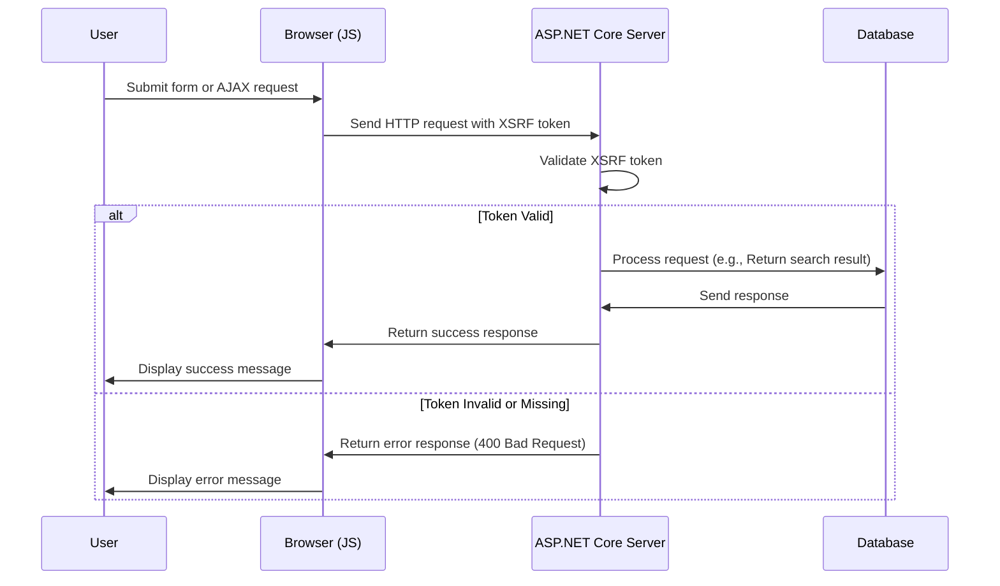

# XSRF:n lisääminen JavaScriptiin

<!--category-- ASP.NET, Javascript -->
<datetime class="hidden">2024-08-22T05:30</datetime>

## Johdanto

Lisäämällä hakuruutuun [etukäteisartikkeli], jätimme pois kriittisen turvaominaisuuden: XSRF-suojauksen. Tässä artikkelissa kerrotaan, miten XSRF-suoja lisätään hakuruutuun.

[TÄYTÄNTÖÖNPANO

## Mikä XSRF on?

XSRF tarkoittaa cross-site pyynnöstä Forgery. Kyseessä on hyökkäys, jossa ilkivaltainen sivusto huijaa käyttäjää tekemään toimia toisella sivustolla. Esimerkiksi ilkivaltainen sivusto voisi huijata käyttäjää tekemään hakupyynnön sivuillamme. Mutta todennäköisempää on, että hakutuloksena on kirjoitus, joka pysäyttää sivuston jauhamisen.



## Asetukset

Lisätäksemme Javascript XSRF:n meidän täytyy lisätä asetusasetukset meidän `Program.cs` joka kertoo sovelluksen hyväksyvän XSRF:n token otsikkonimen. Tämä tehdään lisäämällä seuraava koodi: `Program.cs`:

```csharp
services.AddAntiforgery(options =>
{
    options.HeaderName = "X-CSRF-TOKEN";
});
```

Tämä kertoo sovelluksen etsiä `X-CSRF-TOKEN` Otsikko XSRF-todennuksen validoinnissa.

### XSRF Tokenin lisääminen hakurajapintaan

Meidän on myös lisättävä ominaisuus API:hen `[ValidateAntiForgeryToken]` tämä pakottaa käyttämään tätä kuponkia.

## XSRF Tokenin lisääminen hakuruutuun

Meidän on lisättävä hakuruutuun XSRF-tunnus. Lisäämme ensin tagin luodaksemme poletin:

```razor
<div x-data="window.mostlylucid.typeahead()" class="relative" id="searchelement"  x-on:click.outside="results = []">
    @Html.AntiForgeryToken()
```

Lisäämme sitten kengänleiman JavaScriptin otsikkoihin:

```javascript
    let token = document.querySelector('#searchelement input[name="__RequestVerificationToken"]').value;
console.log(token);
            fetch(`/api/search/${encodeURIComponent(this.query)}`, { // Fixed the backtick and closing bracket
                method: 'GET', // or 'POST' depending on your needs
                headers: {
                    'Content-Type': 'application/json',
                    'X-CSRF-TOKEN': token // Attach the AntiForgery token in the headers
                }
            })
                .then(response => response.json())
                .then(data => {
                    this.results = data;
                    this.highlightedIndex = -1; // Reset index on new search
                });

```

Kuten näette, tämä saa rahakkeen arvon syöttökentältä ja lisää sen otsikkoihin.

## Johtopäätöksenä

Javascriptiin on suhteellisen helppo lisätä XSRF-suojaus. Se on kriittinen turvaominaisuus, joka pitäisi lisätä kaikkiin lomakkeisiin ja API-päätepisteisiin.