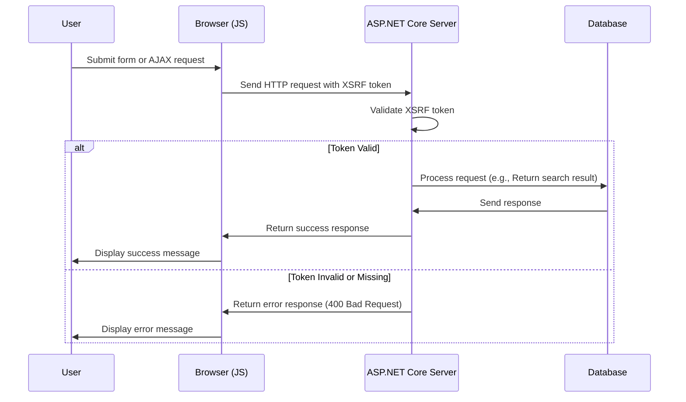

# Ajout de XSRF pour JavaScript

<!--category-- ASP.NET, Javascript -->
<datetime class="hidden">2024-08-22T05:30</datetime>

## Présentation

Lors de l'ajout de la boîte de recherche dans la [article précédent], nous avons oublié une caractéristique de sécurité critique: la protection XSRF. Cet article traitera de la façon d'ajouter la protection XSRF à la boîte de recherche.

[TOC]

## Qu'est-ce que XSRF?

XSRF représente la Forgery Request Cross-Site. C'est un type d'attaque où un site Web malveillant trompe un utilisateur dans l'exécution d'actions sur un autre site Web. Par exemple, un site Web malveillant pourrait tromper un utilisateur à soumettre une requête de recherche sur notre site Web. Mais plus probablement il pourrait y avoir un script lancé contre notre fin de recherche, ce qui mettrait le site à un arrêt de broyage.



## Configuration

Pour ajouter Javascript XSRF, nous devons ajouter un paramètre de configuration à notre `Program.cs` qui dit à l'application d'accepter un nom d'en-tête pour le jeton XSRF. Ceci est fait en ajoutant le code suivant dans `Program.cs`:

```csharp
services.AddAntiforgery(options =>
{
    options.HeaderName = "X-CSRF-TOKEN";
});
```

Ceci indique à l'application de chercher le `X-CSRF-TOKEN` header lors de la validation du jeton XSRF.

### Ajout du jeton XSRF à l'API de recherche

Nous devons également ajouter un attribut sur l'API `[ValidateAntiForgeryToken]` cela force l'utilisation de ce jeton.

## Ajout du jeton XSRF à la boîte de recherche

Dans la boîte de recherche, nous devons ajouter le jeton XSRF aux en-têtes. Nous ajoutons d'abord la balise pour générer le jeton :

```razor
<div x-data="window.mostlylucid.typeahead()" class="relative" id="searchelement"  x-on:click.outside="results = []">
    @Html.AntiForgeryToken()
```

Nous ajoutons ensuite le jeton aux en-têtes dans le JavaScript:

```javascript
    let token = document.querySelector('#searchelement input[name="__RequestVerificationToken"]').value;
console.log(token);
            fetch(`/api/search/${encodeURIComponent(this.query)}`, { // Fixed the backtick and closing bracket
                method: 'GET', // or 'POST' depending on your needs
                headers: {
                    'Content-Type': 'application/json',
                    'X-CSRF-TOKEN': token // Attach the AntiForgery token in the headers
                }
            })
                .then(response => response.json())
                .then(data => {
                    this.results = data;
                    this.highlightedIndex = -1; // Reset index on new search
                });

```

Comme vous pouvez le voir, cela obtient la valeur du jeton à partir du champ d'entrée et l'ajoute aux en-têtes.

## En conclusion

Il est relativement simple d'ajouter une protection XSRF à votre JavaScript. Il s'agit d'une fonction de sécurité critique qui devrait être ajoutée à tous vos formulaires et paramètres d'API.