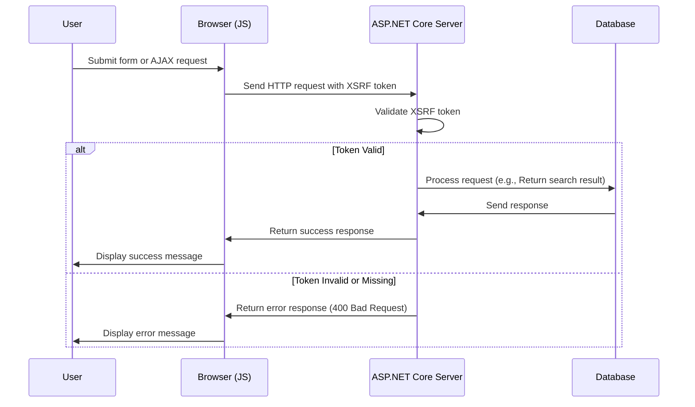

# जावास्क्रिप्ट के लिए एक्स-RF जोड़ रहे

<!--category-- ASP.NET, Javascript -->
<datetime class="hidden">2024- 0. 2222टी0: 30</datetime>

## परिचय

खोज बक्से को जोड़ने के दौरान [पहले लेख], हम एक महत्वपूर्ण सुरक्षा विशेषता बाहर छोड़ दिया: XRF सुरक्षा. इस लेख में चर्चा की जाएगी कि खोज बक्स में XRF सुरक्षा कैसे दी जाएगी ।

[विषय

## XRF क्या है?

एक्सआरएफ क्रॉस-Sy के लिए अनुरोध खड़ा होता है. यह हमला का प्रकार है जहाँ एक हानिकर वेबसाइट की चाल एक उपयोक्ता की चाल है अन्य वेबसाइट पर कार्रवाई करने के लिए. उदाहरण के लिए, एक बदनाम वेबसाइट एक उपयोक्ता को हमारी वेबसाइट पर खोज क्वैरी करने के लिए प्रेरित कर सकती है. लेकिन शायद हमारी खोज के अन्त - बिन्दु के विरुद्ध एक स्क्रिप्ट चलाया जा सकता है, जो कि इस साइट को जा रहा है ।



## कॉन्फ़िगरेशन

जावा- स्क्रिप्ट एक्सआरएफ जोड़ने के लिए हमें अपने लिए एक विन्यास विन्यास विन्यास सेटिंग जोड़ने की जरूरत है `Program.cs` जो एक हेडर नाम स्वीकार करने के लिए बताता है XRF टोकन के लिए. यह निम्न कोड को आगे जोड़ने के द्वारा किया जाता है `Program.cs`:

```csharp
services.AddAntiforgery(options =>
{
    options.HeaderName = "X-CSRF-TOKEN";
});
```

यह ए आईए को सूचित करता है कि वह क्या देखने के लिए कहता है `X-CSRF-TOKEN` जब एक्स-RF टोकन वैध किया जा रहा हो तो शीर्ष- सूचना.

### खोज के लिए एक्स-RFAS को जोड़ना

हमें भी एपीआई पर एक गुण जोड़ना चाहिए `[ValidateAntiForgeryToken]` इस संकेत का उपयोग करने की शक्‍ति।

## खोज बक्से में एक्स-REF को जोड़ना

खोज बक्से में, हमें XRF टोकन को शीर्ष पर जोड़ने की जरूरत है. हम पहली बार टैग को इस चिह्न तैयार करने के लिए जोड़ते हैं:

```razor
<div x-data="window.mostlylucid.typeahead()" class="relative" id="searchelement"  x-on:click.outside="results = []">
    @Html.AntiForgeryToken()
```

तब हम जावास्क्रिप्ट के हेडर में इस संकेत को जोड़ते हैं:

```javascript
    let token = document.querySelector('#searchelement input[name="__RequestVerificationToken"]').value;
console.log(token);
            fetch(`/api/search/${encodeURIComponent(this.query)}`, { // Fixed the backtick and closing bracket
                method: 'GET', // or 'POST' depending on your needs
                headers: {
                    'Content-Type': 'application/json',
                    'X-CSRF-TOKEN': token // Attach the AntiForgery token in the headers
                }
            })
                .then(response => response.json())
                .then(data => {
                    this.results = data;
                    this.highlightedIndex = -1; // Reset index on new search
                });

```

जैसा कि आप देख सकते हैं, यह इनपुट क्षेत्र से टोकन का मूल्य बन जाता है और इसे हेडर में जोड़ता है.

## ऑन्टियम

यह आपके जावास्क्रिप्ट के लिए एक्सआरएफ सुरक्षा जोड़ने के लिए सापेक्ष रूप से सरल है. यह एक महत्वपूर्ण सुरक्षा विशेषता है कि अपने सभी रूप और अंतिम बिन्दुओं में जोड़ा जाना चाहिए.