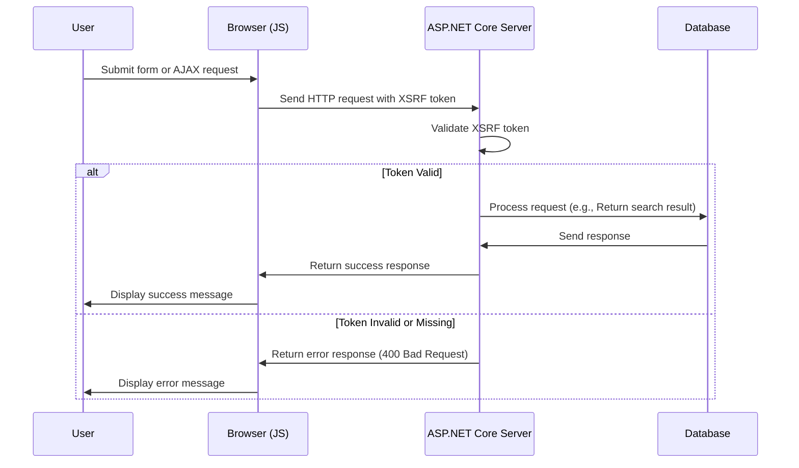

# Aggiunta di XSRF per JavaScript

<!--category-- ASP.NET, Javascript -->
<datetime class="hidden">2024-08-22T05:30</datetime>

## Introduzione

Quando si aggiunge la casella di ricerca nella [articolo precedente], abbiamo tralasciato una caratteristica di sicurezza critica: protezione XSRF. Questo articolo coprirà come aggiungere la protezione XSRF alla casella di ricerca.

[TOC]

## Che cos'è XSRF?

XSRF sta per Cross-Site Request Falgia. Si tratta di un tipo di attacco in cui un sito web dannoso inganna un utente in azioni di esecuzione su un altro sito web. Ad esempio, un sito Web dannoso potrebbe indurre un utente a inviare una query di ricerca sul nostro sito web. Ma e' piu' probabile che ci sia un copione contro il nostro obiettivo di ricerca, che porti il sito ad un blocco di triturazione.



## Configurazione

Per aggiungere Javascript XSRF dobbiamo aggiungere un'impostazione di configurazione al nostro `Program.cs` che dice all'app di accettare un nome di intestazione per il token XSRF. Questo viene fatto aggiungendo il seguente codice in `Program.cs`:

```csharp
services.AddAntiforgery(options =>
{
    options.HeaderName = "X-CSRF-TOKEN";
});
```

Questo dice all'app di cercare il `X-CSRF-TOKEN` intestazione quando si convalida il token XSRF.

### Aggiunta del token XSRF all'API di ricerca

Abbiamo anche bisogno di aggiungere un attributo sulle API `[ValidateAntiForgeryToken]` Questo costringe l'uso di questo gettone.

## Aggiunta del token XSRF alla casella di ricerca

Nella casella di ricerca, dobbiamo aggiungere il token XSRF alle intestazioni. Per prima cosa aggiungiamo il tag per generare il token:

```razor
<div x-data="window.mostlylucid.typeahead()" class="relative" id="searchelement"  x-on:click.outside="results = []">
    @Html.AntiForgeryToken()
```

Poi aggiungiamo il token alle intestazioni nel JavaScript:

```javascript
    let token = document.querySelector('#searchelement input[name="__RequestVerificationToken"]').value;
console.log(token);
            fetch(`/api/search/${encodeURIComponent(this.query)}`, { // Fixed the backtick and closing bracket
                method: 'GET', // or 'POST' depending on your needs
                headers: {
                    'Content-Type': 'application/json',
                    'X-CSRF-TOKEN': token // Attach the AntiForgery token in the headers
                }
            })
                .then(response => response.json())
                .then(data => {
                    this.results = data;
                    this.highlightedIndex = -1; // Reset index on new search
                });

```

Come potete vedere questo ottiene il valore del token dal campo di input e lo aggiunge alle intestazioni.

## In conclusione

È relativamente semplice aggiungere protezione XSRF al tuo JavaScript. Si tratta di una funzione di sicurezza critica che dovrebbe essere aggiunto a tutti i moduli e gli endpoint API.