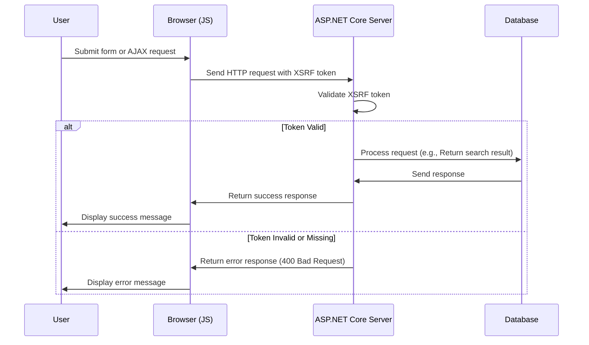

# XSRF toevoegen voor JavaScript

<!--category-- ASP.NET, Javascript -->
<datetime class="hidden">2024-08-22T05:30</datetime>

## Inleiding

Bij het toevoegen van het zoekvak in de [voorgaand artikel], we hebben een kritische beveiligingsfunctie weggelaten: XSRF bescherming. Dit artikel zal betrekking hebben op hoe u XSRF bescherming toe te voegen aan het zoekvak.

[TOC]

## Wat is XSRF?

XSRF staat voor Cross-Site Request Forgery. Het is een soort aanval waarbij een kwaadaardige website een gebruiker verleidt tot het uitvoeren van acties op een andere website. Bijvoorbeeld, een kwaadaardige website kan een gebruiker verleiden tot het indienen van een zoekopdracht op onze website. Maar meer kans dat er een script wordt uitgevoerd tegen ons zoekeindpunt waardoor de site tot stilstand komt.



## Configuratie

Om Javascript XSRF toe te voegen moeten we een config setting toevoegen aan onze `Program.cs` waarin de app een headernaam voor de XSRF token moet accepteren. Dit wordt gedaan door het toevoegen van de volgende code in `Program.cs`:

```csharp
services.AddAntiforgery(options =>
{
    options.HeaderName = "X-CSRF-TOKEN";
});
```

Dit vertelt de app om te zoeken naar de `X-CSRF-TOKEN` header bij het valideren van het XSRF token.

### Het toevoegen van de XSRF Token aan de zoek API

We moeten ook een attribuut toevoegen aan de API `[ValidateAntiForgeryToken]` Dit dwingt het gebruik van dit token.

## Het toevoegen van de XSRF Token aan het zoekvak

In het zoekvak moeten we de XSRF token toevoegen aan de headers. We voegen eerst de tag toe om het token te genereren:

```razor
<div x-data="window.mostlylucid.typeahead()" class="relative" id="searchelement"  x-on:click.outside="results = []">
    @Html.AntiForgeryToken()
```

Vervolgens voegen we het token toe aan de headers in het JavaScript:

```javascript
    let token = document.querySelector('#searchelement input[name="__RequestVerificationToken"]').value;
console.log(token);
            fetch(`/api/search/${encodeURIComponent(this.query)}`, { // Fixed the backtick and closing bracket
                method: 'GET', // or 'POST' depending on your needs
                headers: {
                    'Content-Type': 'application/json',
                    'X-CSRF-TOKEN': token // Attach the AntiForgery token in the headers
                }
            })
                .then(response => response.json())
                .then(data => {
                    this.results = data;
                    this.highlightedIndex = -1; // Reset index on new search
                });

```

Zoals je kunt zien krijgt dit de waarde van het token uit het invoerveld en voegt het toe aan de headers.

## Conclusie

Het is relatief eenvoudig om XSRF bescherming toe te voegen aan uw JavaScript. Het is een kritische beveiligingsfunctie die moet worden toegevoegd aan al uw formulieren en API eindpunten.