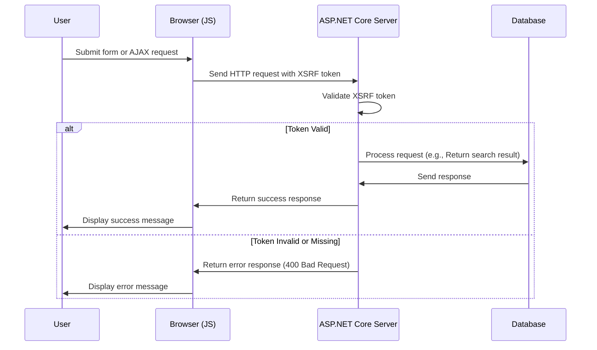

# Lägga till XSRF för JavaScript

<!--category-- ASP.NET, Javascript -->
<datetime class="hidden">2024-08-22T05:30 Ordförande</datetime>

## Inledning

När sökrutan läggs till [tidigare artikel], Vi utelämnade en kritisk säkerhetsfunktion: XSRF skydd. Denna artikel kommer att behandla hur du lägger till XSRF skydd till sökrutan.

[TOC]

## Vad är XSRF?

XSRF står för Cross-Site Request Forgery. Det är en typ av attack där en skadlig webbplats lurar en användare att utföra åtgärder på en annan webbplats. Till exempel kan en skadlig webbplats lura en användare att skicka in en sökfråga på vår webbplats. Men mer sannolikt kan det finnas ett manus köras mot vår sökning endpoint vilket gör platsen till ett malande stopp.



## Inställning

För att lägga till Javascript XSRF måste vi lägga till en inställning i vår `Program.cs` som talar om för appen att acceptera ett rubriknamn för XSRF- token. Detta görs genom att lägga till följande kod i `Program.cs`:

```csharp
services.AddAntiforgery(options =>
{
    options.HeaderName = "X-CSRF-TOKEN";
});
```

Detta talar om för appen att leta efter `X-CSRF-TOKEN` header vid validering av XSRF- token.

### Lägga till XSRF Token i sökgränssnittet

Vi behöver också lägga till ett attribut på API:et `[ValidateAntiForgeryToken]` Detta tvingar fram användandet av detta tecken.

## Lägga till XSRF Token i sökrutan

I sökrutan måste vi lägga till XSRF-symbolen till rubrikerna. Vi lägger först till taggen för att generera token:

```razor
<div x-data="window.mostlylucid.typeahead()" class="relative" id="searchelement"  x-on:click.outside="results = []">
    @Html.AntiForgeryToken()
```

Vi lägger sedan till token till rubrikerna i JavaScript:

```javascript
    let token = document.querySelector('#searchelement input[name="__RequestVerificationToken"]').value;
console.log(token);
            fetch(`/api/search/${encodeURIComponent(this.query)}`, { // Fixed the backtick and closing bracket
                method: 'GET', // or 'POST' depending on your needs
                headers: {
                    'Content-Type': 'application/json',
                    'X-CSRF-TOKEN': token // Attach the AntiForgery token in the headers
                }
            })
                .then(response => response.json())
                .then(data => {
                    this.results = data;
                    this.highlightedIndex = -1; // Reset index on new search
                });

```

Som du kan se får detta värdet av token från inmatningsfältet och lägger till det till rubrikerna.

## Slutsatser

Det är relativt enkelt att lägga till XSRF-skydd till ditt JavaScript. Det är en kritisk säkerhetsfunktion som bör läggas till alla dina formulär och API-slutpunkter.