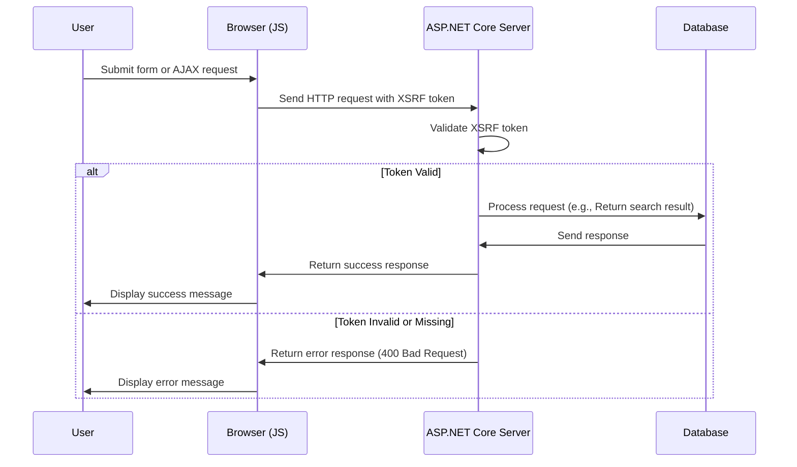

# Додавання XSRF для JavaScript

<!--category-- ASP.NET, Javascript -->
<datetime class="hidden">22T05 2024- 08: 30</datetime>

## Вступ

Під час додавання поля пошуку [Попередня стаття]Ми забули про важливу властивість безпеки - захист від XSRF. У цій статті ми поговоримо про те, як додати до поля пошуку захист XSRF.

[TOC]

## Що таке XSRF?

XSRF означає Cross-Site Request Forgery. Це тип атаки, на якому злісний веб-сайт змушує користувача виконувати дії на іншому веб-сайті. Наприклад, на певному вебсайті можна переконати користувача подати запит про пошук на нашому веб-сайті. Но более вероятно, что есть сценарий, бегающий к концу поиска, приводит к остановке места.



## Налаштування

Щоб додати Javascript XSRF, нам потрібно додати параметр налаштування до нашого `Program.cs` За допомогою цього пункту можна наказати програмі прийняти назву заголовка для ключа XSRF. Це можна зробити додаванням наступного коду до `Program.cs`:

```csharp
services.AddAntiforgery(options =>
{
    options.HeaderName = "X-CSRF-TOKEN";
});
```

За допомогою цього пункту можна повідомити програмі, що слід шукати `X-CSRF-TOKEN` заголовок під час перевірки ключа XSRF.

### Додавання ключа XSRF до інтерфейсу пошуку

Нам також потрібно додати атрибут в API `[ValidateAntiForgeryToken]` це змушує використовувати цей знак.

## Додавання ключа XSRF до панелі пошуку

У полі пошуку нам потрібно додати ключ XSRF до заголовків. Спочатку ми додаємо мітку, щоб створити ключ:

```razor
<div x-data="window.mostlylucid.typeahead()" class="relative" id="searchelement"  x-on:click.outside="results = []">
    @Html.AntiForgeryToken()
```

Після цього ми додаємо ключ до заголовків у JavaScript:

```javascript
    let token = document.querySelector('#searchelement input[name="__RequestVerificationToken"]').value;
console.log(token);
            fetch(`/api/search/${encodeURIComponent(this.query)}`, { // Fixed the backtick and closing bracket
                method: 'GET', // or 'POST' depending on your needs
                headers: {
                    'Content-Type': 'application/json',
                    'X-CSRF-TOKEN': token // Attach the AntiForgery token in the headers
                }
            })
                .then(response => response.json())
                .then(data => {
                    this.results = data;
                    this.highlightedIndex = -1; // Reset index on new search
                });

```

Як ви можете бачити, значення ключа буде взято з поля вводу і додається до заголовків.

## Включення

Дуже просто додати до вашого JavaScript захист XSRF. Це критична функція безпеки, яку слід додати до всіх ваших форм і кінцевих пунктів API.