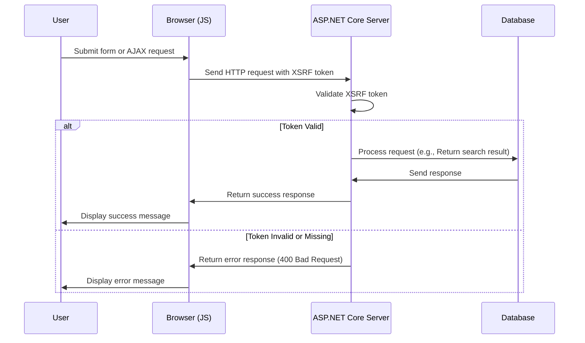

# 为 JavaScript 添加 XSRF 中

<!--category-- ASP.NET, Javascript -->
<datetime class="hidden">2024-08-222-05:30</datetime>

## 一. 导言 导言 导言 导言 导言 导言 一,导言 导言 导言 导言 导言 导言

添加搜索框时 [前一条文]我们漏掉了一个关键的安全特征:XSRF保护。 本条将涵盖如何在搜索框中添加 XSRF 保护。

[技选委

## 什么是XSRF?

XSRF代表跨边请求伪造。 这是一种攻击,恶意网站欺骗用户在另一个网站上采取行动。 例如,恶意网站可以欺骗用户在我们的网站上提交搜索查询。 但更可能有一个脚本 运行与我们的搜索端点 使这个网站 陷入了痛苦的停顿。



## 配置配置配置

要添加 Javascript XSRF, 我们需要在 `Program.cs` 它告诉应用程序要接受 XSRF 符号的页眉名称 。 这样做的方式是,在下列编码中添加以下编码: `Program.cs`:

```csharp
services.AddAntiforgery(options =>
{
    options.HeaderName = "X-CSRF-TOKEN";
});
```

这表示应用程序要查找 `X-CSRF-TOKEN` 验证 XSRF 符号时的标题。

### 向搜索 API 添加 XSRF 调制

我们还需要增加一个关于API的属性 `[ValidateAntiForgeryToken]` 强制使用此符号 。

## 将 XSRF 标记添加到搜索框

在搜索箱中,我们需要在信头上添加 XSRF 标志。 我们首先添加标记来生成标记 :

```razor
<div x-data="window.mostlylucid.typeahead()" class="relative" id="searchelement"  x-on:click.outside="results = []">
    @Html.AntiForgeryToken()
```

然后,我以这个记号加在贾瓦斯克里普特的书头上:

```javascript
    let token = document.querySelector('#searchelement input[name="__RequestVerificationToken"]').value;
console.log(token);
            fetch(`/api/search/${encodeURIComponent(this.query)}`, { // Fixed the backtick and closing bracket
                method: 'GET', // or 'POST' depending on your needs
                headers: {
                    'Content-Type': 'application/json',
                    'X-CSRF-TOKEN': token // Attach the AntiForgery token in the headers
                }
            })
                .then(response => response.json())
                .then(data => {
                    this.results = data;
                    this.highlightedIndex = -1; // Reset index on new search
                });

```

正如您所看到的,它从输入字段中获取了标记的价值,并将其添加到信头中。

## 在结论结论中

在你的 JavaScript 添加 XSRF 保护比较简单。 这是一个关键的安全特征 应该在你的表格和API端点上加进


