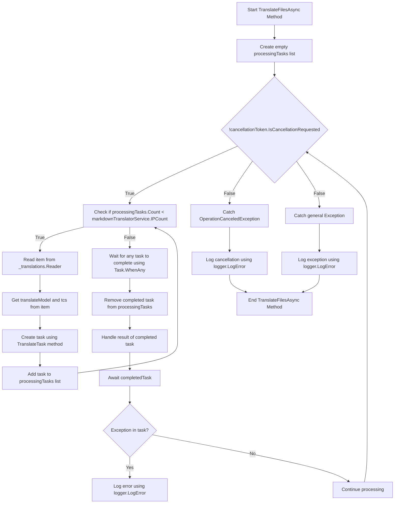

# الـ خلفيات الشّرْع. فريقان

<datetime class="hidden">2024-08-23-TT 19: 52</datetime>

<!--category-- EasyNMT, ASP.NET -->
## أولاً

في مراجعتنا السابقة [هنا هنا](/blog/backgroundtranslationspt1) لقد ناقشنا كيف يمكننا أن نستخدم "ايس NAMT" لترجمة `.md` ملفات إلى لغات مختلفة. ناقشنا أيضاً كيف يمكننا عرض هذه الوظيفة على المستخدم بإضافة قطرة إلى محرّر العلامة. في هذا المنصب سوف نناقش كيف يمكننا استخدام خدمة خلفية للتعامل مع مهام الترجمة.

[رابعاً -

## يجري إعداد

أول شيء علينا القيام به هو إنشاء حاوية docker لتشغيل خدمة الترجمة لدينا. سوف نستخدم `EasyNMT` صورة ducrker موجودة على Doker hough.

```yaml
  easynmt:
    image: easynmt/api:2.0.2-cpu
    volumes:
      - /mnt/easynmt:/cache/
    deploy:
      resources:
        limits:
          cpus: "4.0"
    networks:
      - app_network
```

نحن هنا نُنشئُ a خدمة مسمّاة `easynmt` التي تستخدم `easynmt/api:2.0.2-cpu` (أ) صورة مصوّرة. كما أننا نزيد من حجم تخزين مخبئ الترجمة. كما أننا نضع حدوداً للموارد لضمان أن الخدمة لا تستهلك كل الموارد على الآلة المضيفة (AasyNMT هو قليلاً من خنازير الموارد).

## نعم نعم

إحدى القضايا هي أن (إيزي إن إم تي) إما أن يأخذ قليلاً ليبدأ و/أو ينزل بشكل عشوائي. إذاً في [الخلفية SSSSSS](https://github.com/scottgal/mostlylucidweb/blob/main/Mostlylucid/MarkdownTranslator/BackgroundTranslateService.cs) يجب أن نتعامل مع هذا الأمر

### انت بدء

عند بدء الخدمة، يجب أن نتحقق إذا كانت خدمة (ايزي نانمت) تعمل. إذا لم يكن نحن تجميد المعالجة المستقبلية حتى هو. كما أننا بحاجة إلى التعامل مع الحالة التي تنخفض فيها الخدمة (كما يمكن أن تكون عشوائية).

```csharp
    private async Task<bool> StartupHealthCheck(CancellationToken cancellationToken)
    {
        var count = 1;
        var isUp = false;
        while (true)
        {
            if (await Ping(cancellationToken))
            {
                logger.LogInformation("Translation service is available");
                isUp = true;
                break;
            }

            await Task.Delay(10000, cancellationToken);
            count++;
            if (count > 3)
            {
                logger.LogError("Translation service is not available trying again (count: {Count})", count);
                _translations.Writer.Complete();
                await cancellationTokenSource.CancelAsync();
                isUp = false;
                break;
            }
        }

        return isUp;
    }

    private async Task PeriodicHealthCheck(CancellationToken cancellationToken)
    {
        // Run the health check periodically (e.g., every 60 seconds)
        const int delayMilliseconds = 60000;


        while (!cancellationToken.IsCancellationRequested)
        {
            try
            {
                if (!await Ping(cancellationToken))
                {
                    logger.LogError("Translation service is not available");
                    await cancellationTokenSource.CancelAsync();
                    _translations.Writer.Complete();
                    TranslationServiceUp = false;
                }
                else
                {
                    logger.LogInformation("Translation service is healthy");
                    TranslationServiceUp = true;
                }
            }
            catch (Exception ex)
            {
                TranslationServiceUp = false;
                logger.LogError(ex, "Error during service health check");
                await cancellationTokenSource.CancelAsync();
                _translations.Writer.Complete();
            }

            // Wait before checking again
            await Task.Delay(delayMilliseconds, cancellationToken);
        }
    }
    
        public async Task<bool> Ping(CancellationToken cancellationToken)
    {
        if (!await markdownTranslatorService.IsServiceUp(cancellationToken))
        {
            logger.LogError("Translation service is not available");
            return false;
        }

        return true;
    }

    
```

ويعزى ذلك في معظمه إلى عدم وجود نقطة نهاية للفحص الصحي. نحن فقط نتعقب الخدمة كل 60 ثانية لنرى إن كانت جاهزة إذا لم يكن نحن إلغاء الخدمة وتجميد المعالجة المستقبلية حتى هو.

```csharp
    private string[] IPs = translateServiceConfig.IPs;
    public async ValueTask<bool> IsServiceUp(CancellationToken cancellationToken)
    {
        var workingIPs = new List<string>();

        try
        {
            foreach (var ip in IPs)
            {
                logger.LogInformation("Checking service status at {IP}", ip);
                var response = await client.GetAsync($"{ip}/model_name", cancellationToken);
                if (response.IsSuccessStatusCode)
                {
                    workingIPs.Add(ip);
                }
            }

            IPs = workingIPs.ToArray();
            if (!IPs.Any()) return false;
            return true;
        }
        catch (Exception e)
        {
            logger.LogError(e, "Error checking service status");
            return false;
        }
    }
```

في الـ `IsServiceUp` ننقل جميع خدمات (ايزي ناتم) المتاحة لنرى إن كانت جاهزة. إن كان أحد منهم منا رجعنَّا إلى الدنيا ، ثم رجعنَّا راجعًا راجعًا راجعًا راجعًا بعد البعث بعد البعث بعد البعث بعد البعث ، إن كان أحدًا منهم منا رجعنا رجعنا بعد رجعنا بعد البعث بعد البعث بعد البعث بعد رجع ، ورجعنا رجعنا بعد رجعًا رجعًا رجعًا ، ورجعنا بعد رجعًا رجعنا بعد رجعًا منااا بعد رجعنا بعد البعث بعد البعث بعد البعث بعد رجع ، ورجعنا بعد عودًا رجعًا بعد عودًا ،ا بعد عودًا :ا بعد عودًا بعد عودًا مناا بعد عودًا ،ا بعد رجعًا ،ا بعد عودًا مناا بعد عودًا بعدا ، فنا بعد عودًا بعد عودًا ،ا ،ا بعد رجعًا بعد رجعًا ،ًا ،ً ،ا بعد رجعًا يرجعًا ،ًا ،ًا ،ا بعدًا بعدًا ،ًا يرجعًا ،ًا ،ًا بعدًا بعدًا بعدًا بعدًا ،ًا بعدًا بعدًا بعدًا ،ًا ،ًا بعدًا ،ًا بعدًا ،ًا منًا بعدًا بعدًا بعدًا بعدًا بعدًا منًا بعدًا بعدًا بعدًا بعدًا بعدًا بعدًا بعدًا بعدًا :ًا بعدًا بعدًا بعدًا بعدًا بعدًا بعدًا بعدًا بعدًا بعدًا :ًا بعدًا :ًا بعدًا بعدًا بعدًا بعدًا بعدًا بعدًا بعدًا بعدًا بعدًا بعدًا بعدًا بعدًا بعدًا بعدًا بعدًا بعدًا بعدًا بعدًا بعدًا بعدًا :ًا بعدًا بعدًا يرجعًا يرجعًا بعدًا بعدا بعدا بعدا بعدا بعدا بعدًا بعدًا بعدًا بعدًا بعدًاا بعداا بعدا بعدا بعدا بعدا بعدا بعدا بعدا بعدااا :ًا يرجعًا بعدا بعدا يرجعًا يرجعًا يرجعًا يرجعًا بعدا بعدا بعدا بعدا `true` خلاف ذلك، نرجع إلى `false`/ / / / كما أننا نستكمل قائمة IPs الخدمية لتشمل فقط تلك الموجودة. لدي في المنزل عدد قليل من خدمات "ايزي نمت" تعمل على آلات مختلفة لذا هذا مفيد لي (ويجعل الترجمة أسرع قليلاً).

### التحديثات

في API نحن الآن التحقق من الخدمة يجري حتى قبل إطلاق النار على طلب الترجمة:

```csharp
    [HttpPost("start-translation")]
    [ValidateAntiForgeryToken]
    public async Task<Results<Ok<string>, BadRequest<string>>> StartTranslation([FromBody] MarkdownTranslationModel model)
    {
        if(!backgroundTranslateService.TranslationServiceUp)
        {
            return TypedResults.BadRequest("Translation service is down");
        }
        // Create a unique identifier for this translation task
        var taskId = Guid.NewGuid().ToString("N");
        var userId = Request.GetUserId(Response);
       
        // Trigger translation and store the associated task
        var translationTask = await backgroundTranslateService.Translate(model);
    
        var translateTask = new TranslateTask(taskId, model.Language, translationTask);
        translateCacheService.AddTask(userId, translateTask);

        // Return the task ID to the client
        return TypedResults.Ok(taskId);
    }
```

### المحتويات مُترجم

لقد انتقلنا الآن إلى استخدام `Channels` لترجمتنا للصف ، انها مجرد نسخة أفضل من `BufferBlock` استخدمنا سابقاً (أداء أفضل، ذاكرة أقل، إلخ).

```csharp
    private readonly
        Channel<(PageTranslationModel, TaskCompletionSource<TaskCompletion>)>
        _translations = Channel.CreateUnbounded<(PageTranslationModel, TaskCompletionSource<TaskCompletion>)>();

    public async Task<Task<TaskCompletion>> Translate(MarkdownTranslationModel message)
    {
        // Create a TaskCompletionSource that will eventually hold the result of the translation
        var translateMessage = new PageTranslationModel
        {
            Language = message.Language,
            OriginalFileName = "",
            OriginalMarkdown = message.OriginalMarkdown,
            Persist = false
        };

        return await Translate(translateMessage);
    }

    private async Task<Task<TaskCompletion>> Translate(PageTranslationModel message)
    {
        // Create a TaskCompletionSource that will eventually hold the result of the translation
        var tcs = new TaskCompletionSource<TaskCompletion>();
        // Send the translation request along with the TaskCompletionSource to be processed
        await _translations.Writer.WriteAsync((message, tcs));
        return tcs.Task;
    }
```

يمكنك ان ترى ان هذا يستخدم `TaskCompletionSource` إلى عقد نتيجة الترجمة. ثم نرسل طلب الترجمة مع `TaskCompletionSource` التي ينبغي أن تُجهـز `await _translations.Writer.WriteAsync((message, tcs));` ثم ترجع بعد ذلك `TaskCompletion` إلى API set الإيطالية إلى.

### لُوَج

"الـ "الـ "الـ "الـ "الـ "الـ "الـ "الـ "الـ "الـ `IHostedService` يكون مسؤولا عن تجهيز أي طلبات للترجمة ترد إليه. الرسم البياني مخيف قليلاً لكنه ليس بذلك السوء

في الـ



ومن أجل تبسيط الترجمات، ننشئ حلقة لا تحاول سوى معالجة عدد الترجمات في وقت واحد حيث لدينا خدمات HyseNMT تعمل. هذا هو لمنع الخدمة من أن تكون مغمورة.

لكل واحد من هذه نقوم بعد ذلك بطرح وظيفة جديدة للترجمة

```csharp
 TranslateTask(cancellationToken, translateModel, item, tcs);
```

ثم نستعمل `Task.WhenAny` إلى انتظار أي من المهام إلى أن تكتمل. ثم نحذف المهمة المنجزة من القائمة ونعالج نتيجة المهمة المنجزة. إذا كان هناك استثناء نسجله ونستمر في المعالجة.

ثم نبدأ الحلقة مرة أخرى حتى يتم إلغاء الخدمة.

```csharp
    private async Task TranslateFilesAsync(CancellationToken cancellationToken)
    {
        try
        {
            var processingTasks = new List<Task>();
            while (!cancellationToken.IsCancellationRequested)
            {
                while (processingTasks.Count < markdownTranslatorService.IPCount &&
                       !cancellationToken.IsCancellationRequested)
                {
                    var item = await _translations.Reader.ReadAsync(cancellationToken);
                    var translateModel = item.Item1;
                    var tcs = item.Item2;
                    // Start the task and add it to the list
                    var task = TranslateTask(cancellationToken, translateModel, item, tcs);
                    processingTasks.Add(task);
                }

                // Wait for any of the tasks to complete
                var completedTask = await Task.WhenAny(processingTasks);

                // Remove the completed task
                processingTasks.Remove(completedTask);

                // Optionally handle the result of the completedTask here
                try
                {
                    await completedTask; // Catch exceptions if needed
                }
                catch (Exception ex)
                {
                    logger.LogError(ex, "Error translating markdown");
                }
            }
        }

        catch (OperationCanceledException)
        {
            logger.LogError("Translation service was cancelled");
        }
        catch (Exception e)
        {
            logger.LogError(e, "Error translating markdown");
        }
    }
```

### 

"العقل" من هذه المعالجة يتم التعامل معها في `TranslateTask` (أستخدم هذا لترجمة الملفات وفي المستقبل لحفظ المقالات المترجمة عائدة إلى مصرف التنمية).

أولاً أتحقق من ما إذا كان المدخل الأصلي قد تغيّر أمّا باستخدام مسطرة ملفّ محتويات الملف الأصلي فقط أتحقق من التاريخ المحدّث لمدخل المدونة مقابل المترجم منها. إذا لم يتغير، سأتخطى الترجمة. وإذا تغيرت، أترجم الهدف إلى أسفل وأواصله إذا لزم الأمر.

ثم اتصل بالوسيلة المترجمة الرئيسية لطريقة `MarkdownTranslatorService` للقيام بالترجمة.
انظر كيف أفعل هذا [هنا هنا](/blog/autotranslatingmarkdownfiles).
وهذا يرجع إلى النقطة المترجمة التي أواصل عندها إذا لزم الأمر.
ثم قمت بعد ذلك بوضع `tcs` إلى المُتَرجَمَة هدف أسفل و الإيطالية كامل.

```csharp
private async Task TranslateTask(CancellationToken cancellationToken, PageTranslationModel translateModel,
        (PageTranslationModel, TaskCompletionSource<TaskCompletion>) item,
        TaskCompletionSource<TaskCompletion> tcs)
    {
        var scope = scopeFactory.CreateScope();

        var slug = Path.GetFileNameWithoutExtension(translateModel.OriginalFileName);
        if (translateModel.Persist)
        {
            if (await EntryChanged(scope, slug, translateModel))
            {
                logger.LogInformation("Entry {Slug} has changed, translating", slug);
            }
            else
            {
                logger.LogInformation("Entry {Slug} has not changed, skipping translation", slug);
                tcs.SetResult(new TaskCompletion(null, translateModel.Language, true, DateTime.Now));
                return;
            }
        }


        logger.LogInformation("Translating {File} to {Language}", translateModel.OriginalFileName,
            translateModel.Language);
        try
        {
            var translatedMarkdown =
                await markdownTranslatorService.TranslateMarkdown(translateModel.OriginalMarkdown,
                    translateModel.Language, cancellationToken);


            if (item.Item1.Persist)
            {
                await PersistTranslation(scope, slug, translateModel, translatedMarkdown);
            }

            tcs.SetResult(new TaskCompletion(translatedMarkdown, translateModel.Language, true, DateTime.Now));
        }
        catch (Exception e)
        {
            logger.LogError(e, "Error translating {File} to {Language}", translateModel.OriginalFileName,
                translateModel.Language);
            tcs.SetException(e);
        }
    }
```

## في الإستنتاج

هكذا، هكذا أتعامل مع الترجمات الأساسية في مدونتي. أنا أستخدم هذا منذ شهر أو نحو ذلك والآن وقد كان يعمل بشكل جيد. في حين أنها تبدو صعبة في الواقع الشفرة واضحة جدا. آمل أن يساعدك هذا في مشاريعك الخاصة