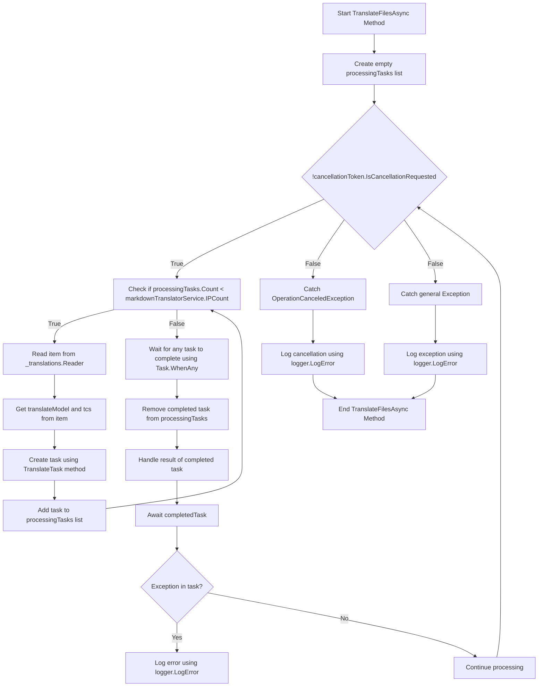

# Hintergrundübersetzungen Pt. 2.............................................................................................................................................................................................................................................................. 

<datetime class="hidden">2024-08-23T19:52</datetime>

<!--category-- EasyNMT, ASP.NET -->
## Einleitung

In unserem vorherigen Beitrag [Hierher](/blog/backgroundtranslationspt1) wir diskutierten, wie wir EasyNMT verwenden können, um unsere `.md` Dateien in verschiedenen Sprachen. Wir diskutierten auch, wie wir diese Funktionalität an den Benutzer anpassen können, indem wir dem Markdown-Editor einen Dropdown hinzufügen. In diesem Beitrag werden wir besprechen, wie wir einen Hintergrunddienst verwenden können, um die Übersetzungsaufgaben zu bewältigen.

[TOC]

## Docker-Einrichtung

Als erstes müssen wir einen Docker-Container einrichten, um unseren Übersetzungsdienst zu betreiben. Wir benutzen die `EasyNMT` docker Bild, das auf Docker Hub verfügbar ist.

```yaml
  easynmt:
    image: easynmt/api:2.0.2-cpu
    volumes:
      - /mnt/easynmt:/cache/
    deploy:
      resources:
        limits:
          cpus: "4.0"
    networks:
      - app_network
```

Hier richten wir einen Dienst ein, der `easynmt` die die `easynmt/api:2.0.2-cpu` Bild. Wir montieren auch ein Volumen, um den Übersetzungscache zu speichern. Wir setzen auch Ressourcenlimits, um sicherzustellen, dass der Dienst nicht alle Ressourcen auf dem Host-Rechner verbraucht (EasyNMT ist ein bisschen ein Ressourcenschwein).

## Hintergrunddienst

Ein Problem ist, dass EasyNMT entweder ein bisschen dauern kann, um zu starten und / oder gehen Sie zufällig. So in unserem [Hintergrunddienst](https://github.com/scottgal/mostlylucidweb/blob/main/Mostlylucid/MarkdownTranslator/BackgroundTranslateService.cs) Wir müssen das regeln.

### Inbetriebnahme

Beim Start des Dienstes müssen wir prüfen, ob der EasyNMT-Service läuft. Wenn wir es nicht sind, frieren wir die zukünftige Verarbeitung ein, bis es soweit ist. Wir müssen auch den Fall behandeln, in dem der Dienst untergeht (wie es zufällig möglich ist).

```csharp
    private async Task<bool> StartupHealthCheck(CancellationToken cancellationToken)
    {
        var count = 1;
        var isUp = false;
        while (true)
        {
            if (await Ping(cancellationToken))
            {
                logger.LogInformation("Translation service is available");
                isUp = true;
                break;
            }

            await Task.Delay(10000, cancellationToken);
            count++;
            if (count > 3)
            {
                logger.LogError("Translation service is not available trying again (count: {Count})", count);
                _translations.Writer.Complete();
                await cancellationTokenSource.CancelAsync();
                isUp = false;
                break;
            }
        }

        return isUp;
    }

    private async Task PeriodicHealthCheck(CancellationToken cancellationToken)
    {
        // Run the health check periodically (e.g., every 60 seconds)
        const int delayMilliseconds = 60000;


        while (!cancellationToken.IsCancellationRequested)
        {
            try
            {
                if (!await Ping(cancellationToken))
                {
                    logger.LogError("Translation service is not available");
                    await cancellationTokenSource.CancelAsync();
                    _translations.Writer.Complete();
                    TranslationServiceUp = false;
                }
                else
                {
                    logger.LogInformation("Translation service is healthy");
                    TranslationServiceUp = true;
                }
            }
            catch (Exception ex)
            {
                TranslationServiceUp = false;
                logger.LogError(ex, "Error during service health check");
                await cancellationTokenSource.CancelAsync();
                _translations.Writer.Complete();
            }

            // Wait before checking again
            await Task.Delay(delayMilliseconds, cancellationToken);
        }
    }
    
        public async Task<bool> Ping(CancellationToken cancellationToken)
    {
        if (!await markdownTranslatorService.IsServiceUp(cancellationToken))
        {
            logger.LogError("Translation service is not available");
            return false;
        }

        return true;
    }

    
```

Dies ist vor allem der EasyNMT Mangel an einem Gesundheitscheck-Endpunkt. Wir pingen nur alle 60 Sekunden, um zu sehen, ob es aus ist. Wenn es nicht so ist, stornieren wir den Service und frieren die zukünftige Verarbeitung ein, bis es soweit ist.

```csharp
    private string[] IPs = translateServiceConfig.IPs;
    public async ValueTask<bool> IsServiceUp(CancellationToken cancellationToken)
    {
        var workingIPs = new List<string>();

        try
        {
            foreach (var ip in IPs)
            {
                logger.LogInformation("Checking service status at {IP}", ip);
                var response = await client.GetAsync($"{ip}/model_name", cancellationToken);
                if (response.IsSuccessStatusCode)
                {
                    workingIPs.Add(ip);
                }
            }

            IPs = workingIPs.ToArray();
            if (!IPs.Any()) return false;
            return true;
        }
        catch (Exception e)
        {
            logger.LogError(e, "Error checking service status");
            return false;
        }
    }
```

In der `IsServiceUp` Methode ping wir alle verfügbaren EasyNMT-Dienste, um zu sehen, ob sie up sind. Wenn einer von ihnen ist, kehren wir zurück `true` sonst kehren wir zurück `false`......................................................................................................... Wir aktualisieren auch die Liste der Service-IPs, um nur diejenigen, die oben sind. Zu Hause habe ich ein paar EasyNMT Dienste laufen auf verschiedenen Maschinen, so dass dies für mich nützlich ist (und macht die Übersetzung ein bisschen schneller).

### API-Updates

In der API überprüfen wir nun, ob der Dienst vor dem Abfeuern einer Übersetzungsanfrage aufsteht:

```csharp
    [HttpPost("start-translation")]
    [ValidateAntiForgeryToken]
    public async Task<Results<Ok<string>, BadRequest<string>>> StartTranslation([FromBody] MarkdownTranslationModel model)
    {
        if(backgroundTranslateService.TranslationServiceUp)
        {
            return TypedResults.BadRequest("Translation service is down");
        }
        // Create a unique identifier for this translation task
        var taskId = Guid.NewGuid().ToString("N");
        var userId = Request.GetUserId(Response);
       
        // Trigger translation and store the associated task
        var translationTask = await backgroundTranslateService.Translate(model);
    
        var translateTask = new TranslateTask(taskId, model.Language, translationTask);
        translateCacheService.AddTask(userId, translateTask);

        // Return the task ID to the client
        return TypedResults.Ok(taskId);
    }
```

### Methode übersetzen

Wir haben jetzt auf den Einsatz umgestellt. `Channels` für unsere Übersetzung Warteschlange; es ist nur eine bessere Version der `BufferBlock` zuvor verwendet (bessere Leistung, weniger Speicher etc.).

```csharp
    private readonly
        Channel<(PageTranslationModel, TaskCompletionSource<TaskCompletion>)>
        _translations = Channel.CreateUnbounded<(PageTranslationModel, TaskCompletionSource<TaskCompletion>)>();

    public async Task<Task<TaskCompletion>> Translate(MarkdownTranslationModel message)
    {
        // Create a TaskCompletionSource that will eventually hold the result of the translation
        var translateMessage = new PageTranslationModel
        {
            Language = message.Language,
            OriginalFileName = "",
            OriginalMarkdown = message.OriginalMarkdown,
            Persist = false
        };

        return await Translate(translateMessage);
    }

    private async Task<Task<TaskCompletion>> Translate(PageTranslationModel message)
    {
        // Create a TaskCompletionSource that will eventually hold the result of the translation
        var tcs = new TaskCompletionSource<TaskCompletion>();
        // Send the translation request along with the TaskCompletionSource to be processed
        await _translations.Writer.WriteAsync((message, tcs));
        return tcs.Task;
    }
```

Sie können sehen, dass dies eine `TaskCompletionSource` um das Ergebnis der Übersetzung zu halten. Wir senden dann die Übersetzungsanfrage zusammen mit der `TaskCompletionSource` zu verarbeiten mit `await _translations.Writer.WriteAsync((message, tcs));` dann geben Sie die `TaskCompletion` Aufgabe an die API, die es ermöglicht, zwischengespeichert zu werden.

### Übersetzungsschleife

Die Haupt 'Schleife' in unserem `IHostedService` ist für die Bearbeitung von Übersetzungsanfragen, die eintreffen, verantwortlich. Das Diagramm ist ein wenig beängstigend, aber es ist nicht so schlimm.

In der



Um Übersetzungen zu optimieren, erstellen wir eine Schleife, die nur versucht, so viele Übersetzungen zu einem Zeitpunkt zu verarbeiten, wie wir EasyNMT-Dienste laufen lassen. Dies soll verhindern, dass der Dienst überwältigt wird.

Für jeden von diesen spinnen wir dann eine neue Übersetzungsaufgabe

```csharp
 TranslateTask(cancellationToken, translateModel, item, tcs);
```

Wir benutzen dann `Task.WhenAny` zu warten, bis eine der Aufgaben zu vollenden. Anschließend entfernen wir die abgeschlossene Aufgabe aus der Liste und behandeln das Ergebnis der abgeschlossenen Aufgabe. Wenn es eine Ausnahme gibt, protokollieren wir sie und setzen die Verarbeitung fort.

Dann starten wir die Schleife wieder, bis der Service abgesagt ist.

```csharp
    private async Task TranslateFilesAsync(CancellationToken cancellationToken)
    {
        try
        {
            var processingTasks = new List<Task>();
            while (!cancellationToken.IsCancellationRequested)
            {
                while (processingTasks.Count < markdownTranslatorService.IPCount &&
                       !cancellationToken.IsCancellationRequested)
                {
                    var item = await _translations.Reader.ReadAsync(cancellationToken);
                    var translateModel = item.Item1;
                    var tcs = item.Item2;
                    // Start the task and add it to the list
                    var task = TranslateTask(cancellationToken, translateModel, item, tcs);
                    processingTasks.Add(task);
                }

                // Wait for any of the tasks to complete
                var completedTask = await Task.WhenAny(processingTasks);

                // Remove the completed task
                processingTasks.Remove(completedTask);

                // Optionally handle the result of the completedTask here
                try
                {
                    await completedTask; // Catch exceptions if needed
                }
                catch (Exception ex)
                {
                    logger.LogError(ex, "Error translating markdown");
                }
            }
        }

        catch (OperationCanceledException)
        {
            logger.LogError("Translation service was cancelled");
        }
        catch (Exception e)
        {
            logger.LogError(e, "Error translating markdown");
        }
    }
```

### Verarbeitung

Das "Fleisch" dieser Verarbeitung wird in `TranslateTask` die für die Übersetzung des Markdowns verantwortlich ist und ihn bei Bedarf fortsetzt (ich benutze dies für die Übersetzung von Dateien und in Zukunft für die Speicherung von übersetzten Artikeln zurück in die DB).

Ich prüfe zuerst, ob sich der ursprüngliche Eintrag geändert hat;entweder mit einem Datei-Hash des ursprünglichen Dateiinhalts / einfach das UpdatedDate des Blogeintrags mit den übersetzten überprüfen. Wenn es sich nicht geändert hat, überspringe ich die Übersetzung. Wenn es sich geändert hat, übersetze ich den Markdown und halte ihn bei Bedarf fort.

Ich rufe dann in die Hauptübersetzungsmethode der `MarkdownTranslatorService` für die Übersetzung.
Sehen Sie, wie ich das mache. [Hierher](/blog/autotranslatingmarkdownfiles).
Dies gibt den übersetzten Markdown zurück, den ich dann bei Bedarf fortbeste.
Ich stellte dann die `tcs` Ergebnis auf den übersetzten Markdown und setzen Sie ihn als komplett.

```csharp
private async Task TranslateTask(CancellationToken cancellationToken, PageTranslationModel translateModel,
        (PageTranslationModel, TaskCompletionSource<TaskCompletion>) item,
        TaskCompletionSource<TaskCompletion> tcs)
    {
        var scope = scopeFactory.CreateScope();

        var slug = Path.GetFileNameWithoutExtension(translateModel.OriginalFileName);
        if (translateModel.Persist)
        {
            if (await EntryChanged(scope, slug, translateModel))
            {
                logger.LogInformation("Entry {Slug} has changed, translating", slug);
            }
            else
            {
                logger.LogInformation("Entry {Slug} has not changed, skipping translation", slug);
                tcs.SetResult(new TaskCompletion(null, translateModel.Language, true, DateTime.Now));
                return;
            }
        }


        logger.LogInformation("Translating {File} to {Language}", translateModel.OriginalFileName,
            translateModel.Language);
        try
        {
            var translatedMarkdown =
                await markdownTranslatorService.TranslateMarkdown(translateModel.OriginalMarkdown,
                    translateModel.Language, cancellationToken);


            if (item.Item1.Persist)
            {
                await PersistTranslation(scope, slug, translateModel, translatedMarkdown);
            }

            tcs.SetResult(new TaskCompletion(translatedMarkdown, translateModel.Language, true, DateTime.Now));
        }
        catch (Exception e)
        {
            logger.LogError(e, "Error translating {File} to {Language}", translateModel.OriginalFileName,
                translateModel.Language);
            tcs.SetException(e);
        }
    }
```

## Schlussfolgerung

Das ist es also, so handle ich Hintergrundübersetzungen in meinem Blog. Ich benutze das seit etwa einem Monat und es funktioniert gut. Während es in Wirklichkeit entmutigend aussieht, ist der Code ziemlich einfach. Ich hoffe, das hilft Ihnen bei Ihren eigenen Projekten.