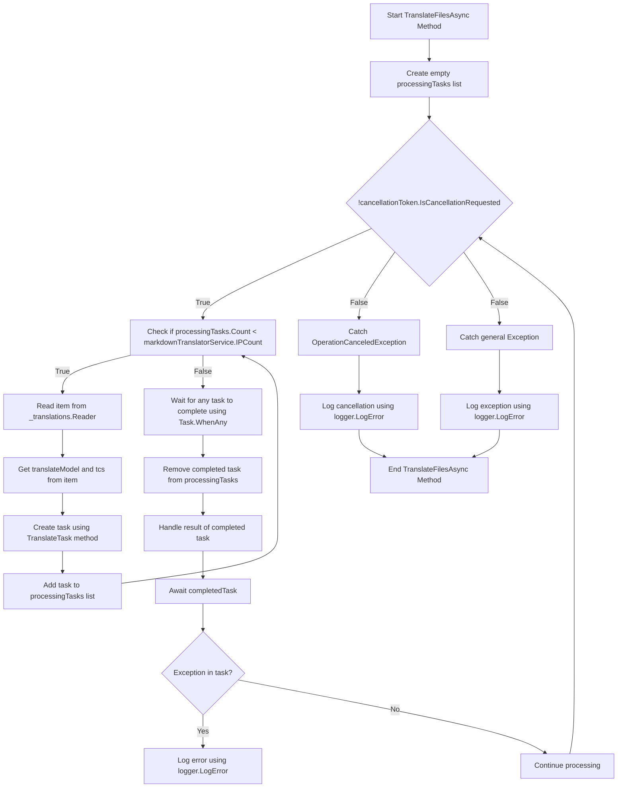

# Background Translations Pt. 2

<datetime class="hidden">2024-08-23T19:52</datetime>

<!--category-- EasyNMT, ASP.NET -->
## Εισαγωγή

Στην προηγούμενη θέση μας [Ορίστε.](/blog/backgroundtranslationspt1) συζητήσαμε πώς μπορούμε να χρησιμοποιήσουμε EasyNMT για να μεταφράσει μας `.md` αρχεία σε διαφορετικές γλώσσες. Συζητήσαμε επίσης πώς μπορούμε να αναδυθούμε αυτή τη λειτουργία στο χρήστη προσθέτοντας μια πτώση στον επεξεργαστή markdown. Σε αυτή τη θέση θα συζητήσουμε πώς μπορούμε να χρησιμοποιήσουμε μια υπηρεσία υποβάθρου για να χειριστούμε τις μεταφραστικές εργασίες.

Δείτε το πρώτο μέρος αυτής της σειράς [Ορίστε.](/blog/backgroundtranslationspt1).

[TOC]

## Ρύθμιση Docker

Το πρώτο πράγμα που πρέπει να κάνουμε είναι να φτιάξουμε ένα δοχείο για να διευθύνουμε την μεταφραστική μας υπηρεσία. Θα χρησιμοποιήσουμε το `EasyNMT` εικόνα docker που είναι διαθέσιμη στο Docker Hub.

```yaml
  easynmt:
    image: easynmt/api:2.0.2-cpu
    volumes:
      - /mnt/easynmt:/cache/
    deploy:
      resources:
        limits:
          cpus: "4.0"
    networks:
      - app_network
```

Εδώ φτιάχνουμε μια υπηρεσία που ονομάζεται `easynmt` που χρησιμοποιεί το `easynmt/api:2.0.2-cpu` Εικόνα. Φτιάχνουμε επίσης έναν τόμο για να αποθηκεύσουμε την μνήμη της μετάφρασης. Θέτουμε επίσης όρια πόρων για να διασφαλίσουμε ότι η υπηρεσία δεν καταναλώνει όλους τους πόρους στο μηχάνημα υποδοχής (EasyNMT είναι ένα κομμάτι ενός πόρου γουρούνι).

## Υπηρεσία υποβάθρου

Ένα θέμα είναι ότι το EasyNMT μπορεί είτε να πάρει λίγο για να ξεκινήσει και/ή να πάει κάτω τυχαία. Οπότε, στο δικό μας... [BackgroundService](https://github.com/scottgal/mostlylucidweb/blob/main/Mostlylucid/MarkdownTranslator/BackgroundTranslateService.cs) Πρέπει να το χειριστούμε.

### Έναρξη

Κατά την έναρξη της υπηρεσίας πρέπει να ελέγξουμε αν η υπηρεσία EasyNMT λειτουργεί. Αν δεν είναι, παγώνουμε την μελλοντική επεξεργασία μέχρι να γίνει. Πρέπει επίσης να χειριστούμε την περίπτωση όπου η υπηρεσία πηγαίνει προς τα κάτω (όπως μπορεί τυχαία).

```csharp
    private async Task<bool> StartupHealthCheck(CancellationToken cancellationToken)
    {
        var count = 1;
        var isUp = false;
        while (true)
        {
            if (await Ping(cancellationToken))
            {
                logger.LogInformation("Translation service is available");
                isUp = true;
                break;
            }

            await Task.Delay(10000, cancellationToken);
            count++;
            if (count > 3)
            {
                logger.LogError("Translation service is not available trying again (count: {Count})", count);
                _translations.Writer.Complete();
                await cancellationTokenSource.CancelAsync();
                isUp = false;
                break;
            }
        }

        return isUp;
    }

    private async Task PeriodicHealthCheck(CancellationToken cancellationToken)
    {
        // Run the health check periodically (e.g., every 60 seconds)
        const int delayMilliseconds = 60000;


        while (!cancellationToken.IsCancellationRequested)
        {
            try
            {
                if (!await Ping(cancellationToken))
                {
                    logger.LogError("Translation service is not available");
                    await cancellationTokenSource.CancelAsync();
                    _translations.Writer.Complete();
                    TranslationServiceUp = false;
                }
                else
                {
                    logger.LogInformation("Translation service is healthy");
                    TranslationServiceUp = true;
                }
            }
            catch (Exception ex)
            {
                TranslationServiceUp = false;
                logger.LogError(ex, "Error during service health check");
                await cancellationTokenSource.CancelAsync();
                _translations.Writer.Complete();
            }

            // Wait before checking again
            await Task.Delay(delayMilliseconds, cancellationToken);
        }
    }
    
        public async Task<bool> Ping(CancellationToken cancellationToken)
    {
        if (!await markdownTranslatorService.IsServiceUp(cancellationToken))
        {
            logger.LogError("Translation service is not available");
            return false;
        }

        return true;
    }

    
```

Αυτό οφείλεται κυρίως στην έλλειψη τελικού σημείου ελέγχου υγείας του EasyNMT. Εντοπίζουμε την υπηρεσία κάθε 60 δευτερόλεπτα για να δούμε αν είναι έτοιμη. Αν δεν είναι, ακυρώνουμε την υπηρεσία και παγώνουμε την μελλοντική επεξεργασία μέχρι να γίνει.

```csharp
    private string[] IPs = translateServiceConfig.IPs;
    public async ValueTask<bool> IsServiceUp(CancellationToken cancellationToken)
    {
        var workingIPs = new List<string>();

        try
        {
            foreach (var ip in IPs)
            {
                logger.LogInformation("Checking service status at {IP}", ip);
                var response = await client.GetAsync($"{ip}/model_name", cancellationToken);
                if (response.IsSuccessStatusCode)
                {
                    workingIPs.Add(ip);
                }
            }

            IPs = workingIPs.ToArray();
            if (!IPs.Any()) return false;
            return true;
        }
        catch (Exception e)
        {
            logger.LogError(e, "Error checking service status");
            return false;
        }
    }
```

Στην `IsServiceUp` method we ping all the available EasyNMT services to see if they are up. Αν κάποιος από αυτούς είναι θα επιστρέψουμε. `true` Αλλιώς θα επιστρέψουμε. `false`. Ενημερώνουμε επίσης τη λίστα των υπηρεσιών IPs για να περιλαμβάνει μόνο αυτά που είναι επάνω. Στο σπίτι έχω μερικές υπηρεσίες EasyNMT τρέχει σε διαφορετικές μηχανές, έτσι αυτό είναι χρήσιμο για μένα (και κάνει τη μετάφραση λίγο πιο γρήγορα).

### Ενημερώσεις API

Στο API ελέγχουμε τώρα για την υπηρεσία που είναι επάνω πριν πυροβολήσει ένα μεταφρασμένο αίτημα:

```csharp
    [HttpPost("start-translation")]
    [ValidateAntiForgeryToken]
    public async Task<Results<Ok<string>, BadRequest<string>>> StartTranslation([FromBody] MarkdownTranslationModel model)
    {
        if(!backgroundTranslateService.TranslationServiceUp)
        {
            return TypedResults.BadRequest("Translation service is down");
        }
        // Create a unique identifier for this translation task
        var taskId = Guid.NewGuid().ToString("N");
        var userId = Request.GetUserId(Response);
       
        // Trigger translation and store the associated task
        var translationTask = await backgroundTranslateService.Translate(model);
    
        var translateTask = new TranslateTask(taskId, model.Language, translationTask);
        translateCacheService.AddTask(userId, translateTask);

        // Return the task ID to the client
        return TypedResults.Ok(taskId);
    }
```

### Μέθοδος μετάφρασης

Τώρα αλλάξαμε σε χρήση. `Channels` για μας μεταφράσει ουρά? είναι απλά μια καλύτερη έκδοση του `BufferBlock` χρησιμοποιήσαμε προηγουμένως (καλύτερη απόδοση, λιγότερη μνήμη κ.λπ.).

```csharp
    private readonly
        Channel<(PageTranslationModel, TaskCompletionSource<TaskCompletion>)>
        _translations = Channel.CreateUnbounded<(PageTranslationModel, TaskCompletionSource<TaskCompletion>)>();

    public async Task<Task<TaskCompletion>> Translate(MarkdownTranslationModel message)
    {
        // Create a TaskCompletionSource that will eventually hold the result of the translation
        var translateMessage = new PageTranslationModel
        {
            Language = message.Language,
            OriginalFileName = "",
            OriginalMarkdown = message.OriginalMarkdown,
            Persist = false
        };

        return await Translate(translateMessage);
    }

    private async Task<Task<TaskCompletion>> Translate(PageTranslationModel message)
    {
        // Create a TaskCompletionSource that will eventually hold the result of the translation
        var tcs = new TaskCompletionSource<TaskCompletion>();
        // Send the translation request along with the TaskCompletionSource to be processed
        await _translations.Writer.WriteAsync((message, tcs));
        return tcs.Task;
    }
```

Μπορείτε να δείτε ότι αυτό χρησιμοποιεί ένα `TaskCompletionSource` να διατηρήσει το αποτέλεσμα της μετάφρασης. Στη συνέχεια, στέλνουμε το αίτημα μετάφρασης μαζί με το `TaskCompletionSource` προς επεξεργασία με `await _translations.Writer.WriteAsync((message, tcs));` Στη συνέχεια, επιστρέψτε το `TaskCompletion` αποστολή στο API που επιτρέπει την αποθήκευσή του.

### Μετάφραση Loop

Το κύριο 'loop' μέσα μας `IHostedService` είναι υπεύθυνος για την επεξεργασία των αιτήσεων μετάφρασης που έρχονται. Το διάγραμμα είναι λίγο τρομακτικό αλλά δεν είναι τόσο άσχημα.

Στην



Για τον εξορθολογισμό των μεταφράσεων δημιουργούμε ένα βρόχο που προσπαθεί μόνο να επεξεργαστεί τόσες μεταφράσεις σε μια στιγμή όπως έχουμε τις υπηρεσίες EasyNMT που λειτουργούν. Αυτό είναι για να αποτρέψουμε την υπερνίκηση της υπηρεσίας.

Για κάθε ένα από αυτά στη συνέχεια περιστρέφουμε ένα νέο έργο μετάφρασης

```csharp
 TranslateTask(cancellationToken, translateModel, item, tcs);
```

Στη συνέχεια, χρησιμοποιούμε `Task.WhenAny` να περιμένει να ολοκληρωθεί οποιαδήποτε από τις εργασίες. Στη συνέχεια αφαιρούμε το ολοκληρωμένο έργο από τη λίστα και χειριζόμαστε το αποτέλεσμα του πλήρους έργου. Αν υπάρχει εξαίρεση, την καταγράφουμε και συνεχίζουμε την επεξεργασία.

Στη συνέχεια, ξεκινάμε το βρόχο και πάλι μέχρι η υπηρεσία να ακυρωθεί.

```csharp
    private async Task TranslateFilesAsync(CancellationToken cancellationToken)
    {
        try
        {
            var processingTasks = new List<Task>();
            while (!cancellationToken.IsCancellationRequested)
            {
                while (processingTasks.Count < markdownTranslatorService.IPCount &&
                       !cancellationToken.IsCancellationRequested)
                {
                    var item = await _translations.Reader.ReadAsync(cancellationToken);
                    var translateModel = item.Item1;
                    var tcs = item.Item2;
                    // Start the task and add it to the list
                    var task = TranslateTask(cancellationToken, translateModel, item, tcs);
                    processingTasks.Add(task);
                }

                // Wait for any of the tasks to complete
                var completedTask = await Task.WhenAny(processingTasks);

                // Remove the completed task
                processingTasks.Remove(completedTask);

                // Optionally handle the result of the completedTask here
                try
                {
                    await completedTask; // Catch exceptions if needed
                }
                catch (Exception ex)
                {
                    logger.LogError(ex, "Error translating markdown");
                }
            }
        }

        catch (OperationCanceledException)
        {
            logger.LogError("Translation service was cancelled");
        }
        catch (Exception e)
        {
            logger.LogError(e, "Error translating markdown");
        }
    }
```

### Επεξεργασία

Το "κρέας" αυτής της επεξεργασίας `TranslateTask` η οποία είναι υπεύθυνη για τη μετάφραση του μαρκαδόρου και επιμένοντάς το αν χρειάζεται (Χρησιμοποιώ αυτό για τη μετάφραση αρχείων και στο μέλλον για την αποθήκευση μεταφρασμένων άρθρων πίσω στην DB).

Ελέγχω πρώτα αν η αρχική εγγραφή έχει αλλάξει; είτε χρησιμοποιώντας ένα αρχείο χασίς του αρχικού περιεχομένου αρχείων / απλά ελέγχω την ενημερωμένη ημερομηνία της καταχώρησης στο blog έναντι των μεταφρασμένων. Αν δεν έχει αλλάξει, θα παραλείψω τη μετάφραση. Αν έχει αλλάξει, μεταφράζω το σήμα και επιμένω αν χρειαστεί.

Στη συνέχεια, καλώ στην κύρια μέθοδο Μετάφρασης του `MarkdownTranslatorService` να κάνει τη μετάφραση.
Δες πως το κάνω αυτό. [Ορίστε.](/blog/autotranslatingmarkdownfiles).
Αυτό επιστρέφει το μεταφρασμένο markdown που στη συνέχεια επιμένω αν χρειαστεί.
Στη συνέχεια, ορίστε το `tcs` αποτέλεσμα στο μεταφρασμένο markdown και να οριστεί ως πλήρης.

```csharp
private async Task TranslateTask(CancellationToken cancellationToken, PageTranslationModel translateModel,
        (PageTranslationModel, TaskCompletionSource<TaskCompletion>) item,
        TaskCompletionSource<TaskCompletion> tcs)
    {
        var scope = scopeFactory.CreateScope();

        var slug = Path.GetFileNameWithoutExtension(translateModel.OriginalFileName);
        if (translateModel.Persist)
        {
            if (await EntryChanged(scope, slug, translateModel))
            {
                logger.LogInformation("Entry {Slug} has changed, translating", slug);
            }
            else
            {
                logger.LogInformation("Entry {Slug} has not changed, skipping translation", slug);
                tcs.SetResult(new TaskCompletion(null, translateModel.Language, true, DateTime.Now));
                return;
            }
        }


        logger.LogInformation("Translating {File} to {Language}", translateModel.OriginalFileName,
            translateModel.Language);
        try
        {
            var translatedMarkdown =
                await markdownTranslatorService.TranslateMarkdown(translateModel.OriginalMarkdown,
                    translateModel.Language, cancellationToken);


            if (item.Item1.Persist)
            {
                await PersistTranslation(scope, slug, translateModel, translatedMarkdown);
            }

            tcs.SetResult(new TaskCompletion(translatedMarkdown, translateModel.Language, true, DateTime.Now));
        }
        catch (Exception e)
        {
            logger.LogError(e, "Error translating {File} to {Language}", translateModel.OriginalFileName,
                translateModel.Language);
            tcs.SetException(e);
        }
    }
```

## Συμπέρασμα

Ώστε αυτό είναι, έτσι χειρίζομαι τις μεταφράσεις στο μπλογκ μου. Το χρησιμοποιώ εδώ και ένα μήνα και δουλεύει καλά. Ενώ φαίνεται τρομακτικό στην πραγματικότητα ο κώδικας είναι αρκετά απλός. Ελπίζω αυτό να σας βοηθήσει στα δικά σας σχέδια.