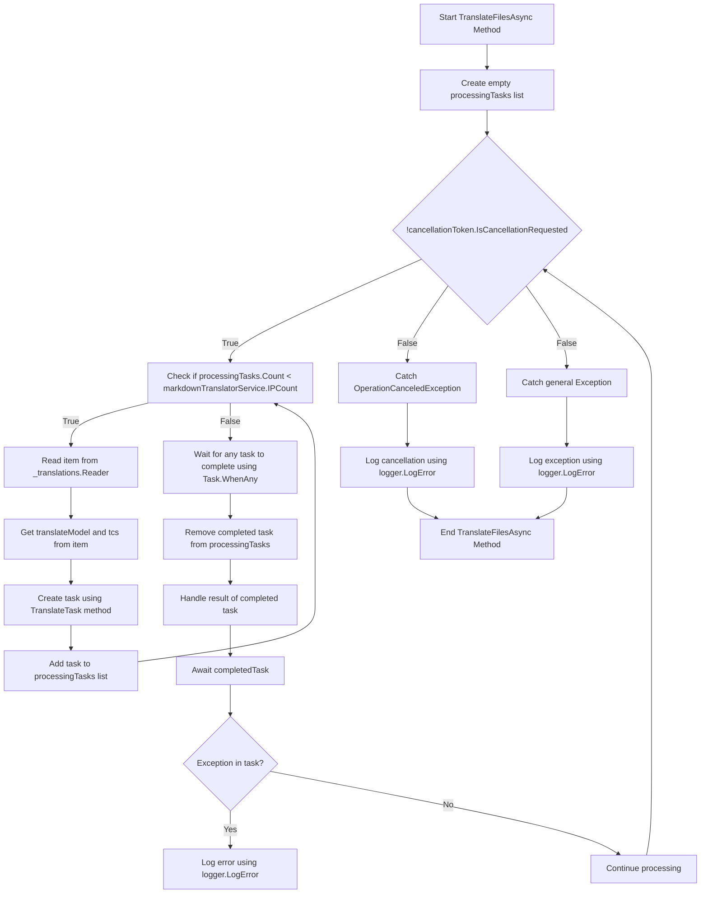

# Traducciones de antecedentes Pt. 2

<datetime class="hidden">2024-08-23T19:52</datetime>

<!--category-- EasyNMT, ASP.NET -->
## Introducción

En nuestro post anterior [aquí](/blog/backgroundtranslationspt1) hemos discutido cómo podemos utilizar EasyNMT para traducir nuestra `.md` archivos en diferentes idiomas. También discutimos cómo podemos sacar a la superficie esta funcionalidad al usuario añadiendo un menú desplegable al editor de marcos. En este post vamos a discutir cómo podemos utilizar un servicio de fondo para manejar las tareas de traducción.

[TOC]

## Configuración de Docker

Lo primero que tenemos que hacer es crear un contenedor de contenedores para ejecutar nuestro servicio de traducción. Usaremos el `EasyNMT` imagen docker que está disponible en Docker Hub.

```yaml
  easynmt:
    image: easynmt/api:2.0.2-cpu
    volumes:
      - /mnt/easynmt:/cache/
    deploy:
      resources:
        limits:
          cpus: "4.0"
    networks:
      - app_network
```

Aquí estamos creando un servicio llamado `easynmt` que utiliza la `easynmt/api:2.0.2-cpu` imagen. También estamos montando un volumen para almacenar la caché de traducción. También estamos estableciendo límites de recursos para asegurarnos de que el servicio no consume todos los recursos en la máquina host (EasyNMT es un poco de un recurso cerdo).

## Servicio de Antecedentes

Un problema es que EasyNMT puede tomar un poco para arrancar y/o bajar al azar. Así que en nuestro [BackgroundService](https://github.com/scottgal/mostlylucidweb/blob/main/Mostlylucid/MarkdownTranslator/BackgroundTranslateService.cs) Tenemos que encargarnos de esto.

### Inicio

Al iniciar el servicio tenemos que comprobar si el servicio EasyNMT se está ejecutando. Si no es así, congelaremos el procesamiento futuro hasta que lo sea. También tenemos que manejar el caso en el que el servicio cae (como puede ser al azar).

```csharp
    private async Task<bool> StartupHealthCheck(CancellationToken cancellationToken)
    {
        var count = 1;
        var isUp = false;
        while (true)
        {
            if (await Ping(cancellationToken))
            {
                logger.LogInformation("Translation service is available");
                isUp = true;
                break;
            }

            await Task.Delay(10000, cancellationToken);
            count++;
            if (count > 3)
            {
                logger.LogError("Translation service is not available trying again (count: {Count})", count);
                _translations.Writer.Complete();
                await cancellationTokenSource.CancelAsync();
                isUp = false;
                break;
            }
        }

        return isUp;
    }

    private async Task PeriodicHealthCheck(CancellationToken cancellationToken)
    {
        // Run the health check periodically (e.g., every 60 seconds)
        const int delayMilliseconds = 60000;


        while (!cancellationToken.IsCancellationRequested)
        {
            try
            {
                if (!await Ping(cancellationToken))
                {
                    logger.LogError("Translation service is not available");
                    await cancellationTokenSource.CancelAsync();
                    _translations.Writer.Complete();
                    TranslationServiceUp = false;
                }
                else
                {
                    logger.LogInformation("Translation service is healthy");
                    TranslationServiceUp = true;
                }
            }
            catch (Exception ex)
            {
                TranslationServiceUp = false;
                logger.LogError(ex, "Error during service health check");
                await cancellationTokenSource.CancelAsync();
                _translations.Writer.Complete();
            }

            // Wait before checking again
            await Task.Delay(delayMilliseconds, cancellationToken);
        }
    }
    
        public async Task<bool> Ping(CancellationToken cancellationToken)
    {
        if (!await markdownTranslatorService.IsServiceUp(cancellationToken))
        {
            logger.LogError("Translation service is not available");
            return false;
        }

        return true;
    }

    
```

Esto explica en su mayoría la falta de un punto final de control de salud de EasyNMT. Solo hacemos ping al servicio cada 60 segundos para ver si está listo. Si no lo es cancelamos el servicio y congelamos el procesamiento futuro hasta que lo sea.

```csharp
    private string[] IPs = translateServiceConfig.IPs;
    public async ValueTask<bool> IsServiceUp(CancellationToken cancellationToken)
    {
        var workingIPs = new List<string>();

        try
        {
            foreach (var ip in IPs)
            {
                logger.LogInformation("Checking service status at {IP}", ip);
                var response = await client.GetAsync($"{ip}/model_name", cancellationToken);
                if (response.IsSuccessStatusCode)
                {
                    workingIPs.Add(ip);
                }
            }

            IPs = workingIPs.ToArray();
            if (!IPs.Any()) return false;
            return true;
        }
        catch (Exception e)
        {
            logger.LogError(e, "Error checking service status");
            return false;
        }
    }
```

En el `IsServiceUp` método hacemos ping todos los servicios disponibles de EasyNMT para ver si están para arriba. Si alguno de ellos es, volvemos. `true` Si no, volveremos. `false`. También actualizamos la lista de IPs de servicio para incluir sólo los que están arriba. En casa tengo algunos servicios EasyNMT que funcionan en diferentes máquinas por lo que esto es útil para mí (y hace la traducción un poco más rápido).

### Actualizaciones de API

En la API ahora comprobamos si el servicio está en marcha antes de iniciar una solicitud de traducción:

```csharp
    [HttpPost("start-translation")]
    [ValidateAntiForgeryToken]
    public async Task<Results<Ok<string>, BadRequest<string>>> StartTranslation([FromBody] MarkdownTranslationModel model)
    {
        if(!backgroundTranslateService.TranslationServiceUp)
        {
            return TypedResults.BadRequest("Translation service is down");
        }
        // Create a unique identifier for this translation task
        var taskId = Guid.NewGuid().ToString("N");
        var userId = Request.GetUserId(Response);
       
        // Trigger translation and store the associated task
        var translationTask = await backgroundTranslateService.Translate(model);
    
        var translateTask = new TranslateTask(taskId, model.Language, translationTask);
        translateCacheService.AddTask(userId, translateTask);

        // Return the task ID to the client
        return TypedResults.Ok(taskId);
    }
```

### Traducir el método

Ahora hemos cambiado a usar `Channels` para nuestra cola de traducción; es sólo una mejor versión de la `BufferBlock` hemos utilizado anteriormente (mejor rendimiento, menos memoria, etc).

```csharp
    private readonly
        Channel<(PageTranslationModel, TaskCompletionSource<TaskCompletion>)>
        _translations = Channel.CreateUnbounded<(PageTranslationModel, TaskCompletionSource<TaskCompletion>)>();

    public async Task<Task<TaskCompletion>> Translate(MarkdownTranslationModel message)
    {
        // Create a TaskCompletionSource that will eventually hold the result of the translation
        var translateMessage = new PageTranslationModel
        {
            Language = message.Language,
            OriginalFileName = "",
            OriginalMarkdown = message.OriginalMarkdown,
            Persist = false
        };

        return await Translate(translateMessage);
    }

    private async Task<Task<TaskCompletion>> Translate(PageTranslationModel message)
    {
        // Create a TaskCompletionSource that will eventually hold the result of the translation
        var tcs = new TaskCompletionSource<TaskCompletion>();
        // Send the translation request along with the TaskCompletionSource to be processed
        await _translations.Writer.WriteAsync((message, tcs));
        return tcs.Task;
    }
```

Usted puede ver que esto utiliza un `TaskCompletionSource` para mantener el resultado de la traducción. A continuación, enviamos la solicitud de traducción junto con el `TaskCompletionSource` a procesar con `await _translations.Writer.WriteAsync((message, tcs));` a continuación, devolver el `TaskCompletion` tarea a la API permitiendo que se cachee.

### Traduction Loop

El 'loop' principal dentro de nuestro `IHostedService` es responsable de procesar cualquier solicitud de traducción que entre. El diagrama da un poco de miedo, pero no es tan malo.

En el



Con el fin de agilizar las traducciones creamos un bucle que sólo intenta procesar tantas traducciones a la vez como tenemos los servicios EasyNMT en funcionamiento. Esto es para evitar que el servicio sea abrumado.

Para cada uno de estos a continuación, girar una nueva tarea de traducción

```csharp
 TranslateTask(cancellationToken, translateModel, item, tcs);
```

A continuación, utilizar `Task.WhenAny` esperar a que se complete cualquiera de las tareas. Luego eliminamos la tarea completada de la lista y manejamos el resultado de la tarea completada. Si hay una excepción la registramos y continuamos procesando.

A continuación, empezamos el bucle de nuevo hasta que el servicio se cancela.

```csharp
    private async Task TranslateFilesAsync(CancellationToken cancellationToken)
    {
        try
        {
            var processingTasks = new List<Task>();
            while (!cancellationToken.IsCancellationRequested)
            {
                while (processingTasks.Count < markdownTranslatorService.IPCount &&
                       !cancellationToken.IsCancellationRequested)
                {
                    var item = await _translations.Reader.ReadAsync(cancellationToken);
                    var translateModel = item.Item1;
                    var tcs = item.Item2;
                    // Start the task and add it to the list
                    var task = TranslateTask(cancellationToken, translateModel, item, tcs);
                    processingTasks.Add(task);
                }

                // Wait for any of the tasks to complete
                var completedTask = await Task.WhenAny(processingTasks);

                // Remove the completed task
                processingTasks.Remove(completedTask);

                // Optionally handle the result of the completedTask here
                try
                {
                    await completedTask; // Catch exceptions if needed
                }
                catch (Exception ex)
                {
                    logger.LogError(ex, "Error translating markdown");
                }
            }
        }

        catch (OperationCanceledException)
        {
            logger.LogError("Translation service was cancelled");
        }
        catch (Exception e)
        {
            logger.LogError(e, "Error translating markdown");
        }
    }
```

### Procesamiento

La «carne» de este tratamiento se trata en: `TranslateTask` que es responsable de traducir la marca hacia abajo y persistir en caso necesario (Utilizo esto para traducir archivos y en el futuro para guardar los artículos traducidos de vuelta a la DB).

Primero comprobé si la entrada original ha cambiado;ya sea usando un hash de archivo del contenido del archivo original / simplemente comprobando la Fecha Actualizada de la entrada del blog contra las traducidas. Si no ha cambiado, omito la traducción. Si ha cambiado, traduciré la marca y la persistiré si es necesario.

Entonces llamo al método de traducción principal de la `MarkdownTranslatorService` para hacer la traducción.
Mira cómo hago esto. [aquí](/blog/autotranslatingmarkdownfiles).
Esto devuelve el marcado traducido que persisto si es necesario.
A continuación, puse el `tcs` resultado al marcado traducido y establecerlo como completo.

```csharp
private async Task TranslateTask(CancellationToken cancellationToken, PageTranslationModel translateModel,
        (PageTranslationModel, TaskCompletionSource<TaskCompletion>) item,
        TaskCompletionSource<TaskCompletion> tcs)
    {
        var scope = scopeFactory.CreateScope();

        var slug = Path.GetFileNameWithoutExtension(translateModel.OriginalFileName);
        if (translateModel.Persist)
        {
            if (await EntryChanged(scope, slug, translateModel))
            {
                logger.LogInformation("Entry {Slug} has changed, translating", slug);
            }
            else
            {
                logger.LogInformation("Entry {Slug} has not changed, skipping translation", slug);
                tcs.SetResult(new TaskCompletion(null, translateModel.Language, true, DateTime.Now));
                return;
            }
        }


        logger.LogInformation("Translating {File} to {Language}", translateModel.OriginalFileName,
            translateModel.Language);
        try
        {
            var translatedMarkdown =
                await markdownTranslatorService.TranslateMarkdown(translateModel.OriginalMarkdown,
                    translateModel.Language, cancellationToken);


            if (item.Item1.Persist)
            {
                await PersistTranslation(scope, slug, translateModel, translatedMarkdown);
            }

            tcs.SetResult(new TaskCompletion(translatedMarkdown, translateModel.Language, true, DateTime.Now));
        }
        catch (Exception e)
        {
            logger.LogError(e, "Error translating {File} to {Language}", translateModel.OriginalFileName,
                translateModel.Language);
            tcs.SetException(e);
        }
    }
```

## Conclusión

Así que eso es todo, así es como manejo las traducciones de fondo en mi blog. He estado usando esto durante un mes o así ahora y ha estado funcionando bien. Aunque parece desalentador en realidad, el código es bastante sencillo. Espero que esto te ayude en tus propios proyectos.