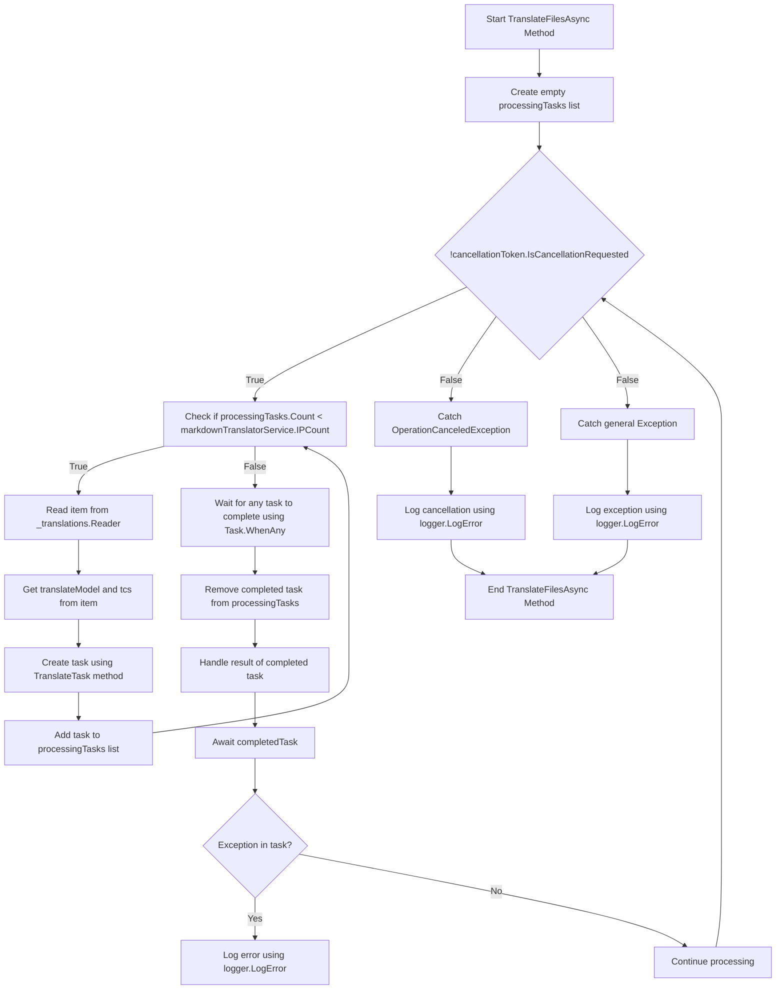

# Taustaa Käännökset Pt. 2

<datetime class="hidden">2024-08-23T19:52</datetime>

<!--category-- EasyNMT, ASP.NET -->
## Johdanto

Edellisessä viestissämme [täällä](/blog/backgroundtranslationspt1) Keskustelimme siitä, miten voimme käyttää EasyNMT:tä kääntämään `.md` tiedostot eri kielille. Keskustelimme myös siitä, miten voimme pintaa tämän toiminnon käyttäjälle lisäämällä pudotuslaskun markown-editoriin. Tässä viestissä keskustellaan siitä, miten voimme käyttää taustapalvelua käännöstehtävien hoitamiseen.

Katso sarjan ensimmäinen osa [täällä](/blog/backgroundtranslationspt1).

[TÄYTÄNTÖÖNPANO

## Dockerin asettelu

Ensimmäinen asia, mitä meidän täytyy tehdä, on perustaa kontti, joka pyörittää käännöspalveluamme. Me käytämme... `EasyNMT` Docker Hubissa saatavilla oleva dokkarikuva.

```yaml
  easynmt:
    image: easynmt/api:2.0.2-cpu
    volumes:
      - /mnt/easynmt:/cache/
    deploy:
      resources:
        limits:
          cpus: "4.0"
    networks:
      - app_network
```

Tässä olemme perustamassa palvelua nimeltä `easynmt` jossa käytetään `easynmt/api:2.0.2-cpu` kuva. Lisäämme myös äänenvoimakkuutta käännösvälimuistin tallentamiseen. Asetamme myös resurssirajat sen varmistamiseksi, että palvelu ei kuluta kaikkia isäntäkoneen resursseja (EasyNMT on hieman resurssihommaa).

## Taustapalvelu

Yksi asia on se, että EasyNMT voi joko hieman käynnistää ja/tai laskea satunnaisesti. Niin meidänkin [Taustapalvelu](https://github.com/scottgal/mostlylucidweb/blob/main/Mostlylucid/MarkdownTranslator/BackgroundTranslateService.cs) Meidän täytyy hoitaa tämä.

### Käynnistys

Palvelua aloitettaessa on tarkistettava, onko EasyNMT-palvelu käynnissä. Jos se ei ole, jäädytämme tulevan käsittelyn, kunnes se on. Meidän on myös hoidettava tapaus, jossa palvelu laskee (kuten se voi satunnaisesti).

```csharp
    private async Task<bool> StartupHealthCheck(CancellationToken cancellationToken)
    {
        var count = 1;
        var isUp = false;
        while (true)
        {
            if (await Ping(cancellationToken))
            {
                logger.LogInformation("Translation service is available");
                isUp = true;
                break;
            }

            await Task.Delay(10000, cancellationToken);
            count++;
            if (count > 3)
            {
                logger.LogError("Translation service is not available trying again (count: {Count})", count);
                _translations.Writer.Complete();
                await cancellationTokenSource.CancelAsync();
                isUp = false;
                break;
            }
        }

        return isUp;
    }

    private async Task PeriodicHealthCheck(CancellationToken cancellationToken)
    {
        // Run the health check periodically (e.g., every 60 seconds)
        const int delayMilliseconds = 60000;


        while (!cancellationToken.IsCancellationRequested)
        {
            try
            {
                if (!await Ping(cancellationToken))
                {
                    logger.LogError("Translation service is not available");
                    await cancellationTokenSource.CancelAsync();
                    _translations.Writer.Complete();
                    TranslationServiceUp = false;
                }
                else
                {
                    logger.LogInformation("Translation service is healthy");
                    TranslationServiceUp = true;
                }
            }
            catch (Exception ex)
            {
                TranslationServiceUp = false;
                logger.LogError(ex, "Error during service health check");
                await cancellationTokenSource.CancelAsync();
                _translations.Writer.Complete();
            }

            // Wait before checking again
            await Task.Delay(delayMilliseconds, cancellationToken);
        }
    }
    
        public async Task<bool> Ping(CancellationToken cancellationToken)
    {
        if (!await markdownTranslatorService.IsServiceUp(cancellationToken))
        {
            logger.LogError("Translation service is not available");
            return false;
        }

        return true;
    }

    
```

Tämä selittää lähinnä sen, että EasyNMT:ltä puuttuu terveystarkastuksen päätetapahtuma. Tarkistamme palvelun 60 sekunnin välein, onko se valmis. Jos se ei ole, perumme palvelun ja jäädytämme tulevan käsittelyn, kunnes se on.

```csharp
    private string[] IPs = translateServiceConfig.IPs;
    public async ValueTask<bool> IsServiceUp(CancellationToken cancellationToken)
    {
        var workingIPs = new List<string>();

        try
        {
            foreach (var ip in IPs)
            {
                logger.LogInformation("Checking service status at {IP}", ip);
                var response = await client.GetAsync($"{ip}/model_name", cancellationToken);
                if (response.IsSuccessStatusCode)
                {
                    workingIPs.Add(ip);
                }
            }

            IPs = workingIPs.ToArray();
            if (!IPs.Any()) return false;
            return true;
        }
        catch (Exception e)
        {
            logger.LogError(e, "Error checking service status");
            return false;
        }
    }
```

• • • • • • • • • • • • • • • • • • • • • • • • • • • • • • • • • • • • • • • • • • • • • • • • • • • • • • • • • • • • • • • • • • • • • • • • • • • • • • • • • • • • • • • • • • • • • • • • • • • • • • • • • • • • • • • • • • • • • • • • • • • • • • • • • • • • • • • • • • • • • • • • • • • • • • • • • • • • • • • • • • • • • • • • • • • • • • • • • • • • • • • • • • • • • • • • • • • • • `IsServiceUp` Metodilla pingamme kaikki saatavilla olevat EasyNMT-palvelut nähdäksemme, ovatko ne kiinni. Jos joku heistä on, palaamme `true` muuten palaamme `false`...................................................................................................................................... Päivitämme myös listan IP-palveluista niin, että mukana ovat vain ne, jotka ovat ylhäällä. Kotona minulla on muutama EasyNMT-palvelu käynnissä eri koneilla, joten siitä on hyötyä minulle (ja se tekee kääntämisestä hieman nopeampaa).

### API-päivitykset

API:ssä tarkistamme nyt, onko palvelu päällä, ennen kuin laukaisemme käännöspyynnön:

```csharp
    [HttpPost("start-translation")]
    [ValidateAntiForgeryToken]
    public async Task<Results<Ok<string>, BadRequest<string>>> StartTranslation([FromBody] MarkdownTranslationModel model)
    {
        if(!backgroundTranslateService.TranslationServiceUp)
        {
            return TypedResults.BadRequest("Translation service is down");
        }
        // Create a unique identifier for this translation task
        var taskId = Guid.NewGuid().ToString("N");
        var userId = Request.GetUserId(Response);
       
        // Trigger translation and store the associated task
        var translationTask = await backgroundTranslateService.Translate(model);
    
        var translateTask = new TranslateTask(taskId, model.Language, translationTask);
        translateCacheService.AddTask(userId, translateTask);

        // Return the task ID to the client
        return TypedResults.Ok(taskId);
    }
```

### Käännä menetelmä

Olemme nyt siirtyneet käyttämään `Channels` Meidän kääntää jono; se on vain parempi versio `BufferBlock` Käytimme aiemmin (parempaa suorituskykyä, vähemmän muistia jne.).

```csharp
    private readonly
        Channel<(PageTranslationModel, TaskCompletionSource<TaskCompletion>)>
        _translations = Channel.CreateUnbounded<(PageTranslationModel, TaskCompletionSource<TaskCompletion>)>();

    public async Task<Task<TaskCompletion>> Translate(MarkdownTranslationModel message)
    {
        // Create a TaskCompletionSource that will eventually hold the result of the translation
        var translateMessage = new PageTranslationModel
        {
            Language = message.Language,
            OriginalFileName = "",
            OriginalMarkdown = message.OriginalMarkdown,
            Persist = false
        };

        return await Translate(translateMessage);
    }

    private async Task<Task<TaskCompletion>> Translate(PageTranslationModel message)
    {
        // Create a TaskCompletionSource that will eventually hold the result of the translation
        var tcs = new TaskCompletionSource<TaskCompletion>();
        // Send the translation request along with the TaskCompletionSource to be processed
        await _translations.Writer.WriteAsync((message, tcs));
        return tcs.Task;
    }
```

Voit nähdä, että tämä käyttää `TaskCompletionSource` pitää kiinni käännöksen tuloksesta. Sen jälkeen lähetämme käännöspyynnön yhdessä `TaskCompletionSource` Käsiteltävä `await _translations.Writer.WriteAsync((message, tcs));` sitten palauttaa `TaskCompletion` tehtävä API-rajapinnalle, jolloin se voidaan piilottaa.

### Käännössilmukka

Tärkein "loop" sisällämme `IHostedService` vastaa mahdollisten käännöspyyntöjen käsittelystä. Kaavio on hieman pelottava, mutta ei se niin paha ole.

• • • • • • • • • • • • • • • • • • • • • • • • • • • • • • • • • • • • • • • • • • • • • • • • • • • • • • • • • • • • • • • • • • • • • • • • • • • • • • • • • • • • • • • • • • • • • • • • • • • • • • • • • • • • • • • • • • • • • • • • • • • • • • • • • • • • • • • • • • • • • • • • • • • • • • • • • • • • • • • • • • • • • • • • • • • • • • • • • • • • • • • • • • • • • • • • • • • • •



Käännösten sujuvoittamiseksi luomme silmukan, joka yrittää käsitellä vain yhtä monta käännöstä kerrallaan kuin EasyNMT-palvelut ovat käynnissä. Tällä pyritään estämään palvelun hukkuminen.

Jokaiselle näistä teemme uuden käännöstehtävän

```csharp
 TranslateTask(cancellationToken, translateModel, item, tcs);
```

Sitten käytämme `Task.WhenAny` odottaa, että kaikki tehtävät on hoidettu loppuun. Sen jälkeen poistamme loppuunmyydyn tehtävän listalta ja hoidamme suoritetun tehtävän tuloksen. Jos on olemassa poikkeus, kirjaamme sen ja jatkamme käsittelyä.

Sitten aloitamme silmukan uudelleen, kunnes palvelu on peruttu.

```csharp
    private async Task TranslateFilesAsync(CancellationToken cancellationToken)
    {
        try
        {
            var processingTasks = new List<Task>();
            while (!cancellationToken.IsCancellationRequested)
            {
                while (processingTasks.Count < markdownTranslatorService.IPCount &&
                       !cancellationToken.IsCancellationRequested)
                {
                    var item = await _translations.Reader.ReadAsync(cancellationToken);
                    var translateModel = item.Item1;
                    var tcs = item.Item2;
                    // Start the task and add it to the list
                    var task = TranslateTask(cancellationToken, translateModel, item, tcs);
                    processingTasks.Add(task);
                }

                // Wait for any of the tasks to complete
                var completedTask = await Task.WhenAny(processingTasks);

                // Remove the completed task
                processingTasks.Remove(completedTask);

                // Optionally handle the result of the completedTask here
                try
                {
                    await completedTask; // Catch exceptions if needed
                }
                catch (Exception ex)
                {
                    logger.LogError(ex, "Error translating markdown");
                }
            }
        }

        catch (OperationCanceledException)
        {
            logger.LogError("Translation service was cancelled");
        }
        catch (Exception e)
        {
            logger.LogError(e, "Error translating markdown");
        }
    }
```

### Jalostus

Tämän jalostuksen "lihaa" käsitellään `TranslateTask` joka on vastuussa markan kääntämisestä ja tarvittaessa sen jatkamisesta (käytän tätä tiedostojen kääntämiseen ja tulevaisuudessa kääntämieni artikkelien tallentamiseen takaisin DB:hen).

Tarkistan ensin, onko alkuperäinen merkintä muuttunut,joko käyttämällä alkuperäisen tiedoston sisällön hasista tai vain tarkistamalla päivitetyn blogikirjoituksen päivitetyn päivämäärän käännettyjä tietoja vastaan. Jos se ei ole muuttunut, jätän käännöksen väliin. Jos se on muuttunut, käännän maalin alas ja jatkan sitä tarvittaessa.

Sitten kutsun pääkäännös menetelmään `MarkdownTranslatorService` käännöstä varten.
Katso, miten teen tämän. [täällä](/blog/autotranslatingmarkdownfiles).
Tämä palauttaa käännetyn maaliviivan, jota jatkan tarvittaessa.
Sitten asetin `tcs` tulos käännettyyn maaliin ja aseta se täydelliseksi.

```csharp
private async Task TranslateTask(CancellationToken cancellationToken, PageTranslationModel translateModel,
        (PageTranslationModel, TaskCompletionSource<TaskCompletion>) item,
        TaskCompletionSource<TaskCompletion> tcs)
    {
        var scope = scopeFactory.CreateScope();

        var slug = Path.GetFileNameWithoutExtension(translateModel.OriginalFileName);
        if (translateModel.Persist)
        {
            if (await EntryChanged(scope, slug, translateModel))
            {
                logger.LogInformation("Entry {Slug} has changed, translating", slug);
            }
            else
            {
                logger.LogInformation("Entry {Slug} has not changed, skipping translation", slug);
                tcs.SetResult(new TaskCompletion(null, translateModel.Language, true, DateTime.Now));
                return;
            }
        }


        logger.LogInformation("Translating {File} to {Language}", translateModel.OriginalFileName,
            translateModel.Language);
        try
        {
            var translatedMarkdown =
                await markdownTranslatorService.TranslateMarkdown(translateModel.OriginalMarkdown,
                    translateModel.Language, cancellationToken);


            if (item.Item1.Persist)
            {
                await PersistTranslation(scope, slug, translateModel, translatedMarkdown);
            }

            tcs.SetResult(new TaskCompletion(translatedMarkdown, translateModel.Language, true, DateTime.Now));
        }
        catch (Exception e)
        {
            logger.LogError(e, "Error translating {File} to {Language}", translateModel.OriginalFileName,
                translateModel.Language);
            tcs.SetException(e);
        }
    }
```

## Johtopäätöksenä

Näin käsittelen taustakäännöksiä blogissani. Olen käyttänyt tätä noin kuukauden, ja se on toiminut hyvin. Vaikka se näyttää pelottavalta todellisuudessa, koodi on melko yksinkertainen. Toivottavasti tämä auttaa sinua omissa projekteissasi.