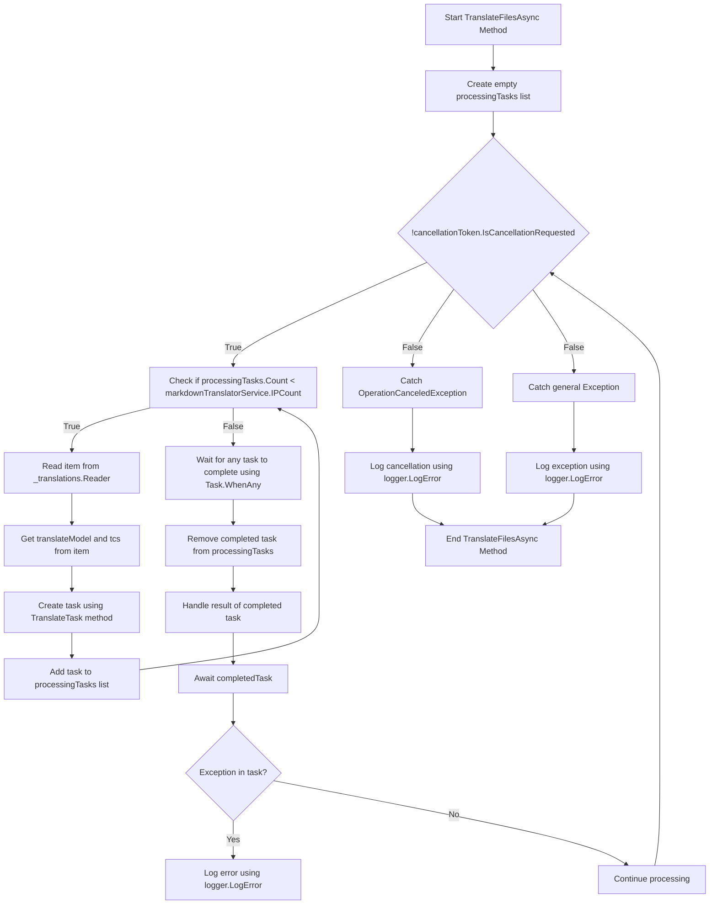

# Contexte Traductions Pt. 2

<datetime class="hidden">2024-08-23T19:52</datetime>

<!--category-- EasyNMT, ASP.NET -->
## Présentation

Dans notre post précédent [Ici.](/blog/backgroundtranslationspt1) nous avons discuté de la façon dont nous pouvons utiliser EasyNMT pour traduire notre `.md` fichiers dans différentes langues. Nous avons également discuté de la façon dont nous pouvons faire surface cette fonctionnalité à l'utilisateur en ajoutant un menu déroulant à l'éditeur de balisage. Dans ce post, nous allons discuter de la façon dont nous pouvons utiliser un service d'arrière-plan pour gérer les tâches de traduction.

[TOC]

## Configuration de Docker

La première chose que nous devons faire est de mettre en place un conteneur docker pour exécuter notre service de traduction. Nous utiliserons les `EasyNMT` l'image docker qui est disponible sur Docker Hub.

```yaml
  easynmt:
    image: easynmt/api:2.0.2-cpu
    volumes:
      - /mnt/easynmt:/cache/
    deploy:
      resources:
        limits:
          cpus: "4.0"
    networks:
      - app_network
```

Ici nous sommes en train de mettre en place un service appelé `easynmt` qui utilise les `easynmt/api:2.0.2-cpu` image. Nous montons également un volume pour stocker le cache de traduction. Nous fixons également des limites de ressources pour s'assurer que le service ne consomme pas toutes les ressources de la machine hôte (EasyNMT est un peu une ressource).

## Service d'information générale

Un problème est que EasyNMT peut soit prendre un peu pour démarrer et/ou descendre au hasard. Donc, dans notre [Service d'information générale](https://github.com/scottgal/mostlylucidweb/blob/main/Mostlylucid/MarkdownTranslator/BackgroundTranslateService.cs) On doit gérer ça.

### Démarrage

Lors du démarrage du service, nous devons vérifier si le service EasyNMT fonctionne. Si ce n'est pas nous gelons le traitement futur jusqu'à ce qu'il soit. Nous devons également traiter le cas où le service tombe en panne (comme il peut au hasard).

```csharp
    private async Task<bool> StartupHealthCheck(CancellationToken cancellationToken)
    {
        var count = 1;
        var isUp = false;
        while (true)
        {
            if (await Ping(cancellationToken))
            {
                logger.LogInformation("Translation service is available");
                isUp = true;
                break;
            }

            await Task.Delay(10000, cancellationToken);
            count++;
            if (count > 3)
            {
                logger.LogError("Translation service is not available trying again (count: {Count})", count);
                _translations.Writer.Complete();
                await cancellationTokenSource.CancelAsync();
                isUp = false;
                break;
            }
        }

        return isUp;
    }

    private async Task PeriodicHealthCheck(CancellationToken cancellationToken)
    {
        // Run the health check periodically (e.g., every 60 seconds)
        const int delayMilliseconds = 60000;


        while (!cancellationToken.IsCancellationRequested)
        {
            try
            {
                if (!await Ping(cancellationToken))
                {
                    logger.LogError("Translation service is not available");
                    await cancellationTokenSource.CancelAsync();
                    _translations.Writer.Complete();
                    TranslationServiceUp = false;
                }
                else
                {
                    logger.LogInformation("Translation service is healthy");
                    TranslationServiceUp = true;
                }
            }
            catch (Exception ex)
            {
                TranslationServiceUp = false;
                logger.LogError(ex, "Error during service health check");
                await cancellationTokenSource.CancelAsync();
                _translations.Writer.Complete();
            }

            // Wait before checking again
            await Task.Delay(delayMilliseconds, cancellationToken);
        }
    }
    
        public async Task<bool> Ping(CancellationToken cancellationToken)
    {
        if (!await markdownTranslatorService.IsServiceUp(cancellationToken))
        {
            logger.LogError("Translation service is not available");
            return false;
        }

        return true;
    }

    
```

Cela explique principalement l'absence d'un critère de contrôle de santé pour EasyNMT. On fait le service toutes les 60 secondes pour voir si c'est fini. Si ce n'est pas nous annuler le service et geler le traitement futur jusqu'à ce qu'il soit.

```csharp
    private string[] IPs = translateServiceConfig.IPs;
    public async ValueTask<bool> IsServiceUp(CancellationToken cancellationToken)
    {
        var workingIPs = new List<string>();

        try
        {
            foreach (var ip in IPs)
            {
                logger.LogInformation("Checking service status at {IP}", ip);
                var response = await client.GetAsync($"{ip}/model_name", cancellationToken);
                if (response.IsSuccessStatusCode)
                {
                    workingIPs.Add(ip);
                }
            }

            IPs = workingIPs.ToArray();
            if (!IPs.Any()) return false;
            return true;
        }
        catch (Exception e)
        {
            logger.LogError(e, "Error checking service status");
            return false;
        }
    }
```

Dans le `IsServiceUp` méthode nous ping tous les services EasyNMT disponibles pour voir s'ils sont en place. Si l'un d'eux est revenu `true` Sinon nous revenons `false`C'est ce que j'ai dit. Nous mettons également à jour la liste des IP de service pour inclure seulement ceux qui sont en place. À la maison, j'ai quelques services EasyNMT fonctionnant sur différentes machines donc c'est utile pour moi (et rend la traduction un peu plus rapide).

### Mises à jour de l'API

Dans l'API, nous vérifions maintenant que le service est en place avant de lancer une demande de traduction:

```csharp
    [HttpPost("start-translation")]
    [ValidateAntiForgeryToken]
    public async Task<Results<Ok<string>, BadRequest<string>>> StartTranslation([FromBody] MarkdownTranslationModel model)
    {
        if(backgroundTranslateService.TranslationServiceUp)
        {
            return TypedResults.BadRequest("Translation service is down");
        }
        // Create a unique identifier for this translation task
        var taskId = Guid.NewGuid().ToString("N");
        var userId = Request.GetUserId(Response);
       
        // Trigger translation and store the associated task
        var translationTask = await backgroundTranslateService.Translate(model);
    
        var translateTask = new TranslateTask(taskId, model.Language, translationTask);
        translateCacheService.AddTask(userId, translateTask);

        // Return the task ID to the client
        return TypedResults.Ok(taskId);
    }
```

### Méthode de traduction

Nous sommes maintenant passés à l'utilisation `Channels` pour notre file d'attente de traduction; c'est juste une meilleure version de la `BufferBlock` nous avons utilisé précédemment (meilleure performance, moins de mémoire, etc.).

```csharp
    private readonly
        Channel<(PageTranslationModel, TaskCompletionSource<TaskCompletion>)>
        _translations = Channel.CreateUnbounded<(PageTranslationModel, TaskCompletionSource<TaskCompletion>)>();

    public async Task<Task<TaskCompletion>> Translate(MarkdownTranslationModel message)
    {
        // Create a TaskCompletionSource that will eventually hold the result of the translation
        var translateMessage = new PageTranslationModel
        {
            Language = message.Language,
            OriginalFileName = "",
            OriginalMarkdown = message.OriginalMarkdown,
            Persist = false
        };

        return await Translate(translateMessage);
    }

    private async Task<Task<TaskCompletion>> Translate(PageTranslationModel message)
    {
        // Create a TaskCompletionSource that will eventually hold the result of the translation
        var tcs = new TaskCompletionSource<TaskCompletion>();
        // Send the translation request along with the TaskCompletionSource to be processed
        await _translations.Writer.WriteAsync((message, tcs));
        return tcs.Task;
    }
```

Vous pouvez voir que cela utilise un `TaskCompletionSource` de conserver le résultat de la traduction. Nous envoyons ensuite la demande de traduction avec la `TaskCompletionSource` à traiter avec `await _translations.Writer.WriteAsync((message, tcs));` puis retourner le `TaskCompletion` tâche à l'API lui permettant d'être mis en cache.

### Boucle de traduction

La principale « boucle » à l'intérieur de notre `IHostedService` est responsable du traitement des demandes de traduction qui arrivent. Le diagramme est un peu effrayant, mais ce n'est pas si mauvais.

Dans le



Afin de rationaliser les traductions, nous créons une boucle qui tente seulement de traiter autant de traductions à la fois que nous avons des services EasyNMT en cours d'exécution. C'est pour éviter que le service ne soit submergé.

Pour chacun d'entre eux, nous faisons ensuite tourner une nouvelle tâche de traduction

```csharp
 TranslateTask(cancellationToken, translateModel, item, tcs);
```

Nous utilisons alors `Task.WhenAny` d'attendre que l'une des tâches soit accomplie. Nous supprimons ensuite la tâche terminée de la liste et nous traitons le résultat de la tâche terminée. S'il y a une exception, nous l'enregistreons et nous poursuivons le traitement.

Ensuite, nous recommençons la boucle jusqu'à ce que le service soit annulé.

```csharp
    private async Task TranslateFilesAsync(CancellationToken cancellationToken)
    {
        try
        {
            var processingTasks = new List<Task>();
            while (!cancellationToken.IsCancellationRequested)
            {
                while (processingTasks.Count < markdownTranslatorService.IPCount &&
                       !cancellationToken.IsCancellationRequested)
                {
                    var item = await _translations.Reader.ReadAsync(cancellationToken);
                    var translateModel = item.Item1;
                    var tcs = item.Item2;
                    // Start the task and add it to the list
                    var task = TranslateTask(cancellationToken, translateModel, item, tcs);
                    processingTasks.Add(task);
                }

                // Wait for any of the tasks to complete
                var completedTask = await Task.WhenAny(processingTasks);

                // Remove the completed task
                processingTasks.Remove(completedTask);

                // Optionally handle the result of the completedTask here
                try
                {
                    await completedTask; // Catch exceptions if needed
                }
                catch (Exception ex)
                {
                    logger.LogError(ex, "Error translating markdown");
                }
            }
        }

        catch (OperationCanceledException)
        {
            logger.LogError("Translation service was cancelled");
        }
        catch (Exception e)
        {
            logger.LogError(e, "Error translating markdown");
        }
    }
```

### Traitement

La «viande» de cette transformation est traitée en `TranslateTask` qui est responsable de la traduction du balisage et de la persistance si nécessaire (j'utilise cela pour traduire les fichiers et à l'avenir pour sauvegarder les articles traduits de retour à la DB).

Je vérifie d'abord si l'entrée originale a changé; soit en utilisant un hash de fichier du contenu du fichier original / juste en vérifiant la Date de mise à jour de l'entrée du blog par rapport à ceux traduits. Si ça n'a pas changé, je saute la traduction. Si elle a changé, je traduis le balisage et je le maintiens si nécessaire.

J'appelle ensuite à la méthode principale Traduire de la `MarkdownTranslatorService` pour faire la traduction.
Voyez comment je fais ça. [Ici.](/blog/autotranslatingmarkdownfiles).
Cela renvoie le balisage traduit que je persiste ensuite si nécessaire.
J'ai ensuite mis le `tcs` résultat au balisage traduit et le définir comme complet.

```csharp
private async Task TranslateTask(CancellationToken cancellationToken, PageTranslationModel translateModel,
        (PageTranslationModel, TaskCompletionSource<TaskCompletion>) item,
        TaskCompletionSource<TaskCompletion> tcs)
    {
        var scope = scopeFactory.CreateScope();

        var slug = Path.GetFileNameWithoutExtension(translateModel.OriginalFileName);
        if (translateModel.Persist)
        {
            if (await EntryChanged(scope, slug, translateModel))
            {
                logger.LogInformation("Entry {Slug} has changed, translating", slug);
            }
            else
            {
                logger.LogInformation("Entry {Slug} has not changed, skipping translation", slug);
                tcs.SetResult(new TaskCompletion(null, translateModel.Language, true, DateTime.Now));
                return;
            }
        }


        logger.LogInformation("Translating {File} to {Language}", translateModel.OriginalFileName,
            translateModel.Language);
        try
        {
            var translatedMarkdown =
                await markdownTranslatorService.TranslateMarkdown(translateModel.OriginalMarkdown,
                    translateModel.Language, cancellationToken);


            if (item.Item1.Persist)
            {
                await PersistTranslation(scope, slug, translateModel, translatedMarkdown);
            }

            tcs.SetResult(new TaskCompletion(translatedMarkdown, translateModel.Language, true, DateTime.Now));
        }
        catch (Exception e)
        {
            logger.LogError(e, "Error translating {File} to {Language}", translateModel.OriginalFileName,
                translateModel.Language);
            tcs.SetException(e);
        }
    }
```

## En conclusion

Donc c'est tout, c'est comme ça que je gère les traductions de fond dans mon blog. J'utilise ça depuis un mois et ça marche bien. Bien qu'il semble intimidant en réalité le code est assez simple. J'espère que cela vous aidera dans vos propres projets.