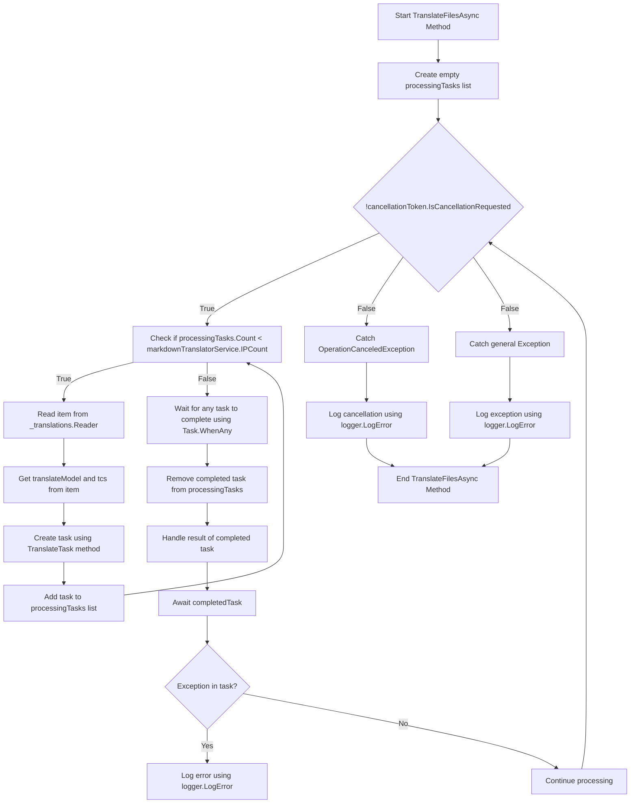

# पृष्ठभूमि अनुवाद Pt. 2

<datetime class="hidden">2024- 2323टी: 52</datetime>

<!--category-- EasyNMT, ASP.NET -->
## परिचय

हमारे पिछले पोस्ट में [यहाँ](/blog/backgroundtranslationspt1) हमने चर्चा की कि हम अपने अनुवाद के लिए आसान - सेएनएमई इस्तेमाल कैसे कर सकते हैं `.md` फ़ाइल को भिन्न भाषाएँ में. हमने यह भी चर्चा की कि कैसे हम इस कार्य को उपयोक्ता के सामने डाल सकते हैं ताकि निशान के संपादक को नीचे दबा सकें । इस पोस्ट में हम चर्चा करेंगे कि कैसे हम अनुवाद कार्य को नियंत्रित करने के लिए एक पृष्ठभूमि सेवा का उपयोग कर सकते हैं।

इस श्रृंखला का पहला भाग देखिए [यहाँ](/blog/backgroundtranslationspt1).

[विषय

## डॉकर सेटअप

पहली बात जो हमें करने की ज़रूरत है वह है, अपनी अनुवाद सेवा शुरू करना । हम उपयोग करेंगे `EasyNMT` डॉकer हब में उपलब्ध है जो छवि उपलब्ध है.

```yaml
  easynmt:
    image: easynmt/api:2.0.2-cpu
    volumes:
      - /mnt/easynmt:/cache/
    deploy:
      resources:
        limits:
          cpus: "4.0"
    networks:
      - app_network
```

यहाँ हम एक सेवा शुरू कर रहे हैं `easynmt` जो उपयोग में आता है `easynmt/api:2.0.2-cpu` छवि. हम अनुवाद कैश बनाने के लिए एक खंड को भी बढ़ा रहे हैं । हम भी सुनिश्चित करने के लिए संसाधन सीमा स्थापित कर रहे हैं कि सेवा होस्ट मशीन पर सभी संसाधनों को भस्म नहीं कर रही है (जैसे कि सरल संसाधन होग का एक बिट है)।

## पृष्ठभूमि सेवा

एक मुद्दा यह है कि आसान सीनेटएमटी या तो कुछ ले सकते हैं शुरू और / या तो बेतरतीब नीचे जाना. तो हमारे में [पृष्ठभूमि सेवा](https://github.com/scottgal/mostlylucidweb/blob/main/Mostlylucid/MarkdownTranslator/BackgroundTranslateService.cs) हम इसे संभाल की जरूरत है.

### प्रारंभ

सेवा शुरू करने के लिए हमें जांच करने की जरूरत है अगर आसानNMT सेवा चल रहा है. अगर यह हम भविष्य प्रक्रिया नहीं है जब तक यह नहीं है. हमें इस मामले को भी सँभालने की ज़रूरत है जहाँ सेवा जाती है (जैसे यह बेतरतीब हो सकता है) ।

```csharp
    private async Task<bool> StartupHealthCheck(CancellationToken cancellationToken)
    {
        var count = 1;
        var isUp = false;
        while (true)
        {
            if (await Ping(cancellationToken))
            {
                logger.LogInformation("Translation service is available");
                isUp = true;
                break;
            }

            await Task.Delay(10000, cancellationToken);
            count++;
            if (count > 3)
            {
                logger.LogError("Translation service is not available trying again (count: {Count})", count);
                _translations.Writer.Complete();
                await cancellationTokenSource.CancelAsync();
                isUp = false;
                break;
            }
        }

        return isUp;
    }

    private async Task PeriodicHealthCheck(CancellationToken cancellationToken)
    {
        // Run the health check periodically (e.g., every 60 seconds)
        const int delayMilliseconds = 60000;


        while (!cancellationToken.IsCancellationRequested)
        {
            try
            {
                if (!await Ping(cancellationToken))
                {
                    logger.LogError("Translation service is not available");
                    await cancellationTokenSource.CancelAsync();
                    _translations.Writer.Complete();
                    TranslationServiceUp = false;
                }
                else
                {
                    logger.LogInformation("Translation service is healthy");
                    TranslationServiceUp = true;
                }
            }
            catch (Exception ex)
            {
                TranslationServiceUp = false;
                logger.LogError(ex, "Error during service health check");
                await cancellationTokenSource.CancelAsync();
                _translations.Writer.Complete();
            }

            // Wait before checking again
            await Task.Delay(delayMilliseconds, cancellationToken);
        }
    }
    
        public async Task<bool> Ping(CancellationToken cancellationToken)
    {
        if (!await markdownTranslatorService.IsServiceUp(cancellationToken))
        {
            logger.LogError("Translation service is not available");
            return false;
        }

        return true;
    }

    
```

यह ज़्यादातर स्वास्थ्य जाँच - बिन्दु की कमी के लिए खाता है । हम हर 60 सेकंड में सेवा करते हैं अगर यह ऊपर है देखने के लिए। अगर यह हम सेवा रद्द नहीं कर रहे हैं और भविष्य प्रक्रिया जब तक यह नहीं है.

```csharp
    private string[] IPs = translateServiceConfig.IPs;
    public async ValueTask<bool> IsServiceUp(CancellationToken cancellationToken)
    {
        var workingIPs = new List<string>();

        try
        {
            foreach (var ip in IPs)
            {
                logger.LogInformation("Checking service status at {IP}", ip);
                var response = await client.GetAsync($"{ip}/model_name", cancellationToken);
                if (response.IsSuccessStatusCode)
                {
                    workingIPs.Add(ip);
                }
            }

            IPs = workingIPs.ToArray();
            if (!IPs.Any()) return false;
            return true;
        }
        catch (Exception e)
        {
            logger.LogError(e, "Error checking service status");
            return false;
        }
    }
```

में `IsServiceUp` हम सभी उपलब्ध आसानMMMT सेवाओं को भेजने के लिए विधि कि वे कर रहे हैं या नहीं. और हम सबके सब बा साज़ों सामान हैं `true` वरना हम वापस आते हैं `false`___ हम सेवा के आईपीस की सूची को भी अद्यतन करते हैं जो कि ऊपर दिए गए हैं. मेरे पास कुछ आसान - सी सुविधा की सेवाएँ हैं जो अलग - अलग मशीनों पर चल रही हैं ताकि यह मेरे लिए उपयोगी हो (और अनुवाद को थोड़ा तेज़ करता है) ।

### एपीआई अद्यतन

और एपीआई में अब हम सेवा के लिए जाँच कर रहे हैं एक अनुवाद निवेदन बंद करने से पहले:

```csharp
    [HttpPost("start-translation")]
    [ValidateAntiForgeryToken]
    public async Task<Results<Ok<string>, BadRequest<string>>> StartTranslation([FromBody] MarkdownTranslationModel model)
    {
        if(!backgroundTranslateService.TranslationServiceUp)
        {
            return TypedResults.BadRequest("Translation service is down");
        }
        // Create a unique identifier for this translation task
        var taskId = Guid.NewGuid().ToString("N");
        var userId = Request.GetUserId(Response);
       
        // Trigger translation and store the associated task
        var translationTask = await backgroundTranslateService.Translate(model);
    
        var translateTask = new TranslateTask(taskId, model.Language, translationTask);
        translateCacheService.AddTask(userId, translateTask);

        // Return the task ID to the client
        return TypedResults.Ok(taskId);
    }
```

### अनुवाद विधि

अब हम उपयोग करने के लिए स्विच कर दिया है `Channels` हमारे अनुवाद कतार के लिए, यह सिर्फ एक बेहतर संस्करण है `BufferBlock` हम पहले प्रयोग किया (उत्तम प्रदर्शन, कम मेमोरी).

```csharp
    private readonly
        Channel<(PageTranslationModel, TaskCompletionSource<TaskCompletion>)>
        _translations = Channel.CreateUnbounded<(PageTranslationModel, TaskCompletionSource<TaskCompletion>)>();

    public async Task<Task<TaskCompletion>> Translate(MarkdownTranslationModel message)
    {
        // Create a TaskCompletionSource that will eventually hold the result of the translation
        var translateMessage = new PageTranslationModel
        {
            Language = message.Language,
            OriginalFileName = "",
            OriginalMarkdown = message.OriginalMarkdown,
            Persist = false
        };

        return await Translate(translateMessage);
    }

    private async Task<Task<TaskCompletion>> Translate(PageTranslationModel message)
    {
        // Create a TaskCompletionSource that will eventually hold the result of the translation
        var tcs = new TaskCompletionSource<TaskCompletion>();
        // Send the translation request along with the TaskCompletionSource to be processed
        await _translations.Writer.WriteAsync((message, tcs));
        return tcs.Task;
    }
```

आप देख सकते हैं कि यह एक उपयोग करता है `TaskCompletionSource` अनुवाद के परिणाम को थामे रहने के लिए. फिर हम अनुवाद की गुज़ारिश के साथ भेजें `TaskCompletionSource` के साथ प्रोसेस किया जाना चाहिए `await _translations.Writer.WriteAsync((message, tcs));` फिर लौट कर लौटता है; `TaskCompletion` वस्तुओं को कैश करने की अनुमति देने के लिए कार्य.

### अनुवाद लूप

मुख्य 'लोप' हमारे अंदर `IHostedService` किसी भी अनुवाद निवेदन को रद्द करने के लिए ज़िम्मेदार है जो अंदर आता है । आरेख एक छोटे से डरावना है लेकिन यह बुरा नहीं है.

में



स्ट्रीमलाइन अनुवाद करने के लिए हम एक लूप तैयार करते हैं जो एक समय में केवल कई अनुवादों की कोशिश करता है जब हमारे पास आसानNMT सेवाओं चल रहा है. ऐसा करने से हम अपनी सेवा को टूटने से रोक पाएँगे ।

इनमें से हरेक के लिए हम फिर एक नया अनुवाद कार्य शुरू करते हैं

```csharp
 TranslateTask(cancellationToken, translateModel, item, tcs);
```

तब हम उपयोग करते हैं `Task.WhenAny` किसी कार्य के लिए इंतजार करें समाप्त करने के लिए. फिर हम पूरे कार्य को सूची में से मिटा देते हैं और पूर्ण कार्य के परिणाम को संभालते हैं. अगर कोई अपवाद है हम इसे लॉग और प्रक्रिया जारी रखें.

तो हम फिर लूप शुरू जब तक सेवा रद्द हो जाता है।

```csharp
    private async Task TranslateFilesAsync(CancellationToken cancellationToken)
    {
        try
        {
            var processingTasks = new List<Task>();
            while (!cancellationToken.IsCancellationRequested)
            {
                while (processingTasks.Count < markdownTranslatorService.IPCount &&
                       !cancellationToken.IsCancellationRequested)
                {
                    var item = await _translations.Reader.ReadAsync(cancellationToken);
                    var translateModel = item.Item1;
                    var tcs = item.Item2;
                    // Start the task and add it to the list
                    var task = TranslateTask(cancellationToken, translateModel, item, tcs);
                    processingTasks.Add(task);
                }

                // Wait for any of the tasks to complete
                var completedTask = await Task.WhenAny(processingTasks);

                // Remove the completed task
                processingTasks.Remove(completedTask);

                // Optionally handle the result of the completedTask here
                try
                {
                    await completedTask; // Catch exceptions if needed
                }
                catch (Exception ex)
                {
                    logger.LogError(ex, "Error translating markdown");
                }
            }
        }

        catch (OperationCanceledException)
        {
            logger.LogError("Translation service was cancelled");
        }
        catch (Exception e)
        {
            logger.LogError(e, "Error translating markdown");
        }
    }
```

### प्रक्रमित कर रहा है

इस प्रक्रिया का 'घुट' नियंत्रित किया गया है `TranslateTask` जो इस निशान का अनुवाद करने और उसे बनाए रखने के लिए ज़िम्मेदार है यदि आवश्यक है (मैं इसका इस्तेमाल फ़ाइलों का अनुवाद करने के लिए और डीबी में वापस अनुवादित लेखों को सहेजने के लिए भविष्य में करता हूँ.

मैं पहली बार जाँचें कि क्या मूल प्रविष्टि बदल गई है, मूल फ़ाइल की सामग्री का उपयोग कर देखें / सिर्फ अनुवाद किए गए ब्लॉग प्रविष्टि के अद्यतन की जाँच करें. यह नहीं बदला है तो मैं अनुवाद छोड़ दिया है. यदि यह बदल गया है तो मैं चिह्न नीचे का अनुवाद करता हूं और ज़रूरत पड़ने पर उसे बनाए रखता हूं.

मैं तो मुख्य अनुवाद विधि में फोन `MarkdownTranslatorService` अनुवाद करने के लिए.
देखें कि कैसे मैं यह करता हूँ [यहाँ](/blog/autotranslatingmarkdownfiles).
यह अनुवादित चिह्न नीचे लौटाता है जो मैं तब स्थिर रहता हूँ जब आवश्यक हो.
मैं फिर सेट `tcs` इसका परिणाम यह हुआ कि जिस अंक में दिखाया गया है उसका अंत हो गया है ।

```csharp
private async Task TranslateTask(CancellationToken cancellationToken, PageTranslationModel translateModel,
        (PageTranslationModel, TaskCompletionSource<TaskCompletion>) item,
        TaskCompletionSource<TaskCompletion> tcs)
    {
        var scope = scopeFactory.CreateScope();

        var slug = Path.GetFileNameWithoutExtension(translateModel.OriginalFileName);
        if (translateModel.Persist)
        {
            if (await EntryChanged(scope, slug, translateModel))
            {
                logger.LogInformation("Entry {Slug} has changed, translating", slug);
            }
            else
            {
                logger.LogInformation("Entry {Slug} has not changed, skipping translation", slug);
                tcs.SetResult(new TaskCompletion(null, translateModel.Language, true, DateTime.Now));
                return;
            }
        }


        logger.LogInformation("Translating {File} to {Language}", translateModel.OriginalFileName,
            translateModel.Language);
        try
        {
            var translatedMarkdown =
                await markdownTranslatorService.TranslateMarkdown(translateModel.OriginalMarkdown,
                    translateModel.Language, cancellationToken);


            if (item.Item1.Persist)
            {
                await PersistTranslation(scope, slug, translateModel, translatedMarkdown);
            }

            tcs.SetResult(new TaskCompletion(translatedMarkdown, translateModel.Language, true, DateTime.Now));
        }
        catch (Exception e)
        {
            logger.LogError(e, "Error translating {File} to {Language}", translateModel.OriginalFileName,
                translateModel.Language);
            tcs.SetException(e);
        }
    }
```

## ऑन्टियम

तो यह है कि, इस तरह मैं अपने ब्लॉग में पृष्ठभूमि अनुवाद संभालता हूँ. मैं एक महीने के लिए इस का उपयोग किया गया है या अब और यह अच्छी तरह से काम कर रहा है. जबकि यह वास्तव में कठिन लग रहा है कोड बहुत सीधा है. मुझे आशा है कि यह आप अपने ही परियोजनाओं में मदद करता है.