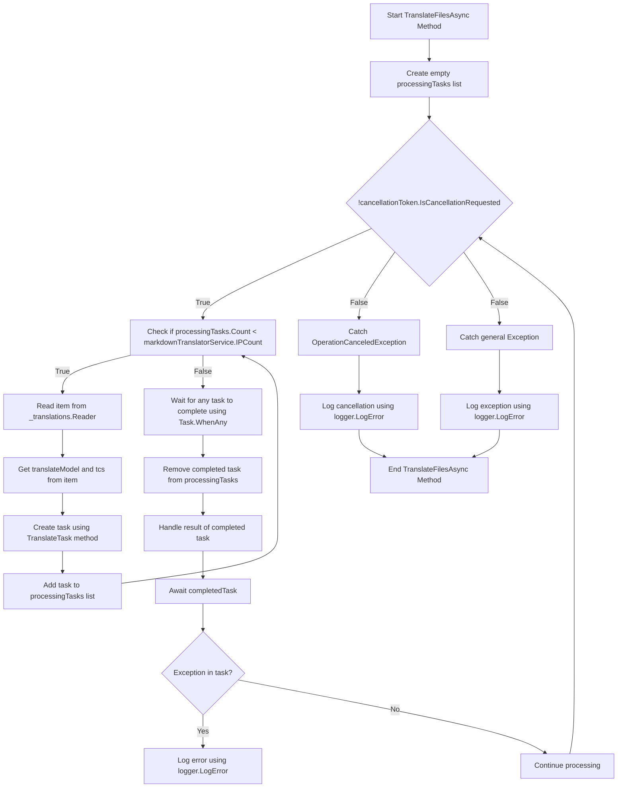

# Traduzioni di sfondo Pt. 2

<datetime class="hidden">2024-08-23T19:52</datetime>

<!--category-- EasyNMT, ASP.NET -->
## Introduzione

Nel nostro post precedente [qui](/blog/backgroundtranslationspt1) abbiamo discusso come possiamo usare EasyNMT per tradurre il nostro `.md` file in diverse lingue. Abbiamo anche discusso come possiamo far emergere questa funzionalità all'utente aggiungendo un menu a discesa all'editor markdown. In questo post discuteremo come possiamo utilizzare un servizio di background per gestire le attività di traduzione.

[TOC]

## Configurazione docker

La prima cosa che dobbiamo fare è impostare un contenitore docker per eseguire il nostro servizio di traduzione. Useremo il `EasyNMT` immagine docker disponibile su Docker Hub.

```yaml
  easynmt:
    image: easynmt/api:2.0.2-cpu
    volumes:
      - /mnt/easynmt:/cache/
    deploy:
      resources:
        limits:
          cpus: "4.0"
    networks:
      - app_network
```

Qui stiamo creando un servizio chiamato `easynmt` che utilizza il `easynmt/api:2.0.2-cpu` immagine. Stiamo anche montando un volume per memorizzare la cache di traduzione. Stiamo anche impostando limiti di risorse per garantire che il servizio non consumi tutte le risorse sulla macchina host (EasyNMT è un po 'di un maiale risorsa).

## Servizio di background

Un problema è che EasyNMT può prendere un po 'per avviare e / o scendere casualmente. Così nel nostro [Servizio di background](https://github.com/scottgal/mostlylucidweb/blob/main/Mostlylucid/MarkdownTranslator/BackgroundTranslateService.cs) Dobbiamo occuparcene.

### Avvio

Quando si avvia il servizio dobbiamo verificare se il servizio EasyNMT è in esecuzione. Se non si tratta di congelare l'elaborazione futura fino a quando non lo è. Abbiamo anche bisogno di gestire il caso in cui il servizio va giù (come può casualmente).

```csharp
    private async Task<bool> StartupHealthCheck(CancellationToken cancellationToken)
    {
        var count = 1;
        var isUp = false;
        while (true)
        {
            if (await Ping(cancellationToken))
            {
                logger.LogInformation("Translation service is available");
                isUp = true;
                break;
            }

            await Task.Delay(10000, cancellationToken);
            count++;
            if (count > 3)
            {
                logger.LogError("Translation service is not available trying again (count: {Count})", count);
                _translations.Writer.Complete();
                await cancellationTokenSource.CancelAsync();
                isUp = false;
                break;
            }
        }

        return isUp;
    }

    private async Task PeriodicHealthCheck(CancellationToken cancellationToken)
    {
        // Run the health check periodically (e.g., every 60 seconds)
        const int delayMilliseconds = 60000;


        while (!cancellationToken.IsCancellationRequested)
        {
            try
            {
                if (!await Ping(cancellationToken))
                {
                    logger.LogError("Translation service is not available");
                    await cancellationTokenSource.CancelAsync();
                    _translations.Writer.Complete();
                    TranslationServiceUp = false;
                }
                else
                {
                    logger.LogInformation("Translation service is healthy");
                    TranslationServiceUp = true;
                }
            }
            catch (Exception ex)
            {
                TranslationServiceUp = false;
                logger.LogError(ex, "Error during service health check");
                await cancellationTokenSource.CancelAsync();
                _translations.Writer.Complete();
            }

            // Wait before checking again
            await Task.Delay(delayMilliseconds, cancellationToken);
        }
    }
    
        public async Task<bool> Ping(CancellationToken cancellationToken)
    {
        if (!await markdownTranslatorService.IsServiceUp(cancellationToken))
        {
            logger.LogError("Translation service is not available");
            return false;
        }

        return true;
    }

    
```

Questo rappresenta per lo più la mancanza di EasyNMT di un endpoint di controllo dello stato di salute. Piniamo il servizio ogni 60 secondi per vedere se e' attivo. Se non si tratta di annullare il servizio e congelare l'elaborazione futura fino a quando non lo è.

```csharp
    private string[] IPs = translateServiceConfig.IPs;
    public async ValueTask<bool> IsServiceUp(CancellationToken cancellationToken)
    {
        var workingIPs = new List<string>();

        try
        {
            foreach (var ip in IPs)
            {
                logger.LogInformation("Checking service status at {IP}", ip);
                var response = await client.GetAsync($"{ip}/model_name", cancellationToken);
                if (response.IsSuccessStatusCode)
                {
                    workingIPs.Add(ip);
                }
            }

            IPs = workingIPs.ToArray();
            if (!IPs.Any()) return false;
            return true;
        }
        catch (Exception e)
        {
            logger.LogError(e, "Error checking service status");
            return false;
        }
    }
```

Nella `IsServiceUp` metodo noi ping tutti i servizi EasyNMT disponibili per vedere se sono in su. Se uno di loro è tornato `true` altrimenti torneremo `false`. Aggiorna anche l'elenco degli IP di servizio per includere solo quelli che sono in su. A casa ho alcuni servizi EasyNMT in esecuzione su macchine diverse quindi questo è utile per me (e rende la traduzione un po 'più veloce).

### Aggiornamenti API

Nell'API controlliamo se il servizio è attivo prima di avviare una richiesta di traduzione:

```csharp
    [HttpPost("start-translation")]
    [ValidateAntiForgeryToken]
    public async Task<Results<Ok<string>, BadRequest<string>>> StartTranslation([FromBody] MarkdownTranslationModel model)
    {
        if(backgroundTranslateService.TranslationServiceUp)
        {
            return TypedResults.BadRequest("Translation service is down");
        }
        // Create a unique identifier for this translation task
        var taskId = Guid.NewGuid().ToString("N");
        var userId = Request.GetUserId(Response);
       
        // Trigger translation and store the associated task
        var translationTask = await backgroundTranslateService.Translate(model);
    
        var translateTask = new TranslateTask(taskId, model.Language, translationTask);
        translateCacheService.AddTask(userId, translateTask);

        // Return the task ID to the client
        return TypedResults.Ok(taskId);
    }
```

### Metodo di traduzione

Ora siamo passati all'uso `Channels` per la nostra coda di traduzione; è solo una versione migliore del `BufferBlock` abbiamo usato in precedenza (migliori prestazioni, meno memoria, ecc).

```csharp
    private readonly
        Channel<(PageTranslationModel, TaskCompletionSource<TaskCompletion>)>
        _translations = Channel.CreateUnbounded<(PageTranslationModel, TaskCompletionSource<TaskCompletion>)>();

    public async Task<Task<TaskCompletion>> Translate(MarkdownTranslationModel message)
    {
        // Create a TaskCompletionSource that will eventually hold the result of the translation
        var translateMessage = new PageTranslationModel
        {
            Language = message.Language,
            OriginalFileName = "",
            OriginalMarkdown = message.OriginalMarkdown,
            Persist = false
        };

        return await Translate(translateMessage);
    }

    private async Task<Task<TaskCompletion>> Translate(PageTranslationModel message)
    {
        // Create a TaskCompletionSource that will eventually hold the result of the translation
        var tcs = new TaskCompletionSource<TaskCompletion>();
        // Send the translation request along with the TaskCompletionSource to be processed
        await _translations.Writer.WriteAsync((message, tcs));
        return tcs.Task;
    }
```

Potete vedere che questo usa un `TaskCompletionSource` per mantenere il risultato della traduzione. Inviiamo poi la richiesta di traduzione insieme con la `TaskCompletionSource` da trattare con `await _translations.Writer.WriteAsync((message, tcs));` poi restituisci il `TaskCompletion` attività per l'API che consente di essere cached.

### Ciclo di traduzione

Il principale 'loop' all'interno del nostro `IHostedService` è responsabile dell'elaborazione di eventuali richieste di traduzione. Il diagramma è un po' spaventoso, ma non è poi così male.

Nella



Al fine di semplificare le traduzioni creiamo un loop che cerca solo di elaborare tante traduzioni alla volta come abbiamo servizi EasyNMT in esecuzione. Questo per evitare che il servizio venga sopraffatto.

Per ognuno di questi facciamo girare un nuovo compito di traduzione

```csharp
 TranslateTask(cancellationToken, translateModel, item, tcs);
```

Poi usiamo `Task.WhenAny` attendere che uno qualsiasi dei compiti da completare. Poi rimuoviamo l'attività completata dall'elenco e gestiamo il risultato dell'attività completata. Se c'è un'eccezione lo registriamo e continuiamo l'elaborazione.

Poi ricominceremo il loop fino a quando il servizio non sarà cancellato.

```csharp
    private async Task TranslateFilesAsync(CancellationToken cancellationToken)
    {
        try
        {
            var processingTasks = new List<Task>();
            while (!cancellationToken.IsCancellationRequested)
            {
                while (processingTasks.Count < markdownTranslatorService.IPCount &&
                       !cancellationToken.IsCancellationRequested)
                {
                    var item = await _translations.Reader.ReadAsync(cancellationToken);
                    var translateModel = item.Item1;
                    var tcs = item.Item2;
                    // Start the task and add it to the list
                    var task = TranslateTask(cancellationToken, translateModel, item, tcs);
                    processingTasks.Add(task);
                }

                // Wait for any of the tasks to complete
                var completedTask = await Task.WhenAny(processingTasks);

                // Remove the completed task
                processingTasks.Remove(completedTask);

                // Optionally handle the result of the completedTask here
                try
                {
                    await completedTask; // Catch exceptions if needed
                }
                catch (Exception ex)
                {
                    logger.LogError(ex, "Error translating markdown");
                }
            }
        }

        catch (OperationCanceledException)
        {
            logger.LogError("Translation service was cancelled");
        }
        catch (Exception e)
        {
            logger.LogError(e, "Error translating markdown");
        }
    }
```

### Trasformazione

La "carne" di questa trasformazione è trattata in `TranslateTask` che è responsabile di tradurre il markdown e perseverare se necessario (io uso questo per tradurre i file e in futuro per salvare gli articoli tradotti di nuovo al DB).

Prima di tutto controllo se la voce originale è cambiata; sia utilizzando un hash di file del contenuto del file originale / solo controllando l'aggiornamentoData della voce del blog rispetto a quelli tradotti. Se non è cambiato, salto la traduzione. Se è cambiato traduco il markdown e lo persevero se necessario.

Allora chiamo al metodo principale di traduzione del `MarkdownTranslatorService` per fare la traduzione.
Guarda come faccio. [qui](/blog/autotranslatingmarkdownfiles).
Questo restituisce il markdown tradotto che poi persisto se necessario.
Poi ho impostato il `tcs` risultato al markdown tradotto e impostarlo come completo.

```csharp
private async Task TranslateTask(CancellationToken cancellationToken, PageTranslationModel translateModel,
        (PageTranslationModel, TaskCompletionSource<TaskCompletion>) item,
        TaskCompletionSource<TaskCompletion> tcs)
    {
        var scope = scopeFactory.CreateScope();

        var slug = Path.GetFileNameWithoutExtension(translateModel.OriginalFileName);
        if (translateModel.Persist)
        {
            if (await EntryChanged(scope, slug, translateModel))
            {
                logger.LogInformation("Entry {Slug} has changed, translating", slug);
            }
            else
            {
                logger.LogInformation("Entry {Slug} has not changed, skipping translation", slug);
                tcs.SetResult(new TaskCompletion(null, translateModel.Language, true, DateTime.Now));
                return;
            }
        }


        logger.LogInformation("Translating {File} to {Language}", translateModel.OriginalFileName,
            translateModel.Language);
        try
        {
            var translatedMarkdown =
                await markdownTranslatorService.TranslateMarkdown(translateModel.OriginalMarkdown,
                    translateModel.Language, cancellationToken);


            if (item.Item1.Persist)
            {
                await PersistTranslation(scope, slug, translateModel, translatedMarkdown);
            }

            tcs.SetResult(new TaskCompletion(translatedMarkdown, translateModel.Language, true, DateTime.Now));
        }
        catch (Exception e)
        {
            logger.LogError(e, "Error translating {File} to {Language}", translateModel.OriginalFileName,
                translateModel.Language);
            tcs.SetException(e);
        }
    }
```

## In conclusione

Così è, questo è il modo in cui gestisco le traduzioni di background nel mio blog. Lo sto usando da circa un mese e sta funzionando bene. Mentre sembra scoraggiante in realtà il codice è abbastanza semplice. Spero che questo vi aiuti nei vostri progetti.