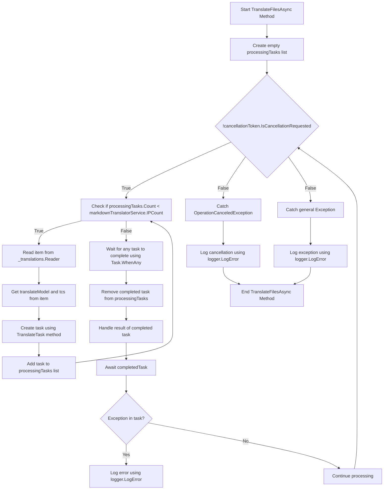

# Achtergrondvertalingen Pt. 2

<datetime class="hidden">2024-08-23T19:52</datetime>

<!--category-- EasyNMT, ASP.NET -->
## Inleiding

In onze vorige post [Hier.](/blog/backgroundtranslationspt1) we bespraken hoe we EasyNMT kunnen gebruiken om onze `.md` bestanden in verschillende talen. We bespraken ook hoe we deze functionaliteit aan de gebruiker kunnen toevoegen door een dropdown toe te voegen aan de markdown editor. In deze post zullen we bespreken hoe we een background service kunnen gebruiken om de vertaaltaken af te handelen.

Zie het eerste deel van deze serie [Hier.](/blog/backgroundtranslationspt1).

[TOC]

## Instellen van de docker

Het eerste wat we moeten doen is het opzetten van een docker container om onze vertaaldienst te runnen. We zullen gebruik maken van de `EasyNMT` docker afbeelding die beschikbaar is op Docker Hub.

```yaml
  easynmt:
    image: easynmt/api:2.0.2-cpu
    volumes:
      - /mnt/easynmt:/cache/
    deploy:
      resources:
        limits:
          cpus: "4.0"
    networks:
      - app_network
```

Hier zijn we het opzetten van een dienst genaamd `easynmt` die gebruik maakt van de `easynmt/api:2.0.2-cpu` afbeelding. We monteren ook een volume om de vertaalcache op te slaan. We stellen ook resource limieten om ervoor te zorgen dat de service niet alle middelen op de host machine verbruikt (EasyNMT is een beetje een resource hog).

## Achtergronddienst

Een probleem is dat EasyNMT ofwel een beetje kan nemen om op te starten en/of willekeurig naar beneden te gaan. Dus in onze [Achtergronddienst](https://github.com/scottgal/mostlylucidweb/blob/main/Mostlylucid/MarkdownTranslator/BackgroundTranslateService.cs) We moeten dit afhandelen.

### Opstarten

Bij het starten van de service moeten we controleren of de EasyNMT service draait. Als het niet zo is, bevriezen we de toekomstige verwerking tot het zover is. We moeten ook omgaan met de zaak waar de dienst gaat naar beneden (zoals het kan willekeurig).

```csharp
    private async Task<bool> StartupHealthCheck(CancellationToken cancellationToken)
    {
        var count = 1;
        var isUp = false;
        while (true)
        {
            if (await Ping(cancellationToken))
            {
                logger.LogInformation("Translation service is available");
                isUp = true;
                break;
            }

            await Task.Delay(10000, cancellationToken);
            count++;
            if (count > 3)
            {
                logger.LogError("Translation service is not available trying again (count: {Count})", count);
                _translations.Writer.Complete();
                await cancellationTokenSource.CancelAsync();
                isUp = false;
                break;
            }
        }

        return isUp;
    }

    private async Task PeriodicHealthCheck(CancellationToken cancellationToken)
    {
        // Run the health check periodically (e.g., every 60 seconds)
        const int delayMilliseconds = 60000;


        while (!cancellationToken.IsCancellationRequested)
        {
            try
            {
                if (!await Ping(cancellationToken))
                {
                    logger.LogError("Translation service is not available");
                    await cancellationTokenSource.CancelAsync();
                    _translations.Writer.Complete();
                    TranslationServiceUp = false;
                }
                else
                {
                    logger.LogInformation("Translation service is healthy");
                    TranslationServiceUp = true;
                }
            }
            catch (Exception ex)
            {
                TranslationServiceUp = false;
                logger.LogError(ex, "Error during service health check");
                await cancellationTokenSource.CancelAsync();
                _translations.Writer.Complete();
            }

            // Wait before checking again
            await Task.Delay(delayMilliseconds, cancellationToken);
        }
    }
    
        public async Task<bool> Ping(CancellationToken cancellationToken)
    {
        if (!await markdownTranslatorService.IsServiceUp(cancellationToken))
        {
            logger.LogError("Translation service is not available");
            return false;
        }

        return true;
    }

    
```

Dit verklaart meestal het EasyNMT gebrek aan een health check eindpunt. We pingen de dienst elke 60 seconden om te zien of het omhoog is. Als dat niet zo is, annuleren we de service en bevriezen we de toekomstige verwerking tot het zover is.

```csharp
    private string[] IPs = translateServiceConfig.IPs;
    public async ValueTask<bool> IsServiceUp(CancellationToken cancellationToken)
    {
        var workingIPs = new List<string>();

        try
        {
            foreach (var ip in IPs)
            {
                logger.LogInformation("Checking service status at {IP}", ip);
                var response = await client.GetAsync($"{ip}/model_name", cancellationToken);
                if (response.IsSuccessStatusCode)
                {
                    workingIPs.Add(ip);
                }
            }

            IPs = workingIPs.ToArray();
            if (!IPs.Any()) return false;
            return true;
        }
        catch (Exception e)
        {
            logger.LogError(e, "Error checking service status");
            return false;
        }
    }
```

In de `IsServiceUp` methode we ping alle beschikbare EasyNMT diensten om te zien of ze up zijn. Als één van hen is, keren we terug. `true` Anders keren we terug. `false`. We updaten ook de lijst van service IP's om alleen degenen die zijn up. Thuis heb ik een paar EasyNMT diensten draaien op verschillende machines dus dit is nuttig voor mij (en maakt vertaling een beetje sneller).

### API-updates

In de API controleren we nu of de dienst opstaat voordat we een vertaalverzoek afvuren:

```csharp
    [HttpPost("start-translation")]
    [ValidateAntiForgeryToken]
    public async Task<Results<Ok<string>, BadRequest<string>>> StartTranslation([FromBody] MarkdownTranslationModel model)
    {
        if(!backgroundTranslateService.TranslationServiceUp)
        {
            return TypedResults.BadRequest("Translation service is down");
        }
        // Create a unique identifier for this translation task
        var taskId = Guid.NewGuid().ToString("N");
        var userId = Request.GetUserId(Response);
       
        // Trigger translation and store the associated task
        var translationTask = await backgroundTranslateService.Translate(model);
    
        var translateTask = new TranslateTask(taskId, model.Language, translationTask);
        translateCacheService.AddTask(userId, translateTask);

        // Return the task ID to the client
        return TypedResults.Ok(taskId);
    }
```

### Methode vertalen

We zijn nu overgestapt op het gebruik `Channels` voor onze vertaalwachtrij; het is gewoon een betere versie van de `BufferBlock` We gebruikten eerder (betere prestaties, minder geheugen etc).

```csharp
    private readonly
        Channel<(PageTranslationModel, TaskCompletionSource<TaskCompletion>)>
        _translations = Channel.CreateUnbounded<(PageTranslationModel, TaskCompletionSource<TaskCompletion>)>();

    public async Task<Task<TaskCompletion>> Translate(MarkdownTranslationModel message)
    {
        // Create a TaskCompletionSource that will eventually hold the result of the translation
        var translateMessage = new PageTranslationModel
        {
            Language = message.Language,
            OriginalFileName = "",
            OriginalMarkdown = message.OriginalMarkdown,
            Persist = false
        };

        return await Translate(translateMessage);
    }

    private async Task<Task<TaskCompletion>> Translate(PageTranslationModel message)
    {
        // Create a TaskCompletionSource that will eventually hold the result of the translation
        var tcs = new TaskCompletionSource<TaskCompletion>();
        // Send the translation request along with the TaskCompletionSource to be processed
        await _translations.Writer.WriteAsync((message, tcs));
        return tcs.Task;
    }
```

U kunt zien dat dit gebruik maakt van een `TaskCompletionSource` het resultaat van de vertaling vast te houden. Vervolgens sturen wij het vertaalverzoek samen met de `TaskCompletionSource` te verwerken met `await _translations.Writer.WriteAsync((message, tcs));` dan terug te keren `TaskCompletion` taak aan de API waardoor het kan worden gecached.

### Translation Loop

De belangrijkste 'loop' binnen onze `IHostedService` is verantwoordelijk voor de verwerking van eventuele vertaalverzoeken die binnenkomen. Het diagram is een beetje eng, maar het is niet zo erg.

In de



Om vertalingen te stroomlijnen creëren we een lus die slechts zoveel vertalingen tegelijk probeert te verwerken als we EasyNMT-diensten draaien. Dit is om te voorkomen dat de dienst overweldigd wordt.

Voor elk van deze draaien we vervolgens een nieuwe vertaaltaak

```csharp
 TranslateTask(cancellationToken, translateModel, item, tcs);
```

We gebruiken dan `Task.WhenAny` om te wachten tot een van de taken is voltooid. Vervolgens verwijderen we de voltooide taak uit de lijst en behandelen we het resultaat van de voltooide taak. Als er een uitzondering is loggen we het en gaan we verder met de verwerking.

Dan starten we de lus opnieuw totdat de service is geannuleerd.

```csharp
    private async Task TranslateFilesAsync(CancellationToken cancellationToken)
    {
        try
        {
            var processingTasks = new List<Task>();
            while (!cancellationToken.IsCancellationRequested)
            {
                while (processingTasks.Count < markdownTranslatorService.IPCount &&
                       !cancellationToken.IsCancellationRequested)
                {
                    var item = await _translations.Reader.ReadAsync(cancellationToken);
                    var translateModel = item.Item1;
                    var tcs = item.Item2;
                    // Start the task and add it to the list
                    var task = TranslateTask(cancellationToken, translateModel, item, tcs);
                    processingTasks.Add(task);
                }

                // Wait for any of the tasks to complete
                var completedTask = await Task.WhenAny(processingTasks);

                // Remove the completed task
                processingTasks.Remove(completedTask);

                // Optionally handle the result of the completedTask here
                try
                {
                    await completedTask; // Catch exceptions if needed
                }
                catch (Exception ex)
                {
                    logger.LogError(ex, "Error translating markdown");
                }
            }
        }

        catch (OperationCanceledException)
        {
            logger.LogError("Translation service was cancelled");
        }
        catch (Exception e)
        {
            logger.LogError(e, "Error translating markdown");
        }
    }
```

### Verwerking

Het "vlees" van deze verwerking wordt verwerkt in `TranslateTask` die verantwoordelijk is voor het vertalen van de markdown en het aanhouden indien nodig (ik gebruik dit voor het vertalen van bestanden en in de toekomst voor het opslaan van vertaalde artikelen terug naar de DB).

Ik eerst controleren of de oorspronkelijke ingang is veranderd; ofwel met behulp van een bestand hash van de oorspronkelijke inhoud van het bestand / gewoon controleren van de bijgewerktDatum van de blog ingang tegen de vertaalde degenen. Als het niet veranderd is sla ik de vertaling over. Als het veranderd is, vertaal ik de afwaardering en houd het zo nodig vol.

Ik roep dan op tot de belangrijkste Vertaalmethode van de `MarkdownTranslatorService` om de vertaling te doen.
Kijken hoe ik dit doe. [Hier.](/blog/autotranslatingmarkdownfiles).
Dit geeft de vertaalde afwaardering terug die ik dan volhard indien nodig.
Ik heb toen de `tcs` resultaat van de vertaalde markdown en zet het als compleet.

```csharp
private async Task TranslateTask(CancellationToken cancellationToken, PageTranslationModel translateModel,
        (PageTranslationModel, TaskCompletionSource<TaskCompletion>) item,
        TaskCompletionSource<TaskCompletion> tcs)
    {
        var scope = scopeFactory.CreateScope();

        var slug = Path.GetFileNameWithoutExtension(translateModel.OriginalFileName);
        if (translateModel.Persist)
        {
            if (await EntryChanged(scope, slug, translateModel))
            {
                logger.LogInformation("Entry {Slug} has changed, translating", slug);
            }
            else
            {
                logger.LogInformation("Entry {Slug} has not changed, skipping translation", slug);
                tcs.SetResult(new TaskCompletion(null, translateModel.Language, true, DateTime.Now));
                return;
            }
        }


        logger.LogInformation("Translating {File} to {Language}", translateModel.OriginalFileName,
            translateModel.Language);
        try
        {
            var translatedMarkdown =
                await markdownTranslatorService.TranslateMarkdown(translateModel.OriginalMarkdown,
                    translateModel.Language, cancellationToken);


            if (item.Item1.Persist)
            {
                await PersistTranslation(scope, slug, translateModel, translatedMarkdown);
            }

            tcs.SetResult(new TaskCompletion(translatedMarkdown, translateModel.Language, true, DateTime.Now));
        }
        catch (Exception e)
        {
            logger.LogError(e, "Error translating {File} to {Language}", translateModel.OriginalFileName,
                translateModel.Language);
            tcs.SetException(e);
        }
    }
```

## Conclusie

Dus dat is het, dit is hoe ik omga met achtergrondvertalingen in mijn blog. Ik gebruik dit al een maand of zo en het werkt al goed. Hoewel het er ontmoedigend uitziet in werkelijkheid is de code vrij eenvoudig. Ik hoop dat dit je helpt in je eigen projecten.