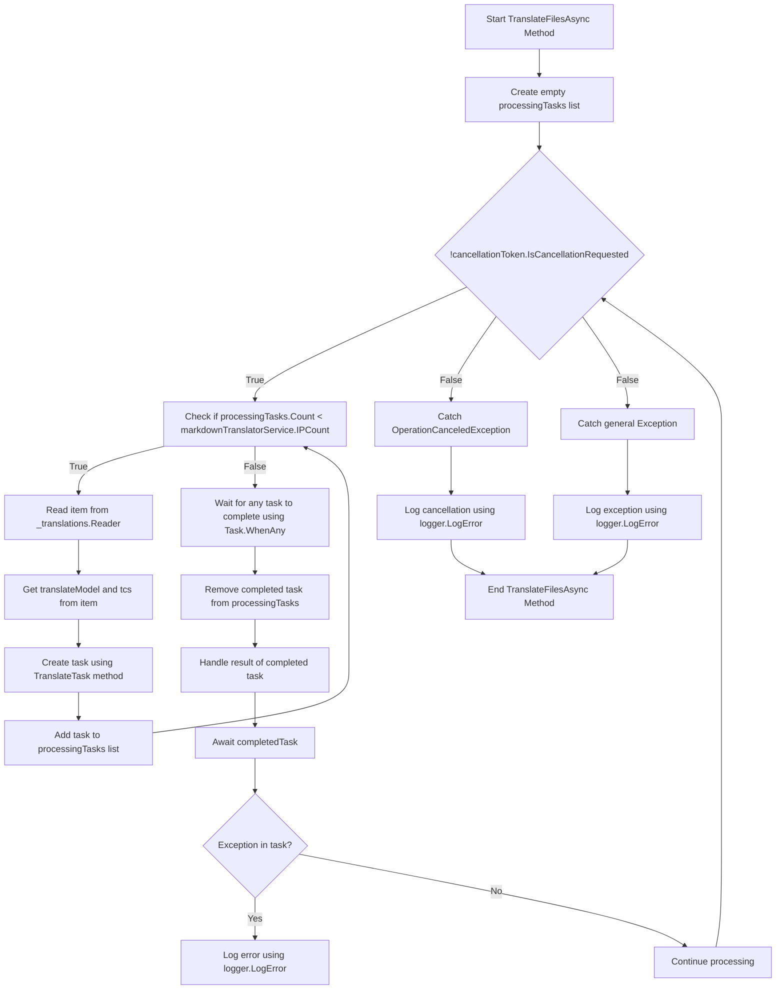

# Bakgrundsöversättningar Pt. I artikel 2 ska punkt 2 ersättas med följande:

<datetime class="hidden">Förbehåll IIIA-PT-38</datetime>

<!--category-- EasyNMT, ASP.NET -->
## Inledning

I vårt tidigare inlägg [här](/blog/backgroundtranslationspt1) vi diskuterade hur vi kan använda EasyNMT för att översätta vår `.md` filer till olika språk. Vi diskuterade också hur vi kan ytbehandla denna funktionalitet till användaren genom att lägga till en dropdown till markdown-editorn. I det här inlägget ska vi diskutera hur vi kan använda en bakgrundstjänst för att hantera översättningsuppgifterna.

Se första delen av denna serie [här](/blog/backgroundtranslationspt1).

[TOC]

## Dockningsinställning

Det första vi behöver göra är att sätta upp en docker container för att köra vår översättningstjänst. Vi använder det. `EasyNMT` Docker image som finns på Docker Hub.

```yaml
  easynmt:
    image: easynmt/api:2.0.2-cpu
    volumes:
      - /mnt/easynmt:/cache/
    deploy:
      resources:
        limits:
          cpus: "4.0"
    networks:
      - app_network
```

Här sätter vi upp en tjänst som heter `easynmt` som använder `easynmt/api:2.0.2-cpu` bild. Vi monterar också en volym för att lagra översättningscachen. Vi sätter också resursgränser för att säkerställa att tjänsten inte förbrukar alla resurser på värdmaskinen (EasyNMT är lite av en resurssvin).

## Bakgrundstjänst

En fråga är att EasyNMT antingen kan ta lite för att starta upp och / eller gå ner slumpmässigt. Så i vår [Bakgrundstjänst](https://github.com/scottgal/mostlylucidweb/blob/main/Mostlylucid/MarkdownTranslator/BackgroundTranslateService.cs) Vi måste ta hand om det här.

### Uppstart

När vi startar tjänsten måste vi kontrollera om EasyNMT-tjänsten körs. Om det inte är det fryser vi framtida bearbetning tills det är det. Vi måste också hantera fallet där tjänsten går ner (eftersom den kanm slumpmässigt).

```csharp
    private async Task<bool> StartupHealthCheck(CancellationToken cancellationToken)
    {
        var count = 1;
        var isUp = false;
        while (true)
        {
            if (await Ping(cancellationToken))
            {
                logger.LogInformation("Translation service is available");
                isUp = true;
                break;
            }

            await Task.Delay(10000, cancellationToken);
            count++;
            if (count > 3)
            {
                logger.LogError("Translation service is not available trying again (count: {Count})", count);
                _translations.Writer.Complete();
                await cancellationTokenSource.CancelAsync();
                isUp = false;
                break;
            }
        }

        return isUp;
    }

    private async Task PeriodicHealthCheck(CancellationToken cancellationToken)
    {
        // Run the health check periodically (e.g., every 60 seconds)
        const int delayMilliseconds = 60000;


        while (!cancellationToken.IsCancellationRequested)
        {
            try
            {
                if (!await Ping(cancellationToken))
                {
                    logger.LogError("Translation service is not available");
                    await cancellationTokenSource.CancelAsync();
                    _translations.Writer.Complete();
                    TranslationServiceUp = false;
                }
                else
                {
                    logger.LogInformation("Translation service is healthy");
                    TranslationServiceUp = true;
                }
            }
            catch (Exception ex)
            {
                TranslationServiceUp = false;
                logger.LogError(ex, "Error during service health check");
                await cancellationTokenSource.CancelAsync();
                _translations.Writer.Complete();
            }

            // Wait before checking again
            await Task.Delay(delayMilliseconds, cancellationToken);
        }
    }
    
        public async Task<bool> Ping(CancellationToken cancellationToken)
    {
        if (!await markdownTranslatorService.IsServiceUp(cancellationToken))
        {
            logger.LogError("Translation service is not available");
            return false;
        }

        return true;
    }

    
```

Detta beror främst på EasyNMT brist på en hälsokontroll endpoint. Vi petar på servicen var 60:e sekund för att se om den är uppe. Om det inte är vi avbryta tjänsten och frysa framtida bearbetning tills det är.

```csharp
    private string[] IPs = translateServiceConfig.IPs;
    public async ValueTask<bool> IsServiceUp(CancellationToken cancellationToken)
    {
        var workingIPs = new List<string>();

        try
        {
            foreach (var ip in IPs)
            {
                logger.LogInformation("Checking service status at {IP}", ip);
                var response = await client.GetAsync($"{ip}/model_name", cancellationToken);
                if (response.IsSuccessStatusCode)
                {
                    workingIPs.Add(ip);
                }
            }

            IPs = workingIPs.ToArray();
            if (!IPs.Any()) return false;
            return true;
        }
        catch (Exception e)
        {
            logger.LogError(e, "Error checking service status");
            return false;
        }
    }
```

I och med att `IsServiceUp` metod vi ping alla tillgängliga EasyNMT tjänster för att se om de är uppe. Om någon av dem är vi återvända `true` annars återvänder vi. `false`....................................... Vi uppdaterar också listan över tjänste-IPs för att endast inkludera de som är uppe. Hemma har jag några EasyNMT tjänster som körs på olika maskiner så detta är användbart för mig (och gör översättning lite snabbare).

### API- uppdateringar

I API:et vi nu kontrollera för tjänsten att vara uppe innan du skjuter av en översätta begäran:

```csharp
    [HttpPost("start-translation")]
    [ValidateAntiForgeryToken]
    public async Task<Results<Ok<string>, BadRequest<string>>> StartTranslation([FromBody] MarkdownTranslationModel model)
    {
        if(!backgroundTranslateService.TranslationServiceUp)
        {
            return TypedResults.BadRequest("Translation service is down");
        }
        // Create a unique identifier for this translation task
        var taskId = Guid.NewGuid().ToString("N");
        var userId = Request.GetUserId(Response);
       
        // Trigger translation and store the associated task
        var translationTask = await backgroundTranslateService.Translate(model);
    
        var translateTask = new TranslateTask(taskId, model.Language, translationTask);
        translateCacheService.AddTask(userId, translateTask);

        // Return the task ID to the client
        return TypedResults.Ok(taskId);
    }
```

### Översätt metod

Vi har nu bytt till att använda `Channels` för vår översätta kö; det är bara en bättre version av `BufferBlock` Vi använde tidigare (bättre prestanda, mindre minne etc).

```csharp
    private readonly
        Channel<(PageTranslationModel, TaskCompletionSource<TaskCompletion>)>
        _translations = Channel.CreateUnbounded<(PageTranslationModel, TaskCompletionSource<TaskCompletion>)>();

    public async Task<Task<TaskCompletion>> Translate(MarkdownTranslationModel message)
    {
        // Create a TaskCompletionSource that will eventually hold the result of the translation
        var translateMessage = new PageTranslationModel
        {
            Language = message.Language,
            OriginalFileName = "",
            OriginalMarkdown = message.OriginalMarkdown,
            Persist = false
        };

        return await Translate(translateMessage);
    }

    private async Task<Task<TaskCompletion>> Translate(PageTranslationModel message)
    {
        // Create a TaskCompletionSource that will eventually hold the result of the translation
        var tcs = new TaskCompletionSource<TaskCompletion>();
        // Send the translation request along with the TaskCompletionSource to be processed
        await _translations.Writer.WriteAsync((message, tcs));
        return tcs.Task;
    }
```

Du kan se att detta använder en `TaskCompletionSource` för att hålla resultatet av översättningen. Vi skickar sedan översättningsförfrågan tillsammans med `TaskCompletionSource` som skall behandlas med `await _translations.Writer.WriteAsync((message, tcs));` och sedan lämna tillbaka `TaskCompletion` uppgift till API:et så att det kan cachas.

### Översättningsloop

Den viktigaste "loop" inuti vår `IHostedService` ansvarar för att behandla eventuella översättningsförfrågningar som kommer in. Diagrammet är lite läskigt, men det är inte så illa.

I och med att



För att effektivisera översättningarna skapar vi en slinga som bara försöker bearbeta så många översättningar åt gången som vi har EasyNMT-tjänster igång. Detta för att förhindra att tjänsten blir överväldigad.

För var och en av dessa vi sedan snurra upp en ny översättning uppgift

```csharp
 TranslateTask(cancellationToken, translateModel, item, tcs);
```

Vi använder sedan `Task.WhenAny` Att vänta på att någon av uppgifterna ska slutföras. Vi tar sedan bort den färdiga uppgiften från listan och hanterar resultatet av den färdiga uppgiften. Om det finns ett undantag loggar vi det och fortsätter behandlingen.

Sedan startar vi slingan igen tills tjänsten ställs in.

```csharp
    private async Task TranslateFilesAsync(CancellationToken cancellationToken)
    {
        try
        {
            var processingTasks = new List<Task>();
            while (!cancellationToken.IsCancellationRequested)
            {
                while (processingTasks.Count < markdownTranslatorService.IPCount &&
                       !cancellationToken.IsCancellationRequested)
                {
                    var item = await _translations.Reader.ReadAsync(cancellationToken);
                    var translateModel = item.Item1;
                    var tcs = item.Item2;
                    // Start the task and add it to the list
                    var task = TranslateTask(cancellationToken, translateModel, item, tcs);
                    processingTasks.Add(task);
                }

                // Wait for any of the tasks to complete
                var completedTask = await Task.WhenAny(processingTasks);

                // Remove the completed task
                processingTasks.Remove(completedTask);

                // Optionally handle the result of the completedTask here
                try
                {
                    await completedTask; // Catch exceptions if needed
                }
                catch (Exception ex)
                {
                    logger.LogError(ex, "Error translating markdown");
                }
            }
        }

        catch (OperationCanceledException)
        {
            logger.LogError("Translation service was cancelled");
        }
        catch (Exception e)
        {
            logger.LogError(e, "Error translating markdown");
        }
    }
```

### Bearbetning

"Köttet" av denna bearbetning hanteras i `TranslateTask` som är ansvarig för att översätta markeringen och ihållande den vid behov (jag använder detta för att översätta filer och i framtiden för att spara översatta artiklar tillbaka till DB).

Jag först kontrollera om den ursprungliga posten har ändrats;antingen med hjälp av en fil hash av den ursprungliga filens innehåll / bara kontrollera UppdateradDatum för bloggen posten mot de översatta. Om det inte har förändrats hoppar jag över översättningen. Om det har förändrats översätter jag markeringen och vid behov vidhåller den.

Jag kallar sedan in till den viktigaste Översätt metoden för `MarkdownTranslatorService` att göra översättningen.
Se hur jag gör det här. [här](/blog/autotranslatingmarkdownfiles).
Detta returnerar den översatta markeringen som jag sedan framhärdar om det behövs.
Jag ställer sedan in `tcs` resultera i den översatta markeringen och ställa in den som komplett.

```csharp
private async Task TranslateTask(CancellationToken cancellationToken, PageTranslationModel translateModel,
        (PageTranslationModel, TaskCompletionSource<TaskCompletion>) item,
        TaskCompletionSource<TaskCompletion> tcs)
    {
        var scope = scopeFactory.CreateScope();

        var slug = Path.GetFileNameWithoutExtension(translateModel.OriginalFileName);
        if (translateModel.Persist)
        {
            if (await EntryChanged(scope, slug, translateModel))
            {
                logger.LogInformation("Entry {Slug} has changed, translating", slug);
            }
            else
            {
                logger.LogInformation("Entry {Slug} has not changed, skipping translation", slug);
                tcs.SetResult(new TaskCompletion(null, translateModel.Language, true, DateTime.Now));
                return;
            }
        }


        logger.LogInformation("Translating {File} to {Language}", translateModel.OriginalFileName,
            translateModel.Language);
        try
        {
            var translatedMarkdown =
                await markdownTranslatorService.TranslateMarkdown(translateModel.OriginalMarkdown,
                    translateModel.Language, cancellationToken);


            if (item.Item1.Persist)
            {
                await PersistTranslation(scope, slug, translateModel, translatedMarkdown);
            }

            tcs.SetResult(new TaskCompletion(translatedMarkdown, translateModel.Language, true, DateTime.Now));
        }
        catch (Exception e)
        {
            logger.LogError(e, "Error translating {File} to {Language}", translateModel.OriginalFileName,
                translateModel.Language);
            tcs.SetException(e);
        }
    }
```

## Slutsatser

Så det är så här jag hanterar bakgrundsöversättningar i min blogg. Jag har använt det här i en månad eller så nu och det har fungerat bra. Även om det ser skrämmande ut i verkligheten koden är ganska enkelt. Jag hoppas att detta hjälper dig i dina egna projekt.