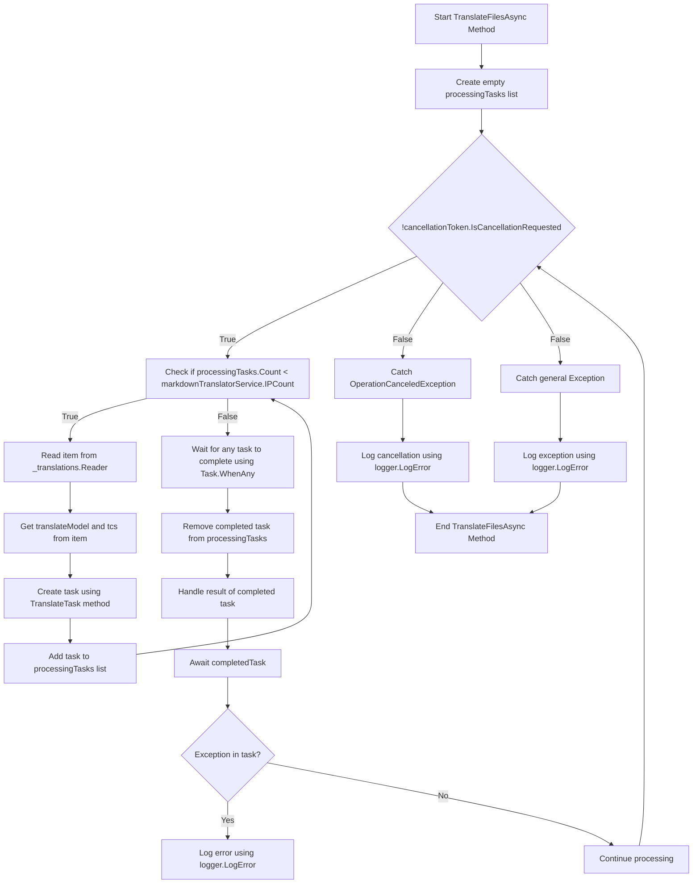

# Тло перекладів Pt. 2

<datetime class="hidden">2024- 08- 23T19: 52</datetime>

<!--category-- EasyNMT, ASP.NET -->
## Вступ

На нашому попередньому посту [тут](/blog/backgroundtranslationspt1) ми обговорили, як можна використовувати RiseNMT для нашого перекладу `.md` файли на різні мови. Ми також обговорили, як можна використати цю функціональність для користувача, додавши спадний список до редактора markdown. У цьому розділі ми обговоримо, як можна використовувати фонову службу для виконання перекладацьких завдань.

Дивіться першу частину цієї серії [тут](/blog/backgroundtranslationspt1).

[TOC]

## Налаштування панелі

Перше, що нам потрібно зробити, - це створити контейнер для докерів, щоб виконувати перекладацьку службу. Ми використаємо `EasyNMT` Зображення Ducker, доступ до якого можна отримати на Docker Hab.

```yaml
  easynmt:
    image: easynmt/api:2.0.2-cpu
    volumes:
      - /mnt/easynmt:/cache/
    deploy:
      resources:
        limits:
          cpus: "4.0"
    networks:
      - app_network
```

Тут ми встановлюємо службу, яка називається `easynmt` який використовує `easynmt/api:2.0.2-cpu` зображення. Ми також збільшуємо гучність, щоб зберегти кеш перекладів. Ми також встановлюємо обмеження ресурсів, щоб служба не споживала всі ресурси на комп'ютері (EasyNMT є трохи відлунням ресурсів).

## Служба тла

Одна з проблем полягає в тому, що EasyNMT може або трохи почати, або вниз випадково. Отже, в нашому [FroneService](https://github.com/scottgal/mostlylucidweb/blob/main/Mostlylucid/MarkdownTranslator/BackgroundTranslateService.cs) Мы должны справиться с этим.

### Запуск

Під час запуску служби нам потрібно перевірити, чи запущено службу EasyNMT. Если это не значит, что мы заморожим будущую обработку, пока это не будет. Нам також потрібно вирішити справу, де послуга падає (як і банком випадково).

```csharp
    private async Task<bool> StartupHealthCheck(CancellationToken cancellationToken)
    {
        var count = 1;
        var isUp = false;
        while (true)
        {
            if (await Ping(cancellationToken))
            {
                logger.LogInformation("Translation service is available");
                isUp = true;
                break;
            }

            await Task.Delay(10000, cancellationToken);
            count++;
            if (count > 3)
            {
                logger.LogError("Translation service is not available trying again (count: {Count})", count);
                _translations.Writer.Complete();
                await cancellationTokenSource.CancelAsync();
                isUp = false;
                break;
            }
        }

        return isUp;
    }

    private async Task PeriodicHealthCheck(CancellationToken cancellationToken)
    {
        // Run the health check periodically (e.g., every 60 seconds)
        const int delayMilliseconds = 60000;


        while (!cancellationToken.IsCancellationRequested)
        {
            try
            {
                if (!await Ping(cancellationToken))
                {
                    logger.LogError("Translation service is not available");
                    await cancellationTokenSource.CancelAsync();
                    _translations.Writer.Complete();
                    TranslationServiceUp = false;
                }
                else
                {
                    logger.LogInformation("Translation service is healthy");
                    TranslationServiceUp = true;
                }
            }
            catch (Exception ex)
            {
                TranslationServiceUp = false;
                logger.LogError(ex, "Error during service health check");
                await cancellationTokenSource.CancelAsync();
                _translations.Writer.Complete();
            }

            // Wait before checking again
            await Task.Delay(delayMilliseconds, cancellationToken);
        }
    }
    
        public async Task<bool> Ping(CancellationToken cancellationToken)
    {
        if (!await markdownTranslatorService.IsServiceUp(cancellationToken))
        {
            logger.LogError("Translation service is not available");
            return false;
        }

        return true;
    }

    
```

Це, в основному, пояснює FayNMT, що не має кінцевого пункту для перевірки здоров'я. Мы просто проверяем обслуживание каждые 60 секунд, чтобы убедиться, что все в порядке. Если это не мы отменим службу и не заморозим будущую обработку, пока это не будет.

```csharp
    private string[] IPs = translateServiceConfig.IPs;
    public async ValueTask<bool> IsServiceUp(CancellationToken cancellationToken)
    {
        var workingIPs = new List<string>();

        try
        {
            foreach (var ip in IPs)
            {
                logger.LogInformation("Checking service status at {IP}", ip);
                var response = await client.GetAsync($"{ip}/model_name", cancellationToken);
                if (response.IsSuccessStatusCode)
                {
                    workingIPs.Add(ip);
                }
            }

            IPs = workingIPs.ToArray();
            if (!IPs.Any()) return false;
            return true;
        }
        catch (Exception e)
        {
            logger.LogError(e, "Error checking service status");
            return false;
        }
    }
```

У `IsServiceUp` метод, який ми відсилаємо до всіх наявних служб EasyNMT, щоб перевірити, чи немає в них підтримки. Якщо хтось з них повернеться, `true` Інакше ми повертаємося. `false`. Ми також оновлюємо список IP сервісу, щоб включити лише ті, що там є. Вдома я маю декілька служб EasyNMT, які працюють на різних машинах, тому це корисно для мене (і трохи пришвидшує переклад).

### Оновлення API

У API тепер перевіряємо наявність служби перед тим, як запустити запит на переклад:

```csharp
    [HttpPost("start-translation")]
    [ValidateAntiForgeryToken]
    public async Task<Results<Ok<string>, BadRequest<string>>> StartTranslation([FromBody] MarkdownTranslationModel model)
    {
        if(!backgroundTranslateService.TranslationServiceUp)
        {
            return TypedResults.BadRequest("Translation service is down");
        }
        // Create a unique identifier for this translation task
        var taskId = Guid.NewGuid().ToString("N");
        var userId = Request.GetUserId(Response);
       
        // Trigger translation and store the associated task
        var translationTask = await backgroundTranslateService.Translate(model);
    
        var translateTask = new TranslateTask(taskId, model.Language, translationTask);
        translateCacheService.AddTask(userId, translateTask);

        // Return the task ID to the client
        return TypedResults.Ok(taskId);
    }
```

### Метод перекладу

Тепер ми перейшли на використання `Channels` для нашої черги перекладу; це лише краща версія `BufferBlock` раніше ми використовували (кращу швидкодію, менше пам'яті тощо).

```csharp
    private readonly
        Channel<(PageTranslationModel, TaskCompletionSource<TaskCompletion>)>
        _translations = Channel.CreateUnbounded<(PageTranslationModel, TaskCompletionSource<TaskCompletion>)>();

    public async Task<Task<TaskCompletion>> Translate(MarkdownTranslationModel message)
    {
        // Create a TaskCompletionSource that will eventually hold the result of the translation
        var translateMessage = new PageTranslationModel
        {
            Language = message.Language,
            OriginalFileName = "",
            OriginalMarkdown = message.OriginalMarkdown,
            Persist = false
        };

        return await Translate(translateMessage);
    }

    private async Task<Task<TaskCompletion>> Translate(PageTranslationModel message)
    {
        // Create a TaskCompletionSource that will eventually hold the result of the translation
        var tcs = new TaskCompletionSource<TaskCompletion>();
        // Send the translation request along with the TaskCompletionSource to be processed
        await _translations.Writer.WriteAsync((message, tcs));
        return tcs.Task;
    }
```

Ви можете бачити, що це використовує a `TaskCompletionSource` для того, щоб мати результат перекладу. Потім ми висилаємо запит на переклад разом з `TaskCompletionSource` буде оброблено `await _translations.Writer.WriteAsync((message, tcs));` а потім повернути `TaskCompletion` завдання для API, яке надає йому змогу кешувати.

### Цикл перекладу

Основний " цикл " всередині нашого `IHostedService` відповідає за обробку всіх запитів на переклади, які ви входите. Діаграма трохи лякає, але не така вже й погана.

У



Для потокових перекладів ми створюємо цикл, який намагається обробляти стільки перекладів, скільки запущено служба EasyNMT. Це допоможе запобігти переобтяженню служби.

Для кожного з них ми роздуваємо нове завдання "Перекладу"

```csharp
 TranslateTask(cancellationToken, translateModel, item, tcs);
```

Потім ми використовуємо `Task.WhenAny` очікувати на завершення будь- якої з задач. Потім ми усунули завершене завдання зі списку і виконали його виконання. Якщо є виняток, ми ведемо його до журналу і продовжуємо обробку.

Потім ми починаємо петлю знову, поки послугу не відмінять.

```csharp
    private async Task TranslateFilesAsync(CancellationToken cancellationToken)
    {
        try
        {
            var processingTasks = new List<Task>();
            while (!cancellationToken.IsCancellationRequested)
            {
                while (processingTasks.Count < markdownTranslatorService.IPCount &&
                       !cancellationToken.IsCancellationRequested)
                {
                    var item = await _translations.Reader.ReadAsync(cancellationToken);
                    var translateModel = item.Item1;
                    var tcs = item.Item2;
                    // Start the task and add it to the list
                    var task = TranslateTask(cancellationToken, translateModel, item, tcs);
                    processingTasks.Add(task);
                }

                // Wait for any of the tasks to complete
                var completedTask = await Task.WhenAny(processingTasks);

                // Remove the completed task
                processingTasks.Remove(completedTask);

                // Optionally handle the result of the completedTask here
                try
                {
                    await completedTask; // Catch exceptions if needed
                }
                catch (Exception ex)
                {
                    logger.LogError(ex, "Error translating markdown");
                }
            }
        }

        catch (OperationCanceledException)
        {
            logger.LogError("Translation service was cancelled");
        }
        catch (Exception e)
        {
            logger.LogError(e, "Error translating markdown");
        }
    }
```

### Обробка

" м'ясо " цієї обробки обробляється у `TranslateTask` який відповідає за переклад повідомлення і утримування його у разі потреби (Я використовую його для перекладу файлів, а у майбутньому для збереження перекладених статей назад у базу даних).

Спочатку я перевіряю, чи було змінено початковий запис; або використано хеш початкового вмісту файла / просто перевірка на Оновлений запис блогу проти перекладених записів. Якщо він не змінився, я пропущу переклад. Якщо він змінився, я переводжу позначку і наполягаю, якщо треба.

Потім я дзвоню до основного методу перекладу `MarkdownTranslatorService` зробити переклад.
Дивлюся, як я це роблю. [тут](/blog/autotranslatingmarkdownfiles).
Це повертає перекладену позначку, яку я наполягаю, якщо потрібно.
Тоді я встановлю `tcs` і встановить її завершеною.

```csharp
private async Task TranslateTask(CancellationToken cancellationToken, PageTranslationModel translateModel,
        (PageTranslationModel, TaskCompletionSource<TaskCompletion>) item,
        TaskCompletionSource<TaskCompletion> tcs)
    {
        var scope = scopeFactory.CreateScope();

        var slug = Path.GetFileNameWithoutExtension(translateModel.OriginalFileName);
        if (translateModel.Persist)
        {
            if (await EntryChanged(scope, slug, translateModel))
            {
                logger.LogInformation("Entry {Slug} has changed, translating", slug);
            }
            else
            {
                logger.LogInformation("Entry {Slug} has not changed, skipping translation", slug);
                tcs.SetResult(new TaskCompletion(null, translateModel.Language, true, DateTime.Now));
                return;
            }
        }


        logger.LogInformation("Translating {File} to {Language}", translateModel.OriginalFileName,
            translateModel.Language);
        try
        {
            var translatedMarkdown =
                await markdownTranslatorService.TranslateMarkdown(translateModel.OriginalMarkdown,
                    translateModel.Language, cancellationToken);


            if (item.Item1.Persist)
            {
                await PersistTranslation(scope, slug, translateModel, translatedMarkdown);
            }

            tcs.SetResult(new TaskCompletion(translatedMarkdown, translateModel.Language, true, DateTime.Now));
        }
        catch (Exception e)
        {
            logger.LogError(e, "Error translating {File} to {Language}", translateModel.OriginalFileName,
                translateModel.Language);
            tcs.SetException(e);
        }
    }
```

## Включення

Саме так я працюю з перекладами на фоні в моєму блозі. Я вже близько місяця цим користуюся, і це добре працює. Хоча насправді цей код здається складним, він досить простий. Сподіваюся, це допоможе тобі у власних проектах.