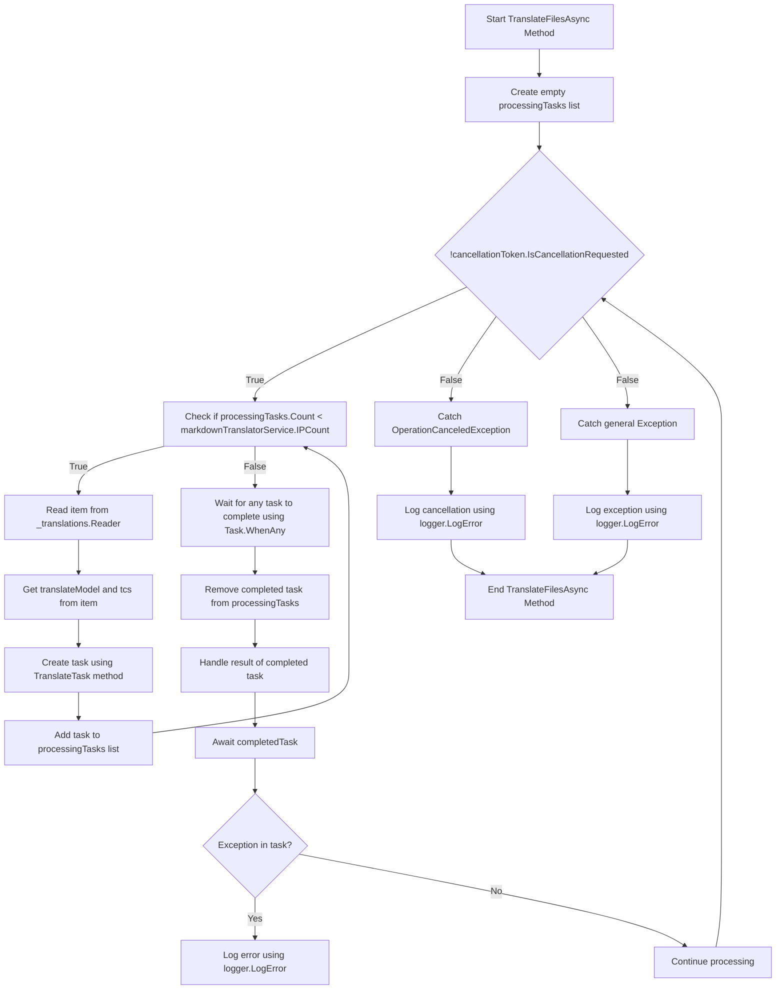

# 背景翻译 2 2, 2, 2, 2

<datetime class="hidden">2024-008-23T19:52</datetime>

<!--category-- EasyNMT, ASP.NET -->
## 一. 导言 导言 导言 导言 导言 导言 一,导言 导言 导言 导言 导言 导言

上任职务 [在这里](/blog/backgroundtranslationspt1) 我们讨论了我们如何利用“易NMT”来翻译我们 `.md` 不同语言的文件 。 我们还讨论了我们如何向用户展示这个功能, 在标记编辑器中添加一个下调 。 我们将讨论如何使用背景服务来完成翻译任务。

见本系列的第一部分 [在这里](/blog/backgroundtranslationspt1).

[技选委

## doccc 设置

首先我们需要做的是 设置一个船舱集装箱 运行我们的翻译服务。 我们用 `EasyNMT` Docker Hub 上可用的 docker 图像 。

```yaml
  easynmt:
    image: easynmt/api:2.0.2-cpu
    volumes:
      - /mnt/easynmt:/cache/
    deploy:
      resources:
        limits:
          cpus: "4.0"
    networks:
      - app_network
```

在这里,我们正在设置一个服务 名为 `easynmt` 使用 `easynmt/api:2.0.2-cpu` 图像。 我们还在堆积一个数量 储存翻译缓存。 我们也在设定资源限制, 以确保服务不会耗尽主机上的所有资源( EasyNMT 有点像资源猪) 。

## 背景事务处

其中一个问题是,容易NMT系统要么需要一点点启动和(或)随机下降。 因此,在我们 [背景服务](https://github.com/scottgal/mostlylucidweb/blob/main/Mostlylucid/MarkdownTranslator/BackgroundTranslateService.cs) 我们需要处理这件事。

### 启动启动

当启动服务时, 我们需要检查 EasyNMT 服务是否运行 。 如果不是我们冻结未来的处理 直到它。 我们还需要处理服务中断的情况(因为它可以随机地处理)。

```csharp
    private async Task<bool> StartupHealthCheck(CancellationToken cancellationToken)
    {
        var count = 1;
        var isUp = false;
        while (true)
        {
            if (await Ping(cancellationToken))
            {
                logger.LogInformation("Translation service is available");
                isUp = true;
                break;
            }

            await Task.Delay(10000, cancellationToken);
            count++;
            if (count > 3)
            {
                logger.LogError("Translation service is not available trying again (count: {Count})", count);
                _translations.Writer.Complete();
                await cancellationTokenSource.CancelAsync();
                isUp = false;
                break;
            }
        }

        return isUp;
    }

    private async Task PeriodicHealthCheck(CancellationToken cancellationToken)
    {
        // Run the health check periodically (e.g., every 60 seconds)
        const int delayMilliseconds = 60000;


        while (!cancellationToken.IsCancellationRequested)
        {
            try
            {
                if (!await Ping(cancellationToken))
                {
                    logger.LogError("Translation service is not available");
                    await cancellationTokenSource.CancelAsync();
                    _translations.Writer.Complete();
                    TranslationServiceUp = false;
                }
                else
                {
                    logger.LogInformation("Translation service is healthy");
                    TranslationServiceUp = true;
                }
            }
            catch (Exception ex)
            {
                TranslationServiceUp = false;
                logger.LogError(ex, "Error during service health check");
                await cancellationTokenSource.CancelAsync();
                _translations.Writer.Complete();
            }

            // Wait before checking again
            await Task.Delay(delayMilliseconds, cancellationToken);
        }
    }
    
        public async Task<bool> Ping(CancellationToken cancellationToken)
    {
        if (!await markdownTranslatorService.IsServiceUp(cancellationToken))
        {
            logger.LogError("Translation service is not available");
            return false;
        }

        return true;
    }

    
```

这主要是造成全国轻便医疗系统缺乏健康检查终点的原因。 我们每60秒就提供一次服务 看看是否已经启动 如果不是我们取消服务 并冻结未来的处理 直到它。

```csharp
    private string[] IPs = translateServiceConfig.IPs;
    public async ValueTask<bool> IsServiceUp(CancellationToken cancellationToken)
    {
        var workingIPs = new List<string>();

        try
        {
            foreach (var ip in IPs)
            {
                logger.LogInformation("Checking service status at {IP}", ip);
                var response = await client.GetAsync($"{ip}/model_name", cancellationToken);
                if (response.IsSuccessStatusCode)
                {
                    workingIPs.Add(ip);
                }
            }

            IPs = workingIPs.ToArray();
            if (!IPs.Any()) return false;
            return true;
        }
        catch (Exception e)
        {
            logger.LogError(e, "Error checking service status");
            return false;
        }
    }
```

在 `IsServiceUp` 我们使用所有可用的“方便NMT”服务 来查看它们是否已经建立起来。 如果他们中有我们再回来的, `true` 否则我们再回去 `false`.. 我们还更新服务IP公司名单,只包括上面的IP公司。 在家,我有一些简单NMT服务,用不同的机器运行,因此这对我有用(而且翻译速度要快一点)。

### API 更新更新

现在在API中,我们先检查一下服务是否已经启动,然后才发出翻译请求:

```csharp
    [HttpPost("start-translation")]
    [ValidateAntiForgeryToken]
    public async Task<Results<Ok<string>, BadRequest<string>>> StartTranslation([FromBody] MarkdownTranslationModel model)
    {
        if(!backgroundTranslateService.TranslationServiceUp)
        {
            return TypedResults.BadRequest("Translation service is down");
        }
        // Create a unique identifier for this translation task
        var taskId = Guid.NewGuid().ToString("N");
        var userId = Request.GetUserId(Response);
       
        // Trigger translation and store the associated task
        var translationTask = await backgroundTranslateService.Translate(model);
    
        var translateTask = new TranslateTask(taskId, model.Language, translationTask);
        translateCacheService.AddTask(userId, translateTask);

        // Return the task ID to the client
        return TypedResults.Ok(taskId);
    }
```

### 翻译方法

我们现在改用 `Channels` 我们的翻译队列; 这只是一个更好的版本 `BufferBlock` 我们以前曾使用过( 更好的性能, 减少内存等) 。

```csharp
    private readonly
        Channel<(PageTranslationModel, TaskCompletionSource<TaskCompletion>)>
        _translations = Channel.CreateUnbounded<(PageTranslationModel, TaskCompletionSource<TaskCompletion>)>();

    public async Task<Task<TaskCompletion>> Translate(MarkdownTranslationModel message)
    {
        // Create a TaskCompletionSource that will eventually hold the result of the translation
        var translateMessage = new PageTranslationModel
        {
            Language = message.Language,
            OriginalFileName = "",
            OriginalMarkdown = message.OriginalMarkdown,
            Persist = false
        };

        return await Translate(translateMessage);
    }

    private async Task<Task<TaskCompletion>> Translate(PageTranslationModel message)
    {
        // Create a TaskCompletionSource that will eventually hold the result of the translation
        var tcs = new TaskCompletionSource<TaskCompletion>();
        // Send the translation request along with the TaskCompletionSource to be processed
        await _translations.Writer.WriteAsync((message, tcs));
        return tcs.Task;
    }
```

你可以看到,这使用 `TaskCompletionSource` 以保持翻译结果。 然后我们把翻译请求和翻译请求一起寄去 `TaskCompletionSource` 有待处理的 `await _translations.Writer.WriteAsync((message, tcs));` 然后返回 `TaskCompletion` 允许缓存的 API 任务。

### 翻译圈

我们体内的主要“圈圈” `IHostedService` 负责处理收到的任何翻译请求。 图表有点吓人,但没那么糟

在



为了简化翻译程序,我们创造了一个循环,它只试图处理尽可能多的翻译,而此时我们却在运行“方便NMT”服务。 这是为了防止服务不堪重负。

为每一个这些, 然后我们为每一个,我们 编织一个新的翻译任务

```csharp
 TranslateTask(cancellationToken, translateModel, item, tcs);
```

然后我们使用 `Task.WhenAny` 等待任何任务完成。 然后,我们将完成的任务从清单中删除,处理完成的任务的结果。 如果有例外,我们记录并继续处理。

然后我们重新开始循环,直到服务取消为止。

```csharp
    private async Task TranslateFilesAsync(CancellationToken cancellationToken)
    {
        try
        {
            var processingTasks = new List<Task>();
            while (!cancellationToken.IsCancellationRequested)
            {
                while (processingTasks.Count < markdownTranslatorService.IPCount &&
                       !cancellationToken.IsCancellationRequested)
                {
                    var item = await _translations.Reader.ReadAsync(cancellationToken);
                    var translateModel = item.Item1;
                    var tcs = item.Item2;
                    // Start the task and add it to the list
                    var task = TranslateTask(cancellationToken, translateModel, item, tcs);
                    processingTasks.Add(task);
                }

                // Wait for any of the tasks to complete
                var completedTask = await Task.WhenAny(processingTasks);

                // Remove the completed task
                processingTasks.Remove(completedTask);

                // Optionally handle the result of the completedTask here
                try
                {
                    await completedTask; // Catch exceptions if needed
                }
                catch (Exception ex)
                {
                    logger.LogError(ex, "Error translating markdown");
                }
            }
        }

        catch (OperationCanceledException)
        {
            logger.LogError("Translation service was cancelled");
        }
        catch (Exception e)
        {
            logger.LogError(e, "Error translating markdown");
        }
    }
```

### 处理处理

此处理过程的“ eat ” 处理在 `TranslateTask` 它负责翻译标记并在需要时坚持(我用它来翻译文件,今后还用来将翻译的文章保存回DB)。

我首先检查原始条目是否已经更改; 或者使用原始文件内容的散列文件 / 只是根据翻译内容检查博客条目的最新日期 。 如果它没有改变,我跳过翻译。 如果它已经改变,我翻译了标记,如果需要的话,我坚持。

然后,我呼吁使用主要的翻译方法 `MarkdownTranslatorService` 进行翻译。
看我怎么做到的 [在这里](/blog/autotranslatingmarkdownfiles).
这将返回翻译后的标记, 如果需要, 我将坚持此标记 。
然后,我设置了 `tcs` 后,结果被翻译为标记并设置为完整。

```csharp
private async Task TranslateTask(CancellationToken cancellationToken, PageTranslationModel translateModel,
        (PageTranslationModel, TaskCompletionSource<TaskCompletion>) item,
        TaskCompletionSource<TaskCompletion> tcs)
    {
        var scope = scopeFactory.CreateScope();

        var slug = Path.GetFileNameWithoutExtension(translateModel.OriginalFileName);
        if (translateModel.Persist)
        {
            if (await EntryChanged(scope, slug, translateModel))
            {
                logger.LogInformation("Entry {Slug} has changed, translating", slug);
            }
            else
            {
                logger.LogInformation("Entry {Slug} has not changed, skipping translation", slug);
                tcs.SetResult(new TaskCompletion(null, translateModel.Language, true, DateTime.Now));
                return;
            }
        }


        logger.LogInformation("Translating {File} to {Language}", translateModel.OriginalFileName,
            translateModel.Language);
        try
        {
            var translatedMarkdown =
                await markdownTranslatorService.TranslateMarkdown(translateModel.OriginalMarkdown,
                    translateModel.Language, cancellationToken);


            if (item.Item1.Persist)
            {
                await PersistTranslation(scope, slug, translateModel, translatedMarkdown);
            }

            tcs.SetResult(new TaskCompletion(translatedMarkdown, translateModel.Language, true, DateTime.Now));
        }
        catch (Exception e)
        {
            logger.LogError(e, "Error translating {File} to {Language}", translateModel.OriginalFileName,
                translateModel.Language);
            tcs.SetException(e);
        }
    }
```

## 在结论结论中

就是这样,这就是我如何在博客中处理背景翻译。 我用这个已经一个月左右了 而且效果很好 虽然在现实中它看起来令人望而生畏,但守则却非常直截了当。 我希望这对你们自己的项目有所帮助。