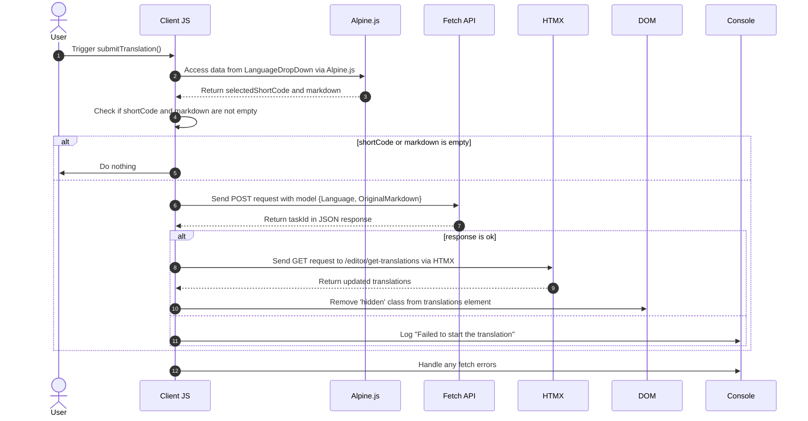

# الـ خلفيات الشّرْع. 3 3

<datetime class="hidden">2024-08-0224-08-25-TT03:20</datetime>

<!--category-- EasyNMT, ASP.NET, WebAPI, Alpine, HTMX -->
# أولاً

وقد ناقشنا في مواد سابقة أهمية الترجمة في سياق التطبيقات الشبكية. وقد استكشفنا أيضا استخدام مكتبة إيسي نمت (EaseNMT) لأداء الترجمات في تطبيق ASP.NET الأساسي. في هذا المقال سأغطي كيف أضفت خدمة خلفية إلى التطبيق للسماح لك بتقديم طلب الترجمة الذي يتم تجهيزه في الخلفية.

مرة أخرى، يمكنك أن ترى كل شفرة المصدر لهذا على [لا يُحَجْجَه](https://github.com/scottgal/mostlylucidweb) بصفـح

## المواد السابقة

- [الـ خلفيات الشّرْع. 1](/blog/backgroundtranslationspt1)
- [الـ خلفيات الشّرْع. فريقان](/blog/backgroundtranslationspt2)

وهنا نضيف أداة صغيرة تقدم الوظائف الخلفية إلى الخدمة التي قمنا بتفصيلها في الجزء 2. هذه الأداة عبارة عن استمارة بسيطة تتيح لك تقديم طلب ترجمة إلى الخدمة. ثم يتم اختباءها وإضافتها إلى طابور يعطيك معلومات عن حالة الترجمة.

[رابعاً -

هذا الدالة الدالة IF a جديد مستند الإيطالية.


# رمز الترجمة

## 

على صفحة مُحرّرنا للعلامة قمت بإضافة بعض الشفرة التي تحتوي على القليل من الانخفاض (في `_LanguageDropDown.cshtml`الذي يسمح لك باختيار اللغة التي تريد ترجمتها إليها.

```razor
        @if (Model.IsNew)
                {
                    var translationHidden = Model.TranslationTasks.Any() ? "" : "hidden";
              
                    <p class="text-blue-dark dark:text-blue-light inline-flex  items-center justify-center space-x-2">
                        <partial name="_LanguageDropDown" for="Languages"/>
                        <button class="btn btn-outline btn-sm mt-1" x-on:click="window.mostlylucid.translations.submitTranslation"><i class='bx bx-send'></i>Translate</button>
                    </p>
                    <div id="translations" class="@translationHidden">
                        <partial name="_GetTranslations" model="Model.TranslationTasks" />
                    </div>
                    <div id="translatedcontent" class="hidden">
                        <textarea class="hidden" id="translatedcontentarea"></textarea>
                    </div>
                }
```

#### _اللغDad

- - - - - - - - - - - - - `_LanguageDropDown` وجهة النظر الجزئية هي عبارة عن نقطة هبوط بسيطة تسمح لك باختيار اللغة التي تريد ترجمتها إليها. هذا من قائمة لغات في `Languages` (ج) أو الممتلكات الخاصة بالنموذج.

يمكنك أن ترى أنه يستخدم Alpin.js للتعامل مع الهبوط إلى الأسفل ولتحديد اللغة المنتقاة والعلم المحدد لعرضه في الجزء المنتقى الرئيسي. كما يحدد الرمز المختصر للغة المستخدمة عند تقديم طلب الترجمة.

استخدام الألبنغ يعني أننا نحافظ على الحد الأدنى، مرجع محلي جافاسكربت في آرائنا. وهذه طريقة عظيمة لإبقاء وجهات نظركم نظيفة وسهلة القراءة.

```razor
@using Mostlylucid.Helpers
@model List<string>

<div id="LanguageDropDown" x-data="{ 
    open: false, 
    selectedLanguage: 'Select Language', 
    selectedFlag: '' ,
    selectedShortCode:''
}" class="relative inline-block mt-3">
    <!-- Dropdown Button -->
    <button x-on:click="open = !open" class="btn btn-sm btn-outline flex items-center space-x-2">
        <!-- Dynamically Show the Flag Icon -->
        <template x-if="selectedFlag">
            
        </template>
        <span x-text="selectedLanguage"></span>
        <svg xmlns="http://www.w3.org/2000/svg" class="h-4 w-4 ml-2" fill="none" viewBox="0 0 24 24" stroke="currentColor">
            <path stroke-linecap="round" stroke-linejoin="round" stroke-width="2" d="M19 9l-7 7-7-7" />
        </svg>
    </button>

    <!-- Dropdown Menu -->
    <div x-show="open" x-on:click.away="open = false"
         class="absolute left-0 mt-2 w-64 rounded-md shadow-lg dark:bg-custom-dark-bg bg-white ring-1 ring-black ring-opacity-5 z-50">
        <ul class="p-2">
            @foreach (var language in Model)
            {
            <li>
                <a href="#"
                   x-on:click.prevent="selectedLanguage = '@(language.ConvertCodeToLanguage())'; selectedFlag = '/img/flags/@(language).svg'; selectedShortCode='@language'; open = false"
                   class="flex dark:text-white text-black items-center p-2 hover:bg-gray-100">
                     @language.ConvertCodeToLanguage()
                </a>
            </li>
            }
        </ul>
    </div>
</div>
```

### 

سترى أن هذا يحتوي على بعض رموز Apline.js التي تدعو إلى لدينا `window.mostlylucid.translations.submitTranslation` الدالة الدالة. هذا الدالة هذه الدالة في `translations.js` الملف المدرج في ملفنا `_Layout.cshtml` ملف ملفّيّاً.

```javascript
export function submitTranslation() {
    const languageDropDown = document.getElementById('LanguageDropDown');

    // Access Alpine.js data using Apline.$data (Alpine.js internal structure)
    const alpineData = Alpine.$data(languageDropDown);
const shortCode = alpineData.selectedShortCode;
const markdown = simplemde.value();
if (shortCode === '' || markdown === '') return;
    
    // Create the data object that matches your model
    const model = {
        Language: shortCode,
        OriginalMarkdown: markdown
    };

// Perform the fetch request to start the translation using POST
    fetch('/api/translate/start-translation', {
        method: 'POST',
        headers: {
            'Content-Type': 'application/json'  // The content type should be JSON
        },
        body: JSON.stringify(model)  // Send the data object as JSON
    })
        .then(function(response) {
            if (response.ok) {
                // Process the returned task ID
                return response.json();  // Parse the JSON response (assuming the task ID is returned in JSON)
            } else {
                console.error('Failed to start the translation');
            }
        })
        .then(function(taskId) {
            if (taskId) {
                console.log("Task ID:", taskId);

                // Trigger an HTMX request to get the translations after saving
                htmx.ajax('get', "/editor/get-translations", {
                    target: '#translations',  // Update this element with the response
                    swap: 'innerHTML',        // Replace the content inside the target
                }).then(function () {
                    // Remove the hidden class after the content is updated
                    document.getElementById('translations').classList.remove('hidden');
                });
            }
        })
        .catch(function(error) {
            // Handle any errors that occur during the fetch
            console.error('An error occurred:', error);
        });
```

#### 

يرد وصف هذا الرمز في الرسم التعاقبي التالي:



على الرغم من أن هذا يبدو مثل الكثير من الشفرة، فإنه في الواقع بسيط جدا.

1. نرسل طلب POPS إلى الخادم مع اللغة والمحتوى علامة أسفل. هذا يذهب إلى نقطة نهاية تُدعى `start-translation` « في خلقنا » أي في خلقنا وما نحن مع مع مع مع مع مع مع مع مع مع مع مع مع مع مع مع `TranslationAPI`/ / / / هذا يبدأ من مهمة الترجمة ويضيف هذه المهمة إلى محفظة هذا المستخدم.

2. الـ خادم تجاوب مع a مهمِل آيد (الذي نسجله لكن لا نستعمله)

3. ثم نرسل طلب الحصول إلى الخادم للحصول على الترجمات. يتم هذا باستخدام HTMX والتي هي مكتبة تسمح لك بتحديث أجزاء من الصفحة بدون صفحة كاملة مرن. هذه أداة قوية جداً وتستخدم في العديد من الأماكن في هذا التطبيق.

### ال_ جاري البدء

هذا جهاز تحكم WebAPI الذي يأخذ الطلبات التي تحتوي على علامات ورمز لغة. ثم يرسل الطلب إلى خادم الترجمة الخلفية، يخبئ المهمة مرة أخرى tserverId (يرد في الكعكة) ويعيد المهمة إلى العميل.
(لقد عطلت الوصفة المصادق عليها Anti Anti Aforsurgery Token في الوقت الراهن لأنني لا أستخدمه)

```csharp
    [HttpPost("start-translation")]
   // [ValidateAntiForgeryToken]
    public async Task<Results<Ok<string>, BadRequest<string>>> StartTranslation([FromBody] MarkdownTranslationModel model)
    {
        if(ModelState.IsValid == false)
        {
            return TypedResults.BadRequest("Invalid model");
        }
        if(!backgroundTranslateService.TranslationServiceUp)
        {
            return TypedResults.BadRequest("Translation service is down");
        }
        // Create a unique identifier for this translation task
        var taskId = Guid.NewGuid().ToString("N");
        var userId = Request.GetUserId(Response);
       
        // Trigger translation and store the associated task
        var translationTask = await backgroundTranslateService.Translate(model);
    
        var translateTask = new TranslateTask(taskId, DateTime.Now,  model.Language, translationTask);
        translateCacheService.AddTask(userId, translateTask);

        // Return the task ID to the client
        return TypedResults.Ok(taskId);
    }

```

## الحصول على المترجمات

هذا مطلوب باستخدام HTMX واعادة تشفيرات المستخدم الحالي. هذه نقطة نهاية بسيطة تحصل على الترجمات من المخبأ وتعيدها إلى العميل.

```csharp
    [HttpGet]
    [Route("get-translations")]
    public IActionResult GetTranslations()
    {
        var userId = Request.GetUserId(Response);
        var tasks = translateCacheService.GetTasks(userId);
        var translations = tasks.Select(x=> new TranslateResultTask(x, false)).ToList();
        return PartialView("_GetTranslations", translations);
    }
    
```

### ال_ جاري

هذا عرض بسيط يستخدم HTMX لطرح الخادم كل 5 ثوان للحصول على ترجمات المستخدم الحالي. وهو يعرض جدولا للترجمات مع وصلة لعرض الترجمة.

كما أنها تتعامل مع الوقت الذي تكون فيه جميع الترجمات جاهزة لوقف الاقتراع (بتحديد موعد التصويت) `none`)ع( ولعرض رسالة بديلة عندما لا تكون هناك ترجمات.

كما استخدم مكتبة Humanizer لعرض الوقت المستغرق لإكمال الترجمة في شكل مقروء من الإنسان.

ويترتب على ذلك ما يلي:


```razor
@using Humanizer
@using Mostlylucid.Helpers
@model List<Mostlylucid.MarkdownTranslator.Models.TranslateResultTask>

@{
    var allCompleted = Model.All(x => x.Completed);
    var noTranslations = Model.Count == 0;
    var trigger = allCompleted ? "none" : "every 5s";
    if (noTranslations)
    {
        <div class="alert alert-info" role="alert">
            No translations have been requested yet.
        </div>
    }
    else
    {
        <div class="translationpoller" hx-controller="Editor" hx-action="GetTranslations" hx-get hx-swap="outerHTML" hx-trigger="@trigger">
            <table class="table">
                <thead>
                <th>
                  
                    @Html.DisplayNameFor(model => model[0].TaskId)
                </th>
                <th>
                    @Html.DisplayNameFor(model => model[0].Completed)
                </th>
                <th >
                    @Html.DisplayNameFor(model => model[0].Language)
                </th>
                <th>
                    @Html.DisplayNameFor(model => model[0].TotalMilliseconds)
                </th>
                </thead>
                @foreach (var item in Model)
                {
                    <tr>
                        <td>  <a href="#" x-on:click.prevent="window.mostlylucid.translations.viewTranslation('@item.TaskId')">View</a></td>
                        <td>@if (item.Completed)
                            {
                                <i class='bx bx-check text-green'></i>
                            }
                            else
                            {
                                <i class='bx bx-loader-alt animate-spin dark:text-white text-black'></i>
                            }
                            </td>
                        <td>
                            <p class="flex items-center">
                                
                                @item.Language.ConvertCodeToLanguage()
                            </p>

                        </td>
                        <td>@(TimeSpan.FromMilliseconds(item.TotalMilliseconds).Humanize())</td>
                    </tr>
                }
            </table>
        </div>
    }
}
```

## 

كما ترون في وجهة النظر أعلاه نحن ندعو إلى قليلا Alping على النقر لمشاهدة الترجمة. هذه الدالة البسيطة التي تحصل على الترجمة من الخادم و تعرضها في حوار واسطة النقل.

```razor
 <a href="#" x-on:click.prevent="window.mostlylucid.translations.viewTranslation('@item.TaskId')">View</a>
```

ما يدعو إلى هذا. كل ما يفعله هو الحصول على النقل المأهول من الخادم وعرضه في الصفحة.

```javascript

export function viewTranslation(taskId) {
    // Construct the URL with the query parameters
    const url = `/api/translate/get-translation/${taskId}`;

    // Fetch call to the API endpoint
    fetch(url, {
        method: 'GET',
        headers: {
            'Accept': 'application/json'  // Indicate that we expect a JSON response
        }
    })
        .then(response => {
            if (!response.ok) {
                throw new Error(`HTTP error! Status: ${response.status}`);
            }
            return response.json();
        })
        .then(data =>

        {
            let translatedContentArea = document.getElementById("translatedcontent")
            translatedContentArea.classList.remove("hidden");
            let textArea = document.getElementById('translatedcontentarea');
            textArea.classList.remove('hidden');
            textArea.value = data.originalMarkdown;
            simplemde.value(data.translatedMarkdown);
        })  // Log the successful response data
        .catch(error => console.error('Error:', error));  // Handle any errors
}

```

## احصل على نقطة النهاية المترجم

هذا مشابه للأسلوب السابق للحصول على قائمة من الترجمات باستثناء أنه يحصل على ترجمة واحدة مع `OriginalMarkdown` وقد عقد مؤتمراً بشأن `TranslatedMarkdown` السكان:

```csharp
    [HttpGet]
    [Route("get-translation/{taskId}")]
    public Results<JsonHttpResult<TranslateResultTask>, BadRequest<string>> GetTranslation(string taskId)
    {
        var userId = Request.GetUserId(Response);
        var tasks = translateCacheService.GetTasks(userId);
        var translationTask = tasks.FirstOrDefault(t => t.TaskId == taskId);
        if (translationTask == null) return TypedResults.BadRequest("Task not found");
        var result = new TranslateResultTask(translationTask, true);
        return TypedResults.Json(result);
    }
```

## في الإستنتاج

نتيجة كل هذا هو أنه يمكنك الآن تقديم طلب الترجمة ورؤية حالة الترجمة في المحرر بعد اكتمالها. سأطلعكم على المزيد من التفاصيل عن كيفية عمل دائرة الترجمة في الوظيفة التالية.

لدي المزيد مما أريد القيام به هنا بما في ذلك إعادة إطلاق Render علامة داون تدفق للمحتوى المترجم وما إلى ذلك. لكن ذلك، هو متعة هذا الموقع، ليس كلّ شيء يلمّع بالكامل، لكنّه كلّ الشفرة الحقيقيّة التي يمكنك اللعب بها بينما أقوم ببناءه.
مرة أخرى، يمكنك أن ترى كل شفرة المصدر لهذا على [لا يُحَجْجَه](https://github.com/scottgal/mostlylucidweb) بصفـح لذا رجاءً اذهب وانظر إلى ذلك إذا أردت أن ترى المزيد.