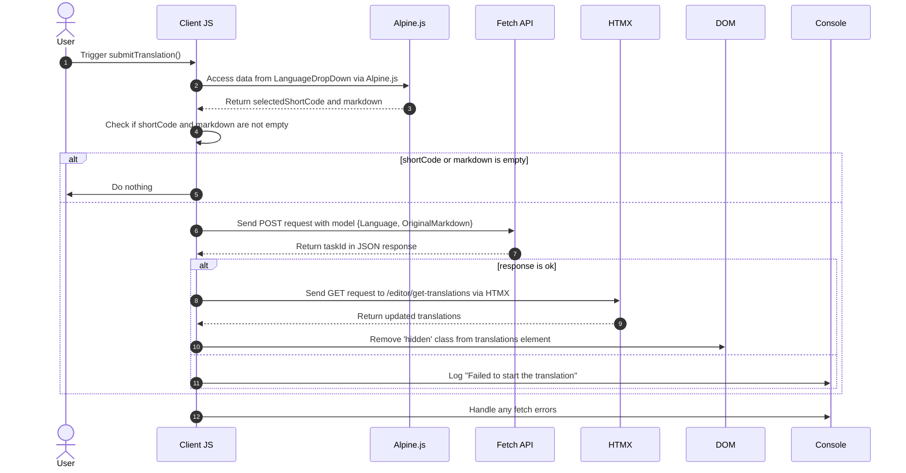

# Hintergrundübersetzungen Pt. 3.............................................................................................................................................................................................................................................................. 

<datetime class="hidden">2024-08-25T03:20</datetime>

<!--category-- EasyNMT, ASP.NET, WebAPI, Alpine, HTMX -->
# Einleitung

In früheren Artikeln haben wir die Bedeutung der Übersetzung im Kontext von Web-Anwendungen diskutiert. Wir haben auch die Verwendung der EasyNMT-Bibliothek erforscht, um Übersetzungen in einer ASP.NET Core-Anwendung durchzuführen. In diesem Beitrag werde ich abdecken, wie ich einen Hintergrund-Service zur Anwendung hinzugefügt, um Ihnen zu erlauben, Übersetzungsanfragen~~~~s, die im Hintergrund verarbeitet werden zu übermitteln.

Auch hier können Sie sehen, alle den Quellcode für diese auf meiner [GitHub](https://github.com/scottgal/mostlylucidweb) Seite.

## Vorherige Artikel

- [Hintergrundübersetzungen Pt. 1.............................................................................................................................................................................................................................................................. ](/blog/backgroundtranslationspt1)
- [Hintergrundübersetzungen Pt. 2.............................................................................................................................................................................................................................................................. ](/blog/backgroundtranslationspt2)

Hier fügen wir ein kleines Werkzeug, das Backround-Jobs an den Service, den wir in Teil 2 detailliert. Dieses Tool ist ein einfaches Formular, mit dem Sie eine Übersetzungsanfrage an den Service senden können. Es wird dann zwischengespeichert und zu einer Warteschlange hinzugefügt, die Ihnen Informationen über den Status der Übersetzung gibt.

[TOC]

Dies fügt Funktionalität hinzu, wo Sie bei der Auswahl eines 'neuen' Dokuments übersetzen können.


# Der Übersetzungscode

## Übersetzungsübersetzer

Auf unserer Markdown-Editor-Seite habe ich einen Code hinzugefügt, der einen kleinen Dropdown enthält (in `_LanguageDropDown.cshtml`), mit dem Sie die Sprache auswählen können, in die Sie übersetzen möchten.

```razor
        @if (Model.IsNew)
                {
                    var translationHidden = Model.TranslationTasks.Any() ? "" : "hidden";
              
                    <p class="text-blue-dark dark:text-blue-light inline-flex  items-center justify-center space-x-2">
                        <partial name="_LanguageDropDown" for="Languages"/>
                        <button class="btn btn-outline btn-sm mt-1" x-on:click="window.mostlylucid.translations.submitTranslation"><i class='bx bx-send'></i>Translate</button>
                    </p>
                    <div id="translations" class="@translationHidden">
                        <partial name="_GetTranslations" model="Model.TranslationTasks" />
                    </div>
                    <div id="translatedcontent" class="hidden">
                        <textarea class="hidden" id="translatedcontentarea"></textarea>
                    </div>
                }
```

#### _SpracheDropDown

Unsere `_LanguageDropDown` Teilansicht ist ein einfacher Dropdown, mit dem Sie die Sprache auswählen können, in die Sie übersetzen möchten. Dies wird aus einer Liste von Sprachen in der `Languages` Eigentum des Modells.

Sie können sehen, dass es Alpine.js verwendet, um den Dropdown zu handhaben und die ausgewählte Sprache und Flagge zu setzen, um im Hauptauswahlteil anzuzeigen. Es setzt auch den kurzen Code der Sprache, die bei der Einreichung der Übersetzungsanfrage verwendet wird.

Die Verwendung von Alping bedeutet, dass wir minimalen, lokal referenzierten JavaScript in unseren Ansichten halten. Dies ist ein guter Weg, um Ihre Ansichten sauber und einfach zu lesen.

```razor
@using Mostlylucid.Helpers
@model List<string>

<div id="LanguageDropDown" x-data="{ 
    open: false, 
    selectedLanguage: 'Select Language', 
    selectedFlag: '' ,
    selectedShortCode:''
}" class="relative inline-block mt-3">
    <!-- Dropdown Button -->
    <button x-on:click="open = !open" class="btn btn-sm btn-outline flex items-center space-x-2">
        <!-- Dynamically Show the Flag Icon -->
        <template x-if="selectedFlag">
            
        </template>
        <span x-text="selectedLanguage"></span>
        <svg xmlns="http://www.w3.org/2000/svg" class="h-4 w-4 ml-2" fill="none" viewBox="0 0 24 24" stroke="currentColor">
            <path stroke-linecap="round" stroke-linejoin="round" stroke-width="2" d="M19 9l-7 7-7-7" />
        </svg>
    </button>

    <!-- Dropdown Menu -->
    <div x-show="open" x-on:click.away="open = false"
         class="absolute left-0 mt-2 w-64 rounded-md shadow-lg dark:bg-custom-dark-bg bg-white ring-1 ring-black ring-opacity-5 z-50">
        <ul class="p-2">
            @foreach (var language in Model)
            {
            <li>
                <a href="#"
                   x-on:click.prevent="selectedLanguage = '@(language.ConvertCodeToLanguage())'; selectedFlag = '/img/flags/@(language).svg'; selectedShortCode='@language'; open = false"
                   class="flex dark:text-white text-black items-center p-2 hover:bg-gray-100">
                     @language.ConvertCodeToLanguage()
                </a>
            </li>
            }
        </ul>
    </div>
</div>
```

### SendenÜbersetzung

Sie werden sehen, dass das hier einen Apline.js Code hat, der in unsere `window.mostlylucid.translations.submitTranslation` Funktion. Diese Funktion ist in unserem `translations.js` Datei, die in unserem `_Layout.cshtml` ..............................................................................................................................

```javascript
export function submitTranslation() {
    const languageDropDown = document.getElementById('LanguageDropDown');

    // Access Alpine.js data using Apline.$data (Alpine.js internal structure)
    const alpineData = Alpine.$data(languageDropDown);
const shortCode = alpineData.selectedShortCode;
const markdown = simplemde.value();
if (shortCode === '' || markdown === '') return;
    
    // Create the data object that matches your model
    const model = {
        Language: shortCode,
        OriginalMarkdown: markdown
    };

// Perform the fetch request to start the translation using POST
    fetch('/api/translate/start-translation', {
        method: 'POST',
        headers: {
            'Content-Type': 'application/json'  // The content type should be JSON
        },
        body: JSON.stringify(model)  // Send the data object as JSON
    })
        .then(function(response) {
            if (response.ok) {
                // Process the returned task ID
                return response.json();  // Parse the JSON response (assuming the task ID is returned in JSON)
            } else {
                console.error('Failed to start the translation');
            }
        })
        .then(function(taskId) {
            if (taskId) {
                console.log("Task ID:", taskId);

                // Trigger an HTMX request to get the translations after saving
                htmx.ajax('get', "/editor/get-translations", {
                    target: '#translations',  // Update this element with the response
                    swap: 'innerHTML',        // Replace the content inside the target
                }).then(function () {
                    // Remove the hidden class after the content is updated
                    document.getElementById('translations').classList.remove('hidden');
                });
            }
        })
        .catch(function(error) {
            // Handle any errors that occur during the fetch
            console.error('An error occurred:', error);
        });
```

#### Sequenzdiagramm

Dieser Code wird im folgenden Sequenzdiagramm beschrieben:



Obwohl das wie eine Menge Code aussieht, ist es eigentlich ganz einfach.

1. Wir senden eine POST-Anfrage an den Server mit der Sprache und dem Markdown-Inhalt. Dies geht zu einem Endpunkt namens `start-translation` die in unserem `TranslationAPI`......................................................................................................... Dies startet die Übersetzungsaufgabe und fügt diese Aufgabe dem Cache für diesen Benutzer hinzu.

2. Der Server reagiert mit einer Task-ID (die wir protokollieren, aber nicht verwenden)

3. Wir senden dann eine GET-Anfrage an den Server, um die Übersetzungen zu erhalten. Dies geschieht mit HTMX, eine Bibliothek, die es Ihnen ermöglicht, Teile der Seite zu aktualisieren, ohne eine ganze Seite zu aktualisieren. Dies ist ein sehr leistungsfähiges Werkzeug und wird an vielen Stellen in dieser Anwendung verwendet.

### Der Endpoint für die Übersetzung starten

Dies ist ein WebAPI-Controller, der Anfragen mit Markdown und einem Sprachcode übernimmt. Es sendet dann die Anfrage an unseren Hintergrund-Übersetzungsserver, zwischenspeichert die Aufgabe wieder tthe UserId (in einem Cookie enthalten) und gibt die Aufgabe Id an den Client zurück.
(Ich habe das ValidateAntiForgeryToken-Attribut für jetzt deaktiviert, da ich es nicht benutze)

```csharp
    [HttpPost("start-translation")]
   // [ValidateAntiForgeryToken]
    public async Task<Results<Ok<string>, BadRequest<string>>> StartTranslation([FromBody] MarkdownTranslationModel model)
    {
        if(ModelState.IsValid == false)
        {
            return TypedResults.BadRequest("Invalid model");
        }
        if(!backgroundTranslateService.TranslationServiceUp)
        {
            return TypedResults.BadRequest("Translation service is down");
        }
        // Create a unique identifier for this translation task
        var taskId = Guid.NewGuid().ToString("N");
        var userId = Request.GetUserId(Response);
       
        // Trigger translation and store the associated task
        var translationTask = await backgroundTranslateService.Translate(model);
    
        var translateTask = new TranslateTask(taskId, DateTime.Now,  model.Language, translationTask);
        translateCacheService.AddTask(userId, translateTask);

        // Return the task ID to the client
        return TypedResults.Ok(taskId);
    }

```

## Der Endpunkt für Übersetzungen

Diese wird mit HTMX angefordert und gibt die Übersetzungen für den aktuellen Benutzer zurück. Dies ist ein einfacher Endpunkt, der die Übersetzungen aus dem Cache erhält und sie an den Client zurückgibt.

```csharp
    [HttpGet]
    [Route("get-translations")]
    public IActionResult GetTranslations()
    {
        var userId = Request.GetUserId(Response);
        var tasks = translateCacheService.GetTasks(userId);
        var translations = tasks.Select(x=> new TranslateResultTask(x, false)).ToList();
        return PartialView("_GetTranslations", translations);
    }
    
```

### Die teilweise Ansicht von Übersetzungen abrufen

Dies ist eine einfache Ansicht, die HTMX verwendet, um den Server alle 5 Sekunden abzufragen, um die Übersetzungen für den aktuellen Benutzer zu erhalten. Es zeigt eine Tabelle mit Übersetzungen mit einem Link, um die Übersetzung anzuzeigen.

Es hat auch die Handhabung für, wenn alle Übersetzungen abgeschlossen sind, um das Polling zu stoppen (durch die Einstellung des Auslösers auf `none`)== Einzelnachweise == Und um eine alternative Nachricht anzuzeigen, wenn es keine Übersetzungen gibt.

Ich benutze auch die Humanizer Bibliothek, um die Zeit anzuzeigen, die genommen wird, um die Übersetzung in einem menschenlesbaren Format abzuschließen.

Daraus ergibt sich diese Ansicht:


```razor
@using Humanizer
@using Mostlylucid.Helpers
@model List<Mostlylucid.MarkdownTranslator.Models.TranslateResultTask>

@{
    var allCompleted = Model.All(x => x.Completed);
    var noTranslations = Model.Count == 0;
    var trigger = allCompleted ? "none" : "every 5s";
    if (noTranslations)
    {
        <div class="alert alert-info" role="alert">
            No translations have been requested yet.
        </div>
    }
    else
    {
        <div class="translationpoller" hx-controller="Editor" hx-action="GetTranslations" hx-get hx-swap="outerHTML" hx-trigger="@trigger">
            <table class="table">
                <thead>
                <th>
                  
                    @Html.DisplayNameFor(model => model[0].TaskId)
                </th>
                <th>
                    @Html.DisplayNameFor(model => model[0].Completed)
                </th>
                <th >
                    @Html.DisplayNameFor(model => model[0].Language)
                </th>
                <th>
                    @Html.DisplayNameFor(model => model[0].TotalMilliseconds)
                </th>
                </thead>
                @foreach (var item in Model)
                {
                    <tr>
                        <td>  <a href="#" x-on:click.prevent="window.mostlylucid.translations.viewTranslation('@item.TaskId')">View</a></td>
                        <td>@if (item.Completed)
                            {
                                <i class='bx bx-check text-green'></i>
                            }
                            else
                            {
                                <i class='bx bx-loader-alt animate-spin dark:text-white text-black'></i>
                            }
                            </td>
                        <td>
                            <p class="flex items-center">
                                
                                @item.Language.ConvertCodeToLanguage()
                            </p>

                        </td>
                        <td>@(TimeSpan.FromMilliseconds(item.TotalMilliseconds).Humanize())</td>
                    </tr>
                }
            </table>
        </div>
    }
}
```

## Die Ansicht Übersetzungsfunktion

Wie Sie in der obigen Ansicht sehen werden, rufen wir in ein wenig Alping onclick, um die Übersetzung zu sehen. Dies ist eine einfache Funktion, die die Übersetzung vom Server erhält und sie in einem Modaldialog anzeigt.

```razor
 <a href="#" x-on:click.prevent="window.mostlylucid.translations.viewTranslation('@item.TaskId')">View</a>
```

Das ruft in die Sache hinein. Alles, was es tut, ist die bevölkerte Transaltion vom Server zu bekommen und zeigt sie auf der Seite an.

```javascript

export function viewTranslation(taskId) {
    // Construct the URL with the query parameters
    const url = `/api/translate/get-translation/${taskId}`;

    // Fetch call to the API endpoint
    fetch(url, {
        method: 'GET',
        headers: {
            'Accept': 'application/json'  // Indicate that we expect a JSON response
        }
    })
        .then(response => {
            if (!response.ok) {
                throw new Error(`HTTP error! Status: ${response.status}`);
            }
            return response.json();
        })
        .then(data =>

        {
            let translatedContentArea = document.getElementById("translatedcontent")
            translatedContentArea.classList.remove("hidden");
            let textArea = document.getElementById('translatedcontentarea');
            textArea.classList.remove('hidden');
            textArea.value = data.originalMarkdown;
            simplemde.value(data.translatedMarkdown);
        })  // Log the successful response data
        .catch(error => console.error('Error:', error));  // Handle any errors
}

```

## Der Endpoint für die Übersetzung erhalten

Dies ist ähnlich der früheren Methode, um eine Liste der Übersetzungen zu erhalten, außer es erhält eine einzige Übersetzung mit der `OriginalMarkdown` und `TranslatedMarkdown` Bevölkert:

```csharp
    [HttpGet]
    [Route("get-translation/{taskId}")]
    public Results<JsonHttpResult<TranslateResultTask>, BadRequest<string>> GetTranslation(string taskId)
    {
        var userId = Request.GetUserId(Response);
        var tasks = translateCacheService.GetTasks(userId);
        var translationTask = tasks.FirstOrDefault(t => t.TaskId == taskId);
        if (translationTask == null) return TypedResults.BadRequest("Task not found");
        var result = new TranslateResultTask(translationTask, true);
        return TypedResults.Json(result);
    }
```

## Schlussfolgerung

Das Ergebnis ist, dass Sie jetzt eine Übersetzungsanfrage einreichen können und den Status der Übersetzung im Editor nach Abschluss sehen können. Ich gehe ins Detail, wie der Übersetzungsdienst im nächsten Beitrag funktioniert.

Ich habe mehr, was ich hier tun möchte, einschließlich des Re-hooking up der Render Markdown-Fluss für den übersetzten Inhalt etc. Aber das; ist der Spaß dieser Website; nicht alles ist komplett poliert, aber es ist alles echte Code, mit dem Sie spielen können, wie ich es ausbaue.
Auch hier können Sie sehen, alle den Quellcode für diese auf meiner [GitHub](https://github.com/scottgal/mostlylucidweb) Seite. Also schauen Sie sich das an, wenn Sie mehr sehen wollen.