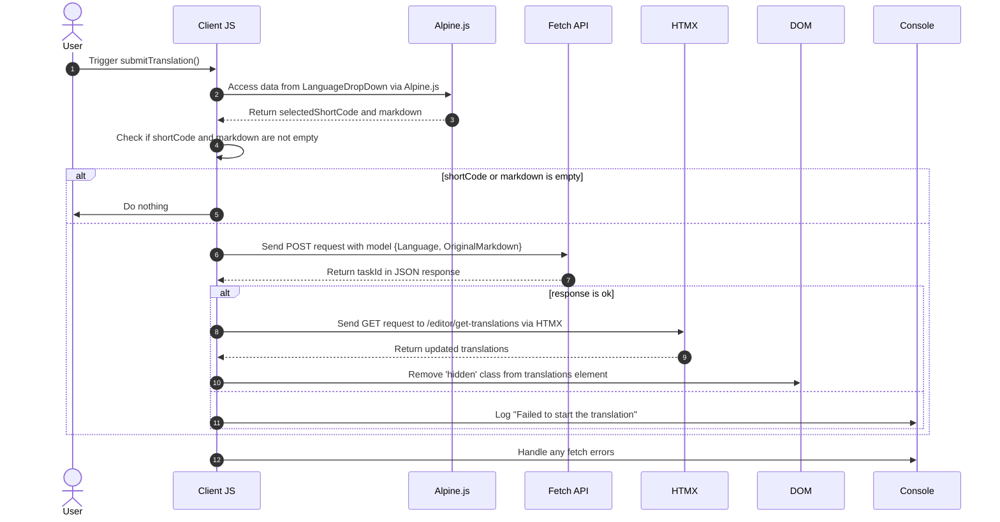

# Background Translations Pt. 3

<datetime class="hidden">2024-08-25T03:20</datetime>

<!--category-- EasyNMT, ASP.NET, WebAPI, Alpine, HTMX -->
# Εισαγωγή

Σε προηγούμενα άρθρα έχουμε συζητήσει τη σημασία της μετάφρασης στο πλαίσιο των διαδικτυακών εφαρμογών. Εξερευνήσαμε επίσης τη χρήση της βιβλιοθήκης EasyNMT για την εκτέλεση μεταφράσεων σε μια εφαρμογή ASP.NET Core. Σε αυτή τη θέση θα καλύψω τον τρόπο με τον οποίο προσέθεσα μια υπηρεσία υποβάθρου στην αίτηση για να σας επιτρέψω να υποβάλετε αίτηση μετάφρασης~~~~ s που υποβάλλονται σε επεξεργασία στο παρασκήνιο.

Και πάλι, μπορείς να δεις όλο τον πηγαίο κώδικα γι' αυτό στο δικό μου [GitHubCity name (optional, probably does not need a translation)](https://github.com/scottgal/mostlylucidweb) Πέιτζ.

## Προηγούμενα άρθρα

- [Background Translations Pt. 1](/blog/backgroundtranslationspt1)
- [Background Translations Pt. 2](/blog/backgroundtranslationspt2)

Εδώ προσθέτουμε ένα μικρό εργαλείο το οποίο υποβάλλει πίσω θέσεις εργασίας στην υπηρεσία που αναλύουμε στο μέρος 2. Αυτό το εργαλείο είναι μια απλή μορφή που σας επιτρέπει να υποβάλετε ένα αίτημα μετάφρασης στην υπηρεσία. Στη συνέχεια είναι cached και προστίθεται σε μια ουρά δίνοντας σας πληροφορίες σχετικά με την κατάσταση της μετάφρασης.

[TOC]

Αυτό προσθέτει λειτουργικότητα όπου κατά την επιλογή ενός 'νέου' εγγράφου μπορείτε να το μεταφράσετε.


# Ο κωδικός μετάφρασης

## Μετάφραση Submitter

Στην σελίδα του εκδότη μας Markdown πρόσθεσα κάποιο κώδικα που περιέχει μια μικρή πτώση κάτω (σε `_LanguageDropDown.cshtml`) η οποία σας επιτρέπει να επιλέξετε τη γλώσσα στην οποία θέλετε να μεταφράσετε.

```razor
        @if (Model.IsNew)
                {
                    var translationHidden = Model.TranslationTasks.Any() ? "" : "hidden";
              
                    <p class="text-blue-dark dark:text-blue-light inline-flex  items-center justify-center space-x-2">
                        <partial name="_LanguageDropDown" for="Languages"/>
                        <button class="btn btn-outline btn-sm mt-1" x-on:click="window.mostlylucid.translations.submitTranslation"><i class='bx bx-send'></i>Translate</button>
                    </p>
                    <div id="translations" class="@translationHidden">
                        <partial name="_GetTranslations" model="Model.TranslationTasks" />
                    </div>
                    <div id="translatedcontent" class="hidden">
                        <textarea class="hidden" id="translatedcontentarea"></textarea>
                    </div>
                }
```

#### _Λήψη γλώσσας

Η δική μας `_LanguageDropDown` μερική προβολή είναι μια απλή πτώση που σας επιτρέπει να επιλέξετε τη γλώσσα που θέλετε να μεταφράσετε. Αυτό είναι κατοικημένο από μια λίστα γλωσσών στο `Languages` ιδιοκτησία του υποδείγματος.

Μπορείτε να δείτε ότι χρησιμοποιεί Alpine.js για να χειριστεί την πτώση και να ρυθμίσετε την επιλεγμένη γλώσσα και σημαία για να δείξει στο κύριο μέρος της επιλογής. Ορίζει επίσης τον σύντομο κώδικα της γλώσσας που χρησιμοποιείται κατά την υποβολή του αιτήματος μετάφρασης.

Χρησιμοποιώντας Alping σημαίνει ότι κρατάμε το ελάχιστο, τοπικά αναφέρεται JavaScript στις απόψεις μας. Αυτός είναι ένας εξαιρετικός τρόπος για να διατηρήσετε τις απόψεις σας καθαρές και εύκολες στο διάβασμα.

```razor
@using Mostlylucid.Helpers
@model List<string>

<div id="LanguageDropDown" x-data="{ 
    open: false, 
    selectedLanguage: 'Select Language', 
    selectedFlag: '' ,
    selectedShortCode:''
}" class="relative inline-block mt-3">
    <!-- Dropdown Button -->
    <button x-on:click="open = !open" class="btn btn-sm btn-outline flex items-center space-x-2">
        <!-- Dynamically Show the Flag Icon -->
        <template x-if="selectedFlag">
            
        </template>
        <span x-text="selectedLanguage"></span>
        <svg xmlns="http://www.w3.org/2000/svg" class="h-4 w-4 ml-2" fill="none" viewBox="0 0 24 24" stroke="currentColor">
            <path stroke-linecap="round" stroke-linejoin="round" stroke-width="2" d="M19 9l-7 7-7-7" />
        </svg>
    </button>

    <!-- Dropdown Menu -->
    <div x-show="open" x-on:click.away="open = false"
         class="absolute left-0 mt-2 w-64 rounded-md shadow-lg dark:bg-custom-dark-bg bg-white ring-1 ring-black ring-opacity-5 z-50">
        <ul class="p-2">
            @foreach (var language in Model)
            {
            <li>
                <a href="#"
                   x-on:click.prevent="selectedLanguage = '@(language.ConvertCodeToLanguage())'; selectedFlag = '/img/flags/@(language).svg'; selectedShortCode='@language'; open = false"
                   class="flex dark:text-white text-black items-center p-2 hover:bg-gray-100">
                     @language.ConvertCodeToLanguage()
                </a>
            </li>
            }
        </ul>
    </div>
</div>
```

### Υποβολή μετάφρασης

Θα δείτε ότι αυτό έχει κάποιο κώδικα Apline.js που καλεί σε μας `window.mostlylucid.translations.submitTranslation` λειτουργία. Αυτή η λειτουργία ορίζεται στο δικό μας `translations.js` αρχείο που περιλαμβάνεται στο δικό μας `_Layout.cshtml` Φάκελος.

```javascript
export function submitTranslation() {
    const languageDropDown = document.getElementById('LanguageDropDown');

    // Access Alpine.js data using Apline.$data (Alpine.js internal structure)
    const alpineData = Alpine.$data(languageDropDown);
const shortCode = alpineData.selectedShortCode;
const markdown = simplemde.value();
if (shortCode === '' || markdown === '') return;
    
    // Create the data object that matches your model
    const model = {
        Language: shortCode,
        OriginalMarkdown: markdown
    };

// Perform the fetch request to start the translation using POST
    fetch('/api/translate/start-translation', {
        method: 'POST',
        headers: {
            'Content-Type': 'application/json'  // The content type should be JSON
        },
        body: JSON.stringify(model)  // Send the data object as JSON
    })
        .then(function(response) {
            if (response.ok) {
                // Process the returned task ID
                return response.json();  // Parse the JSON response (assuming the task ID is returned in JSON)
            } else {
                console.error('Failed to start the translation');
            }
        })
        .then(function(taskId) {
            if (taskId) {
                console.log("Task ID:", taskId);

                // Trigger an HTMX request to get the translations after saving
                htmx.ajax('get', "/editor/get-translations", {
                    target: '#translations',  // Update this element with the response
                    swap: 'innerHTML',        // Replace the content inside the target
                }).then(function () {
                    // Remove the hidden class after the content is updated
                    document.getElementById('translations').classList.remove('hidden');
                });
            }
        })
        .catch(function(error) {
            // Handle any errors that occur during the fetch
            console.error('An error occurred:', error);
        });
```

#### Διάγραμμα ακολουθίας

Ο κωδικός αυτός περιγράφεται στο ακόλουθο διάγραμμα ακολουθίας:



Αν και αυτό μοιάζει με πολύ κώδικα, στην πραγματικότητα είναι αρκετά απλό.

1. Στέλνουμε ένα αίτημα POST στον διακομιστή με τη γλώσσα και το περιεχόμενο markdown. Αυτό πηγαίνει σε ένα τελικό σημείο που ονομάζεται `start-translation` που ορίζεται στο δικό μας `TranslationAPI`. Αυτό ξεκινά από το έργο μετάφρασης και προσθέτει αυτό το έργο στο Cache για αυτό το χρήστη.

2. Ο διακομιστής ανταποκρίνεται με μια ταυτότητα εργασίας (την οποία καταγράφουμε αλλά δεν χρησιμοποιούμε)

3. Στη συνέχεια στέλνουμε ένα αίτημα GET στο διακομιστή για να πάρει τις μεταφράσεις. Αυτό γίνεται χρησιμοποιώντας HTMX η οποία είναι μια βιβλιοθήκη που σας επιτρέπει να ενημερώσετε μέρη της σελίδας χωρίς μια πλήρη σελίδα ανανέωση. Αυτό είναι ένα πολύ ισχυρό εργαλείο και χρησιμοποιείται σε πολλά μέρη σε αυτή την εφαρμογή.

### The Start Translation Endpoint

Αυτό είναι ένα WebAPI χειριστήριο που δέχεται αιτήματα που περιέχουν markdown και ένα γλωσσικό κώδικα. Στη συνέχεια στέλνει το αίτημα στον διακομιστή μας μετάφρασης υποβάθρου, παγιδεύει την εργασία ξανά tthe UserId (που περιέχεται σε ένα cookie) και επιστρέφει την εργασία Id στον πελάτη.
(Απενεργοποίησα το χαρακτηριστικό Validate AntiForgeryToken προς το παρόν, καθώς δεν το χρησιμοποιώ)

```csharp
    [HttpPost("start-translation")]
   // [ValidateAntiForgeryToken]
    public async Task<Results<Ok<string>, BadRequest<string>>> StartTranslation([FromBody] MarkdownTranslationModel model)
    {
        if(ModelState.IsValid == false)
        {
            return TypedResults.BadRequest("Invalid model");
        }
        if(!backgroundTranslateService.TranslationServiceUp)
        {
            return TypedResults.BadRequest("Translation service is down");
        }
        // Create a unique identifier for this translation task
        var taskId = Guid.NewGuid().ToString("N");
        var userId = Request.GetUserId(Response);
       
        // Trigger translation and store the associated task
        var translationTask = await backgroundTranslateService.Translate(model);
    
        var translateTask = new TranslateTask(taskId, DateTime.Now,  model.Language, translationTask);
        translateCacheService.AddTask(userId, translateTask);

        // Return the task ID to the client
        return TypedResults.Ok(taskId);
    }

```

## The Get Translations Endpoint

Αυτό ζητείται με τη χρήση HTMX και επιστρέφει τις μεταφράσεις για τον τρέχοντα χρήστη. Αυτό είναι ένα απλό τελικό σημείο που παίρνει τις μεταφράσεις από την κρύπτη και τις επιστρέφει στον πελάτη.

```csharp
    [HttpGet]
    [Route("get-translations")]
    public IActionResult GetTranslations()
    {
        var userId = Request.GetUserId(Response);
        var tasks = translateCacheService.GetTasks(userId);
        var translations = tasks.Select(x=> new TranslateResultTask(x, false)).ToList();
        return PartialView("_GetTranslations", translations);
    }
    
```

### Η Μερική Άποψη των Μεταφράσεων

Αυτή είναι μια απλή άποψη που χρησιμοποιεί HTMX για να δημοσκοπήσει το διακομιστή κάθε 5 δευτερόλεπτα για να πάρει τις μεταφράσεις για τον τρέχοντα χρήστη. Εμφανίζει έναν πίνακα μεταφράσεων με ένα σύνδεσμο για να δείτε τη μετάφραση.

Έχει επίσης χειρισμό για όταν όλες οι μεταφράσεις είναι πλήρεις για να σταματήσει τη δημοσκόπηση (θέτοντας τη σκανδάλη σε `none`). Και για να εμφανίσετε ένα εναλλακτικό μήνυμα όταν δεν υπάρχουν μεταφράσεις.

Χρησιμοποιώ επίσης τη βιβλιοθήκη Humanizer για να επιδεικνύω το χρόνο που απαιτείται για να ολοκληρώσω τη μετάφραση σε ανθρώπινη ευανάγνωστη μορφή.

Αυτό έχει ως αποτέλεσμα την άποψη αυτή:


```razor
@using Humanizer
@using Mostlylucid.Helpers
@model List<Mostlylucid.MarkdownTranslator.Models.TranslateResultTask>

@{
    var allCompleted = Model.All(x => x.Completed);
    var noTranslations = Model.Count == 0;
    var trigger = allCompleted ? "none" : "every 5s";
    if (noTranslations)
    {
        <div class="alert alert-info" role="alert">
            No translations have been requested yet.
        </div>
    }
    else
    {
        <div class="translationpoller" hx-controller="Editor" hx-action="GetTranslations" hx-get hx-swap="outerHTML" hx-trigger="@trigger">
            <table class="table">
                <thead>
                <th>
                  
                    @Html.DisplayNameFor(model => model[0].TaskId)
                </th>
                <th>
                    @Html.DisplayNameFor(model => model[0].Completed)
                </th>
                <th >
                    @Html.DisplayNameFor(model => model[0].Language)
                </th>
                <th>
                    @Html.DisplayNameFor(model => model[0].TotalMilliseconds)
                </th>
                </thead>
                @foreach (var item in Model)
                {
                    <tr>
                        <td>  <a href="#" x-on:click.prevent="window.mostlylucid.translations.viewTranslation('@item.TaskId')">View</a></td>
                        <td>@if (item.Completed)
                            {
                                <i class='bx bx-check text-green'></i>
                            }
                            else
                            {
                                <i class='bx bx-loader-alt animate-spin dark:text-white text-black'></i>
                            }
                            </td>
                        <td>
                            <p class="flex items-center">
                                
                                @item.Language.ConvertCodeToLanguage()
                            </p>

                        </td>
                        <td>@(TimeSpan.FromMilliseconds(item.TotalMilliseconds).Humanize())</td>
                    </tr>
                }
            </table>
        </div>
    }
}
```

## Η λειτουργία Μετάφρασης Προβολής

Όπως θα δείτε στην παραπάνω άποψη καλούμε σε ένα μικρό Alping onclick για να δείτε τη μετάφραση. Αυτή είναι μια απλή λειτουργία που παίρνει τη μετάφραση από το διακομιστή και την εμφανίζει σε ένα διάλογο τρόπου.

```razor
 <a href="#" x-on:click.prevent="window.mostlylucid.translations.viewTranslation('@item.TaskId')">View</a>
```

Το οποίο απαιτεί αυτό. Το μόνο που κάνει είναι να πάρει το κατοικημένο transaltion από το διακομιστή και να το εμφανίζει στη σελίδα.

```javascript

export function viewTranslation(taskId) {
    // Construct the URL with the query parameters
    const url = `/api/translate/get-translation/${taskId}`;

    // Fetch call to the API endpoint
    fetch(url, {
        method: 'GET',
        headers: {
            'Accept': 'application/json'  // Indicate that we expect a JSON response
        }
    })
        .then(response => {
            if (!response.ok) {
                throw new Error(`HTTP error! Status: ${response.status}`);
            }
            return response.json();
        })
        .then(data =>

        {
            let translatedContentArea = document.getElementById("translatedcontent")
            translatedContentArea.classList.remove("hidden");
            let textArea = document.getElementById('translatedcontentarea');
            textArea.classList.remove('hidden');
            textArea.value = data.originalMarkdown;
            simplemde.value(data.translatedMarkdown);
        })  // Log the successful response data
        .catch(error => console.error('Error:', error));  // Handle any errors
}

```

## The Get Translation Endpoint

Αυτό είναι παρόμοιο με την προηγούμενη μέθοδο για να πάρετε μια λίστα των μεταφράσεων, εκτός από παίρνει μια μόνο μετάφραση με το `OriginalMarkdown` και `TranslatedMarkdown` κατοικημένη:

```csharp
    [HttpGet]
    [Route("get-translation/{taskId}")]
    public Results<JsonHttpResult<TranslateResultTask>, BadRequest<string>> GetTranslation(string taskId)
    {
        var userId = Request.GetUserId(Response);
        var tasks = translateCacheService.GetTasks(userId);
        var translationTask = tasks.FirstOrDefault(t => t.TaskId == taskId);
        if (translationTask == null) return TypedResults.BadRequest("Task not found");
        var result = new TranslateResultTask(translationTask, true);
        return TypedResults.Json(result);
    }
```

## Συμπέρασμα

Το αποτέλεσμα όλων αυτών είναι ότι μπορείτε τώρα να υποβάλετε ένα αίτημα μετάφρασης και να δείτε την κατάσταση της μετάφρασης στον επεξεργαστή αφού ολοκληρωθεί. Θα μπω σε περισσότερες λεπτομέρειες για το πώς λειτουργεί η μεταφραστική υπηρεσία στην επόμενη θέση.

Έχω περισσότερα που θέλω να κάνω εδώ, συμπεριλαμβανομένης της επανασύνδεσης της ροής Render Markdown για το μεταφρασμένο περιεχόμενο κ.λπ. Αλλά αυτό; είναι η διασκέδαση αυτού του site? δεν κάθε tthign είναι εντελώς γυαλισμένο, αλλά είναι όλα πραγματικό κώδικα μπορείτε να παίξετε με καθώς το χτίζω έξω.
Και πάλι, μπορείς να δεις όλο τον πηγαίο κώδικα γι' αυτό στο δικό μου [GitHubCity name (optional, probably does not need a translation)](https://github.com/scottgal/mostlylucidweb) Πέιτζ. Γι' αυτό σε παρακαλώ πήγαινε να το δεις αν θες να δεις κι άλλα.