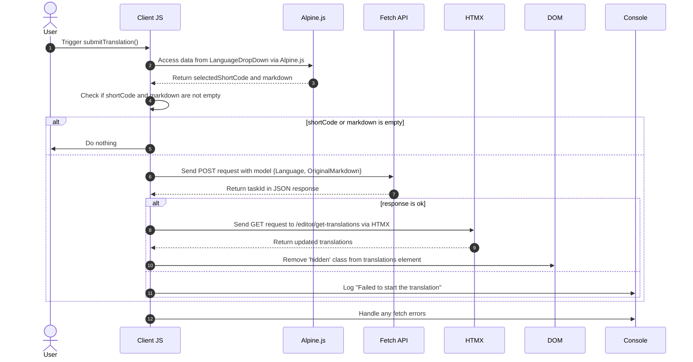

# Traducciones de antecedentes Pt. 3

<datetime class="hidden">2024-08-25T03:20</datetime>

<!--category-- EasyNMT, ASP.NET -->
## Introducción

En artículos anteriores, hemos discutido la importancia de la traducción en el contexto de las aplicaciones web. También hemos explorado el uso de la biblioteca EasyNMT para realizar traducciones en una aplicación ASP.NET Core. En este post cubriré cómo agregué un servicio de fondo a la solicitud para permitirle enviar solicitudes de traducción que se procesan en segundo plano.

De nuevo, puedes ver todo el código fuente para esto en mi [GitHub](https://github.com/scottgal/mostlylucidweb) página.

### Artículos anteriores

- [Traducciones de antecedentes Pt. 1](/blog/backgroundtranslationspt1)
- [Traducciones de antecedentes Pt. 2](/blog/backgroundtranslationspt2)

Aquí añadimos una pequeña herramienta que envía trabajos de backround al servicio que detallamos en la parte 2. Esta herramienta es un formulario simple que le permite enviar una solicitud de traducción al servicio. A continuación, se almacena en caché y se añade a una cola que le da información sobre el estado de la traducción.

[TOC]


## Remitente de traducción

En nuestra página del editor de Markdown agregué un poco de código que contiene un poco desplegable (en `_LanguageDropDown.cshtml`) que le permite seleccionar el idioma al que desea traducir.

```razor
        @if (Model.IsNew)
                {
                    var translationHidden = Model.TranslationTasks.Any() ? "" : "hidden";
              
                    <p class="text-blue-dark dark:text-blue-light inline-flex  items-center justify-center space-x-2">
                        <partial name="_LanguageDropDown" for="Languages"/>
                        <button class="btn btn-outline btn-sm mt-1" x-on:click="window.mostlylucid.translations.submitTranslation"><i class='bx bx-send'></i>Translate</button>
                    </p>
                    <div id="translations" class="@translationHidden">
                        <partial name="_GetTranslations" model="Model.TranslationTasks" />
                    </div>
                    <div id="translatedcontent" class="hidden">
                        <textarea class="hidden" id="translatedcontentarea"></textarea>
                    </div>
                }
```

### EnviarTraducción

Verás que esto tiene algún código Apline.js que llama a nuestro `window.mostlylucid.translations.submitTranslation` función. Esta función se define en nuestra `translations.js` archivo que está incluido en nuestro `_Layout.cshtml` archivo.

```javascript
export function submitTranslation() {
    const languageDropDown = document.getElementById('LanguageDropDown');

    // Access Alpine.js data using __x.$data (Alpine.js internal structure)
    const alpineData = Alpine.$data(languageDropDown);
const shortCode = alpineData.selectedShortCode;
const markdown = simplemde.value();
if (shortCode === '' || markdown === '') return;
    
    // Create the data object that matches your model
    const model = {
        Language: shortCode,
        OriginalMarkdown: markdown
    };

// Perform the fetch request to start the translation using POST
    fetch('/api/translate/start-translation', {
        method: 'POST',
        headers: {
            'Content-Type': 'application/json'  // The content type should be JSON
        },
        body: JSON.stringify(model)  // Send the data object as JSON
    })
        .then(function(response) {
            if (response.ok) {
                // Process the returned task ID
                return response.json();  // Parse the JSON response (assuming the task ID is returned in JSON)
            } else {
                console.error('Failed to start the translation');
            }
        })
        .then(function(taskId) {
            if (taskId) {
                console.log("Task ID:", taskId);

                // Trigger an HTMX request to get the translations after saving
                htmx.ajax('get', "/editor/get-translations", {
                    target: '#translations',  // Update this element with the response
                    swap: 'innerHTML',        // Replace the content inside the target
                }).then(function () {
                    // Remove the hidden class after the content is updated
                    document.getElementById('translations').classList.remove('hidden');
                });
            }
        })
        .catch(function(error) {
            // Handle any errors that occur during the fetch
            console.error('An error occurred:', error);
        });
```

#### Diagrama de secuencia

Este código se describe en el siguiente diagrama de secuencia:



Aunque esto parece un montón de código, en realidad es bastante simple.

1. Enviamos una solicitud POST al servidor con el idioma y el contenido de marcado. Esto va a un punto final llamado `start-translation` que se define en nuestro `TranslationAPI`. Esto inicia la tarea de traducción y añade esta tarea al Cache para este usuario.

2. El servidor responde con una tarea Id (que registramos pero no usamos)

3. Luego enviamos una solicitud GET al servidor para obtener las traducciones. Esto se hace usando HTMX que es una biblioteca que le permite actualizar partes de la página sin una actualización de página completa. Esta es una herramienta muy potente y se utiliza en muchos lugares en esta aplicación.

### El punto final de la traducción de inicio

Este es un controlador WebAPI que toma las peticiones que contienen Markdown y un código de idioma. A continuación, envía la solicitud a nuestro servidor de traducción de fondo, oculta la tarea de nuevo el UserId (contenido en una cookie) y devuelve la tarea Id al cliente.
(Deshabilité el atributo ValidateAntiForgeryToken por ahora, ya que no lo estoy usando)

```csharp
    [HttpPost("start-translation")]
   // [ValidateAntiForgeryToken]
    public async Task<Results<Ok<string>, BadRequest<string>>> StartTranslation([FromBody] MarkdownTranslationModel model)
    {
        if(ModelState.IsValid == false)
        {
            return TypedResults.BadRequest("Invalid model");
        }
        if(!backgroundTranslateService.TranslationServiceUp)
        {
            return TypedResults.BadRequest("Translation service is down");
        }
        // Create a unique identifier for this translation task
        var taskId = Guid.NewGuid().ToString("N");
        var userId = Request.GetUserId(Response);
       
        // Trigger translation and store the associated task
        var translationTask = await backgroundTranslateService.Translate(model);
    
        var translateTask = new TranslateTask(taskId, DateTime.Now,  model.Language, translationTask);
        translateCacheService.AddTask(userId, translateTask);

        // Return the task ID to the client
        return TypedResults.Ok(taskId);
    }

```

### El punto final de obtener traducciones

Esto se solicita utilizando HTMX y devuelve las traducciones para el usuario actual. Este es un punto final simple que obtiene las traducciones de la caché y las devuelve al cliente.

```csharp
    [HttpGet]
    [Route("get-translations")]
    public IActionResult GetTranslations()
    {
        var userId = Request.GetUserId(Response);
        var tasks = translateCacheService.GetTasks(userId);
        var translations = tasks.Select(x=> new TranslateResultTask(x, false)).ToList();
        return PartialView("_GetTranslations", translations);
    }
    
```

### La vista parcial de Obtener traducciones

Esta es una vista sencilla que utiliza HTMX para encuestar el servidor cada 5 segundos para obtener las traducciones para el usuario actual. Muestra una tabla de traducciones con un enlace para ver la traducción.

También tiene manejo para cuando todas las traducciones están completas para detener la votación (estableciendo el gatillo a `none`). Y mostrar un mensaje alternativo cuando no hay traducciones.

También utilizo la biblioteca Humanizer para mostrar el tiempo necesario para completar la traducción en un formato legible por el ser humano.

Esto se traduce en este punto de vista:


```razor
@using Humanizer
@using Mostlylucid.Helpers
@model List<Mostlylucid.MarkdownTranslator.Models.TranslateResultTask>

@{
    var allCompleted = Model.All(x => x.Completed);
    var noTranslations = Model.Count == 0;
    var trigger = allCompleted ? "none" : "every 5s";
    if (noTranslations)
    {
        <div class="alert alert-info" role="alert">
            No translations have been requested yet.
        </div>
    }
    else
    {
        <div class="translationpoller" hx-controller="Editor" hx-action="GetTranslations" hx-get hx-swap="outerHTML" hx-trigger="@trigger">
            <table class="table">
                <thead>
                <th>
                  
                    @Html.DisplayNameFor(model => model[0].TaskId)
                </th>
                <th>
                    @Html.DisplayNameFor(model => model[0].Completed)
                </th>
                <th >
                    @Html.DisplayNameFor(model => model[0].Language)
                </th>
                <th>
                    @Html.DisplayNameFor(model => model[0].TotalMilliseconds)
                </th>
                </thead>
                @foreach (var item in Model)
                {
                    <tr>
                        <td>  <a href="#" x-on:click.prevent="window.mostlylucid.translations.viewTranslation('@item.TaskId')">View</a></td>
                        <td>@if (item.Completed)
                            {
                                <i class='bx bx-check text-green'></i>
                            }
                            else
                            {
                                <i class='bx bx-loader-alt animate-spin dark:text-white text-black'></i>
                            }
                            </td>
                        <td>
                            <p class="flex items-center">
                                
                                @item.Language.ConvertCodeToLanguage()
                            </p>

                        </td>
                        <td>@(TimeSpan.FromMilliseconds(item.TotalMilliseconds).Humanize())</td>
                    </tr>
                }
            </table>
        </div>
    }
}
```

### La función Ver traducción

Como verá en la vista anterior, llamamos a un pequeño Alping onclick para ver la traducción. Esta es una función simple que obtiene la traducción del servidor y la muestra en un diálogo modal.

```razor
 <a href="#" x-on:click.prevent="window.mostlylucid.translations.viewTranslation('@item.TaskId')">View</a>
```

Lo que llama a esto. Todo lo que hace es obtener la transalción poblada del servidor y lo muestra en la página.

```javascript

export function viewTranslation(taskId) {
    // Construct the URL with the query parameters
    const url = `/api/translate/get-translation/${taskId}`;

    // Fetch call to the API endpoint
    fetch(url, {
        method: 'GET',
        headers: {
            'Accept': 'application/json'  // Indicate that we expect a JSON response
        }
    })
        .then(response => {
            if (!response.ok) {
                throw new Error(`HTTP error! Status: ${response.status}`);
            }
            return response.json();
        })
        .then(data =>

        {
            let translatedContentArea = document.getElementById("translatedcontent")
            translatedContentArea.classList.remove("hidden");
            let textArea = document.getElementById('translatedcontentarea');
            textArea.classList.remove('hidden');
            textArea.value = data.originalMarkdown;
            simplemde.value(data.translatedMarkdown);
        })  // Log the successful response data
        .catch(error => console.error('Error:', error));  // Handle any errors
}

```

### El punto final de la traducción

Esto es similar al método anterior para obtener una lista de las traducciones excepto que obtiene una sola traducción con el `OriginalMarkdown` y `TranslatedMarkdown` población:

```csharp
    [HttpGet]
    [Route("get-translation/{taskId}")]
    public Results<JsonHttpResult<TranslateResultTask>, BadRequest<string>> GetTranslation(string taskId)
    {
        var userId = Request.GetUserId(Response);
        var tasks = translateCacheService.GetTasks(userId);
        var translationTask = tasks.FirstOrDefault(t => t.TaskId == taskId);
        if (translationTask == null) return TypedResults.BadRequest("Task not found");
        var result = new TranslateResultTask(translationTask, true);
        return TypedResults.Json(result);
    }
```

## Conclusión

El resultado de todo esto es que ahora puede enviar una solicitud de traducción y ver el estado de la traducción en el editor después de que esté completa. Voy a entrar en más detalles sobre cómo funciona el servicio de traducción en el próximo post.

Tengo más que quiero hacer aquí incluyendo re-ganar el flujo Render Markdown para el contenido traducido, etc. Pero eso; es la diversión de este sitio; no todo está completamente pulido, pero es todo el código real con el que se puede jugar mientras lo construyo.
De nuevo, puedes ver todo el código fuente para esto en mi [GitHub](https://github.com/scottgal/mostlylucidweb) página. Así que por favor ve a ver eso si quieres ver más.