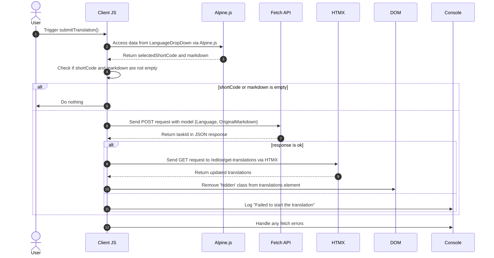

# Taustaa Käännökset Pt. 3

<datetime class="hidden">2024-08-25T03:20</datetime>

<!--category-- EasyNMT, ASP.NET, WebAPI, Alpine, HTMX -->
# Johdanto

Aiemmissa artikkeleissa olemme keskustelleet kääntämisen tärkeydestä verkkosovellusten yhteydessä. Olemme myös tutkineet EasyNMT-kirjaston käyttöä käännösten tekemiseen ASP.NET Core -sovelluksessa. Tässä viestissä selvitän, miten lisäsin hakemuksen taustapalvelun, jotta voit lähettää taustalle käsiteltäviä käännöspyyntöjä.

Jälleen, voit nähdä kaikki lähdekoodin tämän minun [GitHub](https://github.com/scottgal/mostlylucidweb) Sivu.

## Aiemmat artiklat

- [Taustaa Käännökset Pt. 1](/blog/backgroundtranslationspt1)
- [Taustaa Käännökset Pt. 2](/blog/backgroundtranslationspt2)

Lisäämme tähän pienen työkalun, joka lähettää backroll-töitä palveluun, jonka kerroimme osassa 2. Tämä työkalu on yksinkertainen lomake, jonka avulla voit lähettää käännöspyynnön palveluun. Sen jälkeen se on välimuistissa ja lisätty jonoon, josta saat tietoa käännöksen tilasta.

[TOC]

Tämä lisää toiminnallisuutta, jossa "uutta" asiakirjaa valittaessa voi kääntää sen.


# Käännöksen koodi

## Kääntäjä

Markdown-editorisivulle lisäsin koodin, joka sisältää pienen pudotuksen (in `_LanguageDropDown.cshtml`), jonka avulla voit valita kielen, jolle haluat kääntää.

```razor
        @if (Model.IsNew)
                {
                    var translationHidden = Model.TranslationTasks.Any() ? "" : "hidden";
              
                    <p class="text-blue-dark dark:text-blue-light inline-flex  items-center justify-center space-x-2">
                        <partial name="_LanguageDropDown" for="Languages"/>
                        <button class="btn btn-outline btn-sm mt-1" x-on:click="window.mostlylucid.translations.submitTranslation"><i class='bx bx-send'></i>Translate</button>
                    </p>
                    <div id="translations" class="@translationHidden">
                        <partial name="_GetTranslations" model="Model.TranslationTasks" />
                    </div>
                    <div id="translatedcontent" class="hidden">
                        <textarea class="hidden" id="translatedcontentarea"></textarea>
                    </div>
                }
```

#### _LanguageDropDown

Meidän `_LanguageDropDown` Osittainen näkymä on yksinkertainen pudotus, jonka avulla voit valita kielen, jolle haluat kääntää. Tässä on luettelo Euroopan unionin virallisista kielistä. `Languages` mallin omaisuutta.

Voit nähdä, että se käyttää Alpine.js-laitteita pudotuksen hoitamiseen ja valitun kielen ja lipun asettamiseen päävalintaosioon. Siinä on myös lyhyt koodi kielestä, jota käytetään käännöspyynnön jättämisessä.

Alpingin käyttö tarkoittaa, että pidämme näköpiirissämme minimaalisen, paikallisesti referoidun JavaScriptin. Tämä on hieno tapa pitää näkemykset puhtaina ja helppolukuisina.

```razor
@using Mostlylucid.Helpers
@model List<string>

<div id="LanguageDropDown" x-data="{ 
    open: false, 
    selectedLanguage: 'Select Language', 
    selectedFlag: '' ,
    selectedShortCode:''
}" class="relative inline-block mt-3">
    <!-- Dropdown Button -->
    <button x-on:click="open = !open" class="btn btn-sm btn-outline flex items-center space-x-2">
        <!-- Dynamically Show the Flag Icon -->
        <template x-if="selectedFlag">
            
        </template>
        <span x-text="selectedLanguage"></span>
        <svg xmlns="http://www.w3.org/2000/svg" class="h-4 w-4 ml-2" fill="none" viewBox="0 0 24 24" stroke="currentColor">
            <path stroke-linecap="round" stroke-linejoin="round" stroke-width="2" d="M19 9l-7 7-7-7" />
        </svg>
    </button>

    <!-- Dropdown Menu -->
    <div x-show="open" x-on:click.away="open = false"
         class="absolute left-0 mt-2 w-64 rounded-md shadow-lg dark:bg-custom-dark-bg bg-white ring-1 ring-black ring-opacity-5 z-50">
        <ul class="p-2">
            @foreach (var language in Model)
            {
            <li>
                <a href="#"
                   x-on:click.prevent="selectedLanguage = '@(language.ConvertCodeToLanguage())'; selectedFlag = '/img/flags/@(language).svg'; selectedShortCode='@language'; open = false"
                   class="flex dark:text-white text-black items-center p-2 hover:bg-gray-100">
                     @language.ConvertCodeToLanguage()
                </a>
            </li>
            }
        </ul>
    </div>
</div>
```

### LähetäKäännös

Huomaat, että tässä on jokin Apline.js-koodi, joka kutsuu meidän `window.mostlylucid.translations.submitTranslation` Funktio. Tämä toiminto on määritelty meidän `translations.js` tiedosto, joka on mukana meidän `_Layout.cshtml` Kansio.

```javascript
export function submitTranslation() {
    const languageDropDown = document.getElementById('LanguageDropDown');

    // Access Alpine.js data using Apline.$data (Alpine.js internal structure)
    const alpineData = Alpine.$data(languageDropDown);
const shortCode = alpineData.selectedShortCode;
const markdown = simplemde.value();
if (shortCode === '' || markdown === '') return;
    
    // Create the data object that matches your model
    const model = {
        Language: shortCode,
        OriginalMarkdown: markdown
    };

// Perform the fetch request to start the translation using POST
    fetch('/api/translate/start-translation', {
        method: 'POST',
        headers: {
            'Content-Type': 'application/json'  // The content type should be JSON
        },
        body: JSON.stringify(model)  // Send the data object as JSON
    })
        .then(function(response) {
            if (response.ok) {
                // Process the returned task ID
                return response.json();  // Parse the JSON response (assuming the task ID is returned in JSON)
            } else {
                console.error('Failed to start the translation');
            }
        })
        .then(function(taskId) {
            if (taskId) {
                console.log("Task ID:", taskId);

                // Trigger an HTMX request to get the translations after saving
                htmx.ajax('get', "/editor/get-translations", {
                    target: '#translations',  // Update this element with the response
                    swap: 'innerHTML',        // Replace the content inside the target
                }).then(function () {
                    // Remove the hidden class after the content is updated
                    document.getElementById('translations').classList.remove('hidden');
                });
            }
        })
        .catch(function(error) {
            // Handle any errors that occur during the fetch
            console.error('An error occurred:', error);
        });
```

#### Sarjakaavio

Tämä koodi on kuvattu seuraavassa sarjakaaviossa:



Vaikka tämä näyttää paljolta koodilta, se on itse asiassa melko yksinkertaista.

1. Lähetämme palvelimelle POST-pyynnön, jossa on kieli ja markown-sisältö. Tämä johtaa päätetapahtumaan nimeltä `start-translation` joka on määritelty meidän `TranslationAPI`...................................................................................................................................... Tämä aloittaa käännöstehtävän ja lisää tämän tehtävän tälle käyttäjälle Cacheen.

2. Palvelin vastaa tehtävätunnisteella (jota kirjaudumme, mutta emme käytä)

3. Lähetämme sitten GET-pyynnön palvelimelle saadaksemme käännökset. Tämä tehdään käyttämällä HTMX:ää, joka on kirjasto, jonka avulla voit päivittää osia sivusta ilman koko sivun päivitystä. Tämä on erittäin tehokas työkalu ja sitä käytetään monin paikoin tässä sovelluksessa.

### Alkukäännöksen päätepiste

Tämä on WebAPI-ohjain, joka ottaa vastaan pyynnöt, jotka sisältävät markownin ja kielikoodin. Sen jälkeen se lähettää pyynnön taustakäännöspalvelimellemme, siirtää tehtävän uudelleen käyttäjätunnukselle (evästeessä) ja palauttaa tehtävän Id asiakkaalle.
( poistin ValidoituAntiForgeryToken -attribuutin toistaiseksi, koska en käytä sitä)

```csharp
    [HttpPost("start-translation")]
   // [ValidateAntiForgeryToken]
    public async Task<Results<Ok<string>, BadRequest<string>>> StartTranslation([FromBody] MarkdownTranslationModel model)
    {
        if(ModelState.IsValid == false)
        {
            return TypedResults.BadRequest("Invalid model");
        }
        if(!backgroundTranslateService.TranslationServiceUp)
        {
            return TypedResults.BadRequest("Translation service is down");
        }
        // Create a unique identifier for this translation task
        var taskId = Guid.NewGuid().ToString("N");
        var userId = Request.GetUserId(Response);
       
        // Trigger translation and store the associated task
        var translationTask = await backgroundTranslateService.Translate(model);
    
        var translateTask = new TranslateTask(taskId, DateTime.Now,  model.Language, translationTask);
        translateCacheService.AddTask(userId, translateTask);

        // Return the task ID to the client
        return TypedResults.Ok(taskId);
    }

```

## Käännösten saamisen päätepiste

Tämä pyydetään käyttämällä HTMX:ää ja palauttaa käännökset nykyiselle käyttäjälle. Tämä on yksinkertainen päätetapahtuma, joka saa käännökset välimuistista ja palauttaa ne asiakkaalle.

```csharp
    [HttpGet]
    [Route("get-translations")]
    public IActionResult GetTranslations()
    {
        var userId = Request.GetUserId(Response);
        var tasks = translateCacheService.GetTasks(userId);
        var translations = tasks.Select(x=> new TranslateResultTask(x, false)).ToList();
        return PartialView("_GetTranslations", translations);
    }
    
```

### Käännökset osittainen näkemys

Tämä on yksinkertainen näkymä, joka käyttää HTMX:ää palvelimen kyselyyn 5 sekunnin välein saadakseen käännökset nykyiselle käyttäjälle. Siinä on käännöstaulukko, jossa on linkki käännöksen katseluun.

Siinä käsitellään myös sitä, milloin kaikki käännökset ovat valmiita äänestysten lopettamiseksi (asettamalla laukaisin `none`). Ja näyttää vaihtoehtoinen viesti, kun käännöstä ei ole.

Käytän myös Humanizer-kirjastoa näyttääkseni, kuinka paljon aikaa käännökseen kuluu ihmisen luettavassa muodossa.

Tämä johtaa tähän näkemykseen:


```razor
@using Humanizer
@using Mostlylucid.Helpers
@model List<Mostlylucid.MarkdownTranslator.Models.TranslateResultTask>

@{
    var allCompleted = Model.All(x => x.Completed);
    var noTranslations = Model.Count == 0;
    var trigger = allCompleted ? "none" : "every 5s";
    if (noTranslations)
    {
        <div class="alert alert-info" role="alert">
            No translations have been requested yet.
        </div>
    }
    else
    {
        <div class="translationpoller" hx-controller="Editor" hx-action="GetTranslations" hx-get hx-swap="outerHTML" hx-trigger="@trigger">
            <table class="table">
                <thead>
                <th>
                  
                    @Html.DisplayNameFor(model => model[0].TaskId)
                </th>
                <th>
                    @Html.DisplayNameFor(model => model[0].Completed)
                </th>
                <th >
                    @Html.DisplayNameFor(model => model[0].Language)
                </th>
                <th>
                    @Html.DisplayNameFor(model => model[0].TotalMilliseconds)
                </th>
                </thead>
                @foreach (var item in Model)
                {
                    <tr>
                        <td>  <a href="#" x-on:click.prevent="window.mostlylucid.translations.viewTranslation('@item.TaskId')">View</a></td>
                        <td>@if (item.Completed)
                            {
                                <i class='bx bx-check text-green'></i>
                            }
                            else
                            {
                                <i class='bx bx-loader-alt animate-spin dark:text-white text-black'></i>
                            }
                            </td>
                        <td>
                            <p class="flex items-center">
                                
                                @item.Language.ConvertCodeToLanguage()
                            </p>

                        </td>
                        <td>@(TimeSpan.FromMilliseconds(item.TotalMilliseconds).Humanize())</td>
                    </tr>
                }
            </table>
        </div>
    }
}
```

## View Translation -toiminto

Kuten näette yllä olevasta näkymästä, pyydämme pientä Alping-painiketta nähdäksesi käännöksen. Tämä on yksinkertainen toiminto, joka saa käännöksen palvelimelta ja näyttää sen modaaliikkunassa.

```razor
 <a href="#" x-on:click.prevent="window.mostlylucid.translations.viewTranslation('@item.TaskId')">View</a>
```

Mikä on syynä tähän. Se vain saa asutun transaktion palvelimelta ja näyttää sen sivulla.

```javascript

export function viewTranslation(taskId) {
    // Construct the URL with the query parameters
    const url = `/api/translate/get-translation/${taskId}`;

    // Fetch call to the API endpoint
    fetch(url, {
        method: 'GET',
        headers: {
            'Accept': 'application/json'  // Indicate that we expect a JSON response
        }
    })
        .then(response => {
            if (!response.ok) {
                throw new Error(`HTTP error! Status: ${response.status}`);
            }
            return response.json();
        })
        .then(data =>

        {
            let translatedContentArea = document.getElementById("translatedcontent")
            translatedContentArea.classList.remove("hidden");
            let textArea = document.getElementById('translatedcontentarea');
            textArea.classList.remove('hidden');
            textArea.value = data.originalMarkdown;
            simplemde.value(data.translatedMarkdown);
        })  // Log the successful response data
        .catch(error => console.error('Error:', error));  // Handle any errors
}

```

## Käännöksen päätelmä

Tämä on samanlainen kuin aiempi tapa saada lista käännöksistä, paitsi se saa yhden käännöksen kanssa `OriginalMarkdown` sekä `TranslatedMarkdown` asuttu:

```csharp
    [HttpGet]
    [Route("get-translation/{taskId}")]
    public Results<JsonHttpResult<TranslateResultTask>, BadRequest<string>> GetTranslation(string taskId)
    {
        var userId = Request.GetUserId(Response);
        var tasks = translateCacheService.GetTasks(userId);
        var translationTask = tasks.FirstOrDefault(t => t.TaskId == taskId);
        if (translationTask == null) return TypedResults.BadRequest("Task not found");
        var result = new TranslateResultTask(translationTask, true);
        return TypedResults.Json(result);
    }
```

## Johtopäätöksenä

Kaiken tämän seurauksena voit nyt jättää käännöspyynnön ja katsoa käännöksen tilan editorissa sen jälkeen, kun se on valmis. Luen tarkemmin, miten käännöspalvelu toimii seuraavassa viestissä.

Minulla on enemmän tekemistä täällä, kuten Render Markdownin virran uudelleen kytkeminen käännettyyn sisältöön jne. Mutta se on tämän sivuston hauskinta; jokapäiväistä ei ole täysin hiottu, mutta se on kaikki todellinen koodi, jolla voi pelata, kun rakennan sen ulos.
Jälleen, voit nähdä kaikki lähdekoodin tämän minun [GitHub](https://github.com/scottgal/mostlylucidweb) Sivu. Joten mene katsomaan sitä, jos haluat nähdä lisää.