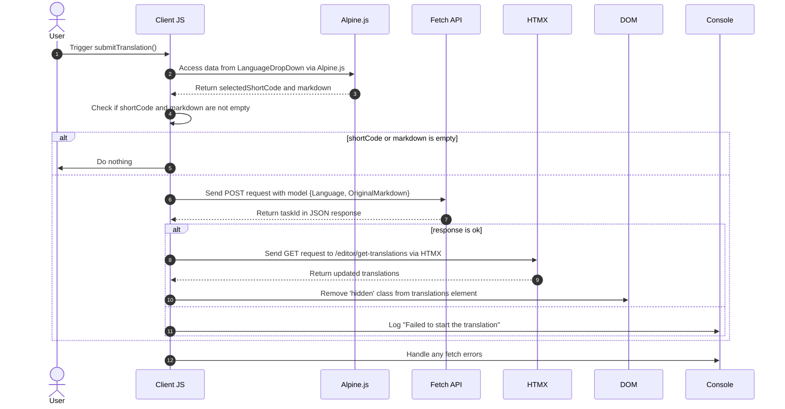

# Contexte Traductions Pt. 3

<datetime class="hidden">2024-08-25T03:20</datetime>

<!--category-- EasyNMT, ASP.NET, WebAPI, Alpine, HTMX -->
# Présentation

Dans les articles précédents, nous avons discuté de l'importance de la traduction dans le contexte des applications Web. Nous avons également exploré l'utilisation de la bibliothèque EasyNMT pour effectuer des traductions dans une application ASP.NET Core. Dans ce post, je vais vous expliquer comment j'ai ajouté un service d'arrière-plan à la demande pour vous permettre de soumettre des demandes de traduction qui sont traitées en arrière-plan.

Encore une fois, vous pouvez voir tout le code source pour ceci sur mon [GitHub](https://github.com/scottgal/mostlylucidweb) page.

## Articles précédents

- [Contexte Traductions Pt. 1](/blog/backgroundtranslationspt1)
- [Contexte Traductions Pt. 2](/blog/backgroundtranslationspt2)

Ici, nous ajoutons un petit outil qui soumet les emplois de retour au service que nous détaillons dans la partie 2. Cet outil est un formulaire simple qui vous permet de soumettre une demande de traduction au service. Il est ensuite mis en cache et ajouté à une file d'attente vous donnant des informations sur l'état de la traduction.

[TOC]

Cela ajoute des fonctionnalités où lors de la sélection d'un « nouveau » document, vous pouvez le traduire.


# Le Code de la traduction

## Auteur de la traduction

Sur notre page d'éditeur de Markdown j'ai ajouté un code qui contient un peu de goutte vers le bas (dans `_LanguageDropDown.cshtml`) qui vous permet de sélectionner la langue dans laquelle vous voulez traduire.

```razor
        @if (Model.IsNew)
                {
                    var translationHidden = Model.TranslationTasks.Any() ? "" : "hidden";
              
                    <p class="text-blue-dark dark:text-blue-light inline-flex  items-center justify-center space-x-2">
                        <partial name="_LanguageDropDown" for="Languages"/>
                        <button class="btn btn-outline btn-sm mt-1" x-on:click="window.mostlylucid.translations.submitTranslation"><i class='bx bx-send'></i>Translate</button>
                    </p>
                    <div id="translations" class="@translationHidden">
                        <partial name="_GetTranslations" model="Model.TranslationTasks" />
                    </div>
                    <div id="translatedcontent" class="hidden">
                        <textarea class="hidden" id="translatedcontentarea"></textarea>
                    </div>
                }
```

#### _LangueDropDown

Notre `_LanguageDropDown` vue partielle est une simple liste déroulante qui vous permet de sélectionner la langue dans laquelle vous voulez traduire. Ceci est peuplé d'une liste de langues dans le `Languages` propriété du modèle.

Vous pouvez voir qu'il utilise Alpine.js pour gérer le menu déroulant et pour définir la langue et le drapeau sélectionnés à afficher dans la partie principale de la sélection. Il définit également le code court de la langue utilisée lors de la présentation de la demande de traduction.

En utilisant Alping signifie que nous conservons le JavaScript minimal, référencé localement dans nos vues. C'est une excellente façon de garder vos vues propres et faciles à lire.

```razor
@using Mostlylucid.Helpers
@model List<string>

<div id="LanguageDropDown" x-data="{ 
    open: false, 
    selectedLanguage: 'Select Language', 
    selectedFlag: '' ,
    selectedShortCode:''
}" class="relative inline-block mt-3">
    <!-- Dropdown Button -->
    <button x-on:click="open = !open" class="btn btn-sm btn-outline flex items-center space-x-2">
        <!-- Dynamically Show the Flag Icon -->
        <template x-if="selectedFlag">
            
        </template>
        <span x-text="selectedLanguage"></span>
        <svg xmlns="http://www.w3.org/2000/svg" class="h-4 w-4 ml-2" fill="none" viewBox="0 0 24 24" stroke="currentColor">
            <path stroke-linecap="round" stroke-linejoin="round" stroke-width="2" d="M19 9l-7 7-7-7" />
        </svg>
    </button>

    <!-- Dropdown Menu -->
    <div x-show="open" x-on:click.away="open = false"
         class="absolute left-0 mt-2 w-64 rounded-md shadow-lg dark:bg-custom-dark-bg bg-white ring-1 ring-black ring-opacity-5 z-50">
        <ul class="p-2">
            @foreach (var language in Model)
            {
            <li>
                <a href="#"
                   x-on:click.prevent="selectedLanguage = '@(language.ConvertCodeToLanguage())'; selectedFlag = '/img/flags/@(language).svg'; selectedShortCode='@language'; open = false"
                   class="flex dark:text-white text-black items-center p-2 hover:bg-gray-100">
                     @language.ConvertCodeToLanguage()
                </a>
            </li>
            }
        </ul>
    </div>
</div>
```

### Soumettre la traduction

Vous verrez que cela a un code Apline.js qui appelle dans notre `window.mostlylucid.translations.submitTranslation` fonction. Cette fonction est définie dans notre `translations.js` fichier qui est inclus dans notre `_Layout.cshtml` fichier.

```javascript
export function submitTranslation() {
    const languageDropDown = document.getElementById('LanguageDropDown');

    // Access Alpine.js data using Apline.$data (Alpine.js internal structure)
    const alpineData = Alpine.$data(languageDropDown);
const shortCode = alpineData.selectedShortCode;
const markdown = simplemde.value();
if (shortCode === '' || markdown === '') return;
    
    // Create the data object that matches your model
    const model = {
        Language: shortCode,
        OriginalMarkdown: markdown
    };

// Perform the fetch request to start the translation using POST
    fetch('/api/translate/start-translation', {
        method: 'POST',
        headers: {
            'Content-Type': 'application/json'  // The content type should be JSON
        },
        body: JSON.stringify(model)  // Send the data object as JSON
    })
        .then(function(response) {
            if (response.ok) {
                // Process the returned task ID
                return response.json();  // Parse the JSON response (assuming the task ID is returned in JSON)
            } else {
                console.error('Failed to start the translation');
            }
        })
        .then(function(taskId) {
            if (taskId) {
                console.log("Task ID:", taskId);

                // Trigger an HTMX request to get the translations after saving
                htmx.ajax('get', "/editor/get-translations", {
                    target: '#translations',  // Update this element with the response
                    swap: 'innerHTML',        // Replace the content inside the target
                }).then(function () {
                    // Remove the hidden class after the content is updated
                    document.getElementById('translations').classList.remove('hidden');
                });
            }
        })
        .catch(function(error) {
            // Handle any errors that occur during the fetch
            console.error('An error occurred:', error);
        });
```

#### Diagramme de séquence

Ce code est décrit dans le diagramme de séquence suivant:



Bien que cela ressemble à beaucoup de code, c'est en fait assez simple.

1. Nous envoyons une requête POST au serveur avec la langue et le contenu de balisage. Ceci va à un point d'arrêt appelé `start-translation` qui est défini dans notre `TranslationAPI`C'est ce que j'ai dit. Cela démarre la tâche de traduction et ajoute cette tâche à la Cache pour cet utilisateur.

2. Le serveur répond avec une tâche Id (que nous logons mais que nous n'utilisons pas)

3. Nous envoyons ensuite une demande GET au serveur pour obtenir les traductions. Ceci est fait en utilisant HTMX qui est une bibliothèque qui vous permet de mettre à jour des parties de la page sans une mise à jour complète de la page. C'est un outil très puissant et est utilisé dans de nombreux endroits dans cette application.

### Le point d'arrivée du début de la traduction

Il s'agit d'un contrôleur WebAPI qui prend des requêtes contenant un balisage et un code de langue. Il envoie ensuite la requête à notre serveur de traduction de fond, cache à nouveau la tâche UserId (contenue dans un cookie) et retourne l'identifiant de tâche au client.
(J'ai désactivé l'attribut ValiderAntiForgeryToken pour le moment car je ne l'utilise pas)

```csharp
    [HttpPost("start-translation")]
   // [ValidateAntiForgeryToken]
    public async Task<Results<Ok<string>, BadRequest<string>>> StartTranslation([FromBody] MarkdownTranslationModel model)
    {
        if(ModelState.IsValid == false)
        {
            return TypedResults.BadRequest("Invalid model");
        }
        if(!backgroundTranslateService.TranslationServiceUp)
        {
            return TypedResults.BadRequest("Translation service is down");
        }
        // Create a unique identifier for this translation task
        var taskId = Guid.NewGuid().ToString("N");
        var userId = Request.GetUserId(Response);
       
        // Trigger translation and store the associated task
        var translationTask = await backgroundTranslateService.Translate(model);
    
        var translateTask = new TranslateTask(taskId, DateTime.Now,  model.Language, translationTask);
        translateCacheService.AddTask(userId, translateTask);

        // Return the task ID to the client
        return TypedResults.Ok(taskId);
    }

```

## Le point d'arrivée de Get Translations

Ceci est demandé en utilisant HTMX et renvoie les traductions pour l'utilisateur actuel. Il s'agit d'un paramètre simple qui obtient les traductions du cache et les renvoie au client.

```csharp
    [HttpGet]
    [Route("get-translations")]
    public IActionResult GetTranslations()
    {
        var userId = Request.GetUserId(Response);
        var tasks = translateCacheService.GetTasks(userId);
        var translations = tasks.Select(x=> new TranslateResultTask(x, false)).ToList();
        return PartialView("_GetTranslations", translations);
    }
    
```

### La vue partielle Get Translations

Il s'agit d'une vue simple qui utilise HTMX pour interroger le serveur toutes les 5 secondes pour obtenir les traductions pour l'utilisateur actuel. Il affiche un tableau de traductions avec un lien pour visualiser la traduction.

Il a également le traitement pour quand toutes les traductions sont terminées pour arrêter le sondage (en réglant le déclencheur à `none`)............................................................................................................................................................................................................................................................................................................................................................................................................................................................................................................................. Et d'afficher un message alternatif quand il n'y a pas de traduction.

J'utilise également la bibliothèque Humanizer pour afficher le temps nécessaire pour compléter la traduction dans un format lisible par l'homme.

Il en résulte ce point de vue :


```razor
@using Humanizer
@using Mostlylucid.Helpers
@model List<Mostlylucid.MarkdownTranslator.Models.TranslateResultTask>

@{
    var allCompleted = Model.All(x => x.Completed);
    var noTranslations = Model.Count == 0;
    var trigger = allCompleted ? "none" : "every 5s";
    if (noTranslations)
    {
        <div class="alert alert-info" role="alert">
            No translations have been requested yet.
        </div>
    }
    else
    {
        <div class="translationpoller" hx-controller="Editor" hx-action="GetTranslations" hx-get hx-swap="outerHTML" hx-trigger="@trigger">
            <table class="table">
                <thead>
                <th>
                  
                    @Html.DisplayNameFor(model => model[0].TaskId)
                </th>
                <th>
                    @Html.DisplayNameFor(model => model[0].Completed)
                </th>
                <th >
                    @Html.DisplayNameFor(model => model[0].Language)
                </th>
                <th>
                    @Html.DisplayNameFor(model => model[0].TotalMilliseconds)
                </th>
                </thead>
                @foreach (var item in Model)
                {
                    <tr>
                        <td>  <a href="#" x-on:click.prevent="window.mostlylucid.translations.viewTranslation('@item.TaskId')">View</a></td>
                        <td>@if (item.Completed)
                            {
                                <i class='bx bx-check text-green'></i>
                            }
                            else
                            {
                                <i class='bx bx-loader-alt animate-spin dark:text-white text-black'></i>
                            }
                            </td>
                        <td>
                            <p class="flex items-center">
                                
                                @item.Language.ConvertCodeToLanguage()
                            </p>

                        </td>
                        <td>@(TimeSpan.FromMilliseconds(item.TotalMilliseconds).Humanize())</td>
                    </tr>
                }
            </table>
        </div>
    }
}
```

## La fonction de traduction de la vue

Comme vous le verrez dans la vue ci-dessus, nous appelons dans un petit Alping onclick pour voir la traduction. Il s'agit d'une fonction simple qui obtient la traduction du serveur et l'affiche dans une boîte de dialogue modale.

```razor
 <a href="#" x-on:click.prevent="window.mostlylucid.translations.viewTranslation('@item.TaskId')">View</a>
```

Ce qui appelle là-dedans. Tout ce qu'il fait, c'est obtenir la transaltion peuplée du serveur et l'afficher dans la page.

```javascript

export function viewTranslation(taskId) {
    // Construct the URL with the query parameters
    const url = `/api/translate/get-translation/${taskId}`;

    // Fetch call to the API endpoint
    fetch(url, {
        method: 'GET',
        headers: {
            'Accept': 'application/json'  // Indicate that we expect a JSON response
        }
    })
        .then(response => {
            if (!response.ok) {
                throw new Error(`HTTP error! Status: ${response.status}`);
            }
            return response.json();
        })
        .then(data =>

        {
            let translatedContentArea = document.getElementById("translatedcontent")
            translatedContentArea.classList.remove("hidden");
            let textArea = document.getElementById('translatedcontentarea');
            textArea.classList.remove('hidden');
            textArea.value = data.originalMarkdown;
            simplemde.value(data.translatedMarkdown);
        })  // Log the successful response data
        .catch(error => console.error('Error:', error));  // Handle any errors
}

```

## Le point d'arrivée de la traduction

Ceci est similaire à la méthode précédente pour obtenir une liste des traductions, sauf qu'il obtient une seule traduction avec le `OriginalMarkdown` et `TranslatedMarkdown` population:

```csharp
    [HttpGet]
    [Route("get-translation/{taskId}")]
    public Results<JsonHttpResult<TranslateResultTask>, BadRequest<string>> GetTranslation(string taskId)
    {
        var userId = Request.GetUserId(Response);
        var tasks = translateCacheService.GetTasks(userId);
        var translationTask = tasks.FirstOrDefault(t => t.TaskId == taskId);
        if (translationTask == null) return TypedResults.BadRequest("Task not found");
        var result = new TranslateResultTask(translationTask, true);
        return TypedResults.Json(result);
    }
```

## En conclusion

Le résultat de tout cela est que vous pouvez maintenant soumettre une demande de traduction et voir l'état de la traduction dans l'éditeur une fois qu'elle est terminée. Je vais aller plus loin sur la façon dont le service de traduction fonctionne dans le prochain post.

J'ai plus de choses à faire ici, y compris le re-hoking vers le haut du flux Render Markdown pour le contenu traduit, etc. Mais c'est ça, c'est le plaisir de ce site, pas tout n'est complètement poli, mais c'est tout le vrai code avec lequel vous pouvez jouer pendant que je le construis.
Encore une fois, vous pouvez voir tout le code source pour ceci sur mon [GitHub](https://github.com/scottgal/mostlylucidweb) page. Alors, allez voir ça si vous voulez en voir plus.