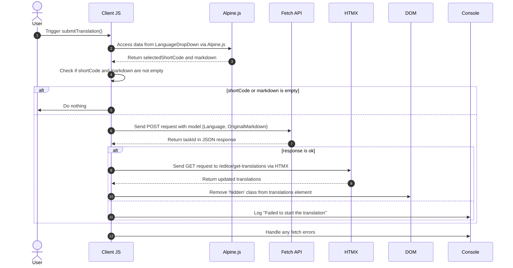

# पृष्ठभूमि अनुवाद Pt. 3

<datetime class="hidden">2024- 0. 2525टी0: 20</datetime>

<!--category-- EasyNMT, ASP.NET, WebAPI, Alpine, HTMX -->
# परिचय

पिछले लेखों में हमने वेब अनुप्रयोगों के संदर्भ में अनुवाद की अहमियत के बारे में चर्चा की है । हमने एक ऐसी भाषा में अनुवाद करने के लिए आसानNMBT लाइब्रेरी का भी इस्तेमाल ढूँढ़ निकाला है । इस पोस्ट में मैं कवर करता हूँ कि कैसे मैंने अनुप्रयोग के लिए एक पृष्ठभूमि सेवा जोड़ी...... अनुप्रयोग के लिए आपको अनुवाद निवेदन स्वीकार करने के लिए अनुमति देने के लिए, चलो चलो जाएँ कि पृष्ठभूमि में प्रोसेस कर रहे हैं.

फिर से, आप मेरे इस पर इस के लिए सभी स्रोत कोड देख सकते हैं [GiHh](https://github.com/scottgal/mostlylucidweb) पृष्ठ.

## पिछला आलेख

- [पृष्ठभूमि अनुवाद Pt. 1](/blog/backgroundtranslationspt1)
- [पृष्ठभूमि अनुवाद Pt. 2](/blog/backgroundtranslationspt2)

यहाँ हम एक छोटे से औज़ार जोड़ते हैं जो वापस आ रहे काम को व्यवस्थित करने के लिए हम भाग 2 में विस्तृत सेवा। यह औज़ार एक सरल रूप है जो आपको सेवा के लिए अनुवाद निवेदन स्वीकार करने देता है । यह तब कैश्ड और अनुवाद की स्थिति पर आप जानकारी दे एक कतार में जोड़ा है.

[विषय

जब आप किसी 'नया' दस्तावेज़ को चुनते हैं तो यह प्रकार्य भी जोड़ता है.


# अनुवाद कोड

## अनुवाद जमा करने वाला

हमारे मार्किड संपादक पृष्ठ पर मैंने कुछ कोड जोड़ा है जो नीचे गिरा हुआ है (इन में) `_LanguageDropDown.cshtml`) जो आपको अनुवाद करने की अनुमति देता है उस भाषा को चुनने की अनुमति देता है जिसका अनुवाद आप करना चाहते हैं.

```razor
        @if (Model.IsNew)
                {
                    var translationHidden = Model.TranslationTasks.Any() ? "" : "hidden";
              
                    <p class="text-blue-dark dark:text-blue-light inline-flex  items-center justify-center space-x-2">
                        <partial name="_LanguageDropDown" for="Languages"/>
                        <button class="btn btn-outline btn-sm mt-1" x-on:click="window.mostlylucid.translations.submitTranslation"><i class='bx bx-send'></i>Translate</button>
                    </p>
                    <div id="translations" class="@translationHidden">
                        <partial name="_GetTranslations" model="Model.TranslationTasks" />
                    </div>
                    <div id="translatedcontent" class="hidden">
                        <textarea class="hidden" id="translatedcontentarea"></textarea>
                    </div>
                }
```

#### _भाषा- मण्डल- नीचे

हमारा `_LanguageDropDown` आंशिक दृश्य एक सरल ड्रॉपर है जो आपको उस भाषा को चुनने देता है जिसका अनुवाद आप करना चाहते हैं. यह भाषाओं की सूची से जुड़ा हुआ है `Languages` मॉडल का गुण.

आप देख सकते हैं कि यह ड्रॉप डाउन को संभालने और मुख्य चयन भाग में चुनी गई भाषा और फ्लैग को दिखाने के लिए अप्रयोगात्मक उपयोग करता है. यह अनुवाद आग्रह करते समय इस्तेमाल की गयी भाषा के छोटे - छोटे कोड को भी स्थापित करता है ।

एलिंगिंग का प्रयोग करने का अर्थ है कि हम कम से कम, स्थानीय रूप से स्थानीय जावास्क्रिप्ट को अपने दृष्टिकोण में रखते हैं । यह पढ़ने के लिए अपने दृष्टिकोण को स्वच्छ रखने और आसान रखने का एक महान तरीक़ा है ।

```razor
@using Mostlylucid.Helpers
@model List<string>

<div id="LanguageDropDown" x-data="{ 
    open: false, 
    selectedLanguage: 'Select Language', 
    selectedFlag: '' ,
    selectedShortCode:''
}" class="relative inline-block mt-3">
    <!-- Dropdown Button -->
    <button x-on:click="open = !open" class="btn btn-sm btn-outline flex items-center space-x-2">
        <!-- Dynamically Show the Flag Icon -->
        <template x-if="selectedFlag">
            
        </template>
        <span x-text="selectedLanguage"></span>
        <svg xmlns="http://www.w3.org/2000/svg" class="h-4 w-4 ml-2" fill="none" viewBox="0 0 24 24" stroke="currentColor">
            <path stroke-linecap="round" stroke-linejoin="round" stroke-width="2" d="M19 9l-7 7-7-7" />
        </svg>
    </button>

    <!-- Dropdown Menu -->
    <div x-show="open" x-on:click.away="open = false"
         class="absolute left-0 mt-2 w-64 rounded-md shadow-lg dark:bg-custom-dark-bg bg-white ring-1 ring-black ring-opacity-5 z-50">
        <ul class="p-2">
            @foreach (var language in Model)
            {
            <li>
                <a href="#"
                   x-on:click.prevent="selectedLanguage = '@(language.ConvertCodeToLanguage())'; selectedFlag = '/img/flags/@(language).svg'; selectedShortCode='@language'; open = false"
                   class="flex dark:text-white text-black items-center p-2 hover:bg-gray-100">
                     @language.ConvertCodeToLanguage()
                </a>
            </li>
            }
        </ul>
    </div>
</div>
```

### जमा किए गएकरण

आप देखेंगे कि इस में कुछ अनुचित कोड है जो हमारे में कॉल करते हैं `window.mostlylucid.translations.submitTranslation` फंक्शन. यह फंक्शन हमारे में पारिभाषित है `translations.js` फ़ाइल जो हमारे में शामिल है `_Layout.cshtml` फ़ाइल.

```javascript
export function submitTranslation() {
    const languageDropDown = document.getElementById('LanguageDropDown');

    // Access Alpine.js data using Apline.$data (Alpine.js internal structure)
    const alpineData = Alpine.$data(languageDropDown);
const shortCode = alpineData.selectedShortCode;
const markdown = simplemde.value();
if (shortCode === '' || markdown === '') return;
    
    // Create the data object that matches your model
    const model = {
        Language: shortCode,
        OriginalMarkdown: markdown
    };

// Perform the fetch request to start the translation using POST
    fetch('/api/translate/start-translation', {
        method: 'POST',
        headers: {
            'Content-Type': 'application/json'  // The content type should be JSON
        },
        body: JSON.stringify(model)  // Send the data object as JSON
    })
        .then(function(response) {
            if (response.ok) {
                // Process the returned task ID
                return response.json();  // Parse the JSON response (assuming the task ID is returned in JSON)
            } else {
                console.error('Failed to start the translation');
            }
        })
        .then(function(taskId) {
            if (taskId) {
                console.log("Task ID:", taskId);

                // Trigger an HTMX request to get the translations after saving
                htmx.ajax('get', "/editor/get-translations", {
                    target: '#translations',  // Update this element with the response
                    swap: 'innerHTML',        // Replace the content inside the target
                }).then(function () {
                    // Remove the hidden class after the content is updated
                    document.getElementById('translations').classList.remove('hidden');
                });
            }
        })
        .catch(function(error) {
            // Handle any errors that occur during the fetch
            console.error('An error occurred:', error);
        });
```

#### आरेख अनुक्रम

इस कोड का वर्णन निम्न अनुक्रम आरेख में किया गया है:



हालांकि यह कोड की एक बहुत सी तरह लग रहा है, यह वास्तव में काफी सरल है.

1. हम भाषा के साथ सर्वर के लिए एक रूट निवेदन भेजें और नीचे की सामग्री के साथ. यह एक अंत बिन्दु पर जाता है जिसे कहा जाता है `start-translation` जो हमारे अंदर पारिभाषित है `TranslationAPI`___ यह अनुवाद कार्य को बन्द करता है और इस उपयोक्ता के लिए कैश में इस कार्य को जोड़ता है.

2. सर्वर कार्य आईडी के साथ जवाब देता है (जो हम लॉग करते हैं लेकिन उपयोग नहीं करते)

3. तब हम अनुवाद प्राप्त करने के लिए सर्वर से एक प्राप्त निवेदन भेजें. यह HMAX का प्रयोग किया जाता है जो एक पुस्तकालय है जो आपको पृष्ठ के पूर्ण पृष्ठ ताज़ा किए बिना अद्यतन करने देता है. यह एक बहुत ही शक्तिशाली औज़ार है तथा इस अनुप्रयोग में अनेक स्थानों पर उपयोग में लिया जाता है.

### प्रारंभ अनुवाद अंत बिन्दु

यह एक जाल नियंत्रण है जो चिह्नों और भाषा कोड को समाहित करने के लिए निवेदन करता है. यह कार्य फिर हमारे पृष्ठभूमि अनुवाद सर्वर के लिए निवेदन भेजता है, कार्य फिर से करता है डीआईडी (कैप्शन) तथा क्लाएंट को लौटाता है.
(मैं मानता हूँ कि मै इसका इस्तेमाल नहीं कर रहा हूँ)

```csharp
    [HttpPost("start-translation")]
   // [ValidateAntiForgeryToken]
    public async Task<Results<Ok<string>, BadRequest<string>>> StartTranslation([FromBody] MarkdownTranslationModel model)
    {
        if(ModelState.IsValid == false)
        {
            return TypedResults.BadRequest("Invalid model");
        }
        if(!backgroundTranslateService.TranslationServiceUp)
        {
            return TypedResults.BadRequest("Translation service is down");
        }
        // Create a unique identifier for this translation task
        var taskId = Guid.NewGuid().ToString("N");
        var userId = Request.GetUserId(Response);
       
        // Trigger translation and store the associated task
        var translationTask = await backgroundTranslateService.Translate(model);
    
        var translateTask = new TranslateTask(taskId, DateTime.Now,  model.Language, translationTask);
        translateCacheService.AddTask(userId, translateTask);

        // Return the task ID to the client
        return TypedResults.Ok(taskId);
    }

```

## अनुवाद अंत किनारा प्राप्त करें

यह HMAX के उपयोग से निवेदित है और वर्तमान उपयोक्ता के लिए अनुवाद लौटाता है. यह एक सरल अंत बिन्दु है जो कैश से अनुवाद करता है और उन्हें क्लाएंट पर लौटाता है.

```csharp
    [HttpGet]
    [Route("get-translations")]
    public IActionResult GetTranslations()
    {
        var userId = Request.GetUserId(Response);
        var tasks = translateCacheService.GetTasks(userId);
        var translations = tasks.Select(x=> new TranslateResultTask(x, false)).ToList();
        return PartialView("_GetTranslations", translations);
    }
    
```

### अनुवाद आंशिक दृश्य प्राप्त करें

यह एक सरल दृश्य है जो मौजूदा उपयोक्ता के लिए संस्करण प्राप्त करने के लिए HMMX प्रयोग करता है सर्वर को हर 5 सेकंड का प्रयोग करता है. यह अनुवाद को एक कड़ी के साथ एक तालिका प्रदर्शित करता है जिसमें अनुवाद किया जाता है ।

इसके अलावा, यह भी है कि जब सभी अनुवाद प्रदूषण रोकने के लिए पूर्ण हो जाते हैं (के द्वारा ट्रिगर को स्थापित करने के लिए स्थापित करें) `none`___ जब अनुवाद का कोई अनुवाद नहीं है तो वैकल्पिक संदेश प्रदर्शित करने के लिए

इसके अलावा, मैं मानव पढ़नेवाले फ़ॉर्मेट में अनुवाद पूरा करने के लिए जो समय लेता है उसका भी प्रयोग करता हूँ ।

इस दृश्य में परिणाम हैं:


```razor
@using Humanizer
@using Mostlylucid.Helpers
@model List<Mostlylucid.MarkdownTranslator.Models.TranslateResultTask>

@{
    var allCompleted = Model.All(x => x.Completed);
    var noTranslations = Model.Count == 0;
    var trigger = allCompleted ? "none" : "every 5s";
    if (noTranslations)
    {
        <div class="alert alert-info" role="alert">
            No translations have been requested yet.
        </div>
    }
    else
    {
        <div class="translationpoller" hx-controller="Editor" hx-action="GetTranslations" hx-get hx-swap="outerHTML" hx-trigger="@trigger">
            <table class="table">
                <thead>
                <th>
                  
                    @Html.DisplayNameFor(model => model[0].TaskId)
                </th>
                <th>
                    @Html.DisplayNameFor(model => model[0].Completed)
                </th>
                <th >
                    @Html.DisplayNameFor(model => model[0].Language)
                </th>
                <th>
                    @Html.DisplayNameFor(model => model[0].TotalMilliseconds)
                </th>
                </thead>
                @foreach (var item in Model)
                {
                    <tr>
                        <td>  <a href="#" x-on:click.prevent="window.mostlylucid.translations.viewTranslation('@item.TaskId')">View</a></td>
                        <td>@if (item.Completed)
                            {
                                <i class='bx bx-check text-green'></i>
                            }
                            else
                            {
                                <i class='bx bx-loader-alt animate-spin dark:text-white text-black'></i>
                            }
                            </td>
                        <td>
                            <p class="flex items-center">
                                
                                @item.Language.ConvertCodeToLanguage()
                            </p>

                        </td>
                        <td>@(TimeSpan.FromMilliseconds(item.TotalMilliseconds).Humanize())</td>
                    </tr>
                }
            </table>
        </div>
    }
}
```

## दृश्य अनुवाद फंक्शन

जैसा कि आप ऊपर दिए दृश्य में देखेंगे हम अनुवाद को देखने के लिए क्लिक पर एक छोटे से अलनािंग में कॉल करेंगे. यह एक सादा फंक्शन है जो सर्वर से अनुवाद करता है तथा इसे कार्य संवाद में प्रदर्शित करता है.

```razor
 <a href="#" x-on:click.prevent="window.mostlylucid.translations.viewTranslation('@item.TaskId')">View</a>
```

जो इस में कहता है. यह सर्वर से नियंत्रण प्राप्त करने और पृष्ठ में इसे प्रदर्शित करने के लिए सभी प्राप्त होता है.

```javascript

export function viewTranslation(taskId) {
    // Construct the URL with the query parameters
    const url = `/api/translate/get-translation/${taskId}`;

    // Fetch call to the API endpoint
    fetch(url, {
        method: 'GET',
        headers: {
            'Accept': 'application/json'  // Indicate that we expect a JSON response
        }
    })
        .then(response => {
            if (!response.ok) {
                throw new Error(`HTTP error! Status: ${response.status}`);
            }
            return response.json();
        })
        .then(data =>

        {
            let translatedContentArea = document.getElementById("translatedcontent")
            translatedContentArea.classList.remove("hidden");
            let textArea = document.getElementById('translatedcontentarea');
            textArea.classList.remove('hidden');
            textArea.value = data.originalMarkdown;
            simplemde.value(data.translatedMarkdown);
        })  // Log the successful response data
        .catch(error => console.error('Error:', error));  // Handle any errors
}

```

## अनुवाद अंत किनारा प्राप्त करें

यह अनुवाद की सूची प्राप्त करने के लिए पहले के तरीके के समान है, सिवाय इसके कि यह एक ही अनुवाद हो जाता है `OriginalMarkdown` और `TranslatedMarkdown` जनसंख्या:

```csharp
    [HttpGet]
    [Route("get-translation/{taskId}")]
    public Results<JsonHttpResult<TranslateResultTask>, BadRequest<string>> GetTranslation(string taskId)
    {
        var userId = Request.GetUserId(Response);
        var tasks = translateCacheService.GetTasks(userId);
        var translationTask = tasks.FirstOrDefault(t => t.TaskId == taskId);
        if (translationTask == null) return TypedResults.BadRequest("Task not found");
        var result = new TranslateResultTask(translationTask, true);
        return TypedResults.Json(result);
    }
```

## ऑन्टियम

इसका परिणाम यह है कि आप अब अनुवाद निवेदन स्वीकार कर सकते हैं और इसे पूरा होने के बाद संपादक में अनुवाद की स्थिति देख सकते हैं. मैं अगले पोस्ट में अनुवाद सेवा कैसे करता है इस पर अधिक विस्तार में जाना होगा.

मैं अधिक से अधिक मैं यहाँ करना चाहता हूँ जो कि रेंडर के लिए मार्क नीचे प्रवाहित करता है. लेकिन यह है कि, इस साइट का मज़ा है, हर गुप्त रूप से पूरी तरह विकसित नहीं है लेकिन यह सब वास्तविक कोड है आप के साथ खेल सकते हैं के रूप में मैं इसे बाहर बनाने के रूप में खेल सकते हैं।
फिर से, आप मेरे इस पर इस के लिए सभी स्रोत कोड देख सकते हैं [GiHh](https://github.com/scottgal/mostlylucidweb) पृष्ठ. तो कृपया उस पर देखो अगर आप अधिक देखना चाहते हैं.