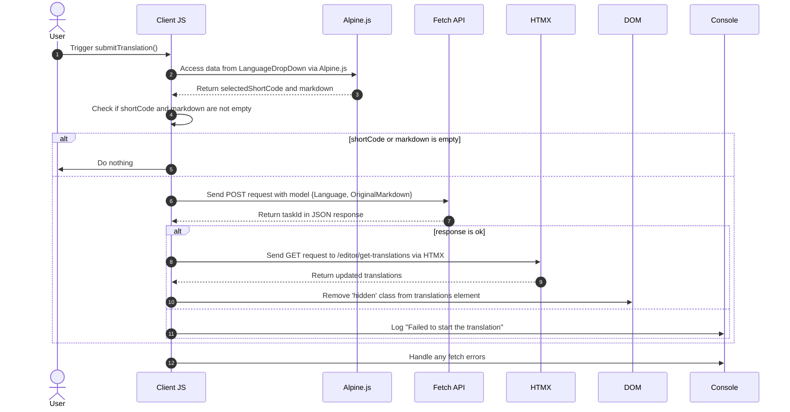

# Traduzioni di sfondo Pt. 3

<datetime class="hidden">2024-08-25T03:20</datetime>

<!--category-- EasyNMT, ASP.NET -->
## Introduzione

Negli articoli precedenti, abbiamo discusso l'importanza della traduzione nel contesto delle applicazioni web. Abbiamo anche esplorato l'uso della libreria EasyNMT per eseguire traduzioni in un'applicazione ASP.NET Core. In questo post coprirò come ho aggiunto un servizio di background all'applicazione per consentire di inviare richiesta di traduzione~~~~s che vengono elaborati in background.

Di nuovo, potete vedere tutto il codice sorgente per questo sul mio [GitHubCity name (optional, probably does not need a translation)](https://github.com/scottgal/mostlylucidweb) pagina.

### Articoli precedenti

- [Traduzioni di sfondo Pt. 1](/blog/backgroundtranslationspt1)
- [Traduzioni di sfondo Pt. 2](/blog/backgroundtranslationspt2)

Qui aggiungiamo un piccolo strumento che invia lavori di backround al servizio che abbiamo dettagliato nella parte 2. Questo strumento è un semplice modulo che consente di inviare una richiesta di traduzione al servizio. E 'quindi cached e aggiunto a una coda dandovi informazioni sullo stato della traduzione.

[TOC]


## Submitter di traduzione

Nella nostra pagina dell'editor di Markdown ho aggiunto un codice che contiene un piccolo a discesa (in `_LanguageDropDown.cshtml`) che ti permette di selezionare la lingua in cui vuoi tradurre.

```razor
        @if (Model.IsNew)
                {
                    var translationHidden = Model.TranslationTasks.Any() ? "" : "hidden";
              
                    <p class="text-blue-dark dark:text-blue-light inline-flex  items-center justify-center space-x-2">
                        <partial name="_LanguageDropDown" for="Languages"/>
                        <button class="btn btn-outline btn-sm mt-1" x-on:click="window.mostlylucid.translations.submitTranslation"><i class='bx bx-send'></i>Translate</button>
                    </p>
                    <div id="translations" class="@translationHidden">
                        <partial name="_GetTranslations" model="Model.TranslationTasks" />
                    </div>
                    <div id="translatedcontent" class="hidden">
                        <textarea class="hidden" id="translatedcontentarea"></textarea>
                    </div>
                }
```

### Invia traduzione

Vedrete che questo ha qualche codice Apline.js che chiama nel nostro `window.mostlylucid.translations.submitTranslation` funzione. Questa funzione è definita nel nostro `translations.js` file che è incluso nel nostro `_Layout.cshtml` Archivio.

```javascript
export function submitTranslation() {
    const languageDropDown = document.getElementById('LanguageDropDown');

    // Access Alpine.js data using __x.$data (Alpine.js internal structure)
    const alpineData = Alpine.$data(languageDropDown);
const shortCode = alpineData.selectedShortCode;
const markdown = simplemde.value();
if (shortCode === '' || markdown === '') return;
    
    // Create the data object that matches your model
    const model = {
        Language: shortCode,
        OriginalMarkdown: markdown
    };

// Perform the fetch request to start the translation using POST
    fetch('/api/translate/start-translation', {
        method: 'POST',
        headers: {
            'Content-Type': 'application/json'  // The content type should be JSON
        },
        body: JSON.stringify(model)  // Send the data object as JSON
    })
        .then(function(response) {
            if (response.ok) {
                // Process the returned task ID
                return response.json();  // Parse the JSON response (assuming the task ID is returned in JSON)
            } else {
                console.error('Failed to start the translation');
            }
        })
        .then(function(taskId) {
            if (taskId) {
                console.log("Task ID:", taskId);

                // Trigger an HTMX request to get the translations after saving
                htmx.ajax('get', "/editor/get-translations", {
                    target: '#translations',  // Update this element with the response
                    swap: 'innerHTML',        // Replace the content inside the target
                }).then(function () {
                    // Remove the hidden class after the content is updated
                    document.getElementById('translations').classList.remove('hidden');
                });
            }
        })
        .catch(function(error) {
            // Handle any errors that occur during the fetch
            console.error('An error occurred:', error);
        });
```

#### Diagramma di sequenza

Questo codice è descritto nel seguente diagramma di sequenza:



Anche se questo sembra un sacco di codice, in realtà è abbastanza semplice.

1. Inviamo una richiesta POST al server con la lingua e il contenuto di markdown. Questo va a un endpoint chiamato `start-translation` che è definito nel nostro `TranslationAPI`. Questo inizia l'attività di traduzione e aggiunge questa attività alla Cache per questo utente.

2. Il server risponde con un ID attività (che registriamo ma non usiamo)

3. Inviamo quindi una richiesta GET al server per ottenere le traduzioni. Questo viene fatto utilizzando HTMX che è una libreria che consente di aggiornare parti della pagina senza un aggiornamento pagina completa. Questo è uno strumento molto potente e viene utilizzato in molti luoghi in questa applicazione.

### L'endpoint di traduzione Start

Si tratta di un controller WebAPI che richiede richieste contenenti markdown e un codice linguistico. Invia quindi la richiesta al nostro server di traduzione di sfondo, caches l'attività nuovamente tthe UserId (contenuto in un cookie) e restituisce l'attività ID al client.
(Ho disabilitato l'attributo ValidateAntiForgeryToken per ora perché non lo sto usando)

```csharp
    [HttpPost("start-translation")]
   // [ValidateAntiForgeryToken]
    public async Task<Results<Ok<string>, BadRequest<string>>> StartTranslation([FromBody] MarkdownTranslationModel model)
    {
        if(ModelState.IsValid == false)
        {
            return TypedResults.BadRequest("Invalid model");
        }
        if(!backgroundTranslateService.TranslationServiceUp)
        {
            return TypedResults.BadRequest("Translation service is down");
        }
        // Create a unique identifier for this translation task
        var taskId = Guid.NewGuid().ToString("N");
        var userId = Request.GetUserId(Response);
       
        // Trigger translation and store the associated task
        var translationTask = await backgroundTranslateService.Translate(model);
    
        var translateTask = new TranslateTask(taskId, DateTime.Now,  model.Language, translationTask);
        translateCacheService.AddTask(userId, translateTask);

        // Return the task ID to the client
        return TypedResults.Ok(taskId);
    }

```

### Il punto finale di Ottieni traduzioni

Questo è richiesto utilizzando HTMX e restituisce le traduzioni per l'utente attuale. Questo è un endpoint semplice che ottiene le traduzioni dalla cache e le restituisce al client.

```csharp
    [HttpGet]
    [Route("get-translations")]
    public IActionResult GetTranslations()
    {
        var userId = Request.GetUserId(Response);
        var tasks = translateCacheService.GetTasks(userId);
        var translations = tasks.Select(x=> new TranslateResultTask(x, false)).ToList();
        return PartialView("_GetTranslations", translations);
    }
    
```

### Il Get Translations Vista parziale

Questa è una vista semplice che utilizza HTMX per interrogare il server ogni 5 secondi per ottenere le traduzioni per l'utente attuale. Visualizza una tabella di traduzioni con un link per visualizzare la traduzione.

Ha anche la gestione per quando tutte le traduzioni sono complete per fermare il sondaggio (impostando il grilletto a `none`). E per visualizzare un messaggio alternativo quando non ci sono traduzioni.

Uso anche la libreria Humanizer per visualizzare il tempo necessario per completare la traduzione in un formato leggibile dall'uomo.

Ciò si traduce in questo punto di vista:


```razor
@using Humanizer
@using Mostlylucid.Helpers
@model List<Mostlylucid.MarkdownTranslator.Models.TranslateResultTask>

@{
    var allCompleted = Model.All(x => x.Completed);
    var noTranslations = Model.Count == 0;
    var trigger = allCompleted ? "none" : "every 5s";
    if (noTranslations)
    {
        <div class="alert alert-info" role="alert">
            No translations have been requested yet.
        </div>
    }
    else
    {
        <div class="translationpoller" hx-controller="Editor" hx-action="GetTranslations" hx-get hx-swap="outerHTML" hx-trigger="@trigger">
            <table class="table">
                <thead>
                <th>
                  
                    @Html.DisplayNameFor(model => model[0].TaskId)
                </th>
                <th>
                    @Html.DisplayNameFor(model => model[0].Completed)
                </th>
                <th >
                    @Html.DisplayNameFor(model => model[0].Language)
                </th>
                <th>
                    @Html.DisplayNameFor(model => model[0].TotalMilliseconds)
                </th>
                </thead>
                @foreach (var item in Model)
                {
                    <tr>
                        <td>  <a href="#" x-on:click.prevent="window.mostlylucid.translations.viewTranslation('@item.TaskId')">View</a></td>
                        <td>@if (item.Completed)
                            {
                                <i class='bx bx-check text-green'></i>
                            }
                            else
                            {
                                <i class='bx bx-loader-alt animate-spin dark:text-white text-black'></i>
                            }
                            </td>
                        <td>
                            <p class="flex items-center">
                                
                                @item.Language.ConvertCodeToLanguage()
                            </p>

                        </td>
                        <td>@(TimeSpan.FromMilliseconds(item.TotalMilliseconds).Humanize())</td>
                    </tr>
                }
            </table>
        </div>
    }
}
```

### La funzione Visualizza traduzione

Come vedrete nella vista qui sopra chiamiamo in un piccolo Alping onclick per vedere la traduzione. Questa è una funzione semplice che ottiene la traduzione dal server e la visualizza in una finestra modale.

```razor
 <a href="#" x-on:click.prevent="window.mostlylucid.translations.viewTranslation('@item.TaskId')">View</a>
```

Il che ci porta a questo. Tutto ciò che fa è ottenere il transaltion popolato dal server e lo visualizza nella pagina.

```javascript

export function viewTranslation(taskId) {
    // Construct the URL with the query parameters
    const url = `/api/translate/get-translation/${taskId}`;

    // Fetch call to the API endpoint
    fetch(url, {
        method: 'GET',
        headers: {
            'Accept': 'application/json'  // Indicate that we expect a JSON response
        }
    })
        .then(response => {
            if (!response.ok) {
                throw new Error(`HTTP error! Status: ${response.status}`);
            }
            return response.json();
        })
        .then(data =>

        {
            let translatedContentArea = document.getElementById("translatedcontent")
            translatedContentArea.classList.remove("hidden");
            let textArea = document.getElementById('translatedcontentarea');
            textArea.classList.remove('hidden');
            textArea.value = data.originalMarkdown;
            simplemde.value(data.translatedMarkdown);
        })  // Log the successful response data
        .catch(error => console.error('Error:', error));  // Handle any errors
}

```

### Ottieni il punto finale della traduzione

Questo è simile al metodo precedente per ottenere una lista delle traduzioni tranne che ottiene una sola traduzione con il `OriginalMarkdown` e `TranslatedMarkdown` popolata:

```csharp
    [HttpGet]
    [Route("get-translation/{taskId}")]
    public Results<JsonHttpResult<TranslateResultTask>, BadRequest<string>> GetTranslation(string taskId)
    {
        var userId = Request.GetUserId(Response);
        var tasks = translateCacheService.GetTasks(userId);
        var translationTask = tasks.FirstOrDefault(t => t.TaskId == taskId);
        if (translationTask == null) return TypedResults.BadRequest("Task not found");
        var result = new TranslateResultTask(translationTask, true);
        return TypedResults.Json(result);
    }
```

## In conclusione

Il risultato di tutto questo è che ora è possibile inviare una richiesta di traduzione e vedere lo stato della traduzione nell'editor dopo che è stato completato. Andrò più in dettaglio su come funziona il servizio di traduzione nel prossimo post.

Ho più che voglio fare qui compreso ri-hooking up il flusso Render Markdown per il contenuto tradotto ecc. Ma questo; è il divertimento di questo sito; non tutto è completamente lucido, ma è tutto vero codice si può giocare con come lo costruisco fuori.
Di nuovo, potete vedere tutto il codice sorgente per questo sul mio [GitHubCity name (optional, probably does not need a translation)](https://github.com/scottgal/mostlylucidweb) pagina. Quindi, per favore, vai a vedere se vuoi vedere di piu'.