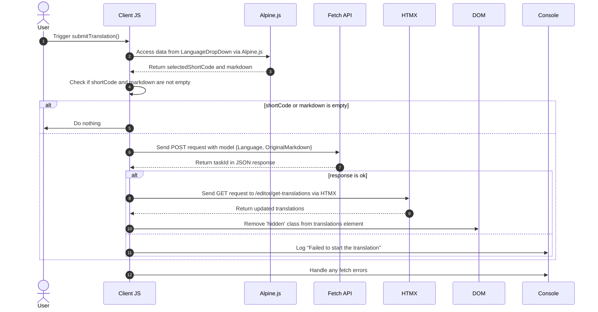

# Achtergrondvertalingen Pt. 3

<datetime class="hidden">2024-08-25T03:20</datetime>

<!--category-- EasyNMT, ASP.NET, WebAPI, Alpine, HTMX -->
# Inleiding

In eerdere artikelen hebben we het belang van vertaling in de context van webapplicaties besproken. We hebben ook het gebruik van de EasyNMT bibliotheek onderzocht om vertalingen uit te voeren in een ASP.NET Core applicatie. In dit bericht zal ik behandelen hoe ik een background service toegevoegd aan de applicatie om u toe te staan om vertaling aanvraag ~~~~s die worden verwerkt op de achtergrond in te dienen.

Nogmaals, je kunt alle broncode voor dit zien op mijn [GitHub](https://github.com/scottgal/mostlylucidweb) blz.

## Vorige artikelen

- [Achtergrondvertalingen Pt. 1](/blog/backgroundtranslationspt1)
- [Achtergrondvertalingen Pt. 2](/blog/backgroundtranslationspt2)

Hier voegen we een klein hulpmiddel toe dat backround jobs indient bij de dienst die we in deel 2 hebben beschreven. Deze tool is een eenvoudig formulier waarmee u een vertaalverzoek kunt indienen bij de dienst. Het wordt dan gecached en toegevoegd aan een wachtrij die u informatie geeft over de status van de vertaling.

[TOC]

Dit voegt functionaliteit toe waar bij het selecteren van een 'nieuw' document u het kunt vertalen.


# De vertaalcode

## Vertaling submitter

Op onze Markdown editor pagina heb ik wat code toegevoegd die een kleine dropdown bevat (in `_LanguageDropDown.cshtml`) waarmee u de taal kunt selecteren waarnaar u wilt vertalen.

```razor
        @if (Model.IsNew)
                {
                    var translationHidden = Model.TranslationTasks.Any() ? "" : "hidden";
              
                    <p class="text-blue-dark dark:text-blue-light inline-flex  items-center justify-center space-x-2">
                        <partial name="_LanguageDropDown" for="Languages"/>
                        <button class="btn btn-outline btn-sm mt-1" x-on:click="window.mostlylucid.translations.submitTranslation"><i class='bx bx-send'></i>Translate</button>
                    </p>
                    <div id="translations" class="@translationHidden">
                        <partial name="_GetTranslations" model="Model.TranslationTasks" />
                    </div>
                    <div id="translatedcontent" class="hidden">
                        <textarea class="hidden" id="translatedcontentarea"></textarea>
                    </div>
                }
```

#### _TaalDropDown

Onze `_LanguageDropDown` gedeeltelijke weergave is een eenvoudige dropdown waarmee u de taal kunt selecteren waarnaar u wilt vertalen. Dit is bevolkt uit een lijst van talen in de `Languages` eigendom van het model.

U kunt zien dat het Alpine.js gebruikt om de dropdown te verwerken en de geselecteerde taal en vlag in te stellen om in het hoofdselectiegedeelte te tonen. Het bepaalt ook de korte code van de taal die wordt gebruikt bij het indienen van het vertaalverzoek.

Het gebruik van Alping betekent dat we minimale, lokaal referentie JavaScript in onze meningen houden. Dit is een geweldige manier om uw uitzichten schoon en gemakkelijk te lezen.

```razor
@using Mostlylucid.Helpers
@model List<string>

<div id="LanguageDropDown" x-data="{ 
    open: false, 
    selectedLanguage: 'Select Language', 
    selectedFlag: '' ,
    selectedShortCode:''
}" class="relative inline-block mt-3">
    <!-- Dropdown Button -->
    <button x-on:click="open = !open" class="btn btn-sm btn-outline flex items-center space-x-2">
        <!-- Dynamically Show the Flag Icon -->
        <template x-if="selectedFlag">
            
        </template>
        <span x-text="selectedLanguage"></span>
        <svg xmlns="http://www.w3.org/2000/svg" class="h-4 w-4 ml-2" fill="none" viewBox="0 0 24 24" stroke="currentColor">
            <path stroke-linecap="round" stroke-linejoin="round" stroke-width="2" d="M19 9l-7 7-7-7" />
        </svg>
    </button>

    <!-- Dropdown Menu -->
    <div x-show="open" x-on:click.away="open = false"
         class="absolute left-0 mt-2 w-64 rounded-md shadow-lg dark:bg-custom-dark-bg bg-white ring-1 ring-black ring-opacity-5 z-50">
        <ul class="p-2">
            @foreach (var language in Model)
            {
            <li>
                <a href="#"
                   x-on:click.prevent="selectedLanguage = '@(language.ConvertCodeToLanguage())'; selectedFlag = '/img/flags/@(language).svg'; selectedShortCode='@language'; open = false"
                   class="flex dark:text-white text-black items-center p-2 hover:bg-gray-100">
                     @language.ConvertCodeToLanguage()
                </a>
            </li>
            }
        </ul>
    </div>
</div>
```

### Vertaling versturen

U zult zien dat dit heeft een aantal Apline.js code die oproept in onze `window.mostlylucid.translations.submitTranslation` functie. Deze functie is gedefinieerd in onze `translations.js` bestand dat is opgenomen in onze `_Layout.cshtml` bestand.

```javascript
export function submitTranslation() {
    const languageDropDown = document.getElementById('LanguageDropDown');

    // Access Alpine.js data using Apline.$data (Alpine.js internal structure)
    const alpineData = Alpine.$data(languageDropDown);
const shortCode = alpineData.selectedShortCode;
const markdown = simplemde.value();
if (shortCode === '' || markdown === '') return;
    
    // Create the data object that matches your model
    const model = {
        Language: shortCode,
        OriginalMarkdown: markdown
    };

// Perform the fetch request to start the translation using POST
    fetch('/api/translate/start-translation', {
        method: 'POST',
        headers: {
            'Content-Type': 'application/json'  // The content type should be JSON
        },
        body: JSON.stringify(model)  // Send the data object as JSON
    })
        .then(function(response) {
            if (response.ok) {
                // Process the returned task ID
                return response.json();  // Parse the JSON response (assuming the task ID is returned in JSON)
            } else {
                console.error('Failed to start the translation');
            }
        })
        .then(function(taskId) {
            if (taskId) {
                console.log("Task ID:", taskId);

                // Trigger an HTMX request to get the translations after saving
                htmx.ajax('get', "/editor/get-translations", {
                    target: '#translations',  // Update this element with the response
                    swap: 'innerHTML',        // Replace the content inside the target
                }).then(function () {
                    // Remove the hidden class after the content is updated
                    document.getElementById('translations').classList.remove('hidden');
                });
            }
        })
        .catch(function(error) {
            // Handle any errors that occur during the fetch
            console.error('An error occurred:', error);
        });
```

#### Sequentiediagram

Deze code wordt beschreven in het volgende sequentiediagram:



Hoewel dit op veel code lijkt, is het eigenlijk heel simpel.

1. We sturen een POST verzoek naar de server met de taal en markdown inhoud. Dit gaat naar een eindpunt genaamd `start-translation` dat is gedefinieerd in onze `TranslationAPI`. Dit start de vertaaltaak en voegt deze taak toe aan de Cache voor deze gebruiker.

2. De server reageert met een taak-ID (die we loggen maar niet gebruiken)

3. Vervolgens sturen we een GET-verzoek naar de server om de vertalingen te krijgen. Dit wordt gedaan met behulp van HTMX dat is een bibliotheek waarmee u delen van de pagina te updaten zonder een volledige pagina te vernieuwen. Dit is een zeer krachtig hulpmiddel en wordt op vele plaatsen in deze toepassing gebruikt.

### Het begin van de vertaling eindpunt

Dit is een WebAPI controller die verzoeken neemt met markdown en een taalcode. Het stuurt vervolgens het verzoek naar onze achtergrondvertalingsserver, caches de taak opnieuw tthe UserId (ingesloten in een cookie) en geeft de taak Id aan de client.
(Ik heb het ValidateAntiForgeryToken attribuut voor nu uitgeschakeld omdat ik het niet gebruik)

```csharp
    [HttpPost("start-translation")]
   // [ValidateAntiForgeryToken]
    public async Task<Results<Ok<string>, BadRequest<string>>> StartTranslation([FromBody] MarkdownTranslationModel model)
    {
        if(ModelState.IsValid == false)
        {
            return TypedResults.BadRequest("Invalid model");
        }
        if(!backgroundTranslateService.TranslationServiceUp)
        {
            return TypedResults.BadRequest("Translation service is down");
        }
        // Create a unique identifier for this translation task
        var taskId = Guid.NewGuid().ToString("N");
        var userId = Request.GetUserId(Response);
       
        // Trigger translation and store the associated task
        var translationTask = await backgroundTranslateService.Translate(model);
    
        var translateTask = new TranslateTask(taskId, DateTime.Now,  model.Language, translationTask);
        translateCacheService.AddTask(userId, translateTask);

        // Return the task ID to the client
        return TypedResults.Ok(taskId);
    }

```

## Het eindpunt Vertalingen ophalen

Dit wordt gevraagd met behulp van HTMX en geeft de vertalingen voor de huidige gebruiker. Dit is een eenvoudig eindpunt dat de vertalingen van de cache krijgt en ze teruggeeft aan de client.

```csharp
    [HttpGet]
    [Route("get-translations")]
    public IActionResult GetTranslations()
    {
        var userId = Request.GetUserId(Response);
        var tasks = translateCacheService.GetTasks(userId);
        var translations = tasks.Select(x=> new TranslateResultTask(x, false)).ToList();
        return PartialView("_GetTranslations", translations);
    }
    
```

### De gedeeltelijke weergave Vertalingen ophalen

Dit is een eenvoudige weergave die HTMX gebruikt om de server elke 5 seconden te peilen om de vertalingen voor de huidige gebruiker te krijgen. Het toont een tabel van vertalingen met een link om de vertaling te bekijken.

Het heeft ook handling voor wanneer alle vertalingen zijn voltooid om de peiling te stoppen (door het instellen van de trigger op `none`). En om een alternatief bericht te tonen als er geen vertalingen zijn.

Ik gebruik ook de Humanizer bibliotheek om de tijd die nodig is om de vertaling in een menselijk leesbaar formaat weer te geven.

Dit resulteert in deze visie:


```razor
@using Humanizer
@using Mostlylucid.Helpers
@model List<Mostlylucid.MarkdownTranslator.Models.TranslateResultTask>

@{
    var allCompleted = Model.All(x => x.Completed);
    var noTranslations = Model.Count == 0;
    var trigger = allCompleted ? "none" : "every 5s";
    if (noTranslations)
    {
        <div class="alert alert-info" role="alert">
            No translations have been requested yet.
        </div>
    }
    else
    {
        <div class="translationpoller" hx-controller="Editor" hx-action="GetTranslations" hx-get hx-swap="outerHTML" hx-trigger="@trigger">
            <table class="table">
                <thead>
                <th>
                  
                    @Html.DisplayNameFor(model => model[0].TaskId)
                </th>
                <th>
                    @Html.DisplayNameFor(model => model[0].Completed)
                </th>
                <th >
                    @Html.DisplayNameFor(model => model[0].Language)
                </th>
                <th>
                    @Html.DisplayNameFor(model => model[0].TotalMilliseconds)
                </th>
                </thead>
                @foreach (var item in Model)
                {
                    <tr>
                        <td>  <a href="#" x-on:click.prevent="window.mostlylucid.translations.viewTranslation('@item.TaskId')">View</a></td>
                        <td>@if (item.Completed)
                            {
                                <i class='bx bx-check text-green'></i>
                            }
                            else
                            {
                                <i class='bx bx-loader-alt animate-spin dark:text-white text-black'></i>
                            }
                            </td>
                        <td>
                            <p class="flex items-center">
                                
                                @item.Language.ConvertCodeToLanguage()
                            </p>

                        </td>
                        <td>@(TimeSpan.FromMilliseconds(item.TotalMilliseconds).Humanize())</td>
                    </tr>
                }
            </table>
        </div>
    }
}
```

## De functie Beeldvertaling

Zoals u zult zien in de bovenstaande weergave bellen we in een beetje Alping onklik om de vertaling te bekijken. Dit is een eenvoudige functie die de vertaling van de server krijgt en deze in een modal dialoog toont.

```razor
 <a href="#" x-on:click.prevent="window.mostlylucid.translations.viewTranslation('@item.TaskId')">View</a>
```

Wat dit oproept. Alles wat het doet is de bevolkte transaltion van de server en toont het in de pagina.

```javascript

export function viewTranslation(taskId) {
    // Construct the URL with the query parameters
    const url = `/api/translate/get-translation/${taskId}`;

    // Fetch call to the API endpoint
    fetch(url, {
        method: 'GET',
        headers: {
            'Accept': 'application/json'  // Indicate that we expect a JSON response
        }
    })
        .then(response => {
            if (!response.ok) {
                throw new Error(`HTTP error! Status: ${response.status}`);
            }
            return response.json();
        })
        .then(data =>

        {
            let translatedContentArea = document.getElementById("translatedcontent")
            translatedContentArea.classList.remove("hidden");
            let textArea = document.getElementById('translatedcontentarea');
            textArea.classList.remove('hidden');
            textArea.value = data.originalMarkdown;
            simplemde.value(data.translatedMarkdown);
        })  // Log the successful response data
        .catch(error => console.error('Error:', error));  // Handle any errors
}

```

## Het vertaaleindpunt opvragen

Dit is vergelijkbaar met de eerdere methode om een lijst van de vertalingen, behalve het krijgt een enkele vertaling met de `OriginalMarkdown` en `TranslatedMarkdown` bevolkt:

```csharp
    [HttpGet]
    [Route("get-translation/{taskId}")]
    public Results<JsonHttpResult<TranslateResultTask>, BadRequest<string>> GetTranslation(string taskId)
    {
        var userId = Request.GetUserId(Response);
        var tasks = translateCacheService.GetTasks(userId);
        var translationTask = tasks.FirstOrDefault(t => t.TaskId == taskId);
        if (translationTask == null) return TypedResults.BadRequest("Task not found");
        var result = new TranslateResultTask(translationTask, true);
        return TypedResults.Json(result);
    }
```

## Conclusie

Het resultaat van dit alles is dat u nu een vertaalverzoek kunt indienen en de status van de vertaling in de editor kunt zien nadat het voltooid is. Ik zal nader ingaan op hoe de vertaaldienst werkt in de volgende post.

Ik heb meer te doen hier inclusief re-hoking up de Render Markdown flow voor de vertaalde inhoud etc. Maar dat; is het plezier van deze site; niet alles is volledig gepolijst, maar het is allemaal echte code waarmee je kunt spelen als ik het bouw.
Nogmaals, je kunt alle broncode voor dit zien op mijn [GitHub](https://github.com/scottgal/mostlylucidweb) blz. Dus ga daar alsjeblieft naar kijken als je meer wilt zien.