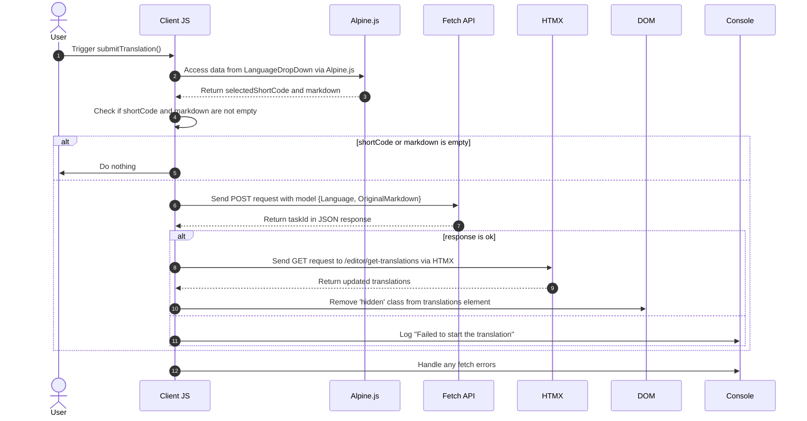

# Bakgrundsöversättningar Pt. I enlighet med artikel 3 i förordning (EU) nr 1307/2013 ska kommissionen, i enlighet med artikel 3 i förordning (EU) nr 1307/2013, anta delegerade akter i enlighet med artikel 4 i förordning (EU) nr 1307/2013, med avseende på följande:

<datetime class="hidden">2024-08-25T03:20</datetime>

<!--category-- EasyNMT, ASP.NET -->
## Inledning

I tidigare artiklar har vi diskuterat betydelsen av översättning i samband med webbapplikationer. Vi har också undersökt användningen av EasyNMT-biblioteket för att utföra översättningar i en ASP.NET Core-applikation. I det här inlägget ska jag täcka hur jag lagt till en bakgrundstjänst till ansökan så att du kan skicka översättningsförfrågan~~~s som behandlas i bakgrunden.

Återigen, du kan se alla källkoden för detta på min [GitHub Ordförande](https://github.com/scottgal/mostlylucidweb) sida.

### Tidigare artiklar

- [Bakgrundsöversättningar Pt. Denna förordning träder i kraft den tjugonde dagen efter det att den har offentliggjorts i Europeiska unionens officiella tidning.](/blog/backgroundtranslationspt1)
- [Bakgrundsöversättningar Pt. I artikel 2 ska punkt 2 ersättas med följande:](/blog/backgroundtranslationspt2)

Här lägger vi till ett litet verktyg som lämnar backroundjobb till den tjänst vi beskrev i del 2. Detta verktyg är ett enkelt formulär som gör att du kan skicka en översättning begäran till tjänsten. Den är sedan cachad och läggs till i en kö som ger dig information om status för översättningen.

[TOC]


## Översättningslämnare

På vår Markdown editor sida lade jag till lite kod som innehåller en liten droppe (i `_LanguageDropDown.cshtml`) som låter dig välja det språk du vill översätta till.

```razor
        @if (Model.IsNew)
                {
                    var translationHidden = Model.TranslationTasks.Any() ? "" : "hidden";
              
                    <p class="text-blue-dark dark:text-blue-light inline-flex  items-center justify-center space-x-2">
                        <partial name="_LanguageDropDown" for="Languages"/>
                        <button class="btn btn-outline btn-sm mt-1" x-on:click="window.mostlylucid.translations.submitTranslation"><i class='bx bx-send'></i>Translate</button>
                    </p>
                    <div id="translations" class="@translationHidden">
                        <partial name="_GetTranslations" model="Model.TranslationTasks" />
                    </div>
                    <div id="translatedcontent" class="hidden">
                        <textarea class="hidden" id="translatedcontentarea"></textarea>
                    </div>
                }
```

### Skicka översättning

Du kommer att se att detta har någon Apline.js kod som kallar in vår `window.mostlylucid.translations.submitTranslation` Funktion. Denna funktion definieras i vår `translations.js` fil som ingår i vår `_Layout.cshtml` En akt.

```javascript
export function submitTranslation() {
    const languageDropDown = document.getElementById('LanguageDropDown');

    // Access Alpine.js data using __x.$data (Alpine.js internal structure)
    const alpineData = Alpine.$data(languageDropDown);
const shortCode = alpineData.selectedShortCode;
const markdown = simplemde.value();
if (shortCode === '' || markdown === '') return;
    
    // Create the data object that matches your model
    const model = {
        Language: shortCode,
        OriginalMarkdown: markdown
    };

// Perform the fetch request to start the translation using POST
    fetch('/api/translate/start-translation', {
        method: 'POST',
        headers: {
            'Content-Type': 'application/json'  // The content type should be JSON
        },
        body: JSON.stringify(model)  // Send the data object as JSON
    })
        .then(function(response) {
            if (response.ok) {
                // Process the returned task ID
                return response.json();  // Parse the JSON response (assuming the task ID is returned in JSON)
            } else {
                console.error('Failed to start the translation');
            }
        })
        .then(function(taskId) {
            if (taskId) {
                console.log("Task ID:", taskId);

                // Trigger an HTMX request to get the translations after saving
                htmx.ajax('get', "/editor/get-translations", {
                    target: '#translations',  // Update this element with the response
                    swap: 'innerHTML',        // Replace the content inside the target
                }).then(function () {
                    // Remove the hidden class after the content is updated
                    document.getElementById('translations').classList.remove('hidden');
                });
            }
        })
        .catch(function(error) {
            // Handle any errors that occur during the fetch
            console.error('An error occurred:', error);
        });
```

#### Sekvensdiagram

Denna kod beskrivs i följande sekvensdiagram:



Även om det ser ut som en hel del kod, är det faktiskt ganska enkelt.

1. Vi skickar en POST begäran till servern med språket och markdown innehåll. Detta går till en endpoint som kallas `start-translation` som definieras i vår `TranslationAPI`....................................... Detta startar från översättningsuppgiften och lägger till denna uppgift till Cache för denna användare.

2. Servern svarar med en uppgift Id (som vi loggar men inte använder)

3. Vi skickar sedan en GET begäran till servern för att få översättningar. Detta görs med hjälp av HTMX som är ett bibliotek som låter dig uppdatera delar av sidan utan en uppdatering på hela sidan. Detta är ett mycket kraftfullt verktyg och används på många ställen i detta program.

### Slutpunkten i början av översättningen

Detta är en WebAPI controller som tar förfrågningar som innehåller markdown och en språkkod. Den skickar sedan begäran till vår bakgrundsöversättningsserver, cachar uppgiften igen tthe UserId (som ingår i en cookie) och returnerar uppgiften Id till klienten.
(Jag inaktiverade ValidateAntiForgeryToken attribut för nu eftersom jag inte använder det)

```csharp
    [HttpPost("start-translation")]
   // [ValidateAntiForgeryToken]
    public async Task<Results<Ok<string>, BadRequest<string>>> StartTranslation([FromBody] MarkdownTranslationModel model)
    {
        if(ModelState.IsValid == false)
        {
            return TypedResults.BadRequest("Invalid model");
        }
        if(!backgroundTranslateService.TranslationServiceUp)
        {
            return TypedResults.BadRequest("Translation service is down");
        }
        // Create a unique identifier for this translation task
        var taskId = Guid.NewGuid().ToString("N");
        var userId = Request.GetUserId(Response);
       
        // Trigger translation and store the associated task
        var translationTask = await backgroundTranslateService.Translate(model);
    
        var translateTask = new TranslateTask(taskId, DateTime.Now,  model.Language, translationTask);
        translateCacheService.AddTask(userId, translateTask);

        // Return the task ID to the client
        return TypedResults.Ok(taskId);
    }

```

### Slutpunkten för att få översättningar

Detta begärs med hjälp av HTMX och returnerar översättningarna för den nuvarande användaren. Detta är en enkel endpoint som får översättningar från cache och returnerar dem till klienten.

```csharp
    [HttpGet]
    [Route("get-translations")]
    public IActionResult GetTranslations()
    {
        var userId = Request.GetUserId(Response);
        var tasks = translateCacheService.GetTasks(userId);
        var translations = tasks.Select(x=> new TranslateResultTask(x, false)).ToList();
        return PartialView("_GetTranslations", translations);
    }
    
```

### Den få översättningar partiell vy

Detta är en enkel vy som använder HTMX för att välja servern var femte sekund för att få översättningar för den nuvarande användaren. Den visar en tabell med översättningar med en länk för att visa översättningen.

Det har också hantering för när alla översättningar är färdiga att stoppa omröstningen (genom att sätta utlösaren till `none`).............................................................................................. Och för att visa ett alternativt meddelande när det inte finns några översättningar.

Jag använder också Humanizer biblioteket för att visa den tid det tar att slutföra översättningen i ett mänskligt läsbart format.

Detta leder till följande:


```razor
@using Humanizer
@using Mostlylucid.Helpers
@model List<Mostlylucid.MarkdownTranslator.Models.TranslateResultTask>

@{
    var allCompleted = Model.All(x => x.Completed);
    var noTranslations = Model.Count == 0;
    var trigger = allCompleted ? "none" : "every 5s";
    if (noTranslations)
    {
        <div class="alert alert-info" role="alert">
            No translations have been requested yet.
        </div>
    }
    else
    {
        <div class="translationpoller" hx-controller="Editor" hx-action="GetTranslations" hx-get hx-swap="outerHTML" hx-trigger="@trigger">
            <table class="table">
                <thead>
                <th>
                  
                    @Html.DisplayNameFor(model => model[0].TaskId)
                </th>
                <th>
                    @Html.DisplayNameFor(model => model[0].Completed)
                </th>
                <th >
                    @Html.DisplayNameFor(model => model[0].Language)
                </th>
                <th>
                    @Html.DisplayNameFor(model => model[0].TotalMilliseconds)
                </th>
                </thead>
                @foreach (var item in Model)
                {
                    <tr>
                        <td>  <a href="#" x-on:click.prevent="window.mostlylucid.translations.viewTranslation('@item.TaskId')">View</a></td>
                        <td>@if (item.Completed)
                            {
                                <i class='bx bx-check text-green'></i>
                            }
                            else
                            {
                                <i class='bx bx-loader-alt animate-spin dark:text-white text-black'></i>
                            }
                            </td>
                        <td>
                            <p class="flex items-center">
                                
                                @item.Language.ConvertCodeToLanguage()
                            </p>

                        </td>
                        <td>@(TimeSpan.FromMilliseconds(item.TotalMilliseconds).Humanize())</td>
                    </tr>
                }
            </table>
        </div>
    }
}
```

### Funktionen Visa översättning

Som du ser i ovanstående vy kallar vi in en liten Alping onclick för att visa översättningen. Detta är en enkel funktion som får översättningen från servern och visar den i en modal dialogruta.

```razor
 <a href="#" x-on:click.prevent="window.mostlylucid.translations.viewTranslation('@item.TaskId')">View</a>
```

Vilket kräver det här. Allt det gör är att få den befolkade transaltionen från servern och visar den på sidan.

```javascript

export function viewTranslation(taskId) {
    // Construct the URL with the query parameters
    const url = `/api/translate/get-translation/${taskId}`;

    // Fetch call to the API endpoint
    fetch(url, {
        method: 'GET',
        headers: {
            'Accept': 'application/json'  // Indicate that we expect a JSON response
        }
    })
        .then(response => {
            if (!response.ok) {
                throw new Error(`HTTP error! Status: ${response.status}`);
            }
            return response.json();
        })
        .then(data =>

        {
            let translatedContentArea = document.getElementById("translatedcontent")
            translatedContentArea.classList.remove("hidden");
            let textArea = document.getElementById('translatedcontentarea');
            textArea.classList.remove('hidden');
            textArea.value = data.originalMarkdown;
            simplemde.value(data.translatedMarkdown);
        })  // Log the successful response data
        .catch(error => console.error('Error:', error));  // Handle any errors
}

```

### Hämta översättningens slutpunkt

Detta liknar den tidigare metoden för att få en lista över översättningar utom det får en enda översättning med `OriginalMarkdown` och `TranslatedMarkdown` befolkad:

```csharp
    [HttpGet]
    [Route("get-translation/{taskId}")]
    public Results<JsonHttpResult<TranslateResultTask>, BadRequest<string>> GetTranslation(string taskId)
    {
        var userId = Request.GetUserId(Response);
        var tasks = translateCacheService.GetTasks(userId);
        var translationTask = tasks.FirstOrDefault(t => t.TaskId == taskId);
        if (translationTask == null) return TypedResults.BadRequest("Task not found");
        var result = new TranslateResultTask(translationTask, true);
        return TypedResults.Json(result);
    }
```

## Slutsatser

Resultatet av allt detta är att du nu kan skicka in en översättning begäran och se status för översättningen i redaktören efter att den är komplett. Jag ska gå in närmare på hur översättningstjänsten fungerar i nästa inlägg.

Jag har mer jag vill göra här inklusive att återknacka upp Render Markdown flöde för översatt innehåll etc. Men det; är det roliga med denna webbplats; inte varje thign är helt polerad men det är allt riktig kod du kan spela med när jag bygger ut det.
Återigen, du kan se alla källkoden för detta på min [GitHub Ordförande](https://github.com/scottgal/mostlylucidweb) sida. Så gå och titta på det om du vill se mer.