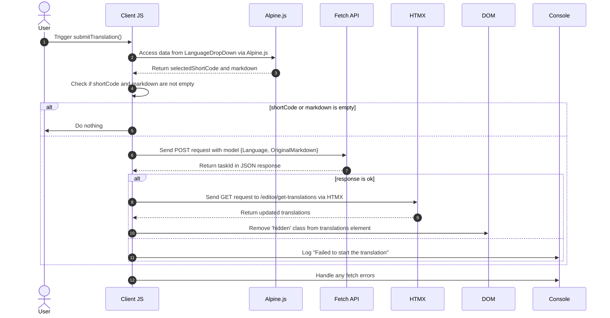

# Тло перекладів Pt. 3

<datetime class="hidden">2024- 08- 25T03: 20</datetime>

<!--category-- EasyNMT, ASP.NET -->
## Вступ

У попередніх статтях ми обговорювали важливість перекладу в контексті веб-програм. Ми також дослідили використання бібліотеки EasyNMT для перекладу у програмі ASP. NET. У цьому дописі я охоплю, як я додав фонову службу до програми, щоб дозволити вам подавати запит перекладу ~~~~~ ~s, які обробляються у фоні.

Знову ж таки, ви можете побачити всі початкові коди для цього на моєму [GitHub](https://github.com/scottgal/mostlylucidweb) page.

### Попередні статті

- [Тло перекладів Pt. 1](/blog/backgroundtranslationspt1)
- [Тло перекладів Pt. 2](/blog/backgroundtranslationspt2)

Тут ми додаємо маленький інструмент, який відправляє круглі робочі місця на службу, яку ми детально опишемо в другій частині. Цей інструмент є простою формою, за допомогою якої ви можете надіслати запит на переклад до служби. Потім зарезервовано і додано до черги, що надає вам інформацію про стан перекладу.

[TOC]


## Надсилання перекладів

На сторінці редактора Markdown я додав код, у якому міститься невеличке падіння (в `_LanguageDropDown.cshtml`) за допомогою цього пункту ви можете обрати мову, якою ви бажаєте перекласти.

```razor
        @if (Model.IsNew)
                {
                    var translationHidden = Model.TranslationTasks.Any() ? "" : "hidden";
              
                    <p class="text-blue-dark dark:text-blue-light inline-flex  items-center justify-center space-x-2">
                        <partial name="_LanguageDropDown" for="Languages"/>
                        <button class="btn btn-outline btn-sm mt-1" x-on:click="window.mostlylucid.translations.submitTranslation"><i class='bx bx-send'></i>Translate</button>
                    </p>
                    <div id="translations" class="@translationHidden">
                        <partial name="_GetTranslations" model="Model.TranslationTasks" />
                    </div>
                    <div id="translatedcontent" class="hidden">
                        <textarea class="hidden" id="translatedcontentarea"></textarea>
                    </div>
                }
```

### ExportTranselation

Ви побачите, що тут є якийсь код Apline.js, який викликає в нас `window.mostlylucid.translations.submitTranslation` функція. Ця функція визначена у наших `translations.js` файл, який включено до нашого `_Layout.cshtml` файл.

```javascript
export function submitTranslation() {
    const languageDropDown = document.getElementById('LanguageDropDown');

    // Access Alpine.js data using __x.$data (Alpine.js internal structure)
    const alpineData = Alpine.$data(languageDropDown);
const shortCode = alpineData.selectedShortCode;
const markdown = simplemde.value();
if (shortCode === '' || markdown === '') return;
    
    // Create the data object that matches your model
    const model = {
        Language: shortCode,
        OriginalMarkdown: markdown
    };

// Perform the fetch request to start the translation using POST
    fetch('/api/translate/start-translation', {
        method: 'POST',
        headers: {
            'Content-Type': 'application/json'  // The content type should be JSON
        },
        body: JSON.stringify(model)  // Send the data object as JSON
    })
        .then(function(response) {
            if (response.ok) {
                // Process the returned task ID
                return response.json();  // Parse the JSON response (assuming the task ID is returned in JSON)
            } else {
                console.error('Failed to start the translation');
            }
        })
        .then(function(taskId) {
            if (taskId) {
                console.log("Task ID:", taskId);

                // Trigger an HTMX request to get the translations after saving
                htmx.ajax('get', "/editor/get-translations", {
                    target: '#translations',  // Update this element with the response
                    swap: 'innerHTML',        // Replace the content inside the target
                }).then(function () {
                    // Remove the hidden class after the content is updated
                    document.getElementById('translations').classList.remove('hidden');
                });
            }
        })
        .catch(function(error) {
            // Handle any errors that occur during the fetch
            console.error('An error occurred:', error);
        });
```

#### Діаграма послідовностей

Цей код описано на наступній діаграмі послідовності:



Хоча це виглядає як багато коду, насправді це досить просто.

1. We send a POST request to the server with the language and markdown content. Це переходить до кінцевої точки, яка називається `start-translation` яка визначена у нашому `TranslationAPI`. Це починається з завдання перекладу і додає це завдання до кешу для цього користувача.

2. Сервер відповідає ідентифікатором завдання (його ми ведемо до журналу, але не використовуємо)

3. Після цього ми відправляємо запит на отримання перекладів на сервер. Ця дія виконується за допомогою програми HTMX, яка є бібліотекою, за допомогою якої ви можете оновлювати частини сторінки без повного оновлення сторінки. Це дуже потужний інструмент, який використовується у багатьох місцях цієї програми.

### Точка закінчення перекладу

Це контролер WebAPI, який приймає запити, що містять markdown і код мови. Після цього програма надсилає запит на наш сервер перекладу у фоновому режимі, спорожнює завдання знову з UserId (який міститься у кукі) і поверне ідентифікатор завдання клієнтові.
(Я вимкнув атрибут AllestAntiForgeryToken поки що, оскільки я не використовую його)

```csharp
    [HttpPost("start-translation")]
   // [ValidateAntiForgeryToken]
    public async Task<Results<Ok<string>, BadRequest<string>>> StartTranslation([FromBody] MarkdownTranslationModel model)
    {
        if(ModelState.IsValid == false)
        {
            return TypedResults.BadRequest("Invalid model");
        }
        if(!backgroundTranslateService.TranslationServiceUp)
        {
            return TypedResults.BadRequest("Translation service is down");
        }
        // Create a unique identifier for this translation task
        var taskId = Guid.NewGuid().ToString("N");
        var userId = Request.GetUserId(Response);
       
        // Trigger translation and store the associated task
        var translationTask = await backgroundTranslateService.Translate(model);
    
        var translateTask = new TranslateTask(taskId, DateTime.Now,  model.Language, translationTask);
        translateCacheService.AddTask(userId, translateTask);

        // Return the task ID to the client
        return TypedResults.Ok(taskId);
    }

```

### Кінцевий пункт перекладу

Надійшов запит на використання HTMX і повернення перекладів для поточного користувача. Це проста кінцева точка, яка отримує переклади з кешу і повертає їх до клієнта.

```csharp
    [HttpGet]
    [Route("get-translations")]
    public IActionResult GetTranslations()
    {
        var userId = Request.GetUserId(Response);
        var tasks = translateCacheService.GetTasks(userId);
        var translations = tasks.Select(x=> new TranslateResultTask(x, false)).ToList();
        return PartialView("_GetTranslations", translations);
    }
    
```

### Неодмінний погляд на переклади

Це простий перегляд, який використовує HTMX для опитування сервера кожні 5 секунд для отримання перекладів для поточного користувача. Він показує таблицю перекладів з посиланням для перегляду перекладу.

Крім того, у програмі передбачено можливість завершення всіх перекладів, за допомогою яких можна зупинити опитування (за допомогою встановлення параметра `none`). А щоб показати альтернативне повідомлення, коли немає перекладів.

Крім того, я використовую бібліотеку гуманізатора, щоб показати час, витрачений на завершення перекладу, у придатному для читання людиною форматі.

Результатом цього є такий вигляд:


```razor
@using Humanizer
@using Mostlylucid.Helpers
@model List<Mostlylucid.MarkdownTranslator.Models.TranslateResultTask>

@{
    var allCompleted = Model.All(x => x.Completed);
    var noTranslations = Model.Count == 0;
    var trigger = allCompleted ? "none" : "every 5s";
    if (noTranslations)
    {
        <div class="alert alert-info" role="alert">
            No translations have been requested yet.
        </div>
    }
    else
    {
        <div class="translationpoller" hx-controller="Editor" hx-action="GetTranslations" hx-get hx-swap="outerHTML" hx-trigger="@trigger">
            <table class="table">
                <thead>
                <th>
                  
                    @Html.DisplayNameFor(model => model[0].TaskId)
                </th>
                <th>
                    @Html.DisplayNameFor(model => model[0].Completed)
                </th>
                <th >
                    @Html.DisplayNameFor(model => model[0].Language)
                </th>
                <th>
                    @Html.DisplayNameFor(model => model[0].TotalMilliseconds)
                </th>
                </thead>
                @foreach (var item in Model)
                {
                    <tr>
                        <td>  <a href="#" x-on:click.prevent="window.mostlylucid.translations.viewTranslation('@item.TaskId')">View</a></td>
                        <td>@if (item.Completed)
                            {
                                <i class='bx bx-check text-green'></i>
                            }
                            else
                            {
                                <i class='bx bx-loader-alt animate-spin dark:text-white text-black'></i>
                            }
                            </td>
                        <td>
                            <p class="flex items-center">
                                
                                @item.Language.ConvertCodeToLanguage()
                            </p>

                        </td>
                        <td>@(TimeSpan.FromMilliseconds(item.TotalMilliseconds).Humanize())</td>
                    </tr>
                }
            </table>
        </div>
    }
}
```

### Функція перекладу " Перегляд "

Як ви бачите з вищесказаного, ми зателефонуємо до маленького Алпінгу на клацання, щоб переглянути переклад. Це проста функція, яка отримує переклад з сервера і показує його у діалоговому вікні модуля.

```razor
 <a href="#" x-on:click.prevent="window.mostlylucid.translations.viewTranslation('@item.TaskId')">View</a>
```

Що викликає це. Все, що він робить - це отримує заповнене трансляція з сервера і показує її на сторінці.

```javascript

export function viewTranslation(taskId) {
    // Construct the URL with the query parameters
    const url = `/api/translate/get-translation/${taskId}`;

    // Fetch call to the API endpoint
    fetch(url, {
        method: 'GET',
        headers: {
            'Accept': 'application/json'  // Indicate that we expect a JSON response
        }
    })
        .then(response => {
            if (!response.ok) {
                throw new Error(`HTTP error! Status: ${response.status}`);
            }
            return response.json();
        })
        .then(data =>

        {
            let translatedContentArea = document.getElementById("translatedcontent")
            translatedContentArea.classList.remove("hidden");
            let textArea = document.getElementById('translatedcontentarea');
            textArea.classList.remove('hidden');
            textArea.value = data.originalMarkdown;
            simplemde.value(data.translatedMarkdown);
        })  // Log the successful response data
        .catch(error => console.error('Error:', error));  // Handle any errors
}

```

### Точка закінчення отримання перекладу

Цей спосіб подібний до попереднього способу отримання списку перекладів, але він отримує окремий переклад з `OriginalMarkdown` і `TranslatedMarkdown` населений:

```csharp
    [HttpGet]
    [Route("get-translation/{taskId}")]
    public Results<JsonHttpResult<TranslateResultTask>, BadRequest<string>> GetTranslation(string taskId)
    {
        var userId = Request.GetUserId(Response);
        var tasks = translateCacheService.GetTasks(userId);
        var translationTask = tasks.FirstOrDefault(t => t.TaskId == taskId);
        if (translationTask == null) return TypedResults.BadRequest("Task not found");
        var result = new TranslateResultTask(translationTask, true);
        return TypedResults.Json(result);
    }
```

## Включення

Результатом всього цього є те, що ви можете надіслати запит на переклад і переглянути стан перекладу у редакторі після завершення його роботи. Я розповім про те, як працює перекладацька служба на наступному місці.

У мене є ще дещо, що я хочу тут зробити, зокрема знову під'єднати потік відтворення для перекладених контентів і т.д. Але це - розвага з цього сайту; не кожен з них повністю відшліфований, але це весь справжній код, з яким ви можете гратися, коли я будую його.
Знову ж таки, ви можете побачити всі початкові коди для цього на моєму [GitHub](https://github.com/scottgal/mostlylucidweb) page. Тож, будь ласка, подивіться на це, якщо ви хочете бачити більше.