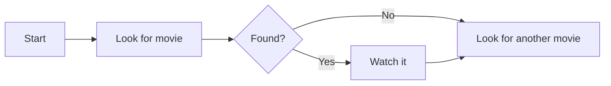
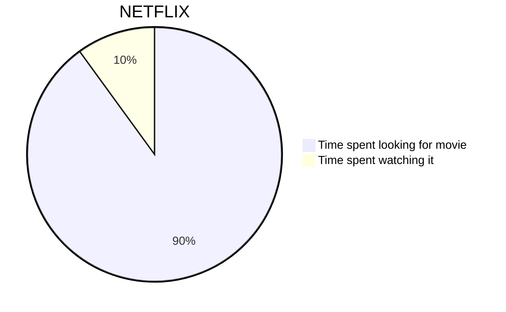
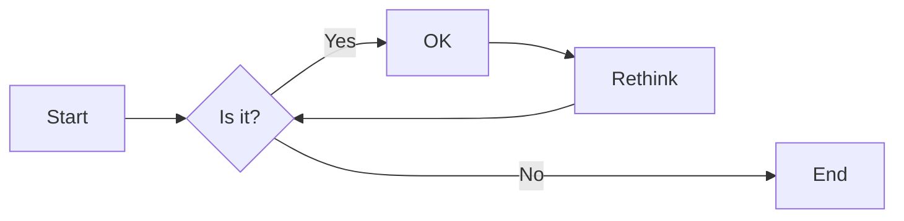
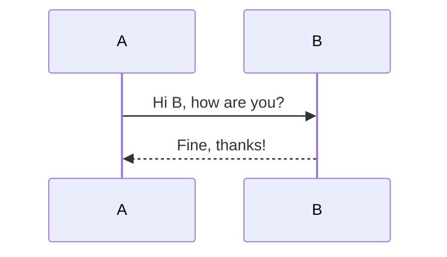
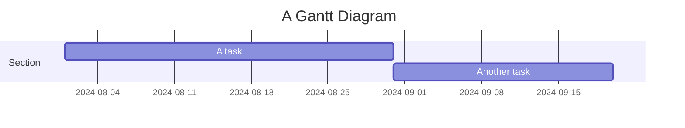
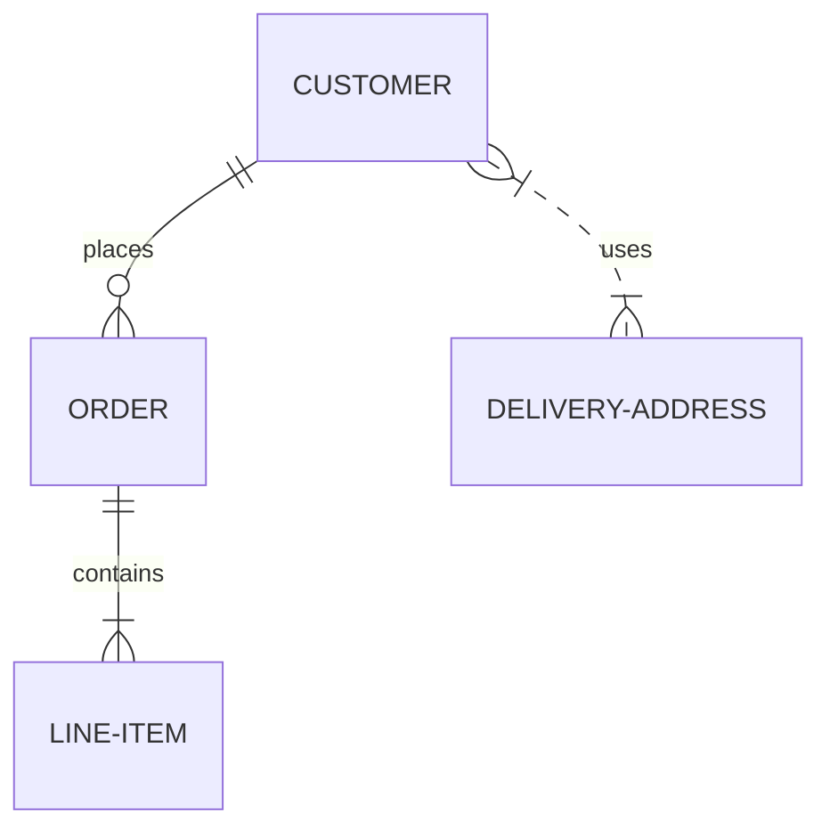
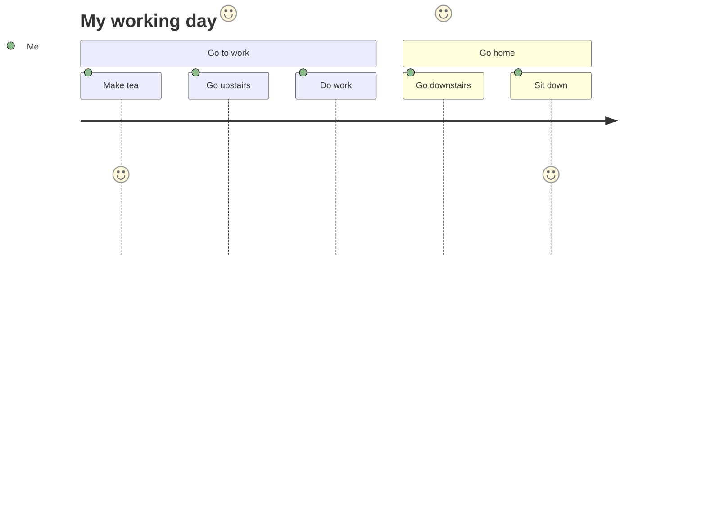

# إضافة حوريّة. js مع

<!--category-- HTMX, Markdown -->
<datetime class="hidden">24/2024-08-02</datetime>

## أولاً

حورية البحر هي شكل تخطيطي بسيط يأخذ مدخلاً قائماً على النصوص ويولد الرسوم في تنسيق SVG. إنها أداة عظيمة لإنشاء الرسوم البيانية للتدفق، الرسوم البيانية المتسلسلة، الرسوم البيانية Gantt، وأكثر من ذلك. في هذا الدرس، سوف نستكشف كيفية استخدام ميرميد مع الـ htmx لإنشاء الرسوم البيانية التفاعلية التي تستكمل ديناميكياً بدون إعادة تحميل الصفحات.
موقع الحُمرة هو[هنا هنا](https://mermaid.js.org/)لديه معلومات أكثر بكثير مما أستطيع أن أقدمه هنا

[رابعاً -

## العلامة الفاصلة وعلامة الحَرْم

يمكن إدراج رسومات الحوريات في ملفات العلامة التنازلية باستخدام الجملة التالية:

<pre>
# My Markdown Title

</pre>
هذا يسمح لك بإدراج مخطّطات حَرَمَةِ الحَرَمَة مباشرةً في ملفات العلامة التنازلية، والتي سيتم إصدارها كصور SVG عندما يتم تحويل الملف إلى HTML.


يمكنك أيضاً إضافة رسومات حورية إلى ملفات html العادية باستخدام الجملة التالية:

```html
<pre class="mermaid">
    graph TD
    A[Start] --> B[Look for movie]
    B --> C{Found?}
    C -->|Yes| D[Watch it]
    C -->|No| E[Look for another movie]
    D --> E
</pre>
```

### أمثلة على الرسوم البيانية

حورية البحر أداة قوية تسمح لك ببناء مجموعة واسعة من الرسوم البيانية باستخدام صياغة نصية بسيطة قائمة على النصوص.
هنا بعض الأمثلة لأنواع الرسوم البيانية التي يمكنك إنشاءها مع الحورية:

- الرسوم البيانية:



-المنازل:
يمكن أن تحدد الروافع الاتجاه، مثل LR (يسار إلى اليمين)، RL (يمين إلى اليسار)، TB (من الأعلى إلى الأسفل)، BT (من الأسفل إلى الأعلى).



- الرسوم البيانية المتعاقبة:



- الرسوم البيانية:



الرسوم البيانية لعلاقة الكيان:






انظر هذه الصفحة للمزيد من المخطوطات التخطيطية التي يمكنك إنشاءها مع حورية[هنا هنا](https://mermaid.js.org/syntax/examples.html)

## بدأ العمل مع حِرْمَة و تَفْكس

أولاً تحتاج إلى تضمين مكتبة حَرَمَة في ملفّ HTML الخاص بك. يمكنك فعل هذا بإضافة شارة سكربتك التالية إلى مستندك:

```html
<script src="https://cdn.jsdelivr.net/npm/mermaid@10.9.1/dist/mermaid.min.js
"></script>
```

التالـي فـي_معاينة. cshtml ملفّ تحتاج إلى اضف سِفْرِك سِفْرِك سِفْرِك

```html
<script>
    document.addEventListener('DOMContentLoaded', function () {
        mermaid.initialize({ startOnLoad: true });
    });
    document.body.addEventListener('htmx:afterSwap', function(evt) {
        mermaid.run();
        
    });

</script>
```

هذا يفعل شيئين

1. انها تؤسس الحوريات عند تحميل الصفحة ، فاذا كنت تنتقل مباشرة الى صفحة مع مخطط حورية (على سبيل المثال).[/blog/mermademandhtmx](/blog/mermaidandhtmx)) ستُصَوِّر بشكل صحيح.
2. إذا كنت تستخدم الـ techx كما في لدينا[السنة السابقة](/blog/htmxwithaspnetcore)وسيعيد تقديم رسم الحورية بعد تحديث الصفحة (حدث htmx: terswap).